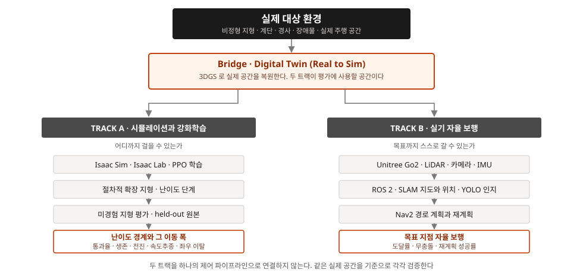

# 프로젝트 기획서

> 분류: 계획
> 작성: 오흥재 · 2026-09-03 15:40
> 근거: 팀 결정(#116 #117 #118 #122) · 실측(#99) · 임석헌 초안(`inbox/lim/20260901`)
> 요지: 9/4 기획발표 제출용 본문. 임석헌 초안의 배경·유사제품은 유지하고 비었거나 프로젝트와 안 맞는 절을 채웠다.
> 상태: 초안
> 이슈: #116

<!-- 제출본 제외 -->
**제출 형식은 PDF.** 이 마크다운이 원본이고 PDF 는 여기서 생성한다. 숫자를 두 곳에 적지 않는다.
`python tools/md2pdf.py deliverables/plan/proposal.md --submission --brand`
<!-- /제출본 제외 -->

---

## 표지

| | |
|---|---|
| **과제명** | Real to Sim 기반 Unitree Go2 미경험 험지 적응 및 자율 보행 시스템 개발 |
| **팀명** | FOOTHOLD |
| **주제 구분** | 실증 |
| **발표일** | 2026. 09. 04. |

**팀원 및 역할**

| 이름 | 포지션 | 담당 영역 |
|---|---|---|
| 오흥재 (팀장) | Applied AI System Builder | `B/항법` · `C/운영` |
| 임석헌 | RL Policy Engineer | `A/정책학습` |
| 맹라현 | 3D Environment & Twin Artist | `A/지형씬제작` · `A/트윈렌더` |
| 오현민 | Perception & Evaluation Engineer | `A/평가` · `B/인지` |
| 이민우 | Autonomous Navigation Engineer | `B/항법` · `C/기록` |

---

## 1. 프로젝트 개요

> **사람이 들어가기 전에, 로봇이 먼저 길을 확인한다.**

FOOTHOLD 는 실제 험지 환경을 Digital Twin 으로 복원하고, 지형 특성을 바탕으로 학습·평가용 변형 지형을 생성한다. **시뮬레이션에서는 보행 성능을 측정하고, 실제 환경에서는 목표 지점까지의 자율 보행을 검증한다.**

세 축으로 구성한다.

| 축 | 묻는 질문 | 무엇을 하나 |
|---|---|---|
| **Track A** | 어디까지 걸을 수 있는가 | Isaac Sim · Isaac Lab · PPO 로 미경험 험지의 보행 한계와 난이도 경계를 측정한다 |
| **Digital Twin** | 가상·실기 평가에 어떤 공간을 사용하는가 | 실제 구간을 물리·시각 트윈으로 복원하고, 지형 특성을 바탕으로 변형 지형을 생성한다. 원본 구간은 학습에 쓰지 않는 held-out 평가 환경으로 남긴다 |
| **Track B** | 목표까지 스스로 갈 수 있는가 | 검증된 순정 보행 위에 ROS 2 · SLAM · Nav2 · 센서 인지를 통합해 실기 자율 보행을 검증한다 |

**Digital Twin 은 두 트랙이 평가할 공간의 기준을 제공한다.** Track A 와 Track B 는 같은 실제 구간을 대상으로 각각의 평가 조건과 결과를 기록한다. 학습 정책을 실물에 이식하는 용도로는 사용하지 않는다.

**범위 밖.** 우리 학습 정책의 실기 저수준 이식은 안전 리깅 부재와 난이도를 고려해 목표에서 제외한다(2026-08-19 팀 전원 합의). Track B 는 순정 보행 위의 고수준 자율 보행을 검증한다.

---

## 2. 제안 배경과 필요성

산업시설·지하시설·터널·재난 현장에는 사람이 직접 접근하기 어렵거나 위험한 공간을 지속적으로 이동·순찰·점검해야 하는 업무가 있다. 사족보행 로봇은 작업 자체를 대체하지는 못하지만 작업자보다 먼저 현장에 진입해 영상·온도·가스·설비 상태를 확인하고 반복 점검을 수행함으로써 사람의 위험 노출을 줄이고 점검 빈도와 데이터 축적 수준을 높일 수 있다.

실제 도입 사례가 있다. National Grid 는 로봇 도입 후 고위험 설비의 점검 주기를 연 1회에서 2주 단위로 단축했고, AB InBev 는 매주 약 1,800건의 점검을 수행하며 초기 6개월 동안 약 150건의 이상 상태를 발견했다.

이러한 현장은 계단·경사·협소 통로·불규칙 지면이 혼재하므로 이동성과 지형 적응성이 중요하다. 최근 휴머노이드 로봇이 주목받고 있으나, 이 프로젝트와 같이 **이동·순찰·점검이 중심인 임무**에서는 네 다리로 다양한 지형에 대응하는 사족보행 구조가 적합하다.

국내에서도 도입으로 이어지고 있다. 2026년 KCC건설은 공사현장에 Unitree Go2 Air 를 도입해 고위험 작업환경의 안전관리에 활용하고 있으며[1], 한국수자원공사도 고위험·반복 점검 업무에 로봇을 시범 도입하고 있다[2]. 과학기술정보통신부의 하이퍼-AI 네트워크 실증사업에서는 공장 내 위험지역을 순찰하고 촬영 영상을 실시간 분석하는 사족보행 로봇이 주요 실증 대상으로 포함되었다[3].

### 미경험 지형에서의 보행 성능

사족보행 로봇이 상용화되었지만, **특정 지형에서 확인한 보행 성능을 다른 지형에도 그대로 적용할 수는 없다.** 실제 환경에서는 서로 다른 지형이 연속으로 등장하므로, 학습한 조건과 다른 지형에서의 성능을 별도로 평가해야 한다.

**이 프로젝트는 학습에 사용하지 않은 지형에서 보행 정책의 성능을 평가한다.**

이 적응성과 일반화는 현재도 활발한 연구 과제다. KAIST 는 2026년 HOUND 기반 APT-RL 연구를 발표해 하나의 정책이 다양한 실제 지형을 통과하면서 상황에 맞는 보행 기술로 전환하도록 학습했다[4]. 새로운 환경의 지형 특성에 맞게 행동을 전환하는 적응 능력을 개선했다는 점에서, 고성능 로봇이 이미 존재하더라도 **새 지형에 대한 일반화 연구가 여전히 필요함**을 보여준다.

### 왜 두 트랙인가

**안정적인 보행 능력만으로 임무가 끝나지 않는다.** 로봇은 자기 위치와 주변 환경을 파악하고 목표 지점까지 스스로 이동할 수 있어야 한다. 그래서 보행 성능을 다루는 트랙과 임무 수행을 다루는 트랙을 함께 둔다.

**낙상 가능성이 있는 학습·평가는 시뮬레이션에서 수행하고, 실기에서는 순정 보행을 사용해 자율 보행 임무를 검증한다.** 장비 손상 위험을 줄이기 위해 두 트랙을 분리한다. Digital Twin 은 두 트랙이 사용할 실제 구간의 형상과 특성을 기록한다.

**출처**

- [1] KCC 웹진, 「KCC건설 사족보행로봇 도입, 스마트 안전관리 강화」, 2026.07.02.
- [2] 환경타임즈, 「한국수자원공사, 로봇 점검체계로 전환 추진」, 2026.05.22.
- [3] 연합뉴스, 「[AI픽] 정부, 피지컬AI용 하이퍼-AI 네트워크 구축 착수」, 2026.07.14.
- [4] KAIST, 「동물처럼 상황 판단해 걷고 뛰고 점프하는 로봇 구현」, 2026.07.16.

---

## 3. 유사 제품 현황

| 제품 | 주요 성능 | 주요 기능·활용 | 참고 |
|---|---|---|---|
| **Boston Dynamics Spot** | 최대 1.6 m/s · 경사 ±30도 · 단차 300 mm · 운용 약 90분 | Depth Camera 기반 장애물 회피 · Autowalk 반복 자율 임무 | 산업시설 점검. Locomotion 내부 구현은 상용 시스템으로 직접 수정 불가 |
| **ANYbotics ANYmal** | 최대 1.3 m/s · 경사 ±30도 · 단차 250 mm · 운용 약 90분 | RL 기반 locomotion · LiDAR·Depth 기반 자율 보행 · 젖은 노면·요철 등 산업 환경 활용 | 화학·전력·광업 등 산업시설 점검 |
| **DEEP Robotics X30** | 최대 4 m/s · 경사 45도 · 단차 200 mm · 운용 약 3시간 | 높은 장애물·계단 주행 · 저조도 융합 인지 | −20~55도 운용. 제조사 수치는 실험실 데이터 |

**출처**

- Boston Dynamics Spot · `https://bostondynamics.com/products/spot/`
- ANYbotics ANYmal 기술 사양서 · `https://www.anybotics.com/anymal-technical-specifications.pdf`
- DEEP Robotics X30 · `https://www.deeprobotics.cn/en/index/product3.html`

**우리는 이들보다 높은 절대 성능을 목표하지 않는다.** 이 프로젝트의 핵심은 기존 보행 정책이 **미경험 지형에서 보이는 한계를 측정**하고, 학습 지형과 물리 조건의 변화가 일반화에 어떤 영향을 주는지 분석하는 것이다.

---

## 4. 시스템 아키텍처

시뮬레이션 기반 보행 정책 학습과 실기 자율 보행·환경 인지를 **병렬로** 개발한다. 두 트랙의 제어기를 직접 연결하지 않고, **동일한 실제 구간을 기준으로** 각각의 성능을 검증한다.

**Track A 의 흐름** · 지형 구성 → PPO 정책 학습 → 미경험 지형 평가 → 실패 원인 분석 → 학습 조건 개선 → 재학습 → 일반화 비교

**Track B 의 흐름** · LiDAR·카메라·로봇 상태 → ROS 2 → SLAM·CV → Nav2 → 목표 지점 자율 보행

### 실제 구간 복원과 학습·평가 지형 구성

| 단계 | 무엇 | 왜 |
|---|---|---|
| ① 실제 구간 스캔 | PoC 공간을 촬영·점군으로 확보 | 지형 복원에 사용할 원자료 |
| ② 트윈 구축 | 물리·시각 트윈으로 복원 | 두 트랙의 평가 공간 |
| ③ 지형 특성 추출 | 경사·요철·틈·단차 분포를 수치화 | 변형 지형의 생성 조건 |
| ④ 절차적 확장 | 그 분포로 변형 지형 생성 | 학습·평가 지형 |
| ⑤ held-out 보존 | **원본 구간은 학습에 쓰지 않는다** | 학습에서 제외한 구간의 성능 평가 |

원본 구간은 Track A 의 학습에서 제외해 평가용으로 사용한다. Track B 는 해당 실제 구간에서 자율 보행 임무를 수행한다.

> **표기 주의.** 확장 지형의 최종 수량은 **계획**이며 확정 결과가 아니다.

---

## 5. 핵심 기술과 적용 구성

각 기술의 적용 목적과, 기성 구현체에서 수정하는 부분을 함께 적는다.

### Track A · 시뮬레이션과 강화학습

| 활용 환경 · 커스터마이징 요소 | 개발 내용 |
|---|---|
| **NVIDIA Isaac Sim · Isaac Lab v2.3.2** | Isaac Lab 이 제공하는 Unitree Go2 locomotion 환경과 학습 코드를 기반으로 시뮬레이션·강화학습 환경을 구성한다. 4,096 병렬 환경에서 21,248~21,385 steps/s 로 학습한다. 표준 1,500 iteration 은 **133분** 실측이다 (RTX 5080 1대 · `docs/guides/runpod-setup.md`). 30 iteration 외삽치 113분보다 18% 길다 |
| **Terrain Configuration** | Terrain Generator 설정을 수정해 계단·요철·`gap(틈)`·`stepping_stones(디딤돌)` 등 학습·평가 지형을 구성한다. 8 m 타일 · `platform_width` 1.5 m · 난이도는 행 좌표로 준다 |
| **Physics Configuration** | 마찰계수·질량·무게중심·외력 등 물리 조건을 조정해 다양한 환경 조건을 만든다. 멘토 진단(무게중심과 압력중심의 어긋남)을 좌우 이탈 원인 후보로 두고 이 축에서 검증한다 |
| **Reward Function** | 속도 추종·자세 안정성·토크·action 변화량·발 접촉 등 Isaac Lab 이 제공하는 reward 의 가중치와 조건을 수정한다. 현재 보상 구성에는 발 높이를 직접 평가하는 항이 없고, `feet_air_time` 은 체공 시간을 기준으로 하며, `flat_orientation_l2` 가중치는 0 이다. 관절 가동 범위 대비 실제 발 들어올림 높이가 낮다는 팀 내 측정(맹라현, `#66`)이 있어, 보상 항 조정의 검토 대상으로 둔다 |
| **Domain Randomization** | 마찰계수·로봇 질량·무게중심·초기 상태의 랜덤화 범위를 설정해 특정 환경 과적합을 줄이고 정책의 강건성을 높인다 |
| **Unseen Terrain Generalization Evaluation** | 학습에 쓰지 않은 지형과 난이도 조건에서 동일 정책을 평가해 일반화 성능을 측정한다. 판정은 생존·전진·속도 추종·직진성 네 축을 모두 만족해야 통과다 |
| **파인튜닝과 성능 유지** | 특정 지형만 추가 학습하면 기존 지형의 성능이 저하될 수 있다. 기존 rough 지형 0.6 과 대상 지형 0.4 를 혼합해 학습하고, 기존 지형 성능의 유지 여부를 평가한다 |
| **MuJoCo** | 결과가 시뮬레이터 특유의 성질에서 온 것인지 확인하는 독립 2차 검증 환경 `계획` |

**Track A 의 반복 흐름** · Baseline 평가 → 실패 지형 분석 → 학습 환경·보상 개선 → 재학습 → 미경험 지형 재평가. 평가 대상은 reward 값 자체가 아니라, **학습 지형과 보상 구성이 미경험 지형의 보행 성능에 미치는 영향**이다.

### Bridge · Digital Twin (Real-to-Sim)

> **Bridge** 는 두 트랙의 평가 공간을 구축하는 Digital Twin 영역이다. 작업 영역 코드 `C/` 는 기록·운영 업무를 뜻하므로 구분한다.

| 활용 환경 · 커스터마이징 요소 | 개발 내용 |
|---|---|
| **Image · Video Acquisition** | 실제 대상 공간을 다중 시점에서 촬영해 3차원 환경 복원에 필요한 이미지·영상 데이터를 확보한다 |
| **COLMAP** | 특징점 추출·이미지 정합·카메라 위치와 방향 추정을 활용해 3D Gaussian Splatting 에 필요한 카메라 정보와 초기 3차원 구조를 생성한다 |
| **3D Gaussian Splatting** | 기존 3DGS 구현체로 대상 공간의 시각적 형상을 복원하고, 촬영 조건과 복원 매개변수를 조정해 품질을 개선한다 |
| **Geometry · Collision Configuration** | 로봇이 물리적으로 접촉하고 이동할 수 있도록 mesh 또는 단순화한 collision geometry 를 구성한다 |
| **Isaac Sim · USD Scene Configuration** | 복원된 환경과 collision geometry 를 Isaac Sim 의 USD scene 으로 구성하고 scale·transform·collision·physics material 을 실제 공간에 맞게 조정한다 |
| **지형 특성 추출과 절차적 확장** | 복원한 구간에서 경사·요철·틈·단차 분포를 수치로 뽑고, 그 분포로 변형 지형을 생성한다. **원본 구간은 학습에 넣지 않고 held-out 평가장으로 남긴다** |

**3DGS 시각 복원물과 보행용 충돌 형상은 구분해 구축·검증한다.**

### Track B · 실기 자율 보행

| 활용 환경 · 커스터마이징 요소 | 개발 내용 |
|---|---|
| **ROS 2 (Jazzy)** | Go2 의 LiDAR·Camera·IMU·Odometry 데이터를 ROS 2 Topic 과 TF 구조로 연동해 자율 보행 모듈이 쓸 입력 데이터를 구성한다 |
| **slam_toolbox** | 2D LiDAR SLAM 기능을 활용하고 scan·odometry·TF 와 mapping parameter 를 실제 환경에 맞게 조정해 지도 생성과 위치 추정을 수행한다 |
| **Nav2** | Costmap·Path Planning·Navigation Control 을 활용하고 로봇 크기·속도 제한·장애물 거리·planner/controller parameter 를 Go2 특성에 맞게 설정한다 |
| **YOLO Object Detection** | 대상 환경 데이터로 파인튜닝한 YOLO 모델로 카메라에서 사람과 주요 객체를 검출한다 |
| **CV-LiDAR Integration** | YOLO 의 객체 분류 결과와 LiDAR 의 공간적 장애물 정보를 ROS 2 기반으로 연동해 객체 종류와 위치 정보를 함께 활용한다 |

**Track B 의 흐름** · LiDAR·Camera·Robot State → ROS 2 → SLAM·CV → Nav2 → 자율 보행. CV 는 Nav2 의 제어 입력으로만 쓰지 않고 **주변 환경의 의미 정보를 추가로 인지하는 모듈**로 구성한다.

실내·지하 구간이라 위성 위치를 쓸 수 없으므로 **자기 위치는 LiDAR·IMU·오도메트리로 추정한다.**

---

## 6. 현재까지의 측정 결과

**2026-09-03 실측.** 기준선 정책은 **NVIDIA 공식 Go2 rough 체크포인트**이며, 팀이 자체 학습한 1,500 iteration 정책은 별도 대조 실험으로 구분한다.

### 6-1. 평지 보행 기준선

**조건** · 20초 · 통과선 10 m · 1.0 m/s · 100판 · seed 42

| 판정 축 | 결과 |
|---|---|
| 생존 (낙상 없음) | **100 / 100** |
| 전진 (10 m 도달) | **100 / 100** |
| 속도 추종 | **100 / 100** |
| 직진성 (10 m 지점 좌우 5 cm) | 33 / 100 |

**위 조건의 평지 평가 100판에서 낙상 없이 10 m 에 도달했다.** 직진성 기준은 33판에서 충족했으며, 개선이 필요하다.

직진성은 **어느 지점에서 재는지에 따라 값이 달라진다.** 같은 100판에서 10 m 통과선 지점의 좌우 이탈은 평균 0.085 m (각도 0.49도)이고, 20초 종료 시점(평균 전진 19.08 m)의 이탈은 평균 2.143 m 다. 위 표의 33/100 은 **통과선 지점 기준**이다.

### 6-2. 미경험 험지 10종

**조건** · 6초 · 통과선 3 m · 1.0 m/s · 지형당 100판 (총 1,000판) · seed 42 · **좌우 이탈 임계 1.5 m**

이탈 임계가 평지(5 cm)와 다른 이유는 재는 거리가 다르기 때문이다. 통과선 3 m 구간에 5 cm 를 걸면 평지 10 m 에 5 cm 를 거는 것보다 훨씬 엄격해진다. 통과선 대비 같은 비율을 유지하도록 **1.5 m** 로 둔다.

| 결과 | 지형 |
|---|---|
| **통과 (97~100%)** | `repeated_boxes(반복 박스)` · `repeated_cylinders(반복 원기둥)` · `wave(파형)` · `star(별)` · `discrete_obstacles(이산 장애물)` |
| **실패 (0~4%)** | `rails(턱)` · `pit(구덩이)` · `stepping_stones(디딤돌)` · `gap(틈)` · `floating_ring(부유 고리)` |

옛 조건(명령 속도 0.5 m/s `추정` · 6초 · 3 m)에서도, 1.0 m/s 로 올린 이번 평가에서도 **5종 통과·5종 실패로 분류됐다.** 다만 이 비교만으로 실패 원인을 지형 자체로 단정할 수는 없다. 정책과 지형 조건의 영향을 추가로 분석해야 한다.

**같은 seed 로 시뮬레이션 독립 실행 3회가 원자료 바이트 단위로 일치**해 재현성을 확인했다.

### 6-3. 지형별 실패 양상

| 지형 | 주요 지표 | 관측된 실패 양상 |
|---|---|---|
| `stepping_stones(디딤돌)` · `gap(틈)` | 생존 20~21% | 발이 빠지며 **낙상** |
| `rails(턱)` | 속도 추종 8% | 통과 중 **명령 속도 추종 부족** |
| `pit(구덩이)` · `floating_ring(부유 고리)` | 전진 0~15% | **목표 전진 거리 미달** |

**지형별로 낙상·속도 추종·전진 거리 중 부족한 지표가 다르다.** 원인을 구분해 보상과 학습 조건의 조정 방향을 검토한다.

---

## 7. 프로젝트 목표와 KPI

### 7-1. 핵심 성과 지표

| 개발 영역 | 핵심 목표 | KPI |
|---|---|---|
| **RL Locomotion** 주 지표 | 미경험 지형 난이도 경계의 이동 | 실패 5종 각각 난이도 경계를 **25% 이상 이동** 지형 · 난이도 칸마다 **100 에피소드** 회귀 방지 · 이미 통과하는 5종 통과율 **95% 이상 유지** |
| **RL Locomotion** 보조 지표 | 지형별 병목 해소 | 실패 5종 종합 통과율 평균 **1.4% → 30% 이상** 낙상형 2종 생존율 **20% → 60% 이상** `rails(턱)` 속도 추종 **8% → 50% 이상** 전진불능형 2종 전진 성공률 **0~15% → 50% 이상** |
| **RL Locomotion** 안전 | 낙상률 | 미경험 10종 평균 낙상률 **20% 이하 유지** (현재 19.1%) 낙상이 집중된 두 지형을 별도로 평가한다 · `stepping_stones(디딤돌)` `gap(틈)` 생존율 **20~21% → 60% 이상** |
| **기본 보행 품질** | 평지 직진성 | 10 m 지점 좌우 이탈 5 cm 이내 **33% → 90% 이상** 낙상 없이 10 m 도달 **100% 유지** |
| **SLAM** | Mapping 과 Localization | Localization 유지율 **90% 이상** 위치 오차 **30 cm 이하** |
| **Nav2** | 실기 Go2 자율 보행 | **20회 이상** 반복 주행 목표 지점 도달률 **80% 이상** 충돌 없는 주행률 **90% 이상** 경로 재계획 성공률 **80% 이상** |
| **Computer Vision** | 주변 환경 인지 | 탐지 객체 **3종 이상** Precision · Recall **80% 이상** mAP@0.5 **75% 이상** |

> **낙상률을 평균으로만 보면 안 된다.** 임석헌 초안의 「Fall Rate 20% 이하」를 그대로 두되, 10종 평균이 **이미 19.1%** 라 그 자체로는 목표가 되지 않는다. 통과 5종이 생존 100% 라 평균을 끌어올리는 동안 `stepping_stones(디딤돌)` 20% 와 `gap(틈)` 21% 가 가려진다. 평균은 회귀 감시 지표로 두고, 개선 목표는 낙상이 집중된 두 지형의 생존율로 평가한다.

### 7-2. 왜 성공률이 아니라 난이도 경계인가

지형 난이도가 달라지면 성공률만으로 정책 성능을 비교하기 어렵다. **성공률을 목표로 두면 지형 난이도 조정에 따른 성공률 변화와 학습에 따른 성능 변화가 구분되지 않는다.**

경계로 측정하면 같은 지형의 난이도 파라미터를 단계로 나눠 **통과 기준을 충족하는 범위**를 재고, 학습 전후 그 경계의 변화를 비교할 수 있다. 동일하게 정의한 난이도 파라미터와 평가 조건에서 학습 전후 경계를 비교하며, 현재 정책으로 통과가 어려운 지형에서도 **어느 난이도까지 통과하는지**가 결과로 남는다.

예를 들어 `rails(턱)` 는 턱 높이를 0.05~0.18 m 범위로 구성한다. 현재 정책이 통과하는 최대 높이가 경계이고, 학습 후 그 높이의 변화가 측정 대상이다.

> **각 지형의 현재 경계값은 A-정책 관문(9/12)에 측정해 고정한다.** 위 「25% 이상 이동」은 그 경계 대비 상대값이며, 절대 경계값은 초기 측정 후 확정한다.

### 7-3. 판정 기준

한 판이 통과로 세려면 **네 축을 모두 만족**해야 한다. 하나라도 못 넘기면 실패다.

| 축 | 기준 | 근거 |
|---|---|---|
| 생존 | 몸통 접촉 없이 완주 | 낙상 판정 |
| 전진 | 통과선 도달 (평지 10 m · 험지 3 m) | 8/31 멘토링 · 지형 타일 구조 |
| 속도 추종 | 명령 속도와의 평균 오차 **0.25 m/s 이하** | 하네스 `--max_velocity_mae` 기본값 |
| 직진성 | 평지는 통과선 지점 좌우 이탈 **5 cm 이내** · 험지는 **1.5 m 이내** | 8/31 멘토링 (평지) · 통과선 대비 동일 비율 (험지) |

**축을 나눈 이유는 지형마다 부족한 지표가 다르기 때문이다.** 6-3 에서 정리한 대로 낙상·속도 추종·전진 거리 중 어떤 항목이 미달인지가 지형별로 갈린다. 단일 성공률로 합치면 보상·학습 조건의 조정 방향을 구분할 수 없다.

Track B 의 정량 임계값 중 실기 환경에 따라 달라지는 항목(주행 구간 길이 · 장애물 배치)은 대여 장비 사양과 PoC 구간 확정 후 재검토한다.

### 7-4. 평가 기록과 재현성

모든 결과에 **조건 · 정책 체크포인트 · 지형 seed · 평가 인자 · 원자료 · 재실행 방법**을 함께 남긴다. 평가 근거에는 시연 영상과 함께 **동일 조건의 반복 평가 결과**를 포함한다.

**시뮬레이션 평가**는 같은 seed 로 재실행했을 때 원자료가 일치하는지를 확인하고, 일치하지 않은 결과는 근거로 쓰지 않는다. **실기 평가**는 원자료 일치를 요구할 수 없으므로 반복 주행 횟수와 조건 기록으로 재현성을 확인한다.

---

## 8. 개발 일정과 WBS

### 8-1. 단계별 일정과 완료 조건

프로젝트는 **다섯 개 관문**으로 진행한다. 각 관문은 핵심 산출물과 다음 단계 착수 조건을 함께 갖는다. 조건을 충족하지 못하면 다음 단계에 착수하지 않는다.

| 관문 | 일자 | 핵심 산출물 | 다음 단계 착수 조건 |
|---|---|---|---|
| **기획 발표** | 09/04 | 문제·범위·KPI·WBS·R&R 합의 | 평가 용어와 담당 확정 |
| **A-정책** | 09/12 | 평가 하네스 · 기준 정책 · 지표 세트 고정 · 지형별 난이도 경계 초기값 | 동일 조건 비교가 가능해짐 |
| **MVP · 중간발표** | 09/30 | 일반화 평가표 · 경계 재측정 · 트윈과 렌더 | 재현 가능한 가상 검증 패키지 |
| **NAV · 실기 항법** | 11/07 | SLAM 지도 · Nav2 실제 경로 | 실기 목표 지점 임무 검증 가능 |
| **FINAL · 최종발표** | 12/11 | 자율 보행 시연 · 검증 보고서 | 공개 배포용 최종 검증 자료 |

### 8-2. 작업 분해 (WBS)

작업 영역은 두 트랙과 공통으로 **8개 작업 영역**이다 (`docs/ROLES.md` 정본). 주담당은 해당 영역의 결과와 인계를 책임지며, 부담당은 검토와 필요 시 업무 대체를 맡는다.

| 작업 영역 | 작업 항목 | 담당 | 관문 | 산출물 |
|---|---|---|---|---|
| `A/정책학습` | 기본값 1,500 iter 학습 지형 결과 분석 | 임석헌 | A-정책 | 정체·낙상 분리 분석표 |
| `A/정책학습` | 보상 항 재설계 · 발 높이 항 신설과 재학습 | 임석헌 | MVP | 학습 로그 · 정책 체크포인트 |
| `A/정책학습` | 기존 지형 성능 유지 혼합 학습 (rough 0.6 · 대상 0.4) | 임석헌 | MVP | 성능 유지 검증표 |
| `A/정책학습` | 확장 지형 학습과 held-out 평가 | 임석헌 | NAV | 일반화 성능표 |
| `A/평가` | 평가 하네스 확장 7건 · 새 기준 측정 가능화 | 오현민 | A-정책 | 하네스 · 시험 68건 |
| `A/평가` | 지표 3종과 판정 기준 정본화 | 오현민 | A-정책 | 판정 함수 · 임계값 문서 |
| `A/평가` | 난이도 격자 스윕과 경계 측정 | 오현민 | A-정책 · MVP | 지형별 경계표 |
| `A/평가` | 재현성 결함 수정 (전역 난수 사용 4종) | 오현민 | A-정책 | 지형 생성 재현성 검증 |
| `A/지형씬제작` | 난이도 스윕 설계 · 지형 파라미터 재설계 | 맹라현 | A-정책 | 스윕 설계서 |
| `A/지형씬제작` | 절차적 확장 지형 생성 | 맹라현 | NAV | 확장 지형 cfg |
| `A/트윈렌더` | PoC 공간 선정과 스캔 (촬영 · 점군) | 맹라현 | MVP | 원자료 · 촬영 기록 |
| `A/트윈렌더` | COLMAP · 3DGS 복원과 충돌 형상 구성 | 맹라현 | MVP | USD 씬 |
| `A/트윈렌더` | 에셋 팩 수령과 HDRI 렌더 · 발표 자산 | 맹라현 | MVP · FINAL | 렌더 시연물 |
| `B/항법` | ROS 2 환경 구축 · 센서와 TF 연결 | 오흥재 | A-정책 · MVP | 토픽·TF 트리 |
| `B/항법` | SLAM 지도 생성과 위치 추정 | 오흥재 · 이민우 | NAV | 지도 · 위치 오차 기록 |
| `B/항법` | Nav2 경로 계획 · 재계획 · 장애물 회피 | 이민우 · 오흥재 | NAV | 주행 로그 (rosbag2) |
| `B/인지` | CV 단계별 계획과 실행 환경 구축 | 오현민 | MVP | 환경 문서 · 데이터셋 |
| `B/인지` | YOLO 파인튜닝과 LiDAR 융합 | 오현민 | NAV | 검출 성능표 |
| `C/기록` | 회의록 · 문서 정본화 · 기술 허브 집필 | 이민우 | 전 관문 | 정본 문서 |
| `C/기록` | 발표 자료 제작과 대외 보고 | 이민우 | 전 관문 | 발표 산출물 |
| `C/운영` | 인프라 · RunPod 볼륨 · 팀 폴더 표준화 | 오흥재 | A-정책 | 실행 환경 |
| `C/운영` | 빌드 · 배포 자동화 · 프로젝트 웹 | 오흥재 | MVP | 배포 파이프라인 |
| `C/운영` | 일정 · 예산 · 범위 관리 · 멘토 협의 | 오흥재 | 전 관문 | 일정 대시보드 |

### 8-3. 실패 지형별 담당

실패 5종을 나눠 맡는다. 담당자는 **실패 분석 1장과 학습 설정안 1장**을 함께 제출한다. 학습 설정안은 해당 지형의 통과율을 올리기 위해 조정할 보상·학습 조건을 적은 문서다.

| 지형 | 현재 종합 통과율 | 병목 | 담당 |
|---|---|---|---|
| `gap(틈)` | 0% | 생존 21% | 임석헌 |
| `rails(턱)` | 4% | 속도 추종 8% | 맹라현 |
| `stepping_stones(디딤돌)` | 0% | 생존 20% | 오현민 |
| `pit(구덩이)` | 3% | 전진 15% | 이민우 |
| `floating_ring(부유 고리)` | 0% | 전진 0% | 오흥재 |

**각 작업 영역과 실패 지형에 담당자를 배정한다.** 문서·발표를 맡은 사람도 실기 항법과 실패 지형을 함께 맡는다.

### 8-4. 월별 진행

| 시기 | Track A | Digital Twin | Track B | 공통 |
|---|---|---|---|---|
| ~09/12 | 하네스 확장 · 기준선 확정 · 10종 재측정 · 난이도 경계 초기값 | PoC 공간 선정 | ROS 2 환경 구축 | 지표·판정 기준 정본화 |
| ~09/30 | 보상 재설계 · 파인튜닝 · 경계 재측정 | 스캔 · 트윈 구축 · 지형 특성 추출 | Go2 센서·TF 연결 · CV 환경 | 중간 산출물 · 실험 기록 |
| ~11/07 | 확장 지형 학습 · held-out 평가 | 절차적 확장 | SLAM 지도 · Nav2 경로 | 실기 검증 기록 |
| ~12/11 | 최종 성능표 · 회귀 검증 | 발표 자산 렌더 | 목표 지점 자율 보행 시연 | 최종 보고서 · 공개 릴리스 |

> 세부 진척은 GitHub 프로젝트 보드의 실측값을 사용하며 **임의 진척률을 기재하지 않는다.** 위 표는 관문별 배치를 보여 주는 것이고, 완료율은 이슈 상태에서 생성한다.

---

## 9. 수행 방법

### 9-1. 데이터 확보

| 데이터 | 출처와 방법 | 형식 | 상태 |
|---|---|---|---|
| 시뮬레이션 롤아웃 로그 | Isaac Lab 평가 하네스 실행 | CSV (에피소드별 판정 5열 = 종합 + 4축 · 거리 · 이탈 · 속도오차) | **확보** · 1,100판 |
| 지형 설정 | Isaac Lab Terrain Generator cfg | Python cfg + seed | **확보** |
| 정책 체크포인트 | NVIDIA 공식 배포 + 자체 학습 산출 | `.pt` | **확보** |
| 학습 로그 | TensorBoard · 학습 스크립트 출력 | 스칼라 로그 | **확보** |
| 실제 공간 촬영 | PoC 구간 다중 시점 촬영 | 이미지·영상 | 계획 |
| 실제 공간 점군 | LiDAR 스캔 | 점군 | 계획 |
| 실기 주행 로그 | ROS 2 기록 | rosbag2 (LiDAR·카메라·IMU·오도메트리·TF) | 계획 |

보행 정책 학습·평가 데이터는 **팀이 설정한 시뮬레이션 환경에서 생성한다.** 실제 공간 촬영·점군과 실기 주행 로그는 이후 확보할 계획이다.

### 9-2. 기능별 수행 방법

| 기능 | 수행 방법 |
|---|---|
| 험지 학습 환경 구성 | Isaac Lab Terrain Generator 로 지형 종류와 난이도 파라미터를 설정하고 병렬 환경에서 학습 |
| 보행 정책 학습 | RSL-RL 의 PPO 로 보상 가중치와 커리큘럼을 단계적으로 조정 |
| 일반화 평가 | 학습에 쓰지 않은 지형에서 동일 프로토콜로 평가하고 판정 4축과 종합 판정을 CSV 로 기록 |
| 실공간 복원 | 촬영 영상에서 COLMAP 으로 카메라 위치와 방향을 추정하고 3DGS 로 시각 복원 |
| 시뮬 장면 구성 | 복원 결과와 충돌 형상을 USD 장면으로 구성 |
| 지도 생성·위치 추정 | ROS 2 위에서 slam_toolbox 로 2D LiDAR SLAM |
| 경로 계획·주행 | Nav2 의 Costmap·Planner·Controller 를 Go2 사양에 맞게 설정 |
| 환경 인지 | 대상 환경 데이터로 파인튜닝한 YOLO 검출 결과를 LiDAR 공간 정보와 결합 |

### 9-3. 실험 관리

**실험마다 한 요인씩 변경해 영향을 비교한다.** 실험 대장에 설정·커밋 해시·결과 원자료·판정을 남기며, **기준 곡선과의 비교 결과를 포함해야 성능 개선으로 판정한다.**

---

## 10. 참여 인원과 역할

**주담당은 해당 영역의 결과 정리와 인계를 책임진다.** 부담당은 검토와 필요 시 업무 대체를 맡는다.

| 이름 | 담당 영역 | 책임 | 실패 지형 |
|---|---|---|---|
| **오흥재** | `B/항법` · `C/운영` | Track B 통합 · 인프라·자동화·일정·예산 · 전 Track 의존성 조정 | `floating_ring(부유 고리)` |
| **임석헌** | `A/정책학습` | 보행 정책 학습 · 보상 설계 · 실험 설계와 반복 | `gap(틈)` |
| **맹라현** | `A/지형씬제작` · `A/트윈렌더` | 시뮬 지형 제작 · 실공간 복원과 렌더 · 난이도 격자 | `rails(턱)` |
| **오현민** | `A/평가` · `B/인지` | 일반화 벤치마크와 판정 지표 · 실기 LiDAR·카메라 인지 | `stepping_stones(디딤돌)` |
| **이민우** | `B/항법` · `C/기록` | SLAM·Nav2 실기 자율 보행 · 문서 정본화 · 웹·서버 | `pit(구덩이)` |

**다섯 명이 실패 지형을 하나씩 담당한다.** 지형별 실패 양상과 담당 역할을 고려한 배정이다. 낙상과 전진 거리 부족이 함께 나타난 `stepping_stones(디딤돌)` 은 평가 주담당이 분석한다.

각 담당은 자기 지형의 **실패 분석 1장과 학습 설정안 1장**을 작성한다. 최종 학습은 지형별 정책을 따로 만들지 않고 **혼합 단일 학습 1회**로 통합한다. 단일 지형 파인튜닝에 따른 기존 지형 성능 저하 위험을 줄이기 위한 계획이다.

---

## 11. 기대 효과와 활용

### 이번 PoC 의 검증 목표

공개된 기준 보행 정책의 **미경험 지형별 성능과 실패 조건**을 재현 가능한 프로토콜로 측정하고, 학습 조건에 따른 난이도 경계의 변화를 정량화한다. 같은 실제 공간에서는 **목표 지점까지의 자율 보행**을 검증한다.

**동일한 프로토콜로 측정한 지형별 성능표와 원자료, 재실행 방법을 정리한다.** 이를 통해 평가 조건과 결과를 다른 실험에서 확인·비교할 수 있도록 한다.

### 이후 확장

측정 방법과 트윈 구축 절차를 다른 현장·로봇에 적용하는 방안을 검토할 수 있다. 지하 공동구·터널·산업 설비 점검처럼 **사람이 직접 접근하기 어려운 반복 점검 업무**가 적용 후보다.

**실제 산업 투입·재난 대응·방폭 환경 운용은 이번 프로젝트의 구현 범위에 포함하지 않는다.**

---

## 12. 한계와 위험

| 항목 | 내용 |
|---|---|
| **범위** | 학습 정책의 실기 저수준 이식은 범위 밖이다. 순정 보행 위의 고수준 자율 보행을 검증한다 |
| **안전** | 대여 장비이며 독립 안전 리깅이 없다. 실기에서 낙상 위험이 있는 실험을 하지 않는다 |
| **측정** | 난이도 경계 측정에 필요한 격자가 아직 없다. A-정책 관문의 선행 과제다 |
| **시뮬 격차** | 시뮬레이터 간 접촉·물리 차이가 있다. 교차 검증 결과를 단일 시뮬 결론으로 쓰지 않는다 |
| **장비** | 대여 Go2 의 옵션·펌웨어·접근 권한은 실측으로 확정한다. 제조사 사양만으로 단정하지 않는다 |
| **일정** | 실기 구간 선정이 트윈의 입력이므로 지연되면 Track A 확장과 Track B 검증이 함께 밀린다 |

---

<!-- 제출본 제외 -->
## 판 이력

| 판 | 날짜 | 무엇이 바뀌었나 |
|---|---|---|
| **v1.4** | 2026-09-03 | 표현 검토 반영 12건(추상 비유·과장·내부 은어 정리). 판정 축 표기 정정 · 축은 4개이고 CSV 는 종합 포함 5열이다. seed 재현의 적용 대상을 시뮬레이션과 실기로 갈랐다. 6-1 에 직진성 측정 지점(통과선 0.086 m 대 종료점 2.143 m)을 명시. FOOTHOLD 브랜드 색 적용(본문 CSS + 도식 SVG 2장). 숫자·담당·일정·기술명·트랙 범위는 그대로 |
| **v1.3** | 2026-09-03 | 임석헌 초안 전수 대조. 누락 6건 복원. 「계단·경사·협소 통로·불규칙 지면 혼재」와 「휴머노이드보다 사족보행이 적합」 2문단, 「보행 능력만으로 임무가 끝나지 않는다」, ANYmal 「젖은 노면·요철」, 제품 사양 출처 URL 3개, Fall Rate 20% 이하 KPI. Bridge 가 초안의 Track C 임을 밝힘 |
| **v1.2** | 2026-09-03 | v1.1 에서 새로 쓴 문장의 표현 정리 9건. 근거 없는 인과 단정(「실패 5종의 공통 뿌리」 등)을 검토 대상 표기로, 비유(「벽」 「무너진다」)와 구어(「뭉치면」 「처방」 「레시피」)를 측정 용어로 교체. 도식 SVG 안의 「공통 기준면」을 「평가에 사용할 공간」으로 맞춰 #116 표현 검토 결과와 일치시켰다. 숫자·담당·일정·기술명은 그대로 |
| **v1.1** | 2026-09-03 | 팀장 검수 반영. 임석헌 초안의 시스템 아키텍처·개요 도식 2장을 SVG 로 복원(초안 md 는 글자만 뽑혀 있어 도식이 빠져 있었다). 핵심 기술 표에 Reward Function · Physics Configuration 을 되살리고 개발 내용을 초안 수준으로 복원. KPI 에 정량 목표 기입. WBS 에 갈래별 작업 항목 23건과 담당·관문·산출물 기입. 지형 이름을 `영문(한국어)` 로 전수 통일 |
| v1.0 | 2026-09-03 | 임석헌 초안(9/1)을 바탕으로 본문 작성. 배경·유사제품은 출처와 함께 유지. 개발 일정을 관문 5개로, 수행방법을 우리 데이터로, KPI 를 난이도 경계로, 역할을 정본 기준으로 교체. 실측 결과 절 신설 |
<!-- /제출본 제외 -->
