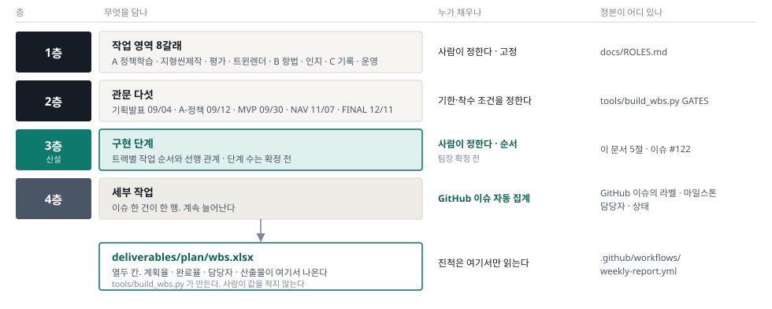
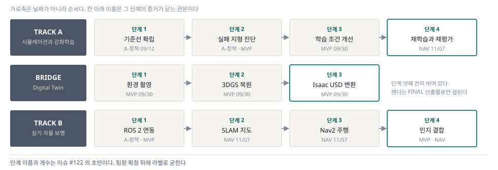

# WBS 설계

> 분류: 계획
> 작성: 오흥재 · 2026-09-03 18:40
> 근거: `deliverables/plan/proposal.md` 8-1 부터 8-4 · `deliverables/plan/wbs.md` (2026-08-27 초안) · `tools/build_wbs.py` · `docs/ROLES.md` v1.2 · 이슈 #122 #77 #104 · 실패 지형 이슈 다섯 건
> 요지: WBS 를 네 층으로 둔다. 위 세 층은 사람이 정하고 맨 아래 층과 진척은 깃에서 생성한다. 이 문서에 완료율을 적지 않는다
> 상태: 초안
> 판: v1.0

<!-- 제출본 제외 -->
**제출 형식은 PDF.** 이 마크다운이 원본이고 PDF 는 여기서 생성한다. 숫자를 두 곳에 적지 않는다.
`python tools/md2pdf.py deliverables/plan/wbs-official.md --submission --brand`

기존 `deliverables/plan/wbs.md` 는 2026-08-27 설계 초안이고 `wbs.xlsx` 는 생성물이다. 둘 다 덮어쓰지 않는다.
<!-- /제출본 제외 -->

---

## 1. 이 문서가 답하는 것

WBS 는 「누가 · 언제까지 · 무엇을 · 어떤 순서로」 네 가지에 답해야 한다. 지금까지 앞의 셋은 답이 있었고 **순서가 없었다.** 이슈 #122 가 그 빈칸을 지적한다.

| 질문 | 어느 층이 답하나 | 지금 |
|---|---|---|
| 누가 어디를 맡나 | 1층 · 작업 영역 8갈래 | 있다 |
| 언제까지인가 | 2층 · 관문 다섯 | 있다 |
| **무엇을 어떤 순서로 하나** | **3층 · 구현 단계** | **이 문서에서 신설한다** |
| 지금 무엇을 하고 있나 | 4층 · 세부 작업 | 있다 |
| **나는 팀에서 어디를 얼마나 맡았나** | 4층을 담당자 축으로 다시 읽는다 | **이 문서에서 축을 정한다** |

**관문은 날짜고 단계는 순서다.** 지금은 「A-정책 09/12 안에 이슈 몇 건」만 있고 그 이슈들이 어떤 차례로 이어지는지가 없다. 8/31 멘토링이 정한 「평지 기준선을 먼저, 그다음 실패 지형」이 바로 그 차례인데 WBS 어디에도 적혀 있지 않았다.

---

## 2. WBS 의 층 구조

2026-08-27 설계(`deliverables/plan/wbs.md`)는 3층이었다. 위 두 층을 사람이 정하고 맨 아래 한 층을 깃에서 채우는 구조다. **여기에 3층을 하나 끼워 넣어 네 층으로 만든다.**

| 층 | 무엇 | 누가 정하나 | 개수 | 정본 |
|---|---|---|---|---|
| 1 | 작업 영역 | 사람 · 고정 | 8 | `docs/ROLES.md` v1.2 |
| 2 | 관문 | 사람 · 날짜 | 5 | `tools/build_wbs.py` 의 `GATES` |
| **3** | **구현 단계** | **사람 · 순서** | **트랙마다 셋 또는 넷** | **이 문서 5절 · 팀장 확정 전** |
| 4 | 세부 작업 | **이슈에서 자동** | 계속 늘어난다 | GitHub 이슈 |

**왜 층을 나누나.** 이슈 제목을 그대로 WBS 에 올리면 사람마다 쓰는 말이 달라 표가 흩어진다. 위 세 층이 표의 뼈대를 미리 잡아 주면, 이슈가 어떤 제목으로 올라와도 제자리에 들어간다. 위 세 층은 이슈가 하나도 없어도 그려지고, 4층은 진척을 채우는 데 쓴다.

**3층이 1층과 다른 점.** 1층은 「누구의 영역인가」라는 소유의 축이고 3층은 「무엇 다음에 무엇인가」라는 시간의 축이다. 한 작업 영역이 여러 단계에 걸치고, 한 단계에 여러 작업 영역이 함께 들어간다.

---

## 3. 1층 · 작업 영역 8갈래

`docs/ROLES.md` v1.2 가 정본이다. 이 문서는 그 표를 옮기지 않고 참조한다.

| 갈래 | 무엇을 하나 | 주담당 | 부담당 |
|---|---|---|---|
| `A/정책학습` | 학습 · 보상 · 관측 · 파인튜닝 | 임석헌 | 이민우 · 오현민 · 맹라현 · 오흥재 |
| `A/지형씬제작` | 지형과 씬 에셋 제작 | 맹라현 | 오흥재 · 이민우 |
| `A/평가` | 일반화 벤치마크 · 지표 | 오현민 | 맹라현 · 이민우 |
| `A/트윈렌더` | 실공간 복원 · 3DGS · RTX 렌더 · 합성데이터 | 맹라현 | 오흥재 · 이민우 |
| `B/항법` | ROS 2 · TF · SLAM · Nav2 | 오흥재 | 임석헌 · 이민우 · 오현민 · 맹라현 |
| `B/인지` | LiDAR · 카메라 · 센서 융합 | 오현민 | 맹라현 · 이민우 |
| `C/기록` | 회의록 · 문서 · 백과 · 커리큘럼 · 발표 · 대외보고 | 이민우 | 맹라현 · 오흥재 |
| `C/운영` | 인프라 · 자동화 · 깃 · 웹 · 예산 · 일정 | 오흥재 | 전원 |

**주담당은 「혼자 한다」가 아니라 「막히면 이 사람에게 묻는다」이다.** 부담당은 검토와 대체를 맡는다. 한 사람이 자리를 비워도 갈래가 멈추지 않도록 갈래마다 두 명 이상을 둔다.

이 여덟 이름은 GitHub 라벨 이름과 글자까지 같다. `tools/build_wbs.py` 의 `AREAS` 가 라벨을 읽어 1층을 붙이므로, 라벨이 없는 이슈는 `(미분류)` 행이 된다.

---

## 4. 2층 · 관문 다섯

기획서 8-1 이 정본이고, 날짜는 `tools/build_wbs.py` 의 `GATES` 에서 읽는다. **관문은 날짜로 닫히지 않고 다음 단계 착수 조건으로 닫힌다.** 조건을 채우지 못하면 다음 단계에 착수하지 않는다.

| 관문 | 일자 | 핵심 산출물 | 다음 단계 착수 조건 | 관문 문서 |
|---|---|---|---|---|
| 기획 발표 | 09/04 | 문제 · 범위 · KPI · WBS · R&R 합의 | 평가 용어와 담당 확정 | `plan/wbs.md` |
| A-정책 | 09/12 | 평가 하네스 · 기준 정책 · 지표 세트 고정 · 지형별 난이도 경계 초기값 | 동일 조건 비교가 가능해짐 | `midterm/policy-metrics.md` |
| MVP · 중간발표 | 09/30 | 일반화 평가표 · 경계 재측정 · 트윈과 렌더 | 재현 가능한 가상 검증 패키지 | `midterm/generalization-report.md` |
| NAV · 실기 항법 | 11/07 | SLAM 지도 · Nav2 실제 경로 | 실기 목표 지점 임무 검증 가능 | `final/nav-report.md` |
| FINAL · 최종발표 | 12/11 | 자율 보행 시연 · 검증 보고서 | 공개 배포용 최종 검증 자료 | `final/final-report.md` |

「관문 문서」 열은 `GATES` 의 셋째 값이고 경로는 모두 `deliverables/` 아래다. 이슈에 마일스톤이 붙으면 생성기가 그 이슈의 산출물 칸에 이 경로를 넣는다. 그래서 **산출물 칸도 사람이 적지 않는다.**

---

## 5. 3층 · 구현 단계

이슈 #122 의 첫째 요구다. **팀장 9/1 지시**가 「지금 마일스톤 외에도 실제 구현 단계를 쪼개고, 그 안에서 팀원이 각자의 역할로 할 수 있는 것을 쪼개라」였다.

### 5-1. 단계 초안

**아래 단계 이름과 개수는 이슈 #122 의 초안이고 팀장 확정 전이다.** 기획서의 두 트랙 축을 그대로 따랐다. 「닫는 관문」 열은 기획서 8-2 의 각 작업 항목에 이미 붙어 있는 관문을 모은 것이고, 새로 만든 날짜가 아니다.

| 트랙 | 단계 | 무엇을 하나 | 닫는 관문 | 기획서 8-2 의 해당 작업 항목 |
|---|---|---|---|---|
| Track A | 1 · 기준선 확립 | 평지와 미경험 10종을 같은 조건으로 재측정하고 하네스를 고정한다 | A-정책 | 기본값 1,500 iter 학습 지형 결과 분석 · 평가 하네스 확장 7건 · 지표 3종 정본화 |
| Track A | 2 · 실패 지형 진단 | 실패 5종의 병목 축을 갈라 내고 난이도 격자로 경계를 잰다 | A-정책 · MVP | 난이도 격자 스윕과 경계 측정 · 재현성 결함 수정 · 난이도 스윕 설계 |
| Track A | 3 · 학습 조건 개선 | 보상 항을 다시 짜고 기존 지형 성능을 유지한 채 혼합 학습한다 | MVP | 보상 항 재설계와 재학습 · 기존 지형 성능 유지 혼합 학습 |
| Track A | 4 · 재학습과 재평가 | 확장 지형으로 학습하고 held-out 으로 일반화를 잰다 | NAV | 확장 지형 학습과 held-out 평가 · 절차적 확장 지형 생성 |
| Bridge | 1 · 환경 촬영 | PoC 공간을 고르고 촬영과 점군을 남긴다 | MVP | PoC 공간 선정과 스캔 |
| Bridge | 2 · 3DGS 복원 | COLMAP 과 3DGS 로 복원하고 충돌 형상을 만든다 | MVP | COLMAP · 3DGS 복원과 충돌 형상 구성 |
| Bridge | 3 · Isaac USD 변환 | 복원 결과를 학습과 평가가 쓰는 USD 씬으로 바꾼다 | MVP | COLMAP · 3DGS 복원과 충돌 형상 구성 (산출물 USD 씬) |
| Track B | 1 · ROS 2 연동 | 실행 환경을 세우고 센서와 TF 를 잇는다 | A-정책 · MVP | ROS 2 환경 구축 · 센서와 TF 연결 |
| Track B | 2 · SLAM 지도 | 지도를 만들고 위치 추정 오차를 기록한다 | NAV | SLAM 지도 생성과 위치 추정 |
| Track B | 3 · Nav2 주행 | 경로 계획과 재계획으로 목표 지점까지 간다 | NAV | Nav2 경로 계획 · 재계획 · 장애물 회피 |
| Track B | 4 · 인지 결합 | 검출 결과를 항법과 합친다 | MVP · NAV | CV 단계별 계획과 실행 환경 구축 · YOLO 파인튜닝과 LiDAR 융합 |

**Bridge 에는 넷째 단계를 두지 않았다.** 기획서 8-2 의 「에셋 팩 수령과 HDRI 렌더 · 발표 자산」은 MVP 와 FINAL 두 관문에 걸린 산출물이고, 앞 세 단계처럼 다음 단계의 입력이 되지는 않는다. 단계로 세우려면 그 산출물을 무엇이 받아 쓰는지가 먼저 정해져야 한다.

### 5-2. 단계의 완료를 무엇으로 판정하나

이슈 #122 의 둘째 물음이다. 기획서 7-1 의 KPI 를 단계에 붙인다. **기획서가 아직 목표값을 정하지 않은 항목은 여기서도 비워 둔다.**

| 단계 | 완료 판정 | 값의 성격 |
|---|---|---|
| Track A 1 · 기준선 확립 | 평지 100판에서 낙상 없이 통과선 10 m 도달 100% 유지 · 통과선 지점 좌우 이탈 5 cm 이내를 90% 이상으로 올린다 | 우리 측정 위에 세운 목표 |
| Track A 2 · 실패 지형 진단 | 실패 5종 각각 난이도 열 칸 · 칸당 100판을 돌려 경계를 낸다 | **목표 이동폭은 비어 있다.** 경계값 자체가 아직 없다 |
| Track A 3 · 학습 조건 개선 | `rails(턱)` 속도 오차 중앙값을 0.25 m/s 이하로 · `pit(구덩이)` 와 `floating_ring(부유 고리)` 전진 중앙값을 통과선 3 m 로 · 이미 통과하는 5종의 통과율 97% 이상 유지 | 우리 측정 위에 세운 목표 |
| Track A 4 · 재학습과 재평가 | held-out 지형에서 경계가 얼마나 이동했는지 | **목표값은 비어 있다.** 단계 2 의 경계가 먼저 나와야 한다 |
| Bridge 1 · 환경 촬영 | 촬영 기록과 점군 원자료가 재실행 가능한 형태로 남는다 | 산출물 유무 판정 |
| Bridge 2 · 3DGS 복원 | 충돌 형상이 붙은 복원 결과 | 산출물 유무 판정 |
| Bridge 3 · Isaac USD 변환 | 실공간과 같은 스케일의 USD 씬에서 평가가 돌아간다 | 산출물 유무 판정 |
| Track B 1 · ROS 2 연동 | 토픽과 TF 트리가 연결되고 센서 입력이 좌표계에 붙는다 | 산출물 유무 판정 |
| Track B 2 · SLAM 지도 | Localization 유지율 90% 이상 · 위치 오차 30 cm 이하 | **도전 목표 · 일반 기준.** 우리 실측이 아니다 |
| Track B 3 · Nav2 주행 | 20회 이상 반복 주행 · 목표 지점 도달률 80% 이상 · 무충돌 주행률 90% 이상 · 경로 재계획 성공률 80% 이상 | **도전 목표 · 일반 기준.** 우리 실측이 아니다 |
| Track B 4 · 인지 결합 | 탐지 객체 3종 이상 · Precision 과 Recall 80% 이상 · mAP@0.5 75% 이상 | **도전 목표 · 일반 기준.** 우리 실측이 아니다 |

**Track B 의 아홉 값은 실기 측정에서 나온 값이 아니다.** 출처가 기획서 초안이고 실기 측정은 아직 0건이다. 실기 환경과 대여 장비가 확정된 뒤 재검토한다. 기획서 7-1 이 같은 단서를 달고 있다.

**한 판을 통과로 세는 기준은 네 축을 모두 만족하는 것이다.** 생존 · 전진 · 속도 추종 · 직진성이며 하나라도 못 넘기면 실패다. 평가 CSV 는 종합 판정을 포함해 다섯 열이다. 축을 나눈 이유는 지형마다 부족한 지표가 다르기 때문이고, 단일 성공률로 합치면 학습 조건의 조정 방향을 구분할 수 없다.

### 5-3. 3층을 데이터로 어떻게 잇나

지금은 이 문서에만 있고 생성기에는 없다. **잇는 방법 두 가지를 견주면 라벨 쪽이 짧다.**

| 방법 | 어떻게 | 장점 | 단점 |
|---|---|---|---|
| **이슈 라벨** | `S/A1-기준선` 처럼 단계 라벨을 새로 판다 | `tools/build_wbs.py` 가 이미 라벨을 읽는다. `AREAS` 옆에 `STAGES` 를 두고 같은 방식으로 찾으면 된다 | 라벨이 여덟 개 더 늘어난다. 붙이는 것을 잊으면 `(미분류)` 가 된다 |
| 프로젝트 보드 필드 | 보드에 단계 필드를 만든다 | 라벨 목록이 안 늘어난다 | 생성기가 지금 보드를 안 읽는다. 이슈 목록만 읽는다. 읽는 경로를 새로 만들어야 한다 |

**라벨 쪽을 권한다.** 다만 **단계 이름이 팀장 확정을 거친 뒤에 판다.** 라벨은 한 번 붙으면 이슈 전체를 다시 손봐야 바뀐다.

생성기 수정은 이슈 #122 의 후속 작업이고 이 문서의 범위가 아니다. **이 문서는 무엇을 라벨로 만들지를 정하는 데까지다.**

---

## 6. 4층 · 작업 분해 23건

기획서 8-2 가 정본이다. **주담당은 해당 영역의 결과와 인계를 책임지고, 부담당은 검토와 필요 시 업무 대체를 맡는다.**

| 작업 영역 | 작업 항목 | 담당 | 관문 | 산출물 |
|---|---|---|---|---|
| `A/정책학습` | 기본값 1,500 iter 학습 지형 결과 분석 | 임석헌 | A-정책 | 정체 · 낙상 분리 분석표 |
| `A/정책학습` | 보상 항 재설계 · 발 높이 항 신설과 재학습 | 임석헌 | MVP | 학습 로그 · 정책 체크포인트 |
| `A/정책학습` | 기존 지형 성능 유지 혼합 학습 (rough 0.6 · 대상 0.4) | 임석헌 | MVP | 성능 유지 검증표 |
| `A/정책학습` | 확장 지형 학습과 held-out 평가 | 임석헌 | NAV | 일반화 성능표 |
| `A/평가` | 평가 하네스 확장 7건 · 새 기준 측정 가능화 | 오현민 | A-정책 | 하네스 · 시험 68건 |
| `A/평가` | 지표 3종과 판정 기준 정본화 | 오현민 | A-정책 | 판정 함수 · 임계값 문서 |
| `A/평가` | 난이도 격자 스윕과 경계 측정 | 오현민 | A-정책 · MVP | 지형별 경계표 |
| `A/평가` | 재현성 결함 수정 (전역 난수 사용 4종) | 오현민 | A-정책 | 지형 생성 재현성 검증 |
| `A/지형씬제작` | 난이도 스윕 설계 · 지형 파라미터 재설계 | 맹라현 | A-정책 | 스윕 설계서 |
| `A/지형씬제작` | 절차적 확장 지형 생성 | 맹라현 | NAV | 확장 지형 cfg |
| `A/트윈렌더` | PoC 공간 선정과 스캔 (촬영 · 점군) | 맹라현 | MVP | 원자료 · 촬영 기록 |
| `A/트윈렌더` | COLMAP · 3DGS 복원과 충돌 형상 구성 | 맹라현 | MVP | USD 씬 |
| `A/트윈렌더` | 에셋 팩 수령과 HDRI 렌더 · 발표 자산 | 맹라현 | MVP · FINAL | 렌더 시연물 |
| `B/항법` | ROS 2 환경 구축 · 센서와 TF 연결 | 오흥재 | A-정책 · MVP | 토픽 · TF 트리 |
| `B/항법` | SLAM 지도 생성과 위치 추정 | 오흥재 · 이민우 | NAV | 지도 · 위치 오차 기록 |
| `B/항법` | Nav2 경로 계획 · 재계획 · 장애물 회피 | 이민우 · 오흥재 | NAV | 주행 로그 (rosbag2) |
| `B/인지` | CV 단계별 계획과 실행 환경 구축 | 오현민 | MVP | 환경 문서 · 데이터셋 |
| `B/인지` | YOLO 파인튜닝과 LiDAR 융합 | 오현민 | NAV | 검출 성능표 |
| `C/기록` | 회의록 · 문서 정본화 · 기술 허브 집필 | 이민우 | 전 관문 | 정본 문서 |
| `C/기록` | 발표 자료 제작과 대외 보고 | 이민우 | 전 관문 | 발표 산출물 |
| `C/운영` | 인프라 · RunPod 볼륨 · 팀 폴더 표준화 | 오흥재 | A-정책 | 실행 환경 |
| `C/운영` | 빌드 · 배포 자동화 · 프로젝트 웹 | 오흥재 | MVP | 배포 파이프라인 |
| `C/운영` | 일정 · 예산 · 범위 관리 · 멘토 협의 | 오흥재 | 전 관문 | 일정 대시보드 |

**이 23건은 계획의 단위이지 진척의 단위가 아니다.** 실제 진척은 이 23건에 매달린 GitHub 이슈에서 나오며, 이슈는 계속 늘어난다.

---

## 7. 실패 지형 다섯의 소유

기획서 8-3 이 정본이고 이슈 다섯 건이 각각 걸려 있다. **전원이 하나씩 맡는다.** 문서와 발표를 맡은 사람도 실기 항법과 실패 지형을 함께 맡는다.

| 지형 | 현재 종합 통과율 | 병목 축 | 담당 | 이슈 | 갈래 |
|---|---|---|---|---|---|
| `gap(틈)` | 0% | 생존 21% | 임석헌 | #65 | `A/정책학습` |
| `rails(턱)` | 4% | 속도 추종 8% | 맹라현 | #66 | `A/지형씬제작` · `A/트윈렌더` |
| `stepping_stones(디딤돌)` | 0% | 생존 20% | 오현민 | #67 | `A/평가` · `B/인지` |
| `pit(구덩이)` | 3% | 전진 15% | 이민우 | #68 | `B/항법` · `C/기록` |
| `floating_ring(부유 고리)` | 0% | 전진 0% | 오흥재 | #69 | `B/항법` · `C/운영` |

**담당자는 실패 분석 1장과 학습 설정안 1장을 함께 낸다.** 학습 설정안은 해당 지형의 통과율을 올리기 위해 조정할 보상과 학습 조건을 적은 문서다. 다섯 명이 병렬로 찾는 것은 지형별 조정안이고, **최종 정책은 지형별 다섯 개가 아니라 혼합 단일 정책 하나다.**

위 통과율은 난이도 0.5 한 점에서 6초 · 통과선 3 m · 1.0 m/s · 지형당 100판 · seed 42 로 잰 값이다. **같은 0% 가 같은 뜻이 아니다.** `stepping_stones(디딤돌)` 과 `gap(틈)` 은 낙상이고, `floating_ring(부유 고리)` 은 난이도 0.5 의 기하에 통과 경로가 없어서다. 그래서 이 지형의 첫 목표는 통과율이 아니라 어느 난이도부터 통과가 성립하는지를 재는 것이다.

---

## 8. 월별 진행

기획서 8-4 가 정본이다. **이 표는 관문별 배치를 보여 주는 것이고 진척률이 아니다.**

| 시기 | Track A | Digital Twin | Track B | 공통 |
|---|---|---|---|---|
| 09/12 까지 | 하네스 확장 · 기준선 확정 · 10종 재측정 · 난이도 경계 초기값 | PoC 공간 선정 | ROS 2 환경 구축 | 지표 · 판정 기준 정본화 |
| 09/30 까지 | 보상 재설계 · 파인튜닝 · 경계 재측정 | 스캔 · 트윈 구축 · 지형 특성 추출 | Go2 센서와 TF 연결 · CV 환경 | 중간 산출물 · 실험 기록 |
| 11/07 까지 | 확장 지형 학습 · held-out 평가 | 절차적 확장 | SLAM 지도 · Nav2 경로 | 실기 검증 기록 |
| 12/11 까지 | 최종 성능표 · 회귀 검증 | 발표 자산 렌더 | 목표 지점 자율 보행 시연 | 최종 보고서 · 공개 릴리스 |

**세부 진척은 GitHub 프로젝트 보드의 실측값을 사용하며 임의 진척률을 기재하지 않는다.** 이 원칙은 기획서 8-4 가 이미 적었고 이 문서도 같이 지킨다.

---

## 9. 사람별 기여 축

이슈 #122 의 둘째 요구다. 팀장 9/1 지시가 「각자 개인이 팀의 팀원으로서 얼마나 기여하고 앞으로 진행할 수 있는지가 한 눈에 보이는 WBS」였다. **기여를 한 줄로 합치지 않고 세 축으로 나눠 본다.**

| 축 | 무엇을 보나 | 어디서 오나 | 성격 |
|---|---|---|---|
| 1 · 갈래 소유 | 여덟 갈래 중 어느 것의 주담당이고 어느 것의 부담당인가 | `docs/ROLES.md` v1.2 | 사람이 정한다 · 거의 안 바뀐다 |
| 2 · 실패 지형 소유 | 실패 5종 중 어느 하나를 맡고 분석과 설정안을 냈는가 | 기획서 8-3 · 이슈 다섯 건 | 사람이 정한다 · 1인 1지형 |
| 3 · 작업 실적 | 담당자로 걸린 이슈가 어느 영역 · 어느 관문 · 어느 단계에 몇 건이고 그중 몇 건이 닫혔는가 | GitHub 이슈의 `assignees` 와 `state` | **깃이 채운다 · 매주 바뀐다** |

**축 3 의 값은 이 문서에 적지 않는다.** `deliverables/plan/wbs.xlsx` 의 `담당자` 열을 `WBS` · `관문` 열과 교차 집계하면 그대로 나온다. 문서에 숫자를 옮겨 적는 순간 두 곳이 갈라지고, 어느 쪽이 맞는지 확인해 주는 것이 없어진다.

**세지 않는 것도 정해 둔다.** 커밋 수와 코드 줄 수는 기여 축으로 쓰지 않는다. 갈래마다 산출물의 단위가 다르기 때문이다. `C/기록` 의 산출물은 문서고 `A/트윈렌더` 의 산출물은 씬과 렌더며 `A/정책학습` 의 산출물은 학습 로그와 체크포인트다. 같은 자로 재면 문서와 렌더를 맡은 사람의 기여가 실제보다 작게 보인다.

**축 3 이 제대로 나오려면 두 가지가 갖춰져야 한다.**

- 모든 이슈에 작업 영역 라벨이 붙어 있어야 한다. 안 붙은 이슈는 `(미분류)` 행이 되어 갈래별 집계에서 빠진다. 미분류 건수는 `python tools/build_wbs.py` 를 돌리면 둘째 줄에 나온다
- 모든 이슈에 담당자가 지정돼 있어야 한다. 담당자 칸이 비면 그 이슈는 어느 사람 축에도 안 붙는다

**3층 단계별 기여는 아직 볼 수 없다.** 단계 라벨이 아직 없기 때문이다. 5-3 의 라벨이 붙고 나면 같은 교차 집계에 단계 축이 하나 더 생긴다. **단계 라벨이 붙기 전에는 이 자리를 비워 둔다.**

---

## 10. 진척과 완료율을 어디서 읽나

**이 문서에는 완료율도 진척률도 없다.** 어디서 읽는지만 적는다.

| 무엇 | 어디서 | 어떻게 |
|---|---|---|
| 계획율 · 완료율 · 담당자 · 산출물 | `deliverables/plan/wbs.xlsx` | `tools/build_wbs.py` 가 GitHub 이슈에서 만든다 |
| 그 파일이 언제 갱신되나 | `.github/workflows/weekly-report.yml` | 매주 월요일 주간 리포트에 편승한다. 바뀐 것이 있을 때만 커밋한다 |
| 급할 때 | 같은 워크플로 | GitHub Actions 의 Run workflow 단추로 직접 돌린다 |
| 지금 당장 화면에서 | `python tools/build_wbs.py` | 인자 없이 돌리면 표를 화면에 찍는다. 파일을 안 건드린다 |

생성기는 두 저장소(`foothold-lab` · `foothold-go2`)의 이슈를 모두 읽는다. 열두 칸 중 여섯은 이슈에 이미 있는 값을 그대로 옮기고 나머지는 계산한다. **사람이 같은 숫자를 두 번 적는 자리를 만들지 않는 것이 이 구조의 목적이다.** 별도 스케줄을 두지 않은 이유는, 이슈가 바뀔 때마다 파일을 다시 만들면 커밋 이력만 길어지고 얻는 것이 없기 때문이다. 보는 시점에 최신이면 충분하다.

---

## 11. 아직 정하지 못한 것

**지어내지 않고 비워 둔 자리와, 그 자리가 무엇으로 채워지는지를 적는다.**

| 빈 자리 | 무엇이 있어야 채워지나 | 언제 |
|---|---|---|
| 구현 단계의 이름과 개수 | 팀장 확정. 5-1 은 이슈 #122 의 초안이다 | 기획발표 09/04 전후 |
| 단계 라벨 | 위 확정. 확정 전에 라벨을 파면 이슈 전체를 다시 손봐야 한다 | 단계 확정 직후 |
| 생성기의 3층 지원 | `tools/build_wbs.py` 에 `STAGES` 추가. 이슈 #122 의 후속 작업 | 라벨을 판 뒤 |
| 단계별 기여 집계 | 위 셋이 모두 갖춰진 뒤 | 라벨이 이슈에 붙은 뒤 |
| Track A 단계 2 · 4 의 목표값 | 실패 5종 각각 난이도 열 칸 · 칸당 100판. 지금까지의 1,000판은 난이도 0.5 한 점이라 경계를 만들지 못한다 | A-정책 09/12 |
| Track B 아홉 값의 확정 | 실기 환경과 대여 장비 확정. 지금 값은 도전 목표이고 우리 실측이 아니다 | 장비 확정 뒤 |
| Bridge 넷째 단계 | 렌더 산출물을 무엇이 받아 쓰는지. 지금은 다음 단계의 입력이 아니다 | 발표 자산 범위 확정 뒤 |

**정본과 어긋나 보이지만 이 문서에서 고치지 않은 것.**

- 2026-08-27 설계 초안(`deliverables/plan/wbs.md`)의 2층 표에 **기획발표 09/04 관문이 빠져 있다.** 넷만 적혀 있다. `tools/build_wbs.py` 의 주석도 같은 누락을 지적한다. 이 문서는 다섯으로 적었고 초안 파일은 건드리지 않았다
- 같은 초안이 완료율을 「Todo 0 · In Progress 50 · Done 100」으로 적었는데 **생성기는 닫힘 100 · 나머지 0 두 값만 쓴다.** 문서와 코드가 어긋난다
- 같은 초안이 시작날짜를 「보드의 시작일」로 적었는데 **생성기는 이슈 생성일을 쓴다**
- 관문 문서 열의 기획발표 칸이 `deliverables/plan/wbs.md` 를 가리킨다. **제출본은 이 파일(`wbs-official.md`)이다.** 생성기의 `GATES` 를 고칠지는 팀장 확인이 필요하다
- 실패 지형 이슈 다섯 건의 제목이 비유 표현을 쓴다. 표현 규칙과 어긋나지만 **이슈 제목은 고치지 않았다**

---

## 판 이력

| 판 | 언제 | 무엇이 바뀌었나 | 근거 |
|---|---|---|---|
| **v1.0** | 2026-09-03 | 신설. 3층 초안에 구현 단계 층을 끼워 네 층으로 만들고, 사람별 기여를 세 축으로 갈랐다. 작업 분해를 기획서 8-2 의 23건으로 맞추고 진척은 생성 경로에서만 읽게 했다 | #122 · #77 · #104 |
