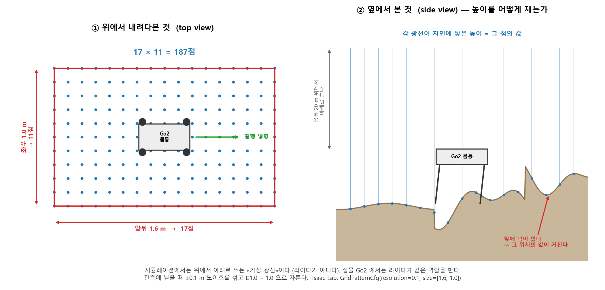

# 프로젝트 전체 흐름

> 이 문서는 **"우리가 무엇을 어떤 순서로 하는가"**를 한 장으로 보이게 한다.
> 로봇공학을 모르는 사람이 읽어도 이해되게 쓴다. 용어는 나올 때마다 그 자리에서 푼다.
> 마지막 §7 은 **자주 헷갈리는 것**을 모아둔 곳이다 — 여기부터 읽어도 된다.

---

## 1. 한 장으로 보는 전체 흐름

<!--SVG:pipeline-->

**세 갈래로 갈라진다는 것**이 이 그림의 핵심이다.
학습이 끝나면 **정책 파일 하나(6.9MB)**만 들고 나오고, 그 뒤로는 서로 다른 세 가지 일이 병행된다.

| 갈래 | 무엇 | 왜 |
|---|---|---|
| **새 지형 시험** | 학습에 쓴 적 없는 지형에서 걸어보게 한다 | 진짜 배웠는지 확인 |
| **sim2sim** | 다른 물리 엔진(MuJoCo)에서 돌려본다 | 특정 엔진을 속인 게 아닌지 확인 |
| **극사실 렌더** | 예쁜 씬에 넣고 영화처럼 렌더한다 | 보여주기. **학습 기여도 0** |

---

## 2. 1단계 — 시뮬레이션에서 학습

### 무엇이 일어나는가

로봇 **4,096마리**가 동시에 험지를 걷는다. 화면은 끄고(headless) 물리 계산만 돌린다.
넘어지면 다시 세우고, 잘 걸으면 점수를 준다. 이걸 수천만 번 반복한다.

### 지형은 이렇게 생겼다

| 항목 | 값 |
|---|---|
| 타일 하나 | 8m × 8m |
| 배치 | 10행 × 20열 = 200개 타일 |
| 전체 | 80m × 160m |
| 행(row) | 난이도. 아래가 쉽고 위로 갈수록 어렵다 |
| 열(col) | 지형 종류 (계단 오름·내림, 요철, 경사 등 6종) |

**로봇이 잘하면 위 행으로 승급하고, 못하면 아래로 강등된다**(지형 커리큘럼).
그래서 학습 중에 에피소드 길이가 출렁이는 것은 나빠진 게 아니라 **승급했다는 뜻**이다.

### 단위

| 말 | 뜻 |
|---|---|
| 1 step | **0.02초** (정책이 50Hz 로 판단한다) |
| 1 iteration | 4,096마리 × 24 step = **98,304 env-step** |
| 기본 학습량 | 1,500 iteration = **실측 133분** (2026-08-12 완주) |

### 정책이란 무엇인가

**로봇의 뇌.** 딱 하나의 일을 한다 — **지금 상태를 보고, 관절 12개를 어디로 움직일지 정한다.**

| 입력 235개 | 개수 | 실물에서 |
|---|---|---|
| 몸통이 얼마나 빨리 도는가 | 3 | 읽힌다 |
| 중력이 어느 쪽인가 (기울기) | 3 | 읽힌다 |
| 어디로 가라는 명령 | 3 | 우리가 준다 |
| 관절 12개의 현재 각도 | 12 | 읽힌다 |
| 관절 12개의 현재 속도 | 12 | 읽힌다 |
| 직전에 내가 한 행동 | 12 | 우리가 안다 |
| 몸통 속도 | 3 | ⚠️ 센서가 없다 |
| 발밑 지형 높이 187점 | 187 | ⚠️ 만들 수 없다 |

**출력은 12개**, 관절 12개의 목표 각도다.

신경망은 **3층(512-256-128)**, 파라미터 약 17만 개, 파일 6.9MB. **요즘 기준으로 아주 작다.**

### 보상(채점표)은 사람이 쓴다

정책은 기계가 만들지만, **"무엇을 잘한 것으로 칠까"는 사람이 코드로 직접 쓴다.**

| | 보상 설계 | 정책 |
|---|---|---|
| 정체 | 채점표 | 상황 → 행동을 내는 신경망 |
| 누가 만드나 | **사람** | **기계** |
| 바꾸는 법 | 코드를 고친다 | 직접 못 고친다. 보상을 바꿔 간접적으로 |

**그래서 이 일의 실력은 "채점표를 얼마나 잘 설계하느냐"에 달려 있다.**

---

## 3. 2단계 — 증류: 실물에 올릴 수 있게 만들기

<!--SVG:privileged-->

### 문제

위 입력 235개 중 두 가지는 **시뮬레이터만 아는 답**이다. 이것을 **특권 정보**라 부른다.

- **몸통 속도** — 실물 Go2 에 이걸 직접 재는 센서가 없다
- **발밑 지형 높이 187점** — 시뮬은 지형 데이터를 조회하면 되지만, 실물은 알 방법이 없다



**187 이 어디서 나온 숫자인가**: 로봇 몸통을 중심으로 **앞뒤 1.6 m × 좌우 1.0 m** 격자를
**10 cm 간격**으로 나누면 **17 × 11 = 187점**이다. 각 점에서 위(20 m)에서 아래로 광선을 쏴
지면까지의 거리를 잰다. 앞에 턱이 있으면 그 위치의 값만 커진다 — 그래서 «앞에 뭔가 있다»를 안다.

> ⚠️ **시뮬에서는 라이다가 아니라 «가상 광선»이다.** 지형 데이터를 조회하는 것이다.
> 실물 Go2 에서는 라이다가 같은 역할을 하지만, **격자 크기와 해상도가 달라 매핑이 필요하고**,
> 저수준 제어로 바꾸면 끊길 가능성이 있다(8/13 현장 확인 항목).

> **즉 1단계에서 학습한 정책은 그대로는 실물에서 못 돈다.** 입력을 채울 수가 없다.

### 해법 — teacher-student 증류

| | Teacher | Student |
|---|---|---|
| 보는 것 | 특권 정보까지 전부 (235개) | 실물에서 읽히는 것만 |
| 걷는 실력 | 아주 잘 걷는다 | Teacher 를 흉내 낸다 |
| 실물 적용 | 못 붙인다 (입력을 채울 수 없다) | 붙는다 |

증류는 **시뮬 안에서, 지도학습으로** 이루어진다. Teacher 가 낸 행동을 정답 삼아
Student 가 같은 행동을 내도록 학습시키는 것이다.

**Student 는 지형 높이를 직접 못 본다.** 대신 **과거 몇 초간의 관절 움직임**에서
*"발이 예상보다 일찍 닿았다 + 토크가 튀었다 → 지금 발밑이 올라와 있다"*를 역추론한다.

> ### ★ 이것이 우리 주제의 **"Online Adaptation"** 이다.
> 지형을 **보지 않고 몸의 느낌으로 알아채는 것.**

### 과거 이력을 얼마나 보는가 — 우리가 정해야 할 것

| 방법 | 이력 | 실시간 | 성격 |
|---|---|---|---|
| **Lee et al.** (Science Robotics 2020) | 100 step | 2초 | 지형 형상 추론에 강함, 반응이 느림 |
| RMA (RSS 2021) | 50 step | 1초 | 동역학(마찰·무게) 적응 중심 |
| DreamWaQ / HIMLoco | 5 step | 0.1초 | 반응이 빠름, 이력 정보가 적음 |

**길수록 지형을 잘 알아채지만 느리게 반응한다.** 짧을수록 반대다.

### ⚠️ 두 종류의 "증류"를 구분할 것

| | **경량화 증류** | **관측 증류 (우리 것)** |
|---|---|---|
| 목적 | 큰 모델 → 작은 모델 | 특권 정보를 보는 정책 → 실제 센서만 보는 정책 |
| 왜 | Orin 에서 실시간으로 돌리려고 | **실물이 그 입력을 만들 수 없어서** |
| 불필요해질 조건 | Orin 이 충분히 빠르면 | **없다. 무조건 필요** |

**우리 정책은 파라미터 17만 개다. Orin NX 에서 여유롭게 돈다 → 경량화 증류는 아마 불필요하다.**

---

## 4. 3~4단계 — 새 지형 시험 · sim2sim

### 새 지형 시험

학습에 쓴 적 없는 지형에서 걸어보게 한다. **여기서 무너지는 지점을 찾는 것이 목적이다.**

**실증 완료**: 회색 절차생성 험지에서 학습한 정책을 창고 USD 씬에 넣어 걷게 하는 데 성공했다.
핵심은 코드 한 줄이다.

```python
env_cfg.scene.terrain = TerrainImporterCfg(
    terrain_type="usd",              # 절차생성 지형 대신
    usd_path="...warehouse.usd",     # USD 파일을 통째로 지형으로
)
```

### sim2sim — 왜 다른 엔진에서 또 돌리나

같은 정책을 **MuJoCo**(구글 딥마인드의 물리 엔진, 로봇 학계 표준)에서 돌려본다.

이유: 정책이 **PhysX 의 버그나 특성에만 통하는 꼼수**를 배웠을 수 있다.

| 결과 | 해석 |
|---|---|
| Isaac Sim 에서만 잘 걷는다 | PhysX 를 속이는 법을 배웠을 수 있다 |
| 두 엔진 모두에서 잘 걷는다 | 진짜 걷는 법을 배웠을 확률이 높다 |

> **sim2sim 은 sim2real 의 예행연습이다.** 실기에서 깨지는 것보다 MuJoCo 에서 깨지는 게 훨씬 싸다.

⚠️ **팀 규칙**: **학습은 Isaac Sim 에서만 한다. MuJoCo 는 검증용으로만.**
물리 계산이 달라서 두 엔진의 학습 결과는 비교할 수 없다.

---

## 5. 5단계 — sim2real: 실물 Go2

<!--SVG:control-->

### Go2 에는 제어 층이 두 개이고, 동시에 켜지지 않는다

| | **고수준 (스포츠 모드 · MCF)** | **저수준 (SDK2)** |
|---|---|---|
| 누가 관절을 움직이나 | Unitree 순정 컨트롤러 | **우리 정책** |
| 당신이 보내는 것 | "앞으로 가", "돌아" | 관절 12개의 목표 각도 |
| 언제 쓰나 | 리모컨 조종 · **안전 백업** | 우리 실험 |

> ### **비유: 자동차의 크루즈 컨트롤과 수동 운전.**
> 크루즈를 켜면 내 발이 액셀에서 떨어지고, 내가 액셀을 밟으면 크루즈가 풀린다.
> **둘이 싸우지 않는다.** 하나가 켜지면 하나가 꺼진다.

**Unitree 순정을 지우는 게 아니라 잠시 비켜두는 것이다.** 언제든 되돌릴 수 있고,
우리 정책이 이상하면 스위치를 되돌려 로봇을 안전하게 세운다. **버릴 게 아니라 백업이다.**

### 실기에서 50분의 1초마다 일어나는 일

<!--SVG:runtime-->

> ### ★★ **실기에서는 학습하지 않는다. 추론만 한다.**
> "Online Adaptation" 의 "online" 은 **실시간으로 추론한다**는 뜻이지
> **실시간으로 학습한다**는 뜻이 아니다.
>
> 정준 인용 (Smith et al., CoRL 2021):
> *"RMA 는 단지 기억을 가진 정책일 뿐이고, **새 환경에서 모은 데이터로 모델의
> 파라미터를 갱신하지 않는다.** 따라서 데이터가 늘어도 나아지지 않는다."*

### 그럼 개선은 어떻게 도나 — 사람이 돈다

<!--SVG:improve-->

**로봇이 스스로 도는 게 아니다.** 한 바퀴에 학습 **약 2시간 15분**(실측 133분) + 배포·시험이 붙는다.
**몇 바퀴 돌 수 있느냐가 일정의 핵심이다.**

*(ONNX = 모델 파일 형식. Orin NX 와 이름만 비슷하고 전혀 다르다.
 PyTorch 로 만든 모델을 다른 프로그램에서 읽을 수 있게 변환한 것 — PSD 를 EXR 로 내보내는 것에 가깝다.)*

---

## 6. 별도 갈래 — 극사실 렌더

**학습과 렌더는 완전히 분리된다.**

| | 구성 | 목적 |
|---|---|---|
| **학습** | 회색 무텍스처 · 4,096마리 · 렌더 끔 | 속도. 예쁠 필요 0 |
| **렌더** | 1마리 · 실사 지형 · Path Tracing | 품질. 느려도 됨 |

VFX 파이프라인과 같은 구조다 — 시뮬레이션 캐시를 굽고, 라이팅·렌더를 따로 한다.

### 실측 (RTX 5080 ×2, 1920×1080)

| 렌더러 | 프레임당 | 30초 영상 | 2분 영상 |
|---|---|---|---|
| RTX Real-Time | 0.056초 | 1.4분 | 5.6분 |
| **Path Tracing 128spp** | **1.751초** | **44분** | **2.9시간** |
| Path Tracing 512spp | 1.786초 | 45분 | 3.0시간 (128 대비 이득 없음) |

> **렌더 시간은 병목이 아니다. 병목은 씬을 만드는 시간이다.**

---

## 7. ★ 자주 헷갈리는 것

### Q. 실기에서 강화학습을 하면 안 되나?

**사실상 불가능하다.** 강화학습은 넘어지면서 배운다.
300 iteration 만 해도 로봇 1대로는 **164시간(6.8일)**이고 수십만 번 넘어진다.
**실물은 부서진다.** 멘토 평가로는 *"리얼월드 수렴 20만 시간"*.

| | 성격 | 조건 |
|---|---|---|
| **시뮬** | 학습장 | 넘어져도 됨 · 4,096마리 · 로봇 1대보다 470배 빠름 |
| **실기** | 시험장 | 넘어지면 안 됨 · 1마리 · 실시간 |

### Q. 이미 학습된 공개 모델을 그냥 실물에 올리면 되지 않나?

**관측 규격만 맞으면 올라간다.** 그런데 그러면 **우리가 한 일이 "남의 모델을 실행한 것"**이 된다.
**다만 출발점으로 쓰는 것은 맞다** — 백지에서 시작할 필요가 없다.

### Q. 세상 모든 환경에서 시뮬을 다 돌려야 하나?

**아니다. 돌려서도 안 된다.** 특정 환경을 다 외우면 오히려 새 환경에서 무너진다(과적합).

대신 **도메인 랜덤화** — 매 에피소드마다 세상을 흔든다.

| 무엇을 흔드나 | 범위 | 로봇이 겪는 것 |
|---|---|---|
| 마찰계수 | 0.4 ~ 1.2 랜덤 | 미끄러움이 매번 다름 |
| 로봇 질량 | ±15% 랜덤 | 무게가 매번 다름 |
| 모터 강도 | ±10% 랜덤 | 힘이 매번 다름 |
| 외력 푸시 | 랜덤 타이밍·방향 | 툭 밀기 |

> **로봇은 "특정 바닥"을 배우는 게 아니라 "바닥이 어떻든 대응하는 법"을 배운다.**

**아이가 걷는 것과 같다.** 아이는 세상 모든 바닥을 밟아보고 걷게 되는 게 아니다.
몇 가지 다른 바닥을 겪으며 **"바닥이 다를 수 있다"는 사실 자체**를 배운다.

### Q. 새 지형마다 처음부터 다시 학습하나?

| 상황 | 방법 |
|---|---|
| 랜덤화가 잘 됐다 | **다시 안 한다.** 그대로 걷는다 |
| 새 지형에서 무너진다 | **기존 가중치에서 이어서 학습**(fine-tuning) |
| 완전히 다른 종류(예: 물속) | 새로 설계해야 한다 |

### Q. 3DGS 로 뜬 실사 지형을 학습에 쓰나?

**아니다.** 학습에는 200개 타일이 필요한데 스캔은 1개다. 하나로 학습하면 그 장소만 외운다.

스캔의 역할은 **"실제 지형은 이런 통계를 갖는다"를 알아내는 것**이다
(돌 크기 분포 · 경사 분포 · 요철 주기). 그 통계가 세 갈래로 쓰인다.

| 쓰임 | 지형 | 왜 |
|---|---|---|
| 학습 지형 | 그 통계로 절차 생성한 200개 타일 (매번 다름) | 외우지 못하게 |
| 평가 지형 | 스캔 그대로 (한 번도 안 본 진짜 지형) | 진짜 시험 |
| 렌더 지형 | 스캔 그대로 + 고품질 텍스처 | 보여주기 |

> **스캔은 "학습 교재"가 아니라 "시험지"와 "무대"다.**
> 그래서 스캔에 뾰족한 노이즈가 있어도 학습을 망치지 않는다.

### Q. 모래는 왜 안 되나?

**Isaac Lab 메인테이너 공식 답변**: *"지원하지 않고 로드맵에도 없다."*
입상 매질(모래·자갈이 흐르는 물리)은 강체 시뮬레이터가 다루지 않는다.
**물의 저항도 같은 이유로 불가능하다.**

**대신 외란은 이렇게 만든다** — 전부 실제로 시뮬레이션된다.
- **밀림**: 무작위 외력 푸시 (Isaac Lab 내장 `push_robot`)
- **미끄러움**: 마찰계수 랜덤화
- **불안정한 발판**: 흔들리는 판, 무너지는 잔해

---

## 8. 지금 어디까지 왔나

| 확인한 것 | 결과 |
|---|---|
| Isaac Sim + Isaac Lab 구축 | ✅ 완료 (Windows 네이티브) |
| 사전학습 정책 재생 | ✅ 성공 |
| 300 iteration 학습 | ✅ 22분 · 보상 13.94 |
| **학습 씬 ≠ 렌더 씬 분리** | ✅ **실증 성공** |
| Path Tracing 실측 | ✅ 1080p 128spp = 1.751초/프레임 |
| GPU 2장 DDP | ❌ **Windows 는 NCCL 미지원 → 구조적 불가** |

**상세**: [visual-evidence.md](visual-evidence.md) · [render-benchmarks.md](render-benchmarks.md) ·
[training-benchmarks.md](training-benchmarks.md) · [architecture-decision.md](architecture-decision.md)
