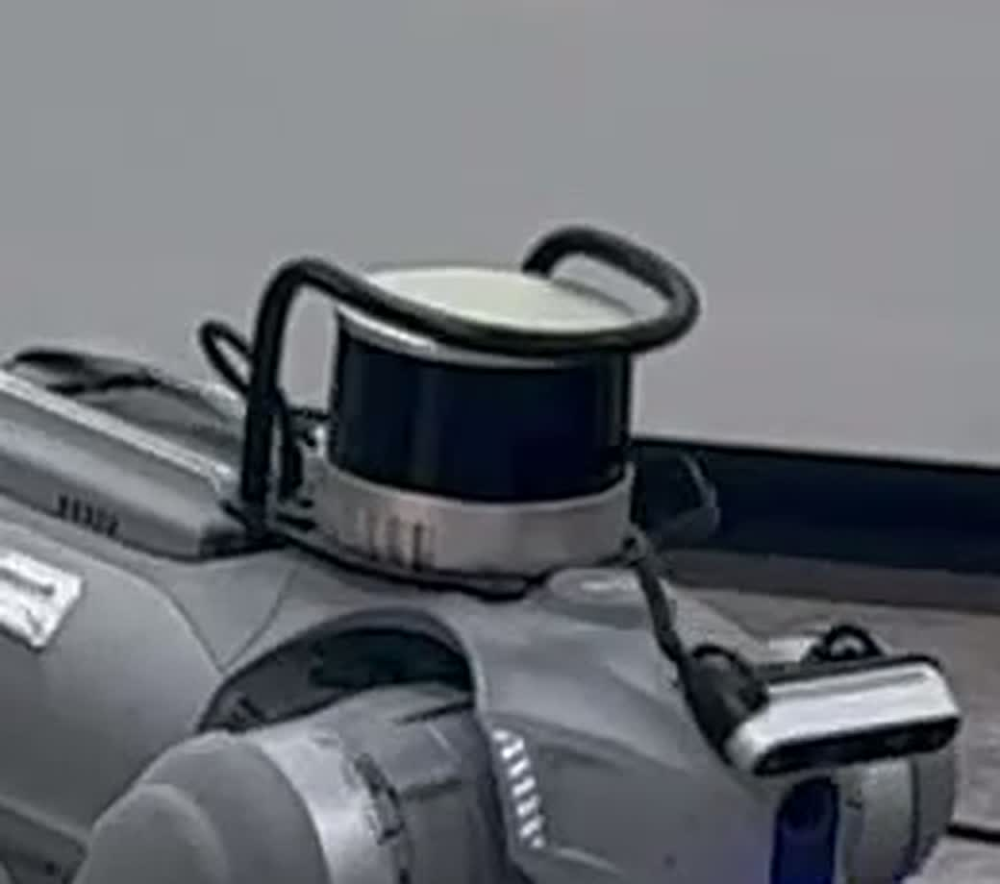

# 우리가 쓰는 Go2 실기 사양

> 분류: 리서치
> 작성: 오흥재 · 2026-08-14 17:52
> 근거: 공식 문서
> 요지: Unitree Go2 하드웨어 제원과 SDK 접근 경로 정리.
> 상태: 확정
> 판: v1.0

> 작성 2026-08-14 · 출처: 팀장 확인 · 이 문서가 «우리 로봇» 의 단일 진실이다.
> 이 사양은 설계 갈림길 여러 개를 이미 닫는다. 아래 §3 참조.

## 1. 확정 사양 `확인됨`

| 항목 | 값 | 무엇이 결정되나 |
|---|---|---|
| **트림** | **EDU** | 저수준 개발이 열려 있다. AIR/PRO 였다면 프로젝트가 성립하지 않았다 |
| **RJ45 이더넷** | **있음** | 유선 연결 가능. DDS NIC 바인딩의 전제 |
| **온보드 컴퓨팅** | **Jetson Orin NX 16GB** | 경량화 증류 불필요 (§3-1) |
| **라이다** | 기본 라이다 **+ 등에 별도 Unitree 라이다 모듈** | 지형 인지 경로가 하나 더 있다 (§3-2) |
| **카메라** | 장착됨 | 인지 갈래의 입력원 |

### 등에 얹힌 라이다: 영상으로 확인한 것 `부분확인`

*팀장 촬영 영상(IMG_6331.MOV, 4K) 0.3초 지점을 원본 해상도에서 잘라 확대.*

영상에서 **확실하게 판별되는 것**:

| 관찰 | 의미 |
|---|---|
| 원통형 puck 형상, 검은 광학 밴드 + 아이보리 상단캡 + 은색 방열 베이스 | **기계식 회전 360° 라이다**. 고정형 솔리드스테이트가 아니다 |
| 몸통 등판에 **별도 브래킷**으로 얹힘 | Go2 순정 구성이 아니라 **추가 장착물** |
| **자체 케이블**이 뒤로 빠짐 | 자체 전원·데이터 경로를 가진다. Orin NX 와 직결로 추정 |
| 검은 와이어 보호 바(롤바)가 위를 감쌈 | 넘어짐 대비 보호. 실기 시험을 전제한 장착 |

**모델명은 이 영상만으로 특정할 수 없다.** 각인·라벨이 보이지 않는다.
형상만 보면 회전식 puck 계열(Velodyne Puck·RoboSense·Unitree 4D L2 등)과 모두 부합한다.
**추측을 결론 자리에 앉히지 않는다**(COLLAB 하지말것 6번). 아래 방법 중 하나로 10초면 확정된다.

1. 모듈 옆면·베이스 **라벨 사진** 한 장
2. 로봇에서 `ros2 topic list` (별도 라이다면 `/livox/lidar`·`/rslidar_points`·`/velodyne_points` 등 자체 토픽이 뜬다)
3. Orin NX 에서 `ip -4 addr` + `ping` (이더넷 라이다는 자체 고정 IP 를 갖는다)

### 그 밖에 아직 확인이 필요한 것 `미확인`
- 펌웨어 버전, 개체 연식·고장 이력.
- 스포츠 모드 해제(`ReleaseMode`)가 **이 개체에서 실제로 되는지** (절차는 [FLOW §5](FLOW.md) 참조).

## 2. 이 사양이 닫은 갈림길

**저수준 개방 여부는 더 이상 «프로젝트 성립 조건» 이 아니다.** EDU 이고 RJ45 가 있으므로
구조적 관문은 통과했다. 남은 것은 «이 개체에서 실제로 되는가» 라는 실행 확인뿐이다.

## 3. 재계산

### 3-1. 경량화 증류는 필요 없다 `확인됨`

우리 정책은 파라미터 약 17만 개, 파일 6.9MB 다. Orin NX 16GB 는 그것을 실시간 50Hz 로
돌리기에 과분하다. 따라서 «작게 만드는 증류» 는 하지 않는다.
**관측 증류**(특권 정보를 안 보는 정책 만들기)만 남는다. 둘은 다른 문제다.

### 3-2. 발밑 지형 문제에 길이 하나 더 생겼다 `가설`

기존 판단은 이랬다. 순정 컨트롤러(MCF)를 놔주면 `rt/utlidar/height_map_array` 가
MCF 오도메트리에 의존해 끊긴다. 그래서 관측 증류가 유일한 길이다.

그런데 **등에 독립 라이다 모듈이 있다면** 그 판단이 바뀔 수 있다.
MCF 가 아니라 그 모듈에서 직접 점군을 받아 우리가 높이맵을 만들 수 있다면,
저수준 제어와 지형 인지가 양립한다.

| 경로 | 성립 조건 | 비용 |
|---|---|---|
| A. 관측 증류 | 없음 (항상 가능) | Teacher-Student 학습 한 번 더 |
| B. 독립 라이다로 높이맵 자체 생성 | 모듈이 MCF 와 무관하게 점군을 내보내야 함 | 점군 → 높이맵 변환·정합 구현 |

**B 는 아직 가설이다.** 모델명 확인과 토픽 실측이 먼저다. A 는 조건 없이 성립하므로
**A 를 기본선으로 두고 B 를 확인한다.** B 가 되면 실기 성능이 올라갈 여지가 크다.

### 3-3. 현장 확인 목록에서 빠지는 항목

[FIELD-CHECK-GO2-INTAKE](FIELD-CHECK-GO2-INTAKE.md) 의 ①(EDU 인가)·②(컴퓨팅 보드)는
확정되었으므로 확인 대상이 아니다. 남은 것은 라이다 모델명·펌웨어·저수준 실행 확인이다.

## 판 이력

| 판 | 언제 | 무엇이 바뀌었나 | 근거 |
|---|---|---|---|
| v1.0 | 2026-08-14 | 처음 씀 | 이전 이력은 git 에 |
