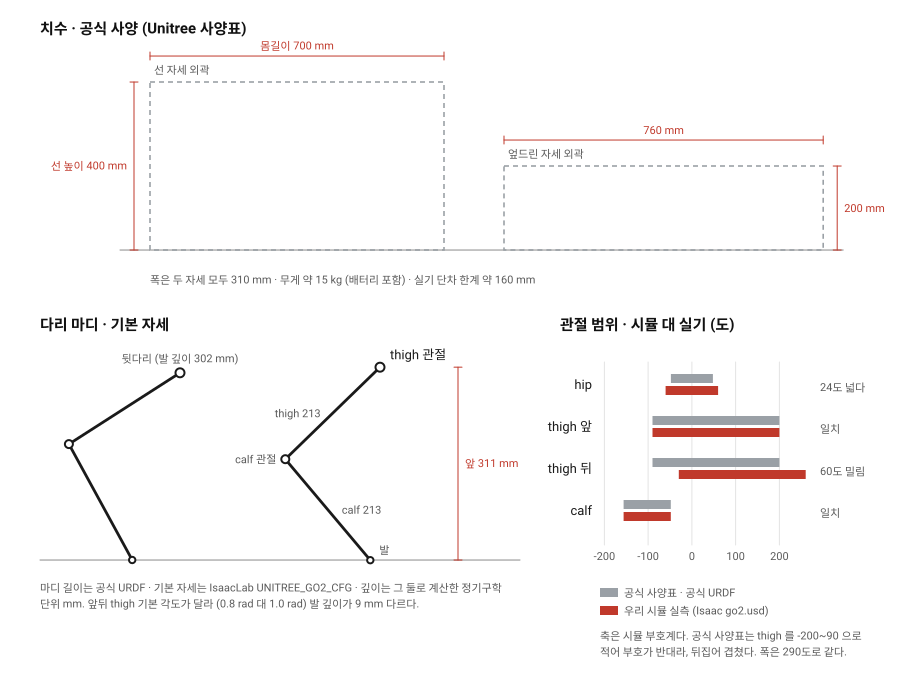

# Go2 제원: 시뮬과 실기를 나란히 놓는다

> 분류: 리서치
> 작성: 오흥재 · 2026-09-08 16:10
> 근거: 공식 문서 (Unitree 사양표 · 브로슈어 · 사용설명서 · 공식 URDF) · IsaacLab 소스 원문 · 우리 실측 인용
> 요지: Go2 EDU 제원을 한 자리에 모으고 시뮬 값과 실기 값을 열로 갈랐다. 가장 큰 격차는 무릎 토크(시뮬 23.5 N·m 대 공식 최대 약 45 N·m)와 hip 관절 범위(시뮬 60도 대 공식 48도)다. 우리가 「하드웨어 비대칭」이라 적어 둔 뒷다리 thigh 범위는 공식 사양표에도 공식 URDF 에도 없다.
> 상태: 초안
> 판: v1.0
> 이슈: #296



---

## 0. 먼저 볼 것: 시뮬과 실기가 크게 다른 넷

**이 표가 이 문서의 요점이다.** 나머지는 근거다.

| # | 항목 | 시뮬 (우리가 학습·평가하는 로봇) | 실기 (실제 Go2) | 차이 | 왜 중요한가 |
|---|---|---|---|---|---|
| **1** | **관절 토크 한계** | **23.5 N·m · 12관절 전부 같은 값** | **약 45 N·m** (가장 큰 관절 모터 기준) · 공식 URDF 는 hip·thigh 23.7 / calf **35.55** | 무릎 기준 **시뮬이 3분의 2 이하** | 「자세는 되는데 토크가 되는가」가 우리 미결 질문이었다. 실기 무릎이 시뮬보다 세다 |
| **2** | **hip 관절 범위** | **-60 ~ 60도** | **-48 ~ 48도** | **시뮬이 좌우로 24도 넓다** | 시뮬에서 배운 옆짚기·자세복구가 실기 관절 한계에 걸릴 수 있다 |
| **3** | **뒷다리 thigh 범위** | **-30 ~ 260도** (앞다리는 -90 ~ 200) | 공식 사양표·공식 URDF 모두 **네 다리 공통 단일 범위** | **앞뒤 비대칭이 공식 근거에 없다** | 우리 문서가 「실제 하드웨어의 비대칭이고 버그가 아니다」라고 단정해 두었다. 그 단정의 근거가 없다 (§7-2) |
| **4** | **발 들기 높이** | 관절로는 **31.0 cm** 가능 · 걸을 때 **3.25 cm** | 순정 보행의 발 들기 높이는 **API 로 조정하는 값**이고 절대 기본값이 공개돼 있지 않다 `미확인` | 대조 불가 | 시뮬의 「3.25 cm 만 든다」에 대응하는 실기 수치가 아직 없다. 이걸 재는 것이 다음 실측 과제다 |

> **1번은 우리 미결 질문에 직접 답한다.** [9/7 관절 한계 실측](20260907-go2-관절한계-실측.md) §7 이
> 「`effort_limit=23.5` 가 있고 무게를 이겨야 하니 정적으로 가능한 높이가 더 낮을 수 있다」로
> 열어 두었다. **실기 하드웨어는 그보다 세다.** 시뮬이 보수적으로 잡혀 있는 쪽이므로,
> 시뮬에서 토크 때문에 안 되는 동작이 실기에서는 될 여지가 있다.
> 다만 **IsaacLab 값이 틀렸다는 뜻은 아니다.** 45 N·m 는 공식 표기상 「최대 관절 모터의 최대
> 토크」, 즉 순간 피크값이고 IsaacLab 의 `effort_limit` 는 연속 제어 상한이다. **두 값은 정의가
> 다르다.** 같은 축에서 비교하려면 실기 연속 토크 정격이 필요한데 그것은 `미확인` 이다.

---

## 1. 우리가 쓰는 개체

| 항목 | 값 | 출처 |
|---|---|---|
| 트림 | **Go2 EDU** | `docs/ROBOT-SPEC.md` (팀장 확인) |
| 온보드 컴퓨팅 | **Jetson Orin NX 16GB** | 같음 |
| RJ45 이더넷 | 있음 | 같음 |
| 라이다 | 기본 라이다 + **등에 별도 Unitree 라이다 모듈** (모델명 미정) | 같음 |
| 라이다 세대 (L1 인가 L2 인가) | `미확인` | [현장 점검 목록](../../docs/FIELD-CHECK-GO2-INTAKE.md) ⑧ |
| 펌웨어 버전 · 연식 | `미확인` | 같음 ③④ |

**대여 개체는 두 대다** (조선대 보유분 · 운영진이 별도 업체를 통해 대여한 개체).
개체별로 값이 다를 수 있으므로 이 문서의 실기 열은 **공식 사양이지 우리 개체의 실측이 아니다.**

> 대여 비용은 대외비다. 이 문서에 적지 않는다. 장비 정가는 공개 정보라 §2 에 적는다 (팀장 2026-09-04 확정).

---

## 2. 등급별 차이 (공식 사양표 전문)

**Go2 는 네 등급이다** (AIR · PRO · X · EDU). 우리 것은 EDU 다.

| 항목 | AIR | PRO | X | **EDU** |
|---|---|---|---|---|
| 선 자세 치수 | 70 x 31 x 40 cm | 좌동 | 좌동 | **좌동** |
| 엎드린 자세 치수 | 76 x 31 x 20 cm | 좌동 | 좌동 | **좌동** |
| 무게 (배터리 포함) | 약 15 kg | 좌동 | 좌동 | **좌동** |
| 재질 | 알루미늄 합금 + 고강도 엔지니어링 플라스틱 | 좌동 | 좌동 | **좌동** |
| 전압 | 28 ~ 33.6 V | 좌동 | 좌동 | **좌동** |
| 최대 작동 전력 | 약 3000 W | 좌동 | 좌동 | **좌동** |
| **적재 하중** | 약 7 kg (최대 10) | 약 8 kg (최대 10) | 약 8 kg (최대 12) | **약 8 kg (최대 12)** |
| **속도** | 0 ~ 2.5 m/s | 0 ~ 3.5 m/s | 0 ~ 3.7 m/s (최대 5) | **0 ~ 3.7 m/s (최대 5)** |
| **단차 한계** | 약 15 cm | 약 16 cm | 약 16 cm | **약 16 cm** |
| **등반 각도** | 30도 | 40도 | 40도 | **40도** |
| 연산 | 없음 | 8코어 고성능 CPU | 좌동 | **좌동** |
| **최대 관절 토크** | 표기 없음 | 약 45 N·m | 약 45 N·m | **약 45 N·m** |
| 관절 모터 | 12개 | 12개 | 12개 | **12개** |
| 관절 범위 | body -48~48도 · thigh -200~90도 · shank -156~-48도 | 좌동 | 좌동 | **좌동** |
| 초광각 4D 라이다 | 있음 | 있음 | 있음 | **있음** |
| 무선 벡터 측위 모듈 | 없음 | 있음 | 있음 | **있음** |
| HD 광각 카메라 | 있음 | 있음 | 있음 | **있음** |
| **발끝 힘 센서** | 없음 | 없음 | 없음 | **있음** |
| 뎁스 카메라 | 없음 | 없음 | 없음 | **있음** |
| 4G 모듈 (GPS 포함) | 없음 | 있음 | 있음 | **있음** |
| 충전 도크 호환 | 없음 | 없음 | 있음 | **있음** |
| **2차 개발** | 없음 | 없음 | 부분 | **전면** |
| 고연산 모듈 | 없음 | 없음 | 없음 | **Orin 등 선택 (40~100 TOPS)** |
| **배터리** | 8000 mAh | 8000 mAh | 8000 mAh | **15000 mAh** |
| **가동 시간** | 약 1~2시간 | 약 1~2시간 | 약 1~2시간 | **약 2~4시간** |
| 충전기 | 33.6 V 3.5 A | 좌동 | 좌동 | **급속 33.6 V 9 A** |
| 보증 | 6개월 | 12개월 | 12개월 | **12개월** |
| 정가 (세금·운임 별도) | $1,600 | $2,800 | $4,500 | 영업 문의 |

출처: 공식 사양표 (unitree.com/go2, 2026-09-08 원문 확인) · 공식 브로슈어 PDF 로 교차 확인.

> **EDU 만 발끝 힘 센서와 2차 개발이 열려 있다.** 그리고 EDU 만 배터리가 15000 mAh 다.
> 「배터리 4시간 = 하루 실험 상한」이라는 [8/13 회의](../../docs/meetings/20260813-ops-alignment.md) 발언은
> **EDU 기준으로 맞는 말이다.** AIR·PRO 였다면 1~2시간이었다.

---

## 3. 치수와 무게

| 항목 | 시뮬 | 실기 | 출처 |
|---|---|---|---|
| 몸길이 (선 자세 외곽) | 몸통 충돌체 **0.3762 m** | **0.70 m** | 시뮬 = 공식 URDF `trunk_length` · 실기 = 공식 사양표 |
| 폭 | 몸통 충돌체 **0.0935 m** | **0.31 m** | 같음 |
| 높이 (선 자세) | 스폰 높이 **0.40 m** (`init_state.pos` z) | **0.40 m** | 시뮬 = IsaacLab 소스 · 실기 = 공식 사양표 |
| 엎드린 자세 | 해당 없음 | **0.76 x 0.31 x 0.20 m** | 공식 사양표 |
| **thigh 마디** | **0.213 m** | **0.213 m** | 시뮬 = 우리 실측 (Isaac USD) · 실기 = 공식 URDF. **두 값이 같다** |
| **calf 마디** | **0.213 m** | **0.213 m** | 같음 |
| 다리 최대 폄 (thigh + calf) | 0.426 m | 0.426 m | 이 문서 계산 |
| hip 관절 간격 (앞뒤) | 0.3868 m | 0.3868 m | 공식 URDF `leg_offset_x` 0.1934 x 2 |
| thigh 관절 간격 (좌우) | 0.2840 m | 0.2840 m | 공식 URDF `leg_offset_y` 0.0465 + `hip_offset` 0.0955, x 2 |
| 발 반경 | 0.02 m | 0.02 m | 공식 URDF `foot_radius` |
| **무게** | URDF 링크 합 **15.10 kg** (로터 12개 포함 시 16.17) | **약 15 kg** (배터리 포함) | 시뮬 = 이 문서가 공식 URDF 질량으로 계산 · 실기 = 공식 사양표 |

> **몸길이 0.3762 m 와 0.70 m 를 같은 줄에 놓고 「시뮬이 절반이다」라고 읽으면 안 된다.**
> 앞쪽은 **몸통 충돌 상자**이고 뒤쪽은 **머리·꼬리를 포함한 외곽 치수**다. 잰 대상이 다르다.
> 같은 대상끼리 비교되는 것은 hip 간격 0.3868 m 인데, 이것은 시뮬과 실기가 정확히 같다.
> **즉 치수는 sim2real 격차가 아니다.** 시뮬이 공식 URDF 를 그대로 쓰고 있다.

무게 내역 (공식 URDF, 단위 kg):

| 링크 | 개수 | 개당 | 합 |
|---|---|---|---|
| trunk | 1 | 6.921 | 6.921 |
| hip | 4 | 0.678 | 2.712 |
| thigh | 4 | 1.152 | 4.608 |
| calf | 4 | 0.154 | 0.616 |
| foot | 4 | 0.060 | 0.240 |
| **소계** | | | **15.097** |
| rotor | 12 | 0.089 | 1.068 |
| **로터 포함 합** | | | **16.165** |

---

## 4. 성능

| 항목 | 시뮬 | 실기 (EDU) | 출처 |
|---|---|---|---|
| **최대 속도** | 명령 속도로 준다. 우리 평가는 **1.0 m/s** (평지 기준선) · 험지도 1.0 | **0 ~ 3.7 m/s** (실험실 최대 약 5 m/s) | 시뮬 = `DECISIONS` 09-02 · 실기 = 공식 사양표 |
| 사용설명서상 실사용 속도 | 해당 없음 | **평지 최대 3.5 m/s** | 공식 사용설명서 |
| 반려 추종 모드 속도 | 해당 없음 | 느린 추종 **1.5 m/s** · 빠른 추종 **3.0 m/s** | 공식 사용설명서 |
| **등반 각도** | 학습 지형 최대 경사 **0.4 (약 22도)** | **40도** | 시뮬 = [험지 학습 커리큘럼](../../docs/research/go2-rough-training.md) `slope_range=(0.0, 0.4)` · 실기 = 공식 사양표 |
| **단차 한계** | 학습 지형은 계단 0.05~0.23 m 까지 준다. **정책이 실제로 넘는 것은** 12.5 cm 63% · 13 cm 39% · 14 cm 10%. **절반이 실패하는 지점은 12.5 ~ 13 cm 사이** | **약 16 cm** (16 cm 넘는 계단은 권장하지 않음) | 시뮬 = [레일즈 진단](../../docs/research/rails-diagnosis.md) 1절 · 실기 = 공식 사양표 + 사용설명서 |
| **적재 하중** | 시뮬에 하중 항 없음 | **약 8 kg (최대 12 kg)** | 실기 = 공식 사양표 |
| **점프 높이** | `미확인` (측정한 적 없음) | **공식 수치 없음** `미확인`. 점프·백플립 동작은 SDK 에 있으나 높이 표기가 공개돼 있지 않다 | 공식 브로슈어에 동작만 언급 |
| 최대 작동 전력 | 해당 없음 | 약 3000 W | 공식 사양표 |
| 로봇 질량 랜덤화 | 학습 시 **±15%** | 해당 없음 | `docs/FLOW.md` |

> **단차만 놓고 보면 시뮬이 실기보다 못한다.** 실기 공식 한계가 16 cm 인데 우리 시뮬 정책은
> 13 cm 부터 무너진다. 이것은 하드웨어 격차가 아니라 **정책 격차**다. 순정 Go2 의
> 16 cm 는 유니트리가 손으로 짠 MCF 컨트롤러가 내는 값이고, 우리 12.5 cm 는 NVIDIA 공식
> 체크포인트가 내는 값이다. **같은 몸으로 다른 뇌가 낸 두 숫자다.**

---

## 5. 보행

| 항목 | 시뮬 | 실기 | 출처 |
|---|---|---|---|
| 물리 주기 | **200 Hz** (`sim.dt = 0.005`) | 해당 없음 | `docs/FLOW.md` |
| **정책 주기** | **50 Hz** (`decimation = 4`, 1 step = 0.02초) | 저수준 제어 주기 `미확인` | 시뮬 = `docs/FLOW.md` |
| **최대 발 높이 (관절 한계)** | 앞 **31.0 cm** · 뒤 **30.1 cm** (무조코로는 33.5 cm) | 관절 범위가 다르므로 재계산 필요 `미확인` | 시뮬 = 우리 실측 (#280) |
| **실제 보행 중 발 높이** | **3.25 cm** | `미확인` | 시뮬 = [레일즈 진단](../../docs/research/rails-diagnosis.md) 3절 |
| 발 들기 높이 조정 | 보상 설계에 발 높이 항이 **없다** | 리모컨·API 로 조정하는 값이다. 상대 조정 범위 **-0.06 ~ +0.03 m** (비공식 ROS2 래퍼 문서) · **절대 기본값 `미확인`** | 시뮬 = 우리 실측 · 실기 = 공식 사용설명서(리모컨에 「발 들기 높이 조정」 항목 존재) + 3rd party 래퍼 문서 |
| 몸통 높이 조정 | 학습된 자세로 결정 | 리모컨·API 로 조정 가능. 정확한 범위 `미확인` | 공식 사용설명서 |
| **보폭** | `미확인` (측정한 적 없음) | `미확인` (공식 수치 없음) | |
| **걸음 주기** | `미확인` (측정한 적 없음) | `미확인` (공식 수치 없음) | |
| 보행 모드 | 단일 정책 | 순정에 여러 모드. 정적보행 · 트롯 · 절전 · 클래식 · 직립보행 · 크로스스텝 · 문워크 · 옆걸음 · 평행다리 달리기 | 공식 SDK `sport_client` · 공식 사용설명서 |

> **보폭과 걸음 주기는 양쪽 다 비어 있다.** 유니트리가 공개하지 않고 우리도 안 쟀다.
> **둘 다 우리 CSV 에서 뽑을 수 있는 값이다** (발 접지 시점과 접지 위치). 별도 과제로 뺀다.
> 이것이 채워지면 실기 영상과 프레임 단위로 대조할 수 있어 sim2real 격차의 가장 직접적인
> 지표가 된다.

---

## 6. 센서

### 6-1. 라이다

**우리 개체가 L1 인지 L2 인지 아직 모른다** `미확인`. 두 세대를 모두 적어 둔다.
현재 유니트리 공식 페이지는 Go2 를 **L2** 로 소개하고, 우리가 받은 브로슈어(구판)는 **L1** 로 적혀 있다.
**연식에 따라 갈린다.**

| 항목 | 4D LiDAR L1 | 4D LiDAR L2 |
|---|---|---|
| FOV | **360도 x 90도** | **360도 x 96도** |
| 최대 측정 거리 | 30 m (@90% 반사율) · 20 m (@10%) | 30 m (@90%) · 15 m (@10%) |
| 최소 측정 거리 (사각) | **0.05 m** | **0.05 m** |
| 측정 정확도 | 약 2 cm | 약 2 cm |
| 유효 샘플링 | **21,600 점/초** (샘플 주파수 43,200) | **64,000 점/초** (샘플 주파수 128,000) |
| 수평 주사 주파수 | 11 Hz | 5.55 Hz |
| 수직 주사 주파수 | 180 Hz | 216 Hz |
| 내장 IMU | 3축 가속 + 3축 자이로 · **250 Hz** | 3축 가속 + 3축 자이로 |
| 레이저 안전 등급 | Class 1 (IEC60825-1:2014) | Class 1 (IEC60825-1:2014) |
| 내광 | 100 Klux | 100 Klux 초과 |
| 무게 | **230 g** | **230 g** |
| 크기 | 75 x 75 x 65 mm | 75 x 75 x 65 mm |
| 소비 전력 | 6 W | 10 W |
| 동작 온도 | -10 ~ 60도 | `미확인` |
| 인터페이스 | 4핀 시리얼 (GH1.25 4PIN) · DC 12 V | ENET UDP / TTL UART |

출처: L1 = 공식 L1 사용설명서 v1.1 (2024.06) + 공식 L1 제품 페이지 · L2 = 공식 L2 제품 페이지.

**시뮬 쪽 대응물**: 우리는 라이다를 쓰지 않는다. 정책 관측 235차원 중 지형 정보는
**높이 스캔 187점**이고 이것은 시뮬이 지형에서 직접 읽는 값이지 라이다 점군이 아니다.
**즉 라이다는 sim2real 대조표에 열이 없다.** 트랙 B(항법)에서만 쓰인다.

### 6-2. 카메라

| 항목 | 값 | 출처 |
|---|---|---|
| 종류 | HD 광각 카메라 (전방) | 공식 사양표 |
| 영상 전송 해상도 | 1280 x 720 | 공식 브로슈어 |
| 화각 · 렌즈 스펙 | `미확인` (「초광각」 표기뿐) | |
| 뎁스 카메라 (EDU) | 있음. 확장 옵션 D435i (124 x 29 x 26 mm · 최소 깊이 0.105 m · 1280x720@30fps) | 공식 사양표 · 공식 브로슈어 확장품 표 |

### 6-3. IMU

| 항목 | 값 | 출처 |
|---|---|---|
| 몸통 IMU 모델·정밀도 | **`미확인`.** 유니트리가 공개하지 않는다 | |
| 얻을 수 있는 값 | `LowState.imu_state` 로 쿼터니언(4) · 자이로(3) · 가속도(3) · RPY(3) · 온도 | 공식 SDK 메시지 정의 |
| 시뮬 쪽 | 정책 관측에 몸통 각속도 3 · 중력 투영 3 이 들어간다 | `docs/FLOW.md` |
| 라이다 내장 IMU | 별도로 존재 (§6-1) | 공식 L1 설명서 |

### 6-4. 발끝 힘 센서

**EDU 에만 있다.** `LowState.foot_force` 로 읽는다. 실제로 값이 변하는지는 현장에서 확인할 항목이다
([현장 점검 목록](../../docs/FIELD-CHECK-GO2-INTAKE.md) ⑪). 시뮬에는 접촉 센서가 있어 `feet_air_time`
보상에 쓰인다.

---

## 7. 관절

### 7-1. 관절 범위

**단위는 도. 세 출처가 부호 규약이 다르다. 표에 그대로 적고 아래에서 맞춘다.**

| 다리 | 관절 | 시뮬 (우리 실측 · Isaac go2.usd) | 공식 URDF (unitree_ros) | 공식 사양표 |
|---|---|---|---|---|
| 앞 FL·FR | hip | **-60 ~ 60** | -60 ~ 60 (±1.0472 rad) | **-48 ~ 48** |
| 앞 FL·FR | thigh | **-90 ~ 200** | -90 ~ 200 (-1.5708 ~ 3.4907 rad) | **-200 ~ 90** |
| 앞 FL·FR | calf | **-156 ~ -48** | -156 ~ -48 (-2.7227 ~ -0.83776 rad) | **-156 ~ -48** |
| 뒤 RL·RR | hip | **-60 ~ 60** | -60 ~ 60 | -48 ~ 48 |
| 뒤 RL·RR | thigh | **-30 ~ 260** | **-90 ~ 200 (앞과 같다)** | **-200 ~ 90 (앞과 같다)** |
| 뒤 RL·RR | calf | **-156 ~ -48** | -156 ~ -48 | -156 ~ -48 |

부호를 맞춰 폭으로 다시 보면 이렇다.

| 관절 | 시뮬 폭 | 공식 폭 | 일치 여부 |
|---|---|---|---|
| hip | 120도 | **96도** | **시뮬이 24도 넓다** |
| thigh (앞) | 290도 | 290도 | 폭 일치 · 위치도 일치 |
| thigh (뒤) | 290도 | 290도 | **폭은 같은데 시뮬이 +60도 밀려 있다** |
| calf | 108도 | 108도 | 일치 |

> **공식 사양표의 thigh -200~90 은 공식 URDF 의 -90~200 과 부호 규약이 반대다.**
> 폭이 290도로 같고 calf 는 두 출처가 부호까지 같으므로, 사양표가 thigh 만 반대 방향을 양으로
> 잡았다고 읽는 것이 자연스럽다. **다만 이것은 추론이다** `미확인`. 사양표에 부호 정의 그림이
> 없어 확정할 수 없다.

### 7-2. 뒷다리 thigh 비대칭: 우리가 「하드웨어다」라고 적은 것의 근거가 없다

[9/7 문서](20260907-go2-관절한계-실측.md) 와 [레일즈 진단 11절](../../docs/research/rails-diagnosis.md) 이
둘 다 이렇게 적어 두었다.

> 「앞다리와 뒷다리의 thigh 범위가 다르다 `확인됨`. 실제 Go2 하드웨어의 비대칭이고 버그가 아니다.」

**앞 문장(USD 에 그렇게 적혀 있다)은 맞고, 뒷 문장(하드웨어의 비대칭이다)은 근거가 없다.**

찾아본 것은 셋이다.

| 출처 | 앞뒤 thigh 범위 | 확인 방법 |
|---|---|---|
| 공식 사양표 | **하나뿐이다.** 다리 구분 없이 thigh -200~90 | 페이지 원문 확인 |
| 공식 URDF (`leg.xacro`) | **하나뿐이다.** `thigh_position_min/max` 를 네 다리에 그대로 쓴다. 앞뒤 분기가 없다 | 원문 확인. 앞뒤 분기(`front_hind`)는 메시·관성에만 쓰이고 `<limit>` 에는 안 쓰인다 |
| Isaac `go2.usd` | 앞 -90~200 · 뒤 -30~260 | 우리 실측 (#280) |

그리고 **밀린 양이 정확히 60도다.** 하한도 60도, 상한도 60도 밀렸고 폭은 290도로 같다.
링크 길이가 바뀌지 않았고, 우리가 기본 자세에서 계산한 발 깊이(앞 0.311 m · 뒤 0.302 m)는
**앞뒤에 같은 부호 규약을 써야 나오는 값이다.** 이 문서가 공식 URDF 마디 길이 0.213 m 와
IsaacLab 기본 관절각(앞 thigh 0.8 rad · 뒤 1.0 rad · calf -1.5 rad)으로 정기구학을 다시 풀어
**0.3113 m 와 0.3020 m 를 그대로 재현했다.** 즉 **영점은 앞뒤가 같은데 한계만 60도 밀려 있다.**

**이것은 하드웨어 비대칭보다 USD 자산의 한계 메타데이터 문제로 읽힌다.** 다만 확정은 아니다.

**해야 할 것** (`미확인` 을 닫는 방법):

1. 실기에서 뒷다리 thigh 를 앞다리와 같은 자세로 두고 `LowState` 관절각을 읽어 영점이 같은지 본다. 5분이면 된다
2. 뒷다리가 정말 260도까지 가는지는 **실기에서 시험하지 않는다.** 관절 한계를 실기로 탐색하는 것은 위험하고 대여 장비다
3. 그 전까지 두 문서의 「실제 하드웨어의 비대칭이고 버그가 아니다」를 **「USD 에 그렇게 적혀 있다. 하드웨어 근거는 미확인」으로 낮춰 적는다**

**왜 이것이 중요한가**: 뒷다리 최대 발 높이 30.1 cm 가 이 범위 위에서 계산됐다.
범위가 틀렸다면 그 숫자도 틀린다.

### 7-3. 토크와 속도 한계

| 관절 | 시뮬 (IsaacLab) | 공식 URDF | 공식 사양표 |
|---|---|---|---|
| hip 토크 | **23.5 N·m** | 23.7 N·m | 표기 없음 |
| thigh 토크 | **23.5 N·m** | 23.7 N·m | 표기 없음 |
| **calf 토크** | **23.5 N·m** | **35.55 N·m** | **약 45 N·m** (가장 큰 관절 모터의 최대) |
| hip·thigh 속도 | 30.0 rad/s | 30.1 rad/s | 표기 없음 |
| calf 속도 | 30.0 rad/s | **20.06 rad/s** | 표기 없음 |

시뮬 액추에이터 설정 전문 (IsaacLab `UNITREE_GO2_CFG`):

```python
DCMotorCfg(
    joint_names_expr=[".*_hip_joint", ".*_thigh_joint", ".*_calf_joint"],
    effort_limit=23.5, saturation_effort=23.5, velocity_limit=30.0,
    stiffness=25.0, damping=0.5, friction=0.0,
)
soft_joint_pos_limit_factor=0.9
```

> **시뮬은 12관절을 한 덩어리로 잡는다.** 하나의 `DCMotorCfg` 가 hip·thigh·calf 에 같은
> 23.5 N·m 와 30.0 rad/s 를 준다. **실제 하드웨어는 관절마다 다르다.** 공식 URDF 기준으로
> 무릎은 토크가 1.5배 세고 속도는 3분의 2로 느리다.
> **무릎을 빠르게 휘두르는 동작은 시뮬에서 실기보다 쉽고, 무릎으로 버티는 동작은
> 시뮬에서 실기보다 어렵다.** 방향이 반대인 두 격차가 동시에 있다.
> 우리 과제(발을 높이 들어 턱을 넘는다)는 **둘 다 걸린다.**

### 7-4. 기본 자세

| 관절 | IsaacLab 기본값 | 도 환산 |
|---|---|---|
| 왼쪽 hip | 0.1 rad | 5.7도 |
| 오른쪽 hip | -0.1 rad | -5.7도 |
| 앞 thigh (FL·FR) | 0.8 rad | 45.8도 |
| 뒤 thigh (RL·RR) | 1.0 rad | 57.3도 |
| calf (전부) | -1.5 rad | -85.9도 |
| 스폰 높이 | 0.4 m | |

이 자세에서 발은 thigh 관절 기준 **앞 0.3113 m · 뒤 0.3020 m** 아래에 있다
(이 문서가 마디 길이 0.213 m 로 재계산해 우리 실측값을 재현했다).

---

## 8. 전원

| 항목 | 시뮬 | 실기 (EDU) | 출처 |
|---|---|---|---|
| 배터리 용량 | 해당 없음 | **15,000 mAh** (AIR·PRO·X 는 8,000) | 공식 사양표 |
| 전압 | 해당 없음 | **28 ~ 33.6 V** (공칭 28.8 V) | 공식 사양표 · 공식 브로슈어 |
| 에너지 환산 | 해당 없음 | 약 **432 Wh** (15,000 mAh x 28.8 V) `계산` | 이 문서 계산. 공칭 전압을 29.6 V 로 보면 444 Wh 라 **출처마다 값이 다르다** |
| **가동 시간** | 해당 없음 | **약 2~4시간** | 공식 사양표 |
| 험지 주행 시 실사용 | 해당 없음 | **2~3시간** (증언) | [8/13 회의](../../docs/meetings/20260813-ops-alignment.md) 유성현 발언 |
| 최대 작동 전력 | 해당 없음 | 약 3,000 W | 공식 사양표 |
| 충전기 | 해당 없음 | 급속 33.6 V 9 A | 공식 사양표 |
| 배터리 개수·실사용 시간 | | **우리 개체 기준은 `미확인`** | [현장 점검 목록](../../docs/FIELD-CHECK-GO2-INTAKE.md) 4절 |

**가동 시간을 줄이는 조건** (공식 사용설명서가 직접 열거한다): 오래 빠르게 달리기 · 선 채로 자세를
크게 오래 바꾸기 · 다리를 굽힌 채 서 있기 · 짐을 지고 달리기 · **몸을 낮춘 채 걷기** · 기복과 경사.

> 마지막 둘이 우리 실험 조건이다. **험지에서 2~3시간이라는 증언은 스펙과 모순되지 않는다.**

---

## 9. 미확인 목록 (추측으로 메우지 않은 것들)

| # | 무엇 | 왜 안 채웠나 | 어떻게 채우나 |
|---|---|---|---|
| 1 | 우리 개체의 라이다 세대 (L1/L2) | 개체 확인 전 | 모듈 라벨 사진 한 장 |
| 2 | 등에 얹힌 별도 라이다의 모델명 | 영상에 각인이 안 보임 | 라벨 사진 · `ros2 topic list` · `ip -4 addr` |
| 3 | 펌웨어 버전 · 연식 · 고장 이력 | 관리자 문의 필요 | Unitree Go 앱 장비 정보 |
| 4 | **실기 점프 높이** | 공식 수치가 없다 | 유니트리 문의 또는 우리 실측. **대여 장비라 점프 시험은 허락 필요** |
| 5 | **실기 보폭 · 걸음 주기** | 공식 수치가 없다 | 실기 영상 프레임 분석 |
| 6 | **시뮬 보폭 · 걸음 주기** | 안 쟀다 | 우리 CSV 의 발 접지 시점·위치에서 산출 |
| 7 | **실기 발 들기 높이 기본값(절대)** | 공식 API 문서에 상대 조정 범위만 있다 | `LowState` 로 보행 중 발 궤적 기록 |
| 8 | 실기 저수준 제어 주기 | 공식 문서 미확보 | SDK 실행 시 실측 |
| 9 | 몸통 IMU 모델·정밀도 | 유니트리가 공개하지 않는다 | 문의 |
| 10 | 전방 카메라 화각 | 「초광각」 표기뿐 | 문의 또는 체커보드 실측 |
| 11 | **뒷다리 thigh 60도 밀림이 하드웨어인지 자산 문제인지** | 공식 근거가 반대를 가리킨다 | §7-2 의 절차 |
| 12 | 실기 **연속** 토크 정격 | 45 N·m 는 피크값이라 `effort_limit` 와 정의가 다르다 | 문의. 이것이 있어야 §0 의 1번이 정량 비교가 된다 |
| 13 | 우리 개체의 배터리 개수 | 현장 확인 전 | 인수 점검 |

---

## 10. 출처

**공식 (유니트리)**

| 태그 | 무엇 | 어디 |
|---|---|---|
| 공식 사양표 | Go2 제품 페이지 사양표 4등급 전문 | `unitree.com/go2` · 2026-09-08 원문 확인 |
| 공식 브로슈어 | Go2 EN 브로슈어 (파라미터 표 · 확장품 표) | `static.generation-robots.com/media/brochure-unitree-go2-en.pdf` |
| 공식 사용설명서 | Go2 User Manual V1.0 | `static.generation-robots.com/media/Go2-User-Manual.pdf` |
| 공식 URDF | `go2_description` 의 `const.xacro` · `leg.xacro` | `github.com/unitreerobotics/unitree_ros` |
| 공식 SDK | `sport_client.hpp` (동작 목록) | `github.com/unitreerobotics/unitree_sdk2` |
| 공식 L1 설명서 | 4D LiDAR-L1 User Manual 2024.06 v1.1 | `oss-global-cdn.unitree.com` |
| 공식 L2 페이지 | 4D LiDAR L2 제품 페이지 | `unitree.com/L2` |

**시뮬**

| 태그 | 무엇 | 어디 |
|---|---|---|
| IsaacLab 소스 | `UNITREE_GO2_CFG` 원문 | `github.com/isaac-sim/IsaacLab` `isaaclab_assets/robots/unitree.py` |
| 우리 실측 | 관절 한계 · 발 높이 · 단차 성공률 | [레일즈 진단](../../docs/research/rails-diagnosis.md) · [9/7 관절 한계](20260907-go2-관절한계-실측.md) |
| 우리 정본 | 개체 사양 | [ROBOT-SPEC](../../docs/ROBOT-SPEC.md) · [현장 점검 목록](../../docs/FIELD-CHECK-GO2-INTAKE.md) |

**3rd party (공식 아님. 이 문서에서 딱 한 값에만 썼다)**

| 무엇 | 어디 | 어디에 썼나 |
|---|---|---|
| `FootRaiseHeight` 상대 조정 범위 -0.06 ~ 0.03 | `github.com/Unitree-Go2-Robot/go2_robot` README | §5 발 들기 높이 조정 한 칸 |

**이 문서가 계산한 것** (원본 수치가 아니다): URDF 질량 합 15.097 / 16.165 kg · 다리 최대 폄
0.426 m · hip 간격 0.3868 m · thigh 간격 0.2840 m · 라디안-도 환산 전부 · 기본 자세 발 깊이
0.3113 / 0.3020 m 재현 · 배터리 Wh 환산 · 관절 범위 폭 비교.

---

## 11. 도해

`20260908-go2-제원-도해.svg` 를 같이 올렸다. 세 칸이다.

1. **치수**: 선 자세 700 x 400 mm 와 엎드린 자세 760 x 200 mm 를 같은 축척으로 그렸다 (공식)
2. **다리 마디**: thigh 213 · calf 213 과 기본 자세의 발 깊이 311 / 302 mm. **좌표를 손으로 찍지 않고 정기구학으로 계산했고, 두 발이 지면선에 정확히 닿는 것으로 계산이 맞는지 확인했다**
3. **관절 범위**: 공식과 시뮬을 겹쳐 그렸다. hip 이 24도 넓고 뒷다리 thigh 가 60도 밀린 것이 눈으로 보인다. **축은 시뮬 부호계이고, 공식 thigh 는 부호를 뒤집어 겹쳤다** (그 사실을 그림 안에 적어 두었다)

---

## 판 이력

| 판 | 언제 | 무엇이 바뀌었나 | 근거 |
|---|---|---|---|
| v1.0 | 2026-09-08 | 처음 씀. 공식 사양·공식 URDF·IsaacLab 소스를 원문으로 확인해 시뮬/실기 열을 갈랐다. 뒷다리 thigh 비대칭의 근거 부재를 §7-2 에 적었다 | #296 |
