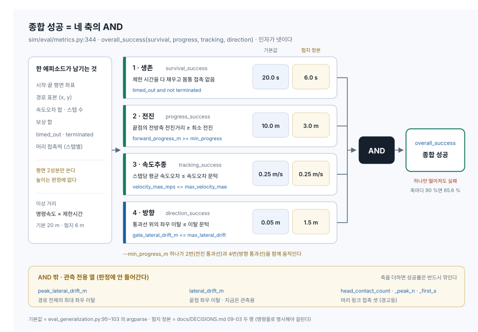
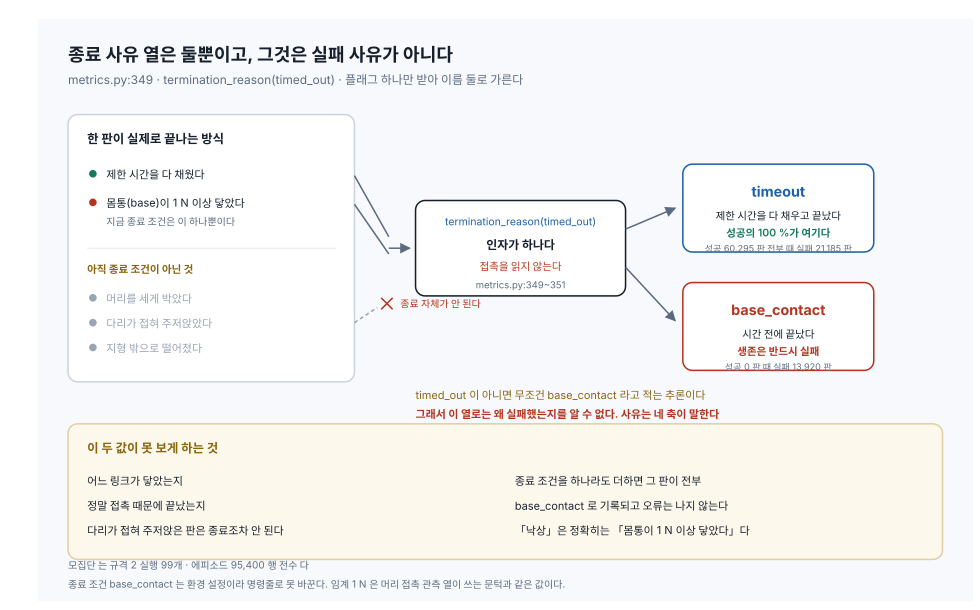
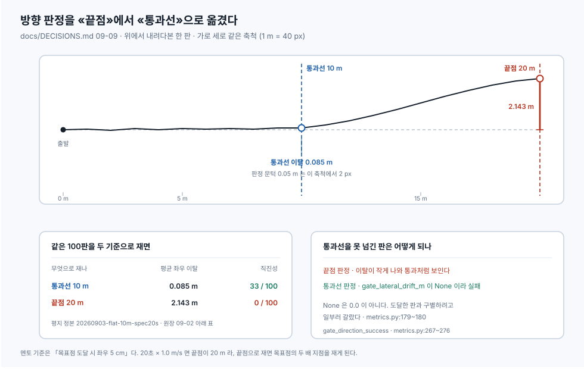
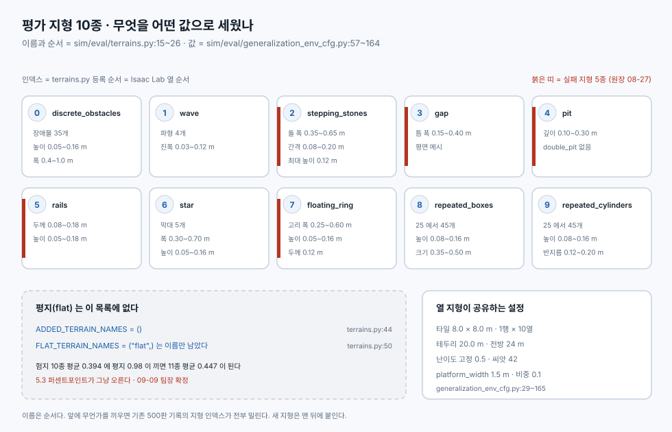

# 평가 하네스 도해 · 무엇을 어떤 기준으로 재나

> 분류: 가이드
> 작성: 오흥재 · 2026-09-09 16:40
> 근거: 실측 (`sim/eval/` 코드 원문을 직접 읽음) · 원장 `docs/DECISIONS.md` · 기존 문서 `20260908-success-criteria-anatomy.md`
> 요지: 평가 하네스의 판정 구조를 SVG 넷으로 옮긴다. 네 축의 AND · 실패 사유 둘 · 방향 판정이 끝점에서 통과선으로 옮겨간 것 · 지형 10종과 평지를 뺀 자리.
> 상태: 초안
> 판: v1.0

---

## 왜 이 문서가 따로 있나

**성공 기준의 숫자와 논증은 이미 있다.** `20260908-success-criteria-anatomy.md`
가 네 축을 해부하고 1,000판을 축별로 재집계해 두었다. 이 문서는 그것을 대체하지
않는다.

없던 것은 **그림**이다. 그 문서에 SVG·이미지·mermaid 가 **0건**이다 `확인됨`
(전수 검색). 표와 코드펜스로만 되어 있어서, 처음 보는 사람이 「네 축이 어떻게
합쳐지는가」를 잡으려면 열두 개 절을 순서대로 읽어야 한다.

팀장 요청은 「평가 하네스가 무엇을 어떻게 재는지 **그림으로** 설명하라」였다.
그래서 도해 넷을 만들고, 각 그림 아래에 **그 숫자를 어느 파일 몇 행에서
읽었는지**를 붙인다. 숫자의 정본은 여전히 해부 문서다.

> **줄 번호 주의.** 해부 문서(09-08)가 인용한 `metrics.py` · `eval_generalization.py`
> 행 번호는 **지금 `main` 과 안 맞는다.** 09-09 에 머리 접촉 열이 들어가면서
> 파일이 밀렸다. 이 문서의 행 번호는 오늘 `main`(`77f1770`)에서 직접 다시 읽은
> 것이다.

---

## 1. 종합 성공은 네 축의 AND



성공은 **하나의 점수가 아니라 네 개의 통과·탈락**이고, 넷을 AND 로 묶는다.

```python
# sim/eval/metrics.py:344
def overall_success(survival, progress, tracking, direction):
    """네 축을 모두 통과했나. 스냅샷 520~525행."""
    return bool(survival and progress and tracking and direction)
```

**인자가 넷이다.** 이것이 「축이 넷뿐」이라는 것의 코드상 보증이고,
`sim/eval/tests/test_metrics.py` 가 시험으로 못 박는다.

| # | 축 | 무엇을 재나 | 기본값 | 험지 10종 정본 | 정의 |
|---|---|---|---|---|---|
| 1 | 생존 `survival_success` | 제한 시간을 다 채우고 몸통 접촉 없음 | 20.0 s | 6.0 s | `metrics.py:315` |
| 2 | 전진 `progress_success` | 끝점의 전방축 전진거리가 최소 전진 이상 | 10.0 m | 3.0 m | `metrics.py:320` |
| 3 | 속도추종 `tracking_success` | 스텝당 평균 속도오차가 문턱 이하 | 0.25 m/s | 0.25 m/s | `metrics.py:325` |
| 4 | 방향 `direction_success` | 통과선 위의 좌우 이탈이 문턱 이하 | 0.05 m | 1.5 m | `metrics.py:330` `:267` |

**기본값 열은 argparse 기본값이다** (`eval_generalization.py:95~103`). 그 값은
**평지 기준선 규격**이고, 평가 대상인 험지 10종은 원장 09-03 두 행이 정한 다른
값으로 돌린다. 기본값이 아니므로 **명령줄로 명시해야 걸린다.**

```
--eval_duration 6.0 --min_progress_m 3.0 --max_lateral_drift 1.5 \
--max_velocity_mae 0.25 --command_vx 1.0
```

### 여기서 읽히는 것 셋

**첫째, AND 는 곱이라 축이 늘수록 급히 깎인다.** 각 축이 독립이고 통과율이
각각 90 %라면 넷을 묶은 값은 0.9⁴ = 65.6 %다. 다섯째 축을 더하면 59 %가 된다.
09-09 에 머리 접촉을 판정이 아니라 **관측 열**로 넣은 이유가 이것이다.

**둘째, 문턱 하나가 축 둘을 움직인다.** `--min_progress_m` 은 전진 통과선이면서
동시에 방향을 재는 지점이다.

```python
# sim/eval/eval_generalization.py:741
gate_progress_m=min_progress,
```

「전진 기준만 낮추자」가 코드 수정 없이는 안 된다. 낮추면 방향도 더 가까운
지점에서 재게 된다.

**셋째, 관측 열은 AND 밖이다.** `peak_lateral_drift_m`(경로 전체의 최대 좌우
이탈) · `lateral_drift_m`(끝점 이탈) · 머리 접촉 셋은 CSV 에 남지만 판정에
안 들어간다. 통과선 판정으로 옮긴 뒤로 **끝점 이탈은 판정에서 관측으로
내려왔다.**

---

## 2. 실패 사유는 둘뿐이다



```python
# sim/eval/metrics.py:349
def termination_reason(timed_out):
    """종료 사유. 스냅샷 537~541행."""
    return "timeout" if timed_out else "base_contact"
```

### 왜 둘뿐인가

**플래그를 하나만 받기 때문이다.** 이 함수는 접촉을 읽지 않는다. `timed_out` 이
아니면 무조건 `"base_contact"` 라고 적는 **추론**이다.

그리고 지금은 그 추론이 맞다. **종료 조건이 실제로 하나뿐**이기 때문이다.

```python
base_contact = DoneTerm(func=mdp.illegal_contact,
    params={"sensor_cfg": SceneEntityCfg("contact_forces", body_names="base"),
            "threshold": 1.0})
```

> **이 조각의 출처를 밝혀 둔다** `미확인`. 위 코드는 **이 저장소 파일이 아니다.**
> 원본은 Isaac Lab 트리에 있고, 팀 문서 둘(`20260908-pit-diagnosis.md:596~598` ·
> `20260909-head-contact-observation.md:24~26`)이 같은 세 줄을 전사해 둔 것을
> 옮겼다. **원본을 직접 열어 대조하지는 않았다.** 이 문서에서 원문을 직접 읽은
> 것은 `sim/eval/` 아래 넷뿐이다.

이 종료 조건은 **환경 설정이라 명령줄로 못 바꾼다.** 임계 1 N 은 머리 접촉
관측 열이 세는 문턱과 같은 값이고 (`--head_contact_threshold_n` 기본 1.0,
`eval_generalization.py:105`), 같은 기준으로 재야 「몸통은 종료시켰는데 머리는
몇 번 닿았나」가 비교된다.

### 그것이 무엇을 못 보게 하나

| 못 보는 것 | 왜 |
|---|---|
| 어느 링크가 닿았는지 | 함수가 접촉 자체를 안 읽는다 |
| 정말 접촉 때문에 끝났는지 | `timed_out` 의 부정을 접촉으로 단정한다 |
| 다리가 접혀 주저앉은 판 | 몸통이 안 닿으면 **종료조차 안 된다** |
| 머리를 세게 박은 판 | 같은 이유로 종료되지 않는다 |

**「낙상」이라는 말도 정확히는 「몸통이 1 N 이상 닿았다」다.**

그리고 이것이 **앞으로 터질 자리**다. 종료 조건을 하나라도 더하는 순간 새 사유로
끝난 판이 전부 `"base_contact"` 로 기록되고 **오류는 나지 않는다.** 커널 철칙의
「조용한 실패」 그대로다. 라이다 접촉을 종료 조건으로 올리자는 제안을 검토할 때
`termination_reason` 을 함께 고치는 비용이 계산에 들어가야 한다.

---

## 3. 방향 판정이 「끝점」에서 「통과선」으로 바뀌었다



원장 09-09 행이 정본이다.

> **좌우 이탈은 «통과선»에서 판정한다.** 09-02 의 「끝점 판정」을 대체한다.
> 멘토 기준 「목표점 도달 시 좌우 5 cm」는 **평지 전제**다. 험지에서는 통과선을
> 못 넘은 판이 섞이는데 끝점만 보면 그것이 0 으로 나와 통과처럼 보인다.

### 왜 끝점이 안 맞았나

**끝점이 목표점이 아니기 때문이다.** 20초 × 1.0 m/s 면 끝점은 20 m 근처인데
목표점은 10 m 다. 끝점으로 재면 **목표점이 아니라 그 두 배 지점**을 재게 된다.

같은 100판을 두 기준으로 재면 값이 이렇게 갈린다.

| 무엇으로 재나 | 평균 좌우 이탈 | 직진성 |
|---|---|---|
| 통과선 10 m | 0.085 m | 33 / 100 |
| 끝점 20 m | 2.143 m | 0 / 100 |

기획서가 인용한 직진성 33/100 은 **통과선 기준**이고, 끝점으로 재면 0/100 이다.

### 백분율로 보면 층위가 다르다

이것이 핵심이다. **5 cm 라는 숫자는 통과선이 얼마인지를 말하지 않으면 뜻이
정해지지 않는다.**

| 규격 | 통과선 | 이탈 문턱 | 통과선 대비 |
|---|---|---|---|
| 평지 기준선 | 10 m | 0.05 m | 0.5 % |
| 험지 10종 정본 | 3 m | 1.5 m | 50 % |

두 규격은 절대값도 비율도 다르다. **문턱 하나만 떼어 「5 cm 기준」이라고 옮겨
적으면 어느 규격의 이야기인지가 사라진다.** 통과선과 문턱은 늘 붙여서 적어야
한다.

> **여기 한 가지를 적어 둔다** `미확인`. 원장 09-03 행은 1.5 m 의 근거를
> 「통과선 대비 같은 비율을 유지하도록」이라고 적었다. 그 말을 산술로 따라가면
> 3 m × 0.5 % = **0.015 m** 가 나오고, 정본 값 1.5 m 는 그 **100배**다.
> 값 자체는 정본 `summary-thr1.5.csv` 로 확정돼 있으니 바뀌는 것은 없다.
> **적힌 근거가 그 값을 재현하지 못한다**는 것만 남긴다. 어느 쪽이 뜻이었는지는
> 이 문서가 판단하지 않는다.

### 못 넘긴 판을 어떻게 처리하나

```python
# sim/eval/metrics.py:267
def gate_direction_success(gate_lateral, max_lateral_drift):
    if gate_lateral is None:
        return False
    return bool(gate_lateral <= max_lateral_drift)
```

통과선을 한 번도 못 넘겼으면 `gate_lateral_drift_m` 이 **`None`** 이고, 그것은
곧 실패다. **`0.0` 이 아니다** (`metrics.py:179~180`). 0.0 으로 돌려주면
「도달했고 완벽하게 곧았다」와 구별이 안 된다. 통과선 기준이면 **「도달하지
않았으면 실패」가 코드로 강제된다.**

전진이 통과선을 처음 넘는 자리를 찾아 앞뒤 표본 사이를 **선형보간**해 정확히
통과선 위의 이탈을 낸다. 표본 간격은 스텝 하나(1.0 m/s 에서 약 2 cm)다.

> **정본 1,000판은 재측정이 필요하다.** 그 기록은 20열이라 끝점으로 채점됐다
> (원장 09-09 행).

---

## 4. 지형 10종과, 평지를 뺀 자리



이름과 순서는 `sim/eval/terrains.py:15~26`, 값은
`sim/eval/generalization_env_cfg.py:57~164` 에서 읽었다.

| # | 이름 | 무엇을 흔드나 |
|---|---|---|
| 0 | `discrete_obstacles` | 장애물 35개 · 높이 0.05~0.16 m · 폭 0.4~1.0 m |
| 1 | `wave` | 파형 4개 · 진폭 0.03~0.12 m |
| 2 | `stepping_stones` | 돌 폭 0.35~0.65 m · 간격 0.08~0.20 m · 최대 높이 0.12 m |
| 3 | `gap` | 틈 폭 0.15~0.40 m |
| 4 | `pit` | 깊이 0.10~0.30 m · `double_pit` 없음 |
| 5 | `rails` | 두께 0.08~0.18 m · 높이 0.05~0.18 m |
| 6 | `star` | 막대 5개 · 폭 0.30~0.70 m · 높이 0.05~0.16 m |
| 7 | `floating_ring` | 고리 폭 0.25~0.60 m · 높이 0.05~0.16 m · 두께 0.12 m |
| 8 | `repeated_boxes` | 25에서 45개 · 높이 0.08~0.16 m · 크기 0.35~0.50 m |
| 9 | `repeated_cylinders` | 25에서 45개 · 높이 0.08~0.16 m · 반지름 0.12~0.20 m |

**열 지형이 공유하는 것**: 타일 8.0 × 8.0 m · 격자 1행 × 10열 · 테두리 20.0 m ·
난이도 고정 0.5 · 씨앗 42 · `platform_width` 전부 1.5 m · 비중 각 0.1.

**인덱스가 곧 순서다.** Isaac Lab 이 `sub_terrains` 등록 순서대로 열을 배정하고
하네스가 `TERRAIN_NAMES[terrain_type]` 로 이름을 되찾는다. 앞에 무언가를 끼우면
기존 500판 기록의 지형 인덱스가 전부 밀린다. 새 지형은 **맨 뒤에** 붙인다.

### 평지를 왜 뺐나

```python
# sim/eval/terrains.py:44
ADDED_TERRAIN_NAMES = ()

# sim/eval/terrains.py:50
FLAT_TERRAIN_NAMES = ("flat",)
```

**평지는 「미경험 험지」가 아니다.** 한 표에 섞이면 험지 평균이 부풀려진다.
험지 10종 평균 0.394 에 평지 0.98 이 끼면 11종 평균이 0.447 이 되어 **5.3
퍼센트포인트가 그냥 오른다.** 성공률을 올리는 실험 중에 이 정도면 결론이 바뀐다.

### 그런데 왜 `FLAT_TERRAIN_NAMES` 는 이름을 남겨 두었나

**다시 넣을 때 가르는 자리를 잊지 않기 위해서다.** 그리고 이 자리는 한 번
무너진 적이 있다.

`#125` 2번이 「평지 10 m 직진을 재려면 평지 설정이 필요하다」로 `flat` 을 더했다.
목적은 맞았는데 **가르는 코드가 없었다.** `ROUGH_TERRAIN_NAMES` 와 `is_flat()`
을 만들어 놓고 **어느 파일도 부르지 않았다.** 이름만 있고 강제하는 자리가 없으니
집계에서 그냥 섞였다.

그래서 지금 형태가 이렇다.

- `ADDED_TERRAIN_NAMES = ()` · 평가 목록에서 **뺐다**
- `FLAT_TERRAIN_NAMES = ("flat",)` · 이름은 **남겼다**
- `ROUGH_TERRAIN_NAMES` · 뺀 뒤로 `TERRAIN_NAMES` 와 같은 값이다

다시 넣으려면 `terrains.py` 에 `"flat"` 을 넣고 `generalization_env_cfg.py` 의
설정을 살린 뒤, **집계에서 가르는 코드까지 만들고 나서** 쓴다.
`sim/eval/tests/test_terrains.py` 가 지금 상태를 시험으로 고정하고 있어서,
넣으면 그 시험이 먼저 깨진다. 이번에는 강제하는 자리가 있다.

평지 기준선의 정본은 `docs/research/flat-straight-baseline-10m.md` 다.

---

## 5. 이 도해가 재보지 않은 것

**원칙 4대로 추론과 실측을 가른다.**

| 항목 | 상태 |
|---|---|
| 네 축의 함수·임계값·행 번호 | `확인됨` · 오늘 `main` 에서 코드 원문을 직접 읽음 |
| 지형 10종의 이름·순서·설정값 | `확인됨` · `terrains.py` · `generalization_env_cfg.py` 원문 |
| SVG 넷이 파싱되고 글자가 상자 안에 있는가 | `확인됨` · 아래 검증 참조 |
| SVG 가 실제 브라우저에서 어떻게 보이는가 | `미확인` · 렌더링은 안 해 봤다 |
| 종료 조건 `base_contact` 의 임계 1 N | `미확인` · **Isaac Lab 원본이 이 저장소 밖**이라 팀 문서의 전사만 옮겼다 |
| 통과선·끝점 이탈 평균(0.085 / 2.143) | `미확인` · 원장 표에서 **인용**했고 원자료를 다시 세지 않았다 |
| 험지 평균 0.394 · 11종 0.447 · 5.3 pp | 산술은 `확인됨`((0.394×10+0.98)/11 = 0.447) · **0.394 와 0.98 자체는 원장 인용이고 다시 안 셌다** |
| `sim/eval/tests` 131개 시험 | `확인됨` · 이 문서를 쓰면서 돌려 전부 통과 |
| 1.5 m 의 근거 산술 | **어긋난다** · 3절 주석 참조 |
| 이 문서의 이슈 번호 | 없다. 승격할 때 붙여야 한다 |

### SVG 를 브라우저 없이 어떻게 검증했나

브라우저를 안 띄웠으므로 **「보인다」고 쓰지 않는다.** 대신 기계로 확인할 수 있는
것만 확인했다.

1. `xml.etree` 로 넷 다 파싱된다
2. 도형(`rect` · `circle` · `polyline` · `path`) **70개 전부에 `fill` 이 명시**돼 있다
3. 글자 **178개**의 추정 상자가 `viewBox` 안에 있다
4. 그중 **157개**는 자기를 담는 카드 상자 안에도 있다
5. 박스 문자 0건 · em dash 0건

글자 너비는 **추정이다**(한글·전각 1.0배 · 그 외 0.55배). 실측이 아니므로
1~2 px 차이는 못 잡는다. 검사기 자체는 일부러 깨뜨린 SVG 로 먼저 시험해
네 결함을 다 잡는 것을 보고 썼다(커널 원칙 1).

**검사기가 못 보는 것**: 카드 *아래로* 삐져나간 글자는 그 점이 이미 카드 밖이라
카드에 귀속되지 않아 안 잡힌다. 세로는 `viewBox` 기준으로만 본다.

### 색을 CSS 변수로 안 쓴 이유

`DESIGN-GUIDE` §3 은 SVG 색에 CSS 변수를 권한다. 여기서는 **literal 색과 불투명한
바탕**을 썼다. 이 파일들은 GitHub 마크다운에서 이미지로 읽히는데, 그 경로에서는
바깥 CSS 변수가 닿지 않아 해석 못 하는 렌더러에서 검정으로 떨어질 수 있다.
바탕을 직접 칠하면 밝은 테마·어두운 테마 어느 쪽에서 열어도 같은 대비로 읽힌다.
저장소에 이미 있는 `docs/assets/visual/20260908-go2-spec-diagram.svg` 도 같은
방식이다.

---

## 참고한 것

- 코드 정본: `sim/eval/metrics.py` · `sim/eval/terrains.py` ·
  `sim/eval/eval_generalization.py` · `sim/eval/generalization_env_cfg.py`
- 시험: `sim/eval/tests/test_metrics.py` · `sim/eval/tests/test_terrains.py`
- 원장: `docs/DECISIONS.md` 09-02 · 09-03 · 09-09 행
- 성공 기준 해부: `docs/research/20260908-success-criteria-anatomy.md`
- 머리 접촉 관측: `docs/research/20260909-head-contact-observation.md`
- 평지 기준선: `docs/research/flat-straight-baseline-10m.md`

## 판 이력

| 판 | 언제 | 무엇이 바뀌었나 | 근거 |
|---|---|---|---|
| v1.0 | 2026-09-09 | 처음 씀. 판정 구조를 SVG 넷으로 옮겼다 | `sim/eval/` 코드 원문 |
