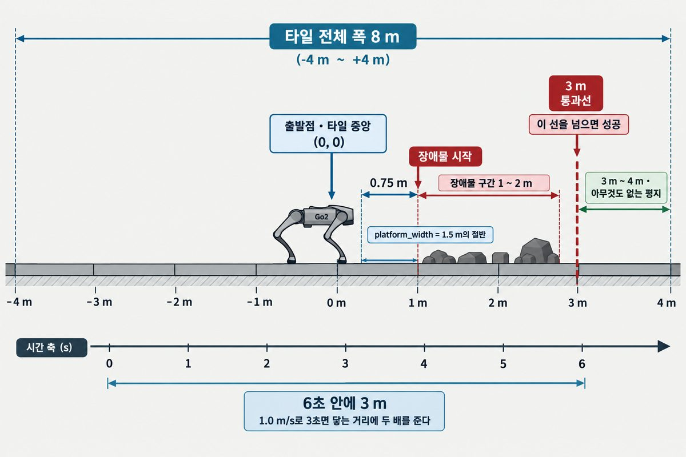
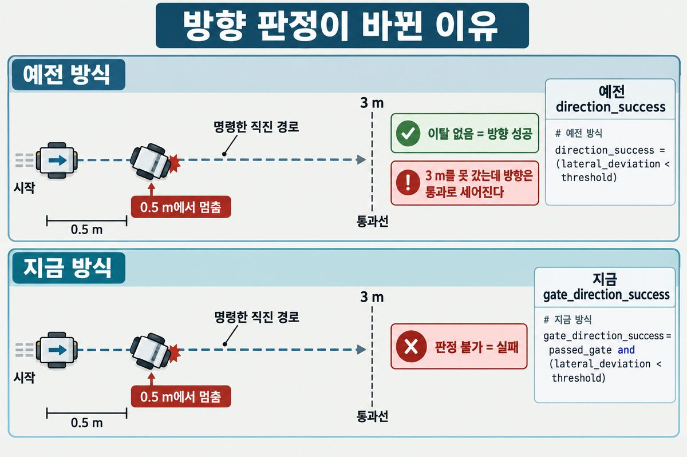
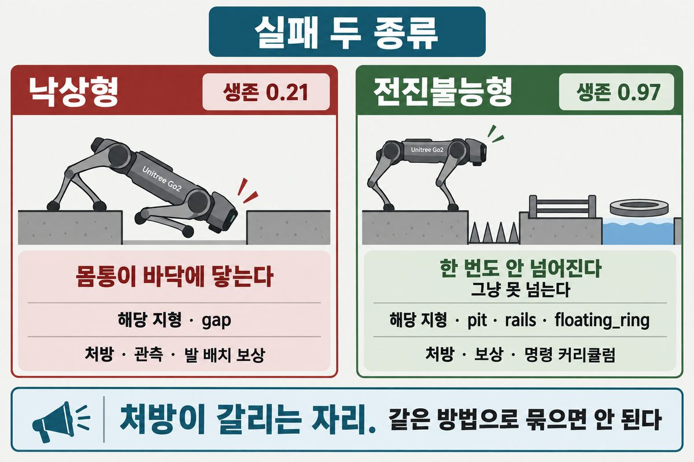
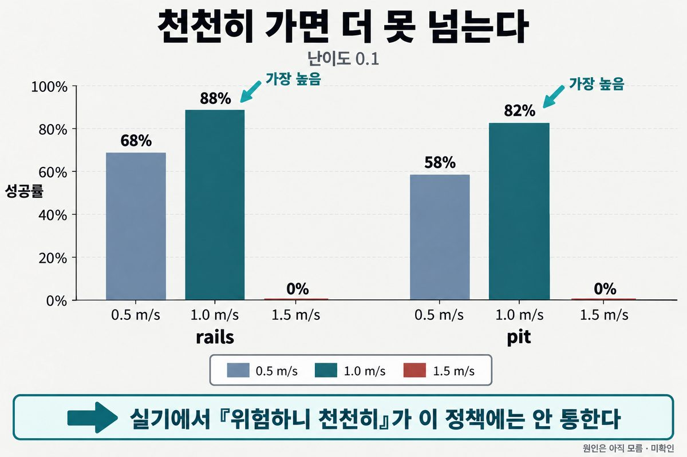
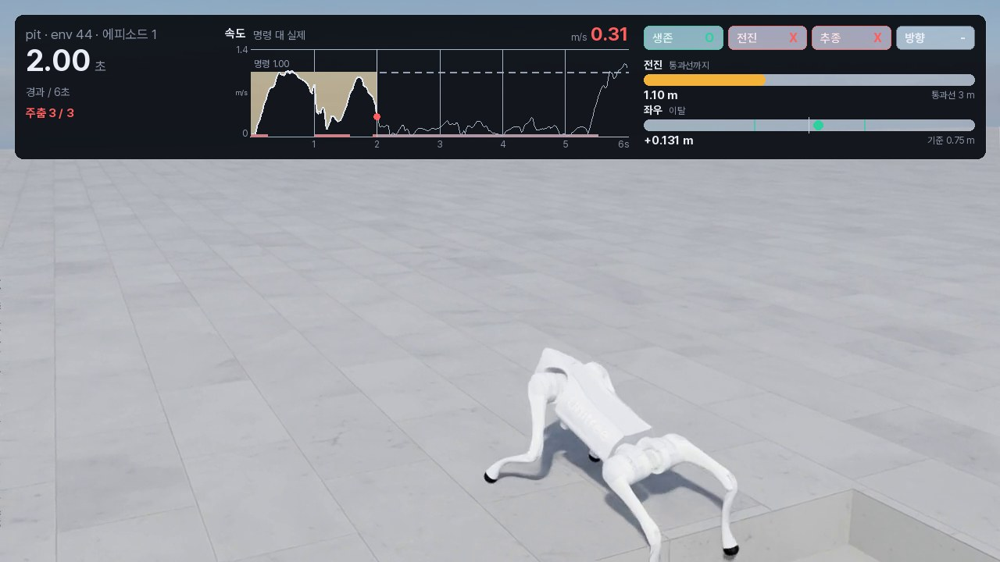
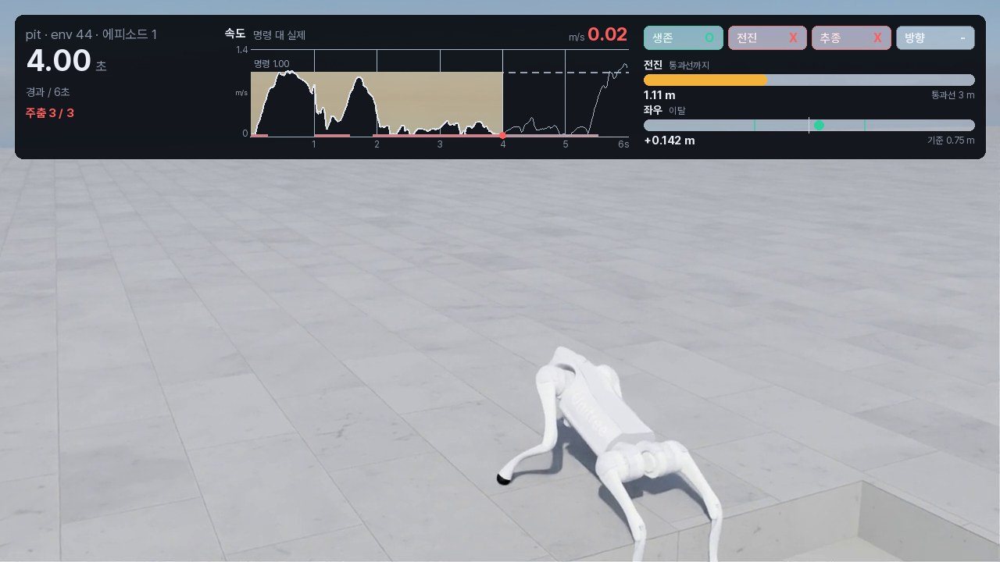

# 평가 프로토콜 정본 · 측정 규격 2

> 분류: 가이드
> 작성: 오흥재 · 2026-09-12 22:10
> 근거: 실측 (`sim/eval/results/maindata-v1` 43,200 에피소드 · `20260911-v3-fixedscan` 원자료) · 코드 원문 · codex 검증 7회차
> 요지: 우리가 무엇을 어떻게 재는지 한 문서에 못 박는다. 규격 2(빗나간 광선 +1)가 기본이고 규격 1 숫자는 성적으로 인용하지 않는다
> 상태: 확정
> 판: v2.0

**웹판**: <https://foothold-project.vercel.app/research-20260911-eval-protocol-v2.html>
도해 여덟 장 · 실측 사진 여섯 장 · 표 예순여덟 개가 다 들어 있습니다.
이 markdown 이 정본이고 웹판은 그것을 옮긴 것입니다.

숫자와 규격을 인용할 때는 이 문서를 근거로 답니다.

> **이 판에서 합쳐진 것.** 배포용 정본과 규격 2 갱신본이 따로 있었고,
> 웹에는 갱신본만 올라가 **난이도 스윕 곡선과 높이 스캔 해설이 빠져**
> 있었습니다 `확인됨` (2026-09-12 팀장 지적). 둘을 합쳐 이 문서 하나로 둡니다.
>
> 읽는 차례는 **1부 지금 규격 · 2부 그 규격이 왜 그렇게 됐나** 입니다.

---

## 1부 · 지금 무엇으로 재는가

지금 성적을 낼 때 쓰는 규격입니다. 숫자를 인용하려면 여기까지만 읽어도 됩니다.

### 0. 한 줄

**구멍 위에서 광선이 빗나갈 때 학습은 `+1`, 평가는 `-1` 을 넣고 있었습니다.**
`-1` 은 「내 몸통보다 0.5 m 넘게 솟은 것」, 곧 벽입니다.
**구멍을 장애물이라고 알려 주고 재고 있었습니다.**

고친 뒤 같은 모델로 다시 재니 이렇게 바뀝니다. 난이도 0.5 · 1.0 m/s · 각 100 에피소드.

| 모델 | 연습한 틈 | 규격 1 | 규격 2 |
|---|---|---:|---:|
| 기준선 · NVIDIA | 없음 | 0% | 1% |
| A | 0.05 ~ 0.20 m | 0% | **28%** |
| **B** = `foothold-v1` | 0.15 ~ 0.40 m | 6% | **100%** |

---

### 1. 측정 규격 둘

| 규격 | 빗나간 광선 | 언제 | 어떻게 부르나 |
|---|---|---|---|
| **1** (결함) | `-1` · 장애물로 보임 | `--legacy_miss_scan` 을 줄 때 | `--legacy_miss_scan` |
| **2** | `+1` · 구멍으로 보임 | 지금 (기본값) | 팔을 안 준다 |

규격은 **`run_manifest.json` 의 필드로만 가립니다.** 날짜로도, `argv` 로도 가르지 않습니다.

| manifest 에 있는 것 | 판정 |
|---|---|
| `eval_spec_version` 이 있다 | 그 값이 정답입니다 |
| 없고 `height_scan_miss_value = 1.0` | 규격 2 |
| 없고 `height_scan_miss_value = null` | 규격 1 |
| 둘 다 없다 | **미확정.** 성적으로 인용하지 않습니다 |

`argv` 의 `--gap_aware_scan` 은 **가리는 데 쓰지 마십시오.** 기본값이 뒤집힌 뒤로는 아무 일도 안 하는 호환용 팔입니다.

저장소에 있는 `run_manifest.json` 328개를 이 규칙으로 세면 이렇습니다 `확인됨`.

| 판정 | 실행 수 |
|---|--:|
| `eval_spec_version` 으로 확정 (전부 값 2) | 12 |
| `height_scan_miss_value = 1.0` 으로 규격 2 | 87 |
| `height_scan_miss_value = null` 로 규격 1 | 12 |
| **미확정** | **217** |
| 합 | 328 |

**미확정이 3분의 2입니다.** 기록을 넣는 코드가 늦게 들어갔기 때문입니다. 그 217개는 이 문서 어디에서도 성적으로 인용하지 않습니다. 이 문서가 인용하는 숫자는 규격 2 의 99개(12 + 87)와, 「고치기 전」 대조용으로 규격 1 의 12개뿐입니다.

미확정 실행을 나중에 규격 1 로 «추정» 해서 채우지 마십시오. 그 실행을 돌린 코드로 입증할 수 있을 때만 근거를 붙여 보충합니다.
규격 1 결과 폴더에는 `_결함규격_읽어주세요.md` 를 넣었습니다.

**규격 1 숫자를 성적으로 인용하지 않습니다.** 지우지도 않습니다. 결함이 있었다는 증거이자
고쳤을 때 무엇이 달라졌는지의 대조군입니다.

#### 어디에 영향이 있나

평가 10종 중 **`gap` 하나뿐**입니다. 광선이 빗나가려면 바닥이 아예 없어야 하는데,
나머지 아홉은 바닥이 있습니다.

> 그림 「gap 지형 위 광선 187개와 빗나간 22개」는 2부 · 03 §3.2 의 그림 3-2 에 있습니다.

발판이 1.5 m 라 가장자리가 ±0.75 m 인데 격자는 ±0.80 m 까지 뻗습니다.
**맨 앞줄과 맨 뒷줄 11개씩, 모두 22개**가 틈 위에 걸칩니다.

| 지형 | 빗나간 광선 (187 중) | 낸 값 |
|---|---:|---|
| **`gap`** | **22** | `-1.00` ~ `-0.10` |
| `floating_ring` | 0 | `-0.33` ~ `-0.10` |
| `pit` | 0 | `-0.30` ~ `-0.10` |
| `rails` | 0 | `-0.22` ~ `-0.10` |
| `stepping_stones` | 0 | `-0.10` ~ `+0.97` |
| 나머지 다섯 | 0 | `-0.10` ~ `+0.11` |

재현은 `sim/eval/probe_height_scan.py` 입니다.

#### 값이 무엇을 뜻하나

> 그림 「높이 스캔 값의 뜻」은 2부 · 03 §3.1 의 그림 3-1 에 있습니다.

`값 = 몸통 높이 - 광선이 닿은 높이 - 0.5`

양수는 「바닥이 아래로 멀다」, 음수는 「위로 솟았다」입니다.
자르는 범위가 `(-1, 1)` 이라 `-1` 의 경계는 `닿은높이 = 몸통높이 + 0.5` 입니다.

---

### 2. 측정 조건

| 항목 | 값 |
|---|---|
| 난이도 기준선 | 0.5 |
| 거리 예산 | 6 m (고정) |
| 통과선 | 3 m |
| 좌우 이탈 한계 | 0.75 m |
| 속도 MAE 한계 | 0.25 m/s |
| Random Seed | 42 |
| 지형마다 | 100 에피소드 |

**제한 시간은 속도에 딸립니다.** 거리 예산 6 m 를 속도로 나눕니다.

| 명령 속도 | 제한 시간 |
|---|---|
| 0.5 m/s | 12초 |
| 1.0 m/s | **6초** |
| 1.5 m/s | 4초 |

「6초」는 1.0 m/s 일 때만입니다. 세 속도가 **같은 거리를 두고** 겨룹니다.

#### 판정은 네 축의 AND

`survival` · `progress` · `tracking` · `direction` 이 **모두 참**일 때만 성공입니다.
`termination_reason` 열의 값은 `timeout` 과 `base_contact` 둘뿐입니다. **이것은 실패 사유가 아니라 종료 사유입니다.**

**규격 2 실행 99개 · 에피소드 95,400 행 전수**를 세어 본 값입니다 `확인됨`.

| 값 | 성공 | 실패 | 합 | 뜻 |
|---|--:|--:|--:|---|
| `timeout` | 60,295 | 21,185 | 81,480 | 제한 시간을 다 채웠다. **통과 여부를 전혀 말하지 않습니다** |
| `base_contact` | 0 | 13,920 | 13,920 | 몸통이 1 N 이상 닿아 시간 전에 끊겼다. 항상 실패입니다 |
| 합 | 60,295 | 35,105 | 95,400 | |

성공한 60,295 에피소드는 **하나도 빠짐없이** `timeout` 입니다. `timeout` 이 붙은 81,480 판 중 74 %가 성공입니다. 그러니 이 열로 「왜 실패했는가」를 물으면 답이 안 나옵니다. 실패 사유는 네 축(생존·전진·속도추종·방향) 중 무엇이 떨어졌는지가 말해 줍니다. 이 열은 **어떻게 끝났는가**만 말합니다.

---

### 3. foothold-v1 성적 · 규격 2

**난이도 0.5 · 지형마다 100 에피소드 · 원자료 행을 직접 셈.**

| 지형 | 0.5 m/s | 1.0 m/s | 1.5 m/s |
|---|---:|---:|---:|
| `gap` | 90 | 100 | 68 |
| `pit` | 100 | 100 | 100 |
| `rails` | 70 | 48 | 21 |
| `floating_ring` | 95 | 99 | 87 |
| `stepping_stones` | 0 | 0 | 0 |
| `discrete_obstacles` | 100 | 100 | 100 |
| `star` | 100 | 100 | 100 |
| `repeated_boxes` | 100 | 100 | 100 |
| `repeated_cylinders` | 100 | 100 | 100 |
| `wave` | 100 | 100 | 100 |

#### 기존 험지 6종 · 난이도 0.5

| 지형 | 0.5 m/s | 1.0 m/s | 1.5 m/s |
|---|---:|---:|---:|
| `boxes` | 99 | 100 | 100 |
| `hf_pyramid_slope` | 100 | 100 | 100 |
| `hf_pyramid_slope_inv` | 100 | 100 | 100 |
| `pyramid_stairs` | 100 | 100 | 100 |
| `pyramid_stairs_inv` | 100 | 100 | 100 |
| `random_rough` | 99 | 100 | 90 |

---

### 4. 난이도 곡선 · 세 모델

> 그림 「규격 2 난이도별 성공률 세 모델」은 2부 · 06 난이도 스윕 에 있습니다.

**`gap` · 1.0 m/s**

| 난이도 | 0.1 | 0.2 | 0.3 | 0.4 | 0.5 | 0.6 | 0.7 | 0.8 | 0.9 | 1.0 |
|---|---:|---:|---:|---:|---:|---:|---:|---:|---:|---:|
| 기준선 | 25 | 7 | 5 | 2 | 1 | 0 | 0 | 0 | 0 | 0 |
| A | 100 | 100 | 100 | 79 | 28 | 8 | 0 | 0 | 0 | 0 |
| **B** | **100** | **100** | **100** | **100** | **100** | **100** | **100** | **100** | **100** | **100** |

A 는 연습한 폭(0.20 m)을 **조금 넘어서까지** 버팁니다. 난이도 0.3 이 평가 틈 0.225 m 이고 거기까지 100%, 0.4(0.25 m)에서 79%, 0.5(0.275 m)에서 28% 입니다. 연습 상한에서 딱 끊기는 것이 아니라 그 위로 서서히 떨어집니다.
**B 는 난이도 1.0(0.40 m)까지 전부 100%** 입니다.

---

### 5. 연습한 지형과 시험 보는 지형

> 그림 「학습 지형과 평가 지형의 거리 비교」는 2부 · 03 §3.8 의 그림 3-4 에 있습니다.

| | 학습 `forward_gap` | 평가 `gap` |
|---|---|---|
| 틈 모양 | 앞을 가로지르는 도랑 하나 | 발판 사방을 두른 고리 |
| 출발점에서 틈까지 | 1.50 m | 0.75 m |
| 틈 폭 (난이도 0.5) · A | 0.125 m | 0.275 m |
| 틈 폭 (난이도 0.5) · **B** | **0.275 m** | 0.275 m |
| 넘은 뒤 착지면 · A | 3.94 m | 2.98 m |
| 넘은 뒤 착지면 · **B** | **3.86 m** | 2.98 m |

---

### 6. 보상이 몸의 어디에 걸리나

> 그림 「보상 지도」는 2부 「무엇을 잘하라고 가르쳤나」 에 있습니다.

가장 큰 벌점이 `lin_vel_z_l2` 의 **-2.00** 입니다.
「위아래로 출렁이지 마라」가 「명령 속도를 맞춰라(+1.50)」보다 무겁습니다.

**이것이 뛰어넘는 동작과 부딪칩니다.** `stepping_stones` 가 관측을 고쳐도
안 풀리는 이유로 이 값을 의심하고 있습니다.

---

### 7. 아직 안 된 것

| 무엇 | 상태 |
|---|---|
| `stepping_stones` | 세 모델 다 난이도 0.2 부터 0%. 보상 구조가 다음 용의자 |
| `rails` | 난이도 0.5 에서 48% (1.0 m/s) |
| 머리 위 천장 | 높이 스캔이 표현하지 못한다. 위쪽 광선 채널이 필요하다 |
| `head_contact_*` 세 열 | 첫 표본이 오염된다. 인용하지 말 것. 아래 주석 |
| CSV 61열 | 설계만 나왔다. `docs/CSV-SPEC-v1.md` |
| 대표 영상 | **찍었다.** 14컷 · `sim/eval/results/20260911-v1-clips/` |

#### 머리 접촉 세 열에 대해

**머리 접촉 세 열(`head_contact_count` · `head_contact_peak_n` · `head_contact_first_s`)은 검증 전까지 인용하지 마십시오.**

규격 2 실행 99개에서 `head_contact_first_s` 에 값이 있는 행은 25,296 이고, 그중 5,979 행(23.6 %)이 정확히 0.0 입니다 `확인됨`.

**이 23.6 %가 전부 거짓이라고 말하지 않습니다.** 0.0 은 「앞 에피소드의 접촉력을 첫 표본이 물려받았다」일 수도 있고 「정말 첫 표본에서 닿았다」일 수도 있습니다. 둘을 갈라내지 않았습니다 (미확인). 첫 접촉 시각이 0.0 이라는 것만으로는 오염을 판별할 수 없습니다.

**앞선 판의 두 숫자를 철회합니다.**

| 철회하는 것 | 왜 |
|---|---|
| 「12,000 에피소드 중 18.7 %(2,241개)」 | 어느 실행에서 나온 값인지 특정하지 못했습니다 |
| 「규격 1 은 36,134 행 중 22.1 %」 | **모집단을 잘못 잡았습니다.** 규격 필드가 «없는» 미확정 실행 217개를 규격 1 로 셌습니다. 규격을 제대로 가리면 규격 1 은 실행 12개뿐이고 값이 있는 행이 169개라, 비율을 말할 표본이 못 됩니다 |

**`count` 와 `peak` 도 영향을 받습니다.** 오염된 첫 표본이 문턱을 넘으면 `head_contact_count` 가 1 오르고, 그 힘이 그 판의 최댓값이면 `head_contact_peak_n` 도 그 값이 됩니다 (`sim/eval/metrics.py:406~411`). 앞선 판에서 「count 와 peak 는 영향이 없다」고 한 것은 틀렸습니다.

판정 네 축(생존·전진·속도추종·방향)은 이 열을 안 쓰므로 영향이 없습니다.

---

### 7-2. 지형이 어디까지 있고, 로봇이 얼마나 탔나

팀장이 물었다. **「discrete_obstacles 나 repeated_boxes 처럼 장애물이 무작위로 놓이는 지형은, 빗겨가서 평지만 걷다 끝나는 판도 있지 않겠나. 그러면 넘어지지 않아 성공이지만 애매한 험지 보행 아닌가.」**

재 봤다. 맞았다.

#### 지형은 앞으로 4~5 m 까지만 있다 `확인됨`

`probe_terrain_extent.py` 로 높이 스캐너가 맞힌 지면 높이를 거리 구간별로 냈다. 난이도 0.5 · 12초 · 지형마다 8 환경.

| 지형 | 0~1 m | 1~2 | 2~3 | 3~4 | 4~5 | 5~6 | 6~11 |
|---|--:|--:|--:|--:|--:|--:|--:|
| `stepping_stones` | 1.07 | 1.06 | 1.06 | . | . | . | . |
| `floating_ring` | 0.23 | 0.22 | 0.00 | 0.00 | 0.00 | 0.00 | 0.00 |
| `pit` | 0.20 | 0.12 | 0.00 | 0.00 | 0.00 | 0.00 | 0.00 |
| `discrete_obstacles` | 0.09 | 0.15 | 0.15 | 0.07 | 0.04 | 0.00 | 0.00 |
| `wave` | 0.12 | 0.12 | 0.12 | 0.10 | 0.04 | 0.00 | 0.00 |
| `star` | 0.10 | 0.11 | 0.11 | 0.11 | 0.03 | 0.00 | 0.00 |
| `rails` | 0.11 | 0.10 | 0.12 | 0.09 | 0.00 | 0.00 | 0.00 |
| `repeated_boxes` | 0.07 | 0.08 | 0.07 | 0.07 | 0.04 | 0.00 | 0.00 |
| `repeated_cylinders` | 0.06 | 0.05 | 0.05 | 0.07 | 0.05 | 0.00 | 0.00 |

단위는 m 이고, 스캔 187개의 (최대 - 최소) 평균이다. **열 지형이 전부 4~5 m 에서 끝나고 6 m 부터는 0.00 이다.**

설정을 보면 그래야 맞다.

```
타일        size = (8.0, 8.0) · num_rows = 1   ->  출발점 앞으로 4 m
발판        platform_width = 1.5               ->  그중 앞 0.75 m 는 평평
테두리      border_width = 20                  ->  4 m 뒤로 평평한 바닥 20 m
```

6초 1.0 m/s 판에서 실제 전진은 약 5.7 m 다. 그중 **장애물이 있을 수 있는 구간은 0.75~4.0 m 의 3.25 m** 이고 나머지 2.45 m(43 %)는 발판이거나 테두리다. 성공 관문이 3.0 m 이므로 **장애물 노출 2.25 m 만에 통과된다.**

> 설정 주석에 「20초 규격을 담으려고 테두리를 넓혔다」가 있다. 그러나 넓어진 것은 **평평한 테두리**다. 20초 규격으로 가면 지형 4 m 에 평지 16 m 가 된다. 「로봇이 세상 밖으로 나간다」는 막았지만 「지형이 떨어진다」는 안 봤다.

#### 그래서 열 셋을 더한다

| 열 | 무엇 |
|---|---|
| `terrain_relief_scan_m` | 몸 주변 1.6 x 1.0 m 안에 **넘을 것이 있었나** |
| `terrain_relief_underfoot_m` | 몸 **바로 아래** 지면이 위아래로 얼마나 움직였나 |
| `terrain_engagement_ratio` | 뒤를 앞으로 나눈 값. 1 이면 다 넘었고 0 이면 비켜 갔다 |

난이도 0.5 · 지형마다 20판으로 재면 이렇다 `확인됨`.

| 지형 | 주변 기복 | 발로 탄 것 | 참여도 | 성공률 |
|---|--:|--:|--:|--:|
| `star` | 0.105 | 0.016 | **0.15** | 100 % |
| `discrete_obstacles` | 0.188 | 0.050 | **0.27** | 100 % |
| `wave` | 0.131 | 0.078 | 0.59 | 100 % |
| `stepping_stones` | 1.103 | 0.887 | 0.80 | 0 % |
| `repeated_boxes` | 0.081 | 0.065 | 0.81 | 100 % |
| `repeated_cylinders` | 0.067 | 0.062 | 0.93 | 100 % |
| `rails` | 0.115 | 0.115 | 1.00 | 30 % |
| `pit` | 0.200 | 0.200 | 1.00 | 100 % |
| `floating_ring` | 0.225 | 0.225 | 1.00 | 95 % |
| `gap` | 0.000 | 0.000 | (못 잼) | 100 % |

**`star` 의 100 % 는 막대를 넘어서 받은 점수가 아니다.** 주변에 0.105 m 짜리 막대가 있는데 발은 0.016 m 만 탔다. 골을 따라 걸어 나갔다. Isaac 의 star 는 막대가 중심에서 바깥으로 뻗으므로, 중심에서 방사 방향으로 걸으면 막대를 **가로지를 일이 구조적으로 없다.** `discrete_obstacles` 도 0.27 로 비슷하다.

반대로 `rails` 와 `stepping_stones` 는 참여도가 1.00 과 0.80 인데 성공률이 30 %와 0 %다. **제대로 타고 실패한 것**이고, 그 실패는 정직하다.

#### 이 열로 못 하는 것

**`gap` 에는 안 통한다** `확인됨`. 구멍은 광선이 아무것도 못 맞히므로 스캔 기복이 0.000 으로 나온다. 구멍을 «성공적으로 건넌» 판과 «구멍이 없던» 판을 이 열로 구별할 수 없다. `gap` 과 `pit` 처럼 «안 딛고 넘는 것이 정답» 인 지형은 네 축이 이미 답하고 있으므로 이 열을 묻지 않는다.

판정을 안 바꾼다. `overall_success` 는 여전히 네 축의 AND 다. 이 열은 **나중에 「그 성공이 어떤 성공이었나」를 되물을 수 있게** 남기는 것이다.

#### 다음에 할 것

장애물 노출 구간 2.25 m 로는 「넘었다」와 「운이 좋았다」를 가르기 어렵다. 구간을 늘리려면 지형을 x 로 잇는 corridor 로 가야 하고(`num_rows` 를 키운다), 그러면 **기존 성적과 비교가 안 되므로 전면 재실행**이다. 임석헌의 평가가 그 방식이라 비교 가능해지는 이점도 있다. v2 에서 결정한다.

---

### 8. 재현

```bash
# 규격 2 (기본값)
python sim/eval/eval_generalization.py \
  --checkpoint models/foothold-v1.pt \
  --terrain_set unseen10 --terrains all \
  --difficulty 0.5 --episodes 100 --envs_per_terrain 10 \
  --eval_duration 6.0 --command_vx 1.0 \
  --min_progress_m 3.0 --max_lateral_drift 0.75 --max_velocity_mae 0.25 \
  --seed 42 --headless --device cuda:0 --output_dir <어디에>

# 규격 1 을 재현할 때만
#   --legacy_miss_scan 을 덧붙인다
```

**모델 SHA-256** `c7612aef0b3c49b876c610d6d1c4f507eba666a4ffa03797760ad4a896ee7aca`

#### 규격 2 함수는 저장소 안에 있습니다

`sim/eval/gap_observations.py` 입니다. `git pull origin main` 만 받으면 그대로 돕니다. IsaacLab 쪽 사본은 이제 안 봅니다.

| 물음 | 답 |
|---|---|
| 아무 팔도 안 주면 어느 규격인가 | **규격 2.** `miss_value = +1.0` 입니다 |
| `--gap_aware_scan` 을 줘야 하나 | 아니요. 기본값이 뒤집히기 전의 팔이라 지금은 아무 일도 안 합니다 |
| 규격 1 로 돌리려면 | `--legacy_miss_scan`. manifest 에 `eval_spec_version = 1` 로 남습니다 |
| Isaac 없이 확인할 수 있나 | 예. `python -m pytest sim/eval/tests/test_gap_observations.py` |

그 시험 9개가 기본값이 +1.0 인 것, 빗나간 광선에만 그 값이 들어가는 것, 맞힌 광선 계산이 IsaacLab 기본 함수와 같은 식인 것을 못 박습니다.

---

### 9. 대표 영상을 직접 만들려면

저장소를 받은 사람이 **옵션 없이 한 줄**로 같은 영상 한 벌을 만듭니다.

```bash
git pull origin main
pip install av        # Isaac 이 도는 파이썬에 «한 번만»

python sim/eval/render_gallery.py \
    --checkpoint models/foothold-v1.pt
```

결과는 `sim/eval/results/<날짜>-gallery/` 에 쌓이고 그 안에 `gallery.html` 이 생깁니다. 브라우저로 그냥 열면 됩니다.

**그 페이지는 옆의 `web/` 폴더를 가리킵니다.** 파일을 심지 않으므로 페이지만 따로 옮기면 영상이 안 나옵니다. 84컷을 심으면 194 MB 가 되어 브라우저가 못 엽니다 `확인됨` (2026-09-12). 남에게 보낼 때는 폴더째 보내거나, 10절의 배포 명령으로 site 에 올립니다.

#### 무엇이 기본값인가

| 무엇 | 값 | 왜 |
|---|---|---|
| 지형 | **16종** (기존 험지 6 + 미경험 험지 10) | 안 무너졌는지와 일반화를 같이 본다 |
| 속도 | 0.5 · 1.0 · 1.5 m/s | 속도가 성패를 가르는 지형이 있다 |
| 난이도 | 0.5 | 성적표와 같은 자리 |
| 길이 | 거리 예산 6 m 를 속도로 나눈 값 | 평가 하네스와 같은 규칙 |
| 시점 | **지형이 정한다** | 아래 |
| 자르는 자리 | 전진 5.0 m | 지형이 끝나는 자리 (7-2절) |
| 해상도 | 마스터 **1920 x 1080** · 웹도 1920 x 1080 (CRF 26) | 아래 |
| 배속 | 안 만든다 | 갤러리의 재생기 단추가 맡는다 |

**웹에 싣는 것도 1080p 입니다.** 예전에는 마스터를 720p 로 찍고 웹에 960 x 540 으로
줄여 실었습니다. 고DPI 화면에서 확대하면 깨졌습니다 `확인됨` (2026-09-12 팀장 지적).
크기를 줄이는 대신 **화질을 한 단계 낮추는** 쪽이 같은 용량에서 더 선명합니다.
`gap-v1` 한 컷을 실제로 구워 재 본 값입니다.

| 무엇 | 컷 하나 | 84컷 | 확대하면 |
|---|--:|--:|---|
| 720p CRF 24 | 0.67 MB | 78 MB | 1.5배 늘려 그린다 |
| **1080p CRF 26** | **1.25 MB** | **105 MB** | **원본 화소 그대로** |
| 1080p CRF 24 | 1.59 MB | 133 MB | 원본 화소 그대로 |

**시점은 옵션이 아닙니다.** `render_gallery.py` 의 `VIEW_BY_TERRAIN` 이 지형마다 적어 둡니다. 높이·깊이를 넘는 지형은 `track_side`, 발을 어디 놓느냐가 관건인 지형은 `track_high` 입니다. 새 지형을 더하면 거기 한 줄 더합니다. 시점을 모르는 지형이 있으면 **찍기 전에** 멈춥니다.

#### 성공률과 참여도를 같이 얹으려면

```bash
python sim/eval/render_gallery.py \
    --checkpoint models/foothold-v1.pt \
    --raw_csv sim/eval/results/20260911-v1-maindata
```

그 폴더 아래의 `generalization_raw.csv` 를 전부 읽어 지형별 성공률·참여도 표를 페이지 맨 위에 올립니다. 안 주면 영상만 나옵니다.

#### 알아 둘 것

**중간에 끊겨도 같은 명령을 다시 주면 이어서 합니다.** 이미 만든 컷은 건너뜁니다. GPU 두 대로 나눠 돌릴 때도 같은 `--out_dir` 을 주면 서로 겹치지 않습니다.

**환경은 하나면 됩니다.** 예전에는 촬영이 Isaac 환경, HUD 가 `av` 있는 다른 환경이라 두 번 나눠 돌려야 했고, 그것을 모르면 HUD 가 **조용히 전부 실패**했습니다 `확인됨` (2026-09-11 · 14컷이 종료코드 0 에 mp4 만 없었다). `pip install av` 한 번으로 그 갈림이 없어집니다.

**배속은 새 프레임을 만들지 않습니다.** 원본이 초당 50장이라 0.25배에서는 초당 12.5장이 보입니다. 부드러운 슬로우모션이 필요하면 촬영을 200 Hz 로 해야 하고 (`record_terrain_demo.py --slowmo 4`), 실측 비용이 **프레임당 약 100배**입니다 `확인됨`. 기본값이 아닌 이유입니다.

#### 왜 50 Hz 인가

임의값이 아니라 **정책이 결정을 내리는 주기**입니다.

```
sim.dt = 0.005       물리 200 Hz
decimation = 4       정책  50 Hz   (물리 4번에 결정 1번)
render_interval = 4  렌더  50 Hz   (결정 1번에 프레임 1장)
```

「결정 한 번에 한 장」입니다. HUD 도 제어 스텝 단위 계측을 얹으므로 자리가 맞고, 50 fps 는 이미 부드러운 구간(30 fps 이상)입니다.

---

### 10. 갤러리를 site 에 올리려면

영상과 성적을 웹에 올리는 것은 **명령 하나**입니다. 폴더만 복사하면 판 목록이
안 바뀝니다. 정적 페이지는 서버 폴더를 열거할 수 없기 때문입니다.

```bash
python sim/eval/publish_gallery.py     --gallery sim/eval/results/20260911-gallery-1080     --raw_csv sim/eval/results/maindata-v1     --version v1 --main_model foothold-v1     --site ../foothold-site
```

네 단계가 순서대로 돕니다.

| 단계 | 하는 일 | 안 맞으면 |
|---|---|---|
| 1 | `gallery_manifest.py` 가 색인을 만든다 | 이름·꼬리표·지형이 규칙에 안 맞으면 죽는다 |
| 2 | `web/*.mp4` 를 `<site>/gallery/vN/clips/` 로 옮긴다 | 색인이 적은 컷이 없으면 죽는다 |
| 3 | 옮긴 것이 색인과 **크기까지** 같은지 센다 | 하나라도 다르면 판 목록에 안 넣는다 |
| 4 | `gallery_versions.py` 가 판 목록을 다시 만든다 | 덜 올라간 판은 목록에서 빠진다 |

#### `--main_model` 은 기본값이 없습니다

v2 를 만들 때 이것을 빼먹으면 **v2 영상에 v1 이름이 붙습니다.** 그러면 원자료에
있는 v1 성적이 v2 컷에 붙어 정상처럼 보입니다. 그래서 필수 인자입니다.

#### 색인이 담는 것 (schema 2)

| 무리 | 무엇 | 왜 |
|---|---|---|
| `models` | 모델별 체크포인트 SHA-256 | 같은 이름이 다른 파일을 뜻할 수 있다 |
| `protocol` | 규격 판 · Random Seed · 제한 시간 · 통과선 · 임계값 | 조건이 다르면 같은 시험이 아니다 |
| `evaluations` | **평가한 칸 전부** (난이도 0.5 에서 144칸) | 영상이 없는 칸도 성적은 있다 |
| `clips` | 영상. `evaluation_id` 로 평가 칸에 걸린다 | 한 칸에 컷이 0개 이상 |
| `metrics` | 지표가 무엇을 재는지, 결측이 무슨 뜻인지 | 화면이 이 글을 그대로 보여 준다 |

컷 84개만 적던 1 판은 **영상 없는 60칸을 통째로 버렸습니다.** 그래서 비교 화면이
「평가는 했지만 영상을 안 뜬 자리」와 「아예 안 돌린 자리」를 구별하지 못했습니다
`확인됨` (2026-09-12 설계 검토 · `boxes / 기준선 / 1.0 m/s` 는 34 % 를 실제로
측정했는데도 없는 것처럼 보였다).

---

### 부록 · 검증 기록

| 차수 | 모델 | 무엇을 잡았나 |
|---|---|---|
| 1차 | `gpt-6-astra` | 관측 부호 불일치를 처음 지적 |
| 2차 | `gpt-6-astra` | S3 원본으로 임석헌 평가도 `+1` 이었음을 확인 · 속도별 제한 시간 오류 |
| 3차 | `gpt-6-astra` | 문서 수치 오류 16건 · 격자 순서 · 대조 실험의 초기 상태 차이 |
| 4차 | `gpt-6-astra` | manifest 가 규격을 안 남기던 것 · 영상 계측이 한 프레임 밀리던 것 |
| 5차 | `gpt-6-astra` | 공개를 막는 8건. 저장소 밖 의존성 · argv 로 규격을 가른다는 잘못된 안내 · 장수 관문이 예정치를 보던 것 · 날짜로 규격을 가르던 문장 · 미리보기 자리가 범위를 넘던 것 |
| 팀장 | 오흥재 | `stepping_stones` 영상에서 카메라가 z 축으로 도는 것을 지적 (2026-09-11) |

세 차수 모두 `Claude/검증결과*.md` 에 남아 있습니다.

---

## 2부 · 그 규격이 왜 그렇게 됐나

배경과 실측입니다. 난이도 스윕 곡선 · 높이 스캔이 무엇을 보는가 ·
지형마다 난이도 축이 어떻게 다른가가 여기 있습니다.

> **규격 1 시절 숫자가 섞여 있을 수 있습니다.** 이 부의 표 가운데
> `eval_spec_version` 이 1 인 것으로 잰 값은 **성적으로 인용하지 않습니다.**
> 규격 2 로 다시 잰 값은 1부와 3절에 있습니다.

### 01 기준선은 난이도 0.5 입니다

모든 비교의 출발선입니다. **이 값은 바뀌지 않습니다.**

#### 왜 하나의 값을 고정하는가

비교에는 **명시적 기준**이 필요합니다. NVIDIA 공식 체크포인트가 이 지형들에서 얼마나 하는지, 그리고 우리 정책이 얼마나 나아졌는지를 말하려면 **같은 자리에서 잰 숫자**가 있어야 합니다.

```
difficulty_range = (0.5, 0.5)
num_rows = 1
sim/eval/generalization_env_cfg.py:53
```

이 값에서 잰 것이 **기준선 성적**이고, 「실패 5종」도 이 기준에서 나온 말입니다.

#### 기준선과 곡선은 둘 다 필요합니다

최종 보고는 두 단계로 갑니다.

1. 기준선에서 NVIDIA 대비 성능을 말한다 
 난이도 0.5 에서 `foothold-vN.pt` 가 NVIDIA 체크포인트보다 얼마나 나아졌는지. **한 자리에서 잰 명확한 숫자**입니다.
2. 난이도별 곡선 전체로 종합한다 
 지형마다 난이도를 바꿔 가며 잰 곡선이 **어디로 얼마나 옮겨졌는지.** 「경계 이동」이 KPI 인 이유가 이것입니다.

**스윕은 기준선을 바꾸는 것이 아니라 그 옆에 곡선을 세우는 것입니다.**

### 02 측정 규격

**평지와 험지는 서로 다른 규격입니다.** 두 시험의 숫자를 나란히 놓으면 안 됩니다.



|  | 평지 기준선 | 미경험 험지 10종 | 인자 |
|---|---|---|---|
| 제한 시간 | 20 초 | **6 초** | --eval_duration |
| 통과선 | 10 m | **3 m** | --min_progress_m |
| 명령 속도 | 1.0 m/s | 1.0 m/s | --command_vx |
| 좌우 이탈 임계 | 5 cm | **0.75 m** | --max_lateral_drift |
| 속도 오차 임계 | 0.25 m/s | 0.25 m/s | --max_velocity_mae |
| 지형당 에피소드 수 | 100 | 100 | --episodes |

#### 왜 험지는 6 초 · 3 m 인가

지형이 놓인 방식 때문입니다. 로봇은 **타일 한가운데**에서 출발하고 장애물은 바로 앞에 있습니다.

| 거리 (출발점 기준) | 거기 무엇이 있나 |
|---|---|
| 0 m | 로봇 출발 위치 · 타일 중앙 좌표 `(0, 0)` |
| 0.75 m | 여기까지 평평한 발판 · **모든 지형이 같다** (`platform_width = 1.5 m` 의 절반) |
| 0.75 m 부터 | **장애물이 시작된다** |
| **3 m** | **통과선** · 전진 축을 채우는 자리. 성공은 네 축 AND 다 |
| 4 m | 타일 끝 (타일은 8 m × 8 m) |

##### 장애물이 끝나는 자리는 지형마다 다릅니다

코드에서 계산한 값입니다. 난이도 0.5 기준이고 중심에서 잰 거리입니다.

| 지형 | 장애물 끝 | 통과선까지 | 근거 · Isaac Lab 0.54.2 |
|---|---|---|---|
| gap | 1.02 m | 1.98 m 가 평지 | 0.75 + (0.15 + 0.5×0.25) |
| rails | 2.88 m | 0.12 m 뿐 | 바깥 레일 바깥 모서리 |
| pit | 4.0 m | 통과선이 구덩이 안 | double_pit=False · 타일 절반 |

**지형마다 크게 다릅니다.**

**`rails` 는 통과선 3 m 까지 12 cm 밖에 안 남습니다.** 바깥 레일을 넘자마자 통과선입니다. **이 지형에서 「통과선을 못 넘었다」는 「레일을 못 넘었다」와 사실상 같은 말입니다.**

**`pit` 은 통과선이 구덩이 안에 있습니다.** 로봇이 구덩이 바닥에서 출발하고 장애물은 발판 가장자리 턱 하나뿐인데, 구덩이 자체가 타일 절반까지 이어집니다.

**`rails` 에서 3 m 가 기준으로 성립하는 이유는 이것입니다.** 가장 먼 레일이 2.88 m 이므로 **3 m 를 넘으면 그 지형에서 넘어야 할 것을 다 넘은 것**입니다. **다른 지형은 다릅니다** · `repeated_boxes` 와 `wave` 등은 4 m 부근까지 구조가 있습니다 (1부 「지형이 어디까지 있나」). 그보다 멀리 가라고 하면 남는 것은 지형 밖 평지뿐입니다.

**이 거리는 코드를 읽어 계산한 것이고 렌더해서 눈으로 재보지는 않았습니다.** `미확인` 으로 둡니다.

**6 초는 3 m 를 가는 데 필요한 시간의 두 배입니다.** 3 m 를 1.0 m/s 로 가면 3초입니다. 헤매서 두 배로 걸려도 **전진 축은 채우도록** 여유를 둔 것입니다. 다만 전진만으로 성공이 되지는 않습니다. 성공은 생존 · 전진 · 속도추종 · 방향 **네 축의 AND** 입니다 (1부 「판정은 네 축의 AND」).

**통과선 3 m 는 출발점에서 잰 거리입니다.** 타일 가장자리나 장애물 끝이 아니라 **로봇이 처음 서 있던 자리**가 0 입니다.

**정정 · 2026-09-11.** 「6초」는 **1.0 m/s 일 때만**입니다. 스윕은 **거리 예산 6 m 를 고정**하고 시간을 속도로 나눠 씁니다 ( sweep_run.ps1:102 ).

| 명령 속도 | 제한 시간 | 거리 예산 | 통과선 |
|---|---|---|---|
| 0.5 m/s | **12초** | 6 m | 3 m |
| 1.0 m/s | **6초** | 6 m | 3 m |
| 1.5 m/s | **4초** | 6 m | 3 m |

세 속도가 **같은 거리를 두고 겨루는** 셈입니다. 「빠른 쪽이 시간을 덜 받아 불리하다」가 아니라, **속도 명령을 지키면 셋 다 같은 여유**를 갖습니다.

### 03 높이 스캔 · 로봇이 땅을 보는 눈

로봇은 발밑 지형을 **광선 187개**로 훑습니다. 그런데 **구멍 위에서 학습과 평가가 정반대 값을 넣습니다.** 2026-09-11 에 코드로 찾고 **실측으로 확인했습니다**.

**2026-09-11 에 고쳤습니다.** 지금 코드의 기본값은 **규격 2** 입니다. 그 전에 잰 41,800 에피소드는 **규격 1** 이고, 결과 폴더마다 딱지를 붙여 두었습니다. 이 문서는 두 규격의 숫자를 **절을 나눠** 싣습니다. 섞어서 인용하면 안 됩니다.

#### 3.1 높이 스캔이 무엇인가

몸통 아래를 향해 **격자 모양으로 광선을 쏘고, 각 광선이 땅에 닿는 높이**를 받습니다. 카메라가 아니라 줄자에 가깝습니다.

| 항목 | 값 | 어디서 |
|---|---|---|
| 격자 크기 | 1.6 m x 1.0 m | velocity_env_cfg.py:70 |
| 격자 간격 | 0.1 m | 같은 자리 |
| 광선 개수 | 17 x 11 = 187 | 위 둘에서 계산 |
| 쏘는 방향 | (0, 0, -1) · 아래로만 | patterns_cfg.py:52 |
| 출발 높이 | 몸통에서 20 m 위 | ray_caster.py:224 |
| 값 계산 | 몸통높이 - 닿은높이 - 0.5 | observations.py:300 |
| 자르는 범위 | -1 에서 +1 | velocity_env_cfg.py:138 |

**「20 m 위에서 쏜다」는 것은 출발점 이야기**입니다. 값 자체는 **몸통 기준**이라 평지에서 -0.10 근처가 나옵니다.


#### 3.2 gap 지형에서 광선이 어디를 비추나

난이도 0.5 에서 실제로 재 본 그림입니다. 재현은 sim/eval/probe_height_scan.py 입니다.


발판이 1.5 m 라 가장자리가 ±0.75 m 인데 격자는 ±0.80 m 까지 뻗습니다. 그래서 **맨 앞줄과 맨 뒷줄 11개씩, 모두 22개**가 틈 위에 걸칩니다.

**학습이 고른 +1 은 옳은 선택입니다.** 이 눈금에서 양수는 「바닥이 아래로 멀다」는 뜻이고, 바닥 없는 구멍이 바로 그것입니다. 학습 코드 주석도 그렇게 적고 있습니다.

평가가 넣는 -1 은 **눈금의 정반대 끝**입니다. 뜻으로 옮기면 **「내 몸통보다 0.5 m 넘게 솟은 무언가가 있다」** 입니다. 몸통높이 - 닿은높이 - 0.5 = -1 이 되는 경계가 닿은높이 = 몸통높이 + 0.5 이기 때문입니다.

**구멍을 보고 장애물이라고 말해 준 셈입니다.**

#### 3.3 실측 · 열 종 중 하나만 해당합니다

광선이 빗나가려면 **바닥이 아예 없어야** 합니다. 열 종을 다 재 봤습니다.

| 지형 | 빗나간 광선 · 187 중 | 낸 값 | 왜 |
|---|---|---|---|
| gap | **22** | -1.00 ~ -0.10 | **발판과 테두리 사이에 바닥이 없다** |
| floating_ring | 0 | -0.33 ~ -0.10 | 타일 전체에 바닥이 깔려 있다 |
| pit | 0 | -0.30 ~ -0.10 | 구덩이 바닥이 상자로 만들어져 있다 |
| rails | 0 | -0.22 ~ -0.10 | 바닥 위에 턱을 얹은 것 |
| stepping_stones | 0 | -0.10 ~ +0.97 | 높이필드라 「구멍」도 깊이가 정해진 면 |
| star · wave · discrete_obstacles · repeated_boxes · repeated_cylinders | 0 | -0.10 ~ +0.11 | 모두 바닥이 있다 |

값의 범위가 -0.33 에서 +0.97 까지 골고루 있습니다. **높이 스캔은 상수가 아니라 실제로 지형 정보를 담고 있습니다.** 그래서 이 채널이 뒤집히는 것은 무시할 수 있는 일이 아닙니다.

#### 3.4 고리 밑을 지나갈 때는 무엇을 보나

광선이 아래로만 가니 **머리 위에 뭔가 있으면 그것부터 맞힙니다.** floating_ring 에서 실제로 그렇습니다.


| 난이도 0.5 에서 | 높이 | 광선이 보는가 |
|---|---|---|
| 고리 윗면 | 0.225 m | 본다 값 -0.33 |
| 고리 아랫면 | 0.105 m | 못 본다 |
| 고리 아래 바닥 | 0 m | 못 본다 |
| 고리 없는 자리 바닥 | 0 m | 본다 값 -0.10 |
| Go2 몸통 | 0.42 m | 기준점. 20환경 평균 0.421 m · floating_ring 초기값은 0.40 m |

**로봇은 고리를 「바닥에서 0.225 m 솟은 덩어리」로 봅니다.** 아래에 틈이 있다는 것도, 고리가 얼마나 두꺼운지도 모릅니다. **높이 스캔은 한 자리에 숫자 하나**라서 「위에 천장, 아래에 바닥」을 담을 수 없습니다.

**이번 지형에서는 그게 문제가 안 됩니다.** 고리 아래 틈이 10.5 cm 라 Go2(몸통 0.42 m )가 기어들어갈 수 없습니다. **넘어가는 턱**이고, 넘으려면 윗면 높이만 알면 됩니다. 그래서 지금 눈으로도 98~99% 를 냅니다.

다만 **진짜 굴다리나 책상 밑을 시키려면 지금 눈으로는 안 됩니다.** 셋 중 하나가 필요합니다.

1. **위로도 광선을 쏜다.** 천장까지 거리를 재는 채널을 더한다. 관측이 187 에서 374 로 늘고 다시 학습해야 한다. 가장 싸다.
2. **깊이 카메라나 라이다로 3차원을 받는다.** 진짜 해법이지만 관측이 훨씬 커지고 실기 이식이 어렵다.
3. **몸을 낮춘 자세를 따로 배운다.** 지금 보상에는 「낮게 가라」는 항이 없어 저절로 안 나온다.

다음 단계 이건 1차 배포 범위 밖입니다. 별도 이슈로 남깁니다.

#### 3.5 고쳐서 재 봤습니다

**고친 규격으로 세 모델을 다시 쟀습니다.** 난이도 0.5 · 1.0 m/s · 각 100 에피소드 · 원자료로 직접 셈.

| 모델 | 연습한 틈 | 규격 1 · 빗나감 = -1 | 규격 2 · 빗나감 = +1 |
|---|---|---|---|
| 기준선 NVIDIA | 없음 | 0% | 1% |
| **A** | 0.05 ~ 0.20 m | 0% | **28%** |
| **B** | 0.15 ~ 0.40 m | 6% | **100%** |

**규격 1 에서는 0 · 0 · 6 으로 평평해 아무것도 안 보였습니다.** 규격 2 에서 1 · 28 · 100 이 됩니다.

기준선은 갭을 배운 적이 없어 **여전히 1%** 입니다. A 는 0.20 m 까지만 배워 시험( 0.275 m )에서 **28%** 입니다. B 는 시험이 배운 범위 안이라 **100%** 입니다.

**둘 다 필요했습니다.** 관측을 고쳐야 신호가 보이고, 폭을 넓혀야 끝까지 갑니다.

2026-09-11 · **같은 모델(B) · 같은 Random Seed · 같은 조건 · 눈만 바꿔서** 각각 100 에피소드씩 돌렸습니다.

| 지형 | 지금 규격 · 빗나감 = -1 | 고친 규격 · 빗나감 = +1 | 차이 |
|---|---|---|---|
| **gap** · 전체 | 6% | **100%** | **+94 %p** |
| **gap** · 생존 | 14% | **100%** | **+86 %p** |
| pit | 100% | 100% | 0 |
| rails | 48% | 48% | 0 |

**예측한 그대로입니다.** gap 만 크게 움직입니다. pit 과 rails 는 바닥이 있어 빗나가는 광선이 애초에 없기 때문입니다.

다만 **「한 자리도 안 바뀐다」는 과장입니다.** 종합 성공률은 같아도 하위 축은 조금씩 흔들립니다 ( rails 생존 83 → 84 · 방향 58 → 55). 같은 Random Seed 를 줘도 **에피소드별 초기 자세가 완전히 같지는 않기** 때문입니다. 100 쌍 중 90 쌍에서 출발 위치가 달랐습니다.

**로봇은 틈을 넘을 줄 알았습니다.** 우리가 틈을 장애물이라고 알려주고 있었을 뿐입니다.

두 실행의 정책 SHA-256 이 같고( c7612aef… ) Random Seed 가 42 로 같습니다. 어느 규격으로 쟀는지는 run_manifest.json 의 argv 에 남아 있습니다. 주의 이 대조 실험은 기록 항목을 붙이기 **전에** 돌려서 gap_aware_scan 필드 자체는 없습니다. 이후 실행부터는 eval_spec_version 과 함께 남습니다.

#### 3.6 무엇을 어떻게 고쳤나

**평가가 -1 을 고른 것이 아닙니다. 아무도 고른 적이 없습니다.**

|  | 높이 스캔 함수 | 빗나가면 |
|---|---|---|
| **학습** Isaac-Velocity-Gap-… | height_scan_with_gap | **+1** |
| **임석헌 평가** S3 원본 | height_scan_with_gap | **+1** |
| **우리 평가** UnitreeGo2Generalization… | 기본 함수를 그대로 물려받음 | **-1** |

IsaacLab 기본 함수는 **바닥 없는 지형을 상정하고 만든 것이 아닙니다.** 험지에는 구멍이 없으니 ∞ 가 들어올 일이 없습니다. 임석헌은 갭을 학습시키려고 그 구멍을 눈치채고 height_scan_with_gap 을 새로 만들었습니다. **우리 평가만 그 함수를 안 쓰고 있었습니다.**

고친 것은 **팔 하나**입니다.

| 자리 | 넣은 것 |
|---|---|
| generalization_env_cfg.py | apply_gap_aware_scan() |
| eval_generalization.py | --gap_aware_scan |
| run_manifest.json | gap_aware_scan · height_scan_miss_value |

**그때는 기본값을 안 바꿨습니다.** (지금은 규격 2 인 **+1 이 기본**입니다. 1부 「측정 규격 둘」 참조.) 팔을 안 주면 지금까지의 모든 실행과 같은 값으로 돕니다. 바꿔 버리면 쌓아 둔 41,800 에피소드와 새 숫자를 나중에 구별할 수 없습니다. 대신 **각 실행이 어느 규격으로 쟀는지 스스로 적게** 했습니다.

#### 3.7 고치면 왜 지금까지 잰 것을 다시 재야 하나

이 한 줄을 고치면 **로봇이 받는 입력이 달라집니다.** 정책을 바꾸는 게 아니라 **시험지를 바꾸는 것**입니다.

학생을 그대로 두고 **시험 문제를 바꿔 놓고**, 새 점수를 옛 점수 옆에 나란히 적으면 안 됩니다. 실력이 오른 것인지 문제가 쉬워진 것인지 구별할 수 없습니다.

| 지금까지 쌓은 것 | 규모 | 어느 규격 |
|---|---|---|
| 기준선 난이도 스윕 | 19,000 에피소드 | 규격 1 |
| 기존 험지 6종 스윕 228칸 | 22,800 에피소드 | 규격 1 |
| A · B 모델 측정 | 누적 중 | 규격 1 |

그래서 고치는 순간 **기준선 · A · B 를 전부 새 규격으로 다시 재야** 비교가 성립합니다. 옛 숫자를 지우는 게 아니라 **두 벌을 나란히 남깁니다.**

1. 평가도 학습과 같은 빗나감 처리( +1 )를 쓰게 한다. 설정 한 줄.
2. 기준선 · A · B 를 새 규격으로 다시 잰다.
3. 옛 규격 성적과 새 규격 성적을 **따로 표로 남긴다.** 섞어서 인용하지 않는다.

이렇게 해야 **「폭을 넓혀서 오른 것」과 「입력을 맞춰서 오른 것」을 갈라서** 말할 수 있습니다.

#### 3.8 연습한 지형과 시험 보는 지형

부호 말고 기하도 다릅니다. 둘 다 난이도 0.5 에서 계산한 값입니다.


|  | 학습 forward_gap | 평가 gap |
|---|---|---|
| 틈 모양 | 앞을 가로지르는 도랑 하나 | 발판 사방을 두른 고리 |
| 출발점에서 틈까지 | 1.50 m | 0.75 m |
| 틈 폭 (난이도 0.5) | 0.125 m | 0.275 m |
| 넘은 뒤 착지면 | 3.94 m | 2.98 m |
| 빗나간 광선의 값 | **+1** | **-1** |

**임석헌의 영상과 우리 성적이 다른 이유는 하나가 아닙니다.** 2026-09-11 에 그의 S3 원자료를 내려받아 대조했습니다.

|  | 임석헌 gap_stop_10 | 우리 1.0 m/s |
|---|---|---|
| **빗나간 광선** | **+1** · 구멍으로 보임 | **-1** · 장애물로 보임 |
| 틈 폭 | 0.16 m | 0.275 m |
| 제한 시간 | 20초 | 6초 |
| 성공 기준 | gap_only | 네 축 AND |
| 체크포인트 | model_899.pt | model_1500.pt |
| **준비 구간** | **정책을 끄고** 기본 관절 자세 | 없음 |

**준비 구간에는 정책이 돌지 않습니다.** 그의 기록에 policy_used_during_preparation=false 로 적혀 있고 제어기는 zero joint_pos action 입니다. 영상에서 본 준비 동작을 **정책이 스스로 배운 것으로 읽으면 안 됩니다.**

미확인 어느 영상이 이 기록의 어느 에피소드인지, 렌더가 정책을 다시 돌린 것인지 저장된 상태를 재생한 것인지는 확인하지 못했습니다.

### 04 판정 네 축

넷이 **모두 참일 때만** 성공입니다.

| 축 | 함수 | CSV 열 | 참이 되는 조건 |
|---|---|---|---|
| **생존** | survival_success · metrics.py:315 | survival_success | 몸통이 바닥에 안 닿음 |
| **전진** | progress_success · metrics.py:320 | progress_success | 통과선을 넘음 |
| **속도 추종** | tracking_success · metrics.py:325 | tracking_success | 평균 속도 오차가 임계 이하 |
| **방향** | gate_direction_success · metrics.py:267 | direction_success | **통과선을 지날 때** 좌우 임계 안 |
| 종합 | overall_success · metrics.py:344 | overall_success | 위 넷이 모두 참 |

#### 방향 판정이 2026-09-09 에 바뀌었습니다



예전에는 **끝점**에서 좌우 이탈을 쟀습니다(`direction_success` · `metrics.py:330`). 지금은 **통과선을 지나는 순간**에 잽니다(`gate_direction_success` · `metrics.py:267`).

**끝점 방식의 구멍.** 로봇이 0.5 m 에서 넘어져 멈추면 옆으로 갈 시간도 없었으니 끝점 좌우 이탈이 거의 0 입니다. **못 간 에피소드가 「똑바로 갔다」로 채점됩니다.**

통과선 방식이면 3 m 를 지나간 적이 없으므로 그 자리에서 실패입니다.

#### 종료 사유 열에는 값이 둘뿐입니다

`termination_reason`(`metrics.py:349`)에 들어갈 수 있는 값은 `timeout` 과 `base_contact` 뿐입니다.

**새 종료 조건을 더하면 이 열이 조용히 틀린 값을 적습니다.** 그 에피소드은 새 이유로 끝났는데 열에는 여전히 둘 중 하나가 적힙니다. 오류도 안 나고 값도 비어 있지 않아 아무도 눈치채지 못합니다.

### 05 기준선 성적 · 실패 5종

규격 1 이 절의 모든 숫자는 **규격 1** 로 잰 것입니다. 특히 gap 의 0% 는 구멍을 장애물로 보여 준 상태의 값이라 **보행 능력을 잰 것이 아닙니다.** 규격 2 성적은 6절 곡선에 있습니다.

2026-09-03 에 험지 10종을 1,000 에피소드 돌린 것이 정본입니다. 난이도 0.5 · 1.0 m/s 입니다.

| 지형 | 성공률 | 생존 | 전진 | 실패 성격 | 담당 |
|---|---|---|---|---|---|
| wave | 100% | 1.00 | 1.00 |  |  |
| star | 100% | 1.00 | 1.00 |  |  |
| repeated_boxes | 100% | 1.00 | 1.00 |  |  |
| repeated_cylinders | 100% | 1.00 | 1.00 |  |  |
| discrete_obstacles | 97% | 1.00 | 1.00 |  |  |
| rails | 4% | 0.85 | 0.51 | **전진불능형** | 맹라현 |
| pit | 3% | 0.97 | 0.15 | **전진불능형** | 이민우 |
| gap | 0% | 0.21 | 0.00 | **낙상형** | 임석헌 |
| stepping_stones | 0% | 0.20 | 0.00 | **낙상형** | 오현민 |
| floating_ring | 0% | 0.86 | 0.00 | **전진불능형** | 오흥재 |

**실패 다섯이 병렬 레시피의 대상입니다.** 「한 사람이 한 지형을 온전히 소유한다」는 2026-08-27 배정 그대로이고, 소유는 그 지형의 진단과 레시피와 최종 수치를 함께 진다는 뜻입니다.

#### 실패는 두 종류입니다



| 분류 | 무엇이 일어나나 | 지형 | 처방 |
|---|---|---|---|
| **낙상형** | 몸통이 바닥에 닿는다 · 생존 0.2 수준 | gap · stepping_stones | 관측 · 발 배치 보상 |
| **전진불능형** | 한 번도 안 넘어지고 그냥 못 넘는다 · 생존 0.85 이상 | pit · rails · floating_ring | 보상 · 명령 커리큘럼 |

`rails` 는 2026-09-03 에 낙상형에서 **전진불능형으로 재분류**됐습니다(팀장 확정 · `#66`). 근거는 1.0 m/s 재측정에서 생존이 36%에서 85%로 오른 것입니다.

### 06 난이도 스윕 · 곡선을 얻는다

**이 절의 표와 곡선은 규격이 섞여 있습니다.** 2026-09-10 에 잰 기준선 분석은 **규격이 기록돼 있지 않습니다**. 그 폴더의 manifest 38개에 `eval_spec_version` 도 `height_scan_miss_value` 도 없습니다 `확인됨` (2026-09-12 codex 8회차). 폴더의 주의문은 규격 1 이라 부르지만 **판별 규칙(1부 「규격은 무엇으로 가르나」)으로는 미확정**입니다. 위 세 모델 곡선은 규격 2 입니다. **섞어서 인용하지 마십시오.**

**두 규격의 값이 gap 말고도 다릅니다.** 예전에는 「빗나가는 광선이 0개라 나머지 아홉은 같다」고 적었는데, 공통 150칸을 다시 세니 **40칸이 다르고 rails 는 8칸이 2 %p 를 넘었습니다** `확인됨` (2026-09-12 codex 8회차 · `pit` d0.3 v0.5 는 18 %에서 31 %). 그 차이가 관측 부호 변경 때문인지는 **미확인**입니다. 실행 구성과 초기 상태까지 통제한 대조가 아닙니다.

그러니 이 절의 옛 표는 **어느 지형이든 성적으로 인용하지 마십시오.**

기준선 한 점 옆에 **난이도별 곡선**을 세웁니다. 2026-09-10 에 실패 5종 19,000에피소드를 40분에 돌렸습니다.


**이 그림은 2026-09-11 에 다시 그렸습니다.** 그 전 그림은 **규격 1**(빗나간 광선 = -1) 로 잰 것이라 gap 이 세 모델 모두 0 근처로 평평했습니다. 구멍을 장애물이라고 알려 주고 잰 곡선이었습니다.

#### 왜 스윕을 하나

**기준선 하나로는 「나아졌다」를 말할 수 없기 때문입니다.**

난이도 0.5 에서 `rails` 가 4% 라고 하겠습니다. 우리 정책이 나중에 12% 가 되면 **「세 배 나아졌다」로 들리지만**, 그것이 **한계 난이도를 밀어낸 것인지 그 앞에서 조금 더 버틴 것인지** 알 수 없습니다. 두 경우는 뜻이 완전히 다른데 **점 하나로는 구분이 안 됩니다.**

**곡선이 있으면 그 구분이 됩니다.** 성공률이 절반으로 떨어지는 난이도를 **그 지형의 경계**라고 하면, 개선은 「같은 자리에서 몇 %p 올랐나」가 아니라 **「경계가 어디로 옮겨졌나」** 로 잽니다. 이것이 우리 KPI 가 성공률이 아니라 **경계 이동**인 이유입니다.

**속도 축도 같은 이유입니다.** 한 속도에서만 재면 **「이 지형이 어렵다」와 「이 속도가 어렵다」가 섞입니다.** 실제로 1.5 m/s 칸이 전부 무너진 것은 지형 탓이 아니라 **그 속도가 학습 범위 밖**이기 때문이었고, 속도를 나누지 않았으면 그것을 지형 문제로 잘못 읽었을 것입니다.

#### 어떻게 나눠서 쟀나

「난이도를 0 에서 1 까지」라는 값 하나가 지형마다 **다른 것**을 바꿉니다. 6절에 어느 지형이 무엇을 바꾸는지 적었습니다. 여기서는 **격자를 어떻게 짰고 왜 그렇게 짰는지**를 적습니다.

##### 격자를 두 번에 나눠 짰습니다

1. 먼저 넓게 훑는다 · 0.1 씩 열 칸 
 `0.1 · 0.2 · 0.3 · … · 1.0` 을 속도 세 개와 곱해 **지형당 30칸**을 돌렸습니다. **어디쯤에서 무너지는지**를 먼저 봅니다.
2. 움직이는 구간만 촘촘히 다시 잰다 
 1단계에서 성공률이 크게 변하는 구간에 **여덟 칸을 더** 넣습니다. 어디에 넣을지는 지형마다 다릅니다. 
 실패 5종은 **아래쪽**(`0.02 · 0.04 · 0.06 · 0.08 · 0.12 · 0.14 · 0.16 · 0.18`), 기존 6종은 **위쪽**(`0.92 · 0.94 · 0.96 · 0.98`)과 아래쪽을 섞었습니다.

**왜 두 번에 나누나.** 처음부터 스무 칸을 다 돌리면 시간이 두 배인데, **대부분의 칸이 0% 나 100% 라 정보가 없습니다.** 먼저 훑어서 「어디가 움직이나」를 보고 그 구간만 촘촘히 하면 같은 시간에 더 많이 압니다.

##### 실제로 돌린 격자

| 실행 | 지형 | 난이도 칸 | 속도 | 돌린 칸 | 칸당 | 총 판수 |
|---|---|---|---|---|---|---|
| 실패 5종 | 5 | 18 | 3 | 190 | 100 | 19,000 |
| 기존 6종 | 6 | 18 | 3 | 228 | 100 | 22,800 |
| `rails` 두께 고정 | 1 | 10 | 1 | 10 | 100 | 1,000 |
| **누적** · 규격 1 로 잰 것 |  |  |  |  |  | **42,800** |

**격자가 다 채워져 있지 않습니다.** 5종은 완전격자 270 중 190칸, 6종은 324 중 228칸입니다.

**빠진 칸은 2단계에서 더한 세밀화 구간의 0.5 와 1.5 m/s 입니다.** 그 여덟 칸은 **1.0 m/s 만** 돌렸습니다. 속도 비교는 1단계 열 칸으로 충분하고, 세밀화는 **「한계 난이도가 어디인가」** 를 보는 것이라 기준 속도 하나면 되기 때문입니다.

**그래서 세밀화 구간의 표에는 1.0 m/s 만 있습니다.** 다른 속도 칸이 비어 있는 것은 안 돌린 것이지 0% 가 아닙니다.

##### 왜 1.0 m/s 를 대표로 보나

**정본 조건이 1.0 m/s 이기 때문입니다.** 기준선 성적도 그 속도로 쟀고, 지형 사이를 비교할 때 조건이 같아야 합니다.

**0.5 와 1.5 는 「속도가 성패에 얼마나 관여하나」를 보려고 넣은 것**이지 대표값이 아닙니다. 특히 **1.5 m/s 는 이 정책의 학습 범위 밖**이라 따로 읽어야 합니다.

##### 한 칸이 무엇을 뜻하나

```
한 칸 = 지형 하나 · 난이도 하나 · 속도 하나 · 100 에피소드

100에피소드는 에피소드마다 출발 위치와 방향이 조금씩 다르다
  start_x_offset_m · start_y_offset_m · start_yaw_deg

그 100 에피소드 중 네 축을 모두 통과한 비율이 그 칸의 성공률이다
```

**100판짜리 성공률의 오차가 대략 ±10 %p 입니다.** 두 칸이 5 %p 차이면 같다고 봐야 하고, 30 %p 차이면 다르다고 볼 수 있습니다. **표의 작은 오르내림을 추세로 읽으면 안 됩니다.**

#### 실측 · 난이도별 성공률 (1.0 m/s · 칸마다 100 에피소드)

처음 10칸으로 재고, 낮은 쪽이 궁금해 **0.02 씩 여덟 칸을 더 채웠습니다.**

| 지형 | 0.02 | 0.08 | 0.1 | 0.16 | 0.18 | 0.2 | 0.3 | 0.4 | 0.5 기준선 |
|---|---|---|---|---|---|---|---|---|---|
| rails | 81 | 96 | 88 | 80 | 85 | 72 | 37 | 16 | 5 |
| pit | 88 | 83 | 82 | 69 | 62 | 56 | 26 | 7 | 3 |
| stepping_stones | 62 | 62 | 54 | 56 | 0 | 0 | 0 | 0 | 0 |
| gap | 22 | 12 | 5 | 3 | 10 | 5 | 0 | 0 | 0 |
| floating_ring | 0 | 0 | 0 | 0 | 0 | 0 | 0 | 0 | 0 |

`floating_ring` 은 0.6 아래가 전부 0 이고 그 위에서 조금 오릅니다 · 6절 참고

**벽은 0.2 와 0.4 사이입니다.** 0.02 씩 채워 보면 `rails` 와 `pit` 은 **0.02 부터 0.18 까지 거의 평평합니다.**

**커리큘럼 첫 계단을 0.02 로 잡을 이유가 없습니다. 0.2 면 됩니다.**

#### 이 곡선이 말해 주는 것 셋

##### 하나 · 지형마다 무너지는 자리가 다릅니다

`rails` 와 `pit` 은 0.1 에서 0.3 까지 완만하게 내려갑니다. `stepping_stones` 는 **0.1 과 0.2 사이에서 절벽처럼 떨어집니다**(54%에서 0%). **같은 「실패」라도 곡선 모양이 다르고, 그래서 처방도 다릅니다.**

##### 둘 · `stepping_stones` 의 절이 급락은 난이도가 아니라 픽셀 탓입니다

0.16 에서 56% 인데 **0.18 에서 0%** 입니다. 그 사이 파라미터는 **6 mm 밖에 안 움직입니다.**

```
stone_distance = int(간격 / horizontal_scale)

0.0992  ->  int  0 픽셀   구멍이 없다 · 그냥 울퉁불퉁한 바닥
0.1016  ->  int  1 픽셀   10 cm 구멍 · 깊이 1 m
```

**난이도 0.1667 아래의 `stepping_stones` 는 발판 지형이 아닙니다.** 그 구간의 62% 를 「발판을 밟았다」로 읽으면 안 됩니다.

**커리큘럼에 「쉬운 발판」 단계를 난이도로는 만들 수 없습니다.** `horizontal_scale` 이나 `stone_distance_range` 를 손대야 합니다.

##### 셋 · `gap` 에 곡선이 없던 것은 «측정» 탓이었습니다

**2026-09-10 에는 이렇게 적었습니다.** 「서른 칸 어디서도 5% 이하다. 난이도를 낮춰도 안 된다. `gap` 은 어디까지 되는가라는 물음 자체가 성립하지 않는다.」

**틀렸습니다.** 그건 규격 1 로 잰 것이고, 로봇이 구멍을 장애물로 보고 있었습니다.

**규격 2 로 다시 재니 곡선이 나옵니다.** 1.0 m/s 기준.

| 모델 | 0.1 | 0.2 | 0.3 | 0.4 | 0.5 | 0.7 | 1.0 |
|---|---|---|---|---|---|---|---|
| 기준선 | 25 | 7 | 5 | 2 | 1 | 0 | 0 |
| **A** 틈 0.20 m | 100 | 100 | 100 | 79 | 28 | 0 | 0 |
| **B** 틈 0.40 m | 100 | 100 | 100 | 100 | 100 | 100 | **100** |

**A 는 연습한 폭(0.20 m)을 조금 넘어서까지 버팁니다.** 난이도 0.3 이 평가 틈 0.225 m 이고 거기까지 100% 입니다. 0.4(0.25 m)에서 79%, 0.5(0.275 m)에서 28% 로 떨어집니다.

**B 는 난이도 1.0(0.40 m)까지 전부 100% 입니다.** 연습 범위 안이면 넘습니다.

임석헌이 `gap` 을 따로 떼어 학습시킨 접근은 **옳았습니다.** 다만 우리 평가가 그것을 못 보여 주고 있었습니다.

##### 넷 · 190칸 중 50칸만 성공률이 5%를 넘습니다

나머지 140칸은 거의 0 입니다. **그 50칸이 어디에 있는지**가 지금 정책의 능력 범위입니다.

| 지형 | 속도 | 칸 | 난이도 범위 |
|---|---|---|---|
| pit | 1.0 | 12 | 0.02 ~ 0.4 |
| rails | 1.0 | 12 | 0.02 ~ 0.4 |
| stepping_stones | 1.0 | 8 | 0.02 ~ 0.16 |
| gap | 1.0 | 6 | 0.02 ~ 0.18 전부 22% 이하 |
| pit · rails | 0.5 | 6 | 0.1 ~ 0.3 |
| floating_ring | 0.5 | 3 | 0.8 ~ 1.0 반대쪽 |
| 그 밖 |  | 3 | 낱개 |

**1.0 m/s 에 39칸이 몰려 있습니다.** 0.5 m/s 는 10칸, 1.5 m/s 는 1칸뿐입니다. **이 정책이 통하는 속도가 사실상 하나**라는 뜻입니다.

**난이도는 지형마다 다릅니다.** `rails` 와 `pit` 은 0.4 까지 가고, `stepping_stones` 는 0.16 에서 끊기고(픽셀 문제), `floating_ring` 만 **반대쪽 끝**에 있습니다.

**그러니 「작은 사각형 하나」가 아닙니다.** 지형마다 다른 조각이고, 앞으로 개선을 잴 때는 **지형별로 그 조각이 얼마나 넓어졌는지**를 봐야 합니다.

#### 속도가 난이도보다 가혹합니다



| 지형 (난이도 0.1) | 0.5 m/s | 1.0 m/s | 1.5 m/s |
|---|---|---|---|
| rails | 68% | 88% | 14% |
| pit | 58% | 82% | 0% |
| stepping_stones | 22% | 54% | 0% |

**1.5 m/s 는 이 정책의 학습 범위 밖입니다.** 학습 설정이 `lin_vel_x = (-1.0, 1.0)` 입니다(`velocity_env_cfg.py:103`).

판정 네 축을 갈라 보니 **무너지는 축이 속도 추종 하나뿐**입니다. `계단` 의 1.5 m/s 칸에서 **종합 성공률이 속도 추종과 한 자리도 안 틀리고 같고**, 생존 · 전진 · 방향은 98~100% 입니다.

**그러니 1.5 m/s 열을 「이 지형이 어렵다」로 읽으면 안 됩니다.** 처방이 지형 커리큘럼이 아니라 **학습 명령 범위를 넓히는 것**입니다.

**1.0 m/s 가 0.5 m/s 보다 잘하는 것은 실패 5종에서만 그렇습니다.** 기존 6종에서는 **지형마다 갈립니다.** 아래 6종 표를 보십시오.

#### 기존 험지 6종 · 학습한 지형인데도 둘이 무너집니다

**NVIDIA 가 학습에 쓴 여섯 지형**입니다. 지금까지 우리 기록이 아예 없었습니다. 2026-09-10 에 같은 격자로 **228칸**을 돌렸고, **난이도 위쪽(0.92 ~ 0.98)까지 촘촘히** 잡았습니다. 실패 5종과 반대 방향입니다.

| 지형 | 0.1 | 0.2 | 0.3 | 0.5 | 0.8 | 1.0 | 성격 |
|---|---|---|---|---|---|---|---|
| 경사 | 100 | 100 | 100 | 100 | 100 | 100 | 끝까지 완주 |
| 계단 | 100 | 100 | 100 | 100 | 100 | 74 | 거의 완주 |
| 역경사 | 100 | 100 | 100 | 100 | 100 | 39 | 맨 끝에서만 꺾임 |
| random_rough | 81 | 81 | 87 | 80 | 91 | 85 | 난이도 무관 |
| boxes | 99 | 91 | 74 | 34 | 8 | 1 | 천천히 무너짐 |
| 역계단 | 90 | 37 | 4 | 0 | 0 | 0 | 0.4 부터 전멸 |

전부 1.0 m/s · 칸마다 100 에피소드

**학습한 지형이라고 다 되는 것이 아닙니다.** `역계단` 은 난이도 **0.4 부터 전멸**하고, `boxes` 도 0.5 에서 34%까지 떨어집니다. **기준선의 능력이 지형마다 크게 다릅니다.**

**`random_rough` 에는 난이도 축이 아예 없습니다.** Isaac Lab 독스트링이 **「이 지형에서는 난이도가 무시된다」** 고 적어 두었고 본문에서도 안 씁니다. 실측 80~91%에 추세가 없는 것이 그 때문입니다.

**이 지형의 난이도 열 개를 자료점 열 개로 세면 안 됩니다. 하나입니다.**

**`경사` 의 100% 를 성과로 인용하면 안 됩니다.** 최대 경사가 0.4 라 이 정책에게 쉬운 것이고, 난이도를 끝까지 올려도 그 값이 안 넘어갑니다.

##### 속도의 영향이 지형마다 반대입니다

| 지형 (난이도 0.5) | 0.5 m/s | 1.0 m/s | 1.5 m/s |
|---|---|---|---|
| 계단 | 10 | 100 | 81 |
| 경사 | 100 | 100 | 0 |
| boxes | 76 | 34 | 0 |
| 역계단 | 24 | 0 | 0 |

**계단은 천천히 가면 10% 인데 1.0 m/s 로 가면 100% 입니다.** 반대로 `boxes` 와 `역계단` 은 **천천히 갈 때 더 잘합니다.**

**「빠르게가 유리하다」도 「천천히가 유리하다」도 지형을 안 밝히면 틀립니다.** 실패 5종에서는 1.0 m/s 가 일관되게 좋았는데 6종에서는 갈립니다.

##### 열한 지형을 한 줄에 놓으면


**「학습한 지형이면 된다」가 성립하지 않습니다.** `역계단` 은 기준선이 학습에 쓴 지형인데 **미경험 5종과 같은 자리인 0%** 에 있습니다. `boxes` 도 34% 로 중간에 걸쳐 있습니다.

**경계는 「학습했나」가 아니라 「무엇이 어려운가」로 그어집니다.**

**출발선 성적이 이것입니다.** 정본 조건(난이도 0.5 · 1.0 m/s)에서 **기존 6종 평균 69%** 대 **실패 5종 평균 1.6%**. 나중에 `foothold-vN.pt` 가 나오면 양쪽을 이 표와 대조해 「모두 나아졌다」를 말할 수 있습니다.

### 07 지형별 난이도 축

규격 1 이 절의 성공률은 **규격 1** 입니다. 지형의 «난이도 축이 무엇을 바꾸는가»를 설명하는 것이 목적이라 규격에 영향받지 않는 부분(기하)이 본론입니다.

난이도가 각 지형에서 무엇을 바꾸는지입니다. **지형마다 다릅니다.**

| 지형 | 난이도가 건드리는 값 | 0.5 에서 | 코드 |
|---|---|---|---|
| gap | 틈의 폭 | 0.275 m | gap_width_range=(0.15, 0.40) |
| pit | 파인 곳 깊이 | 0.20 m | 난이도 연동 |
| floating_ring | **링 높이 · 부호가 뒤집힘** | 0.105 m | mesh_terrains.py:623 |
| stepping_stones | 돌 폭 · 사이 간격 | 0.50 / 0.14 m | 사이는 깊이 1 m |
| rails | **높이만** | 5 ~ 18 cm | rail_height_range=(0.05, 0.18) |

#### `floating_ring` 은 난이도의 뜻이 뒤집혀 있습니다

Isaac Lab 이 링 높이만 부호를 뒤집어 보간해서 **난이도가 오르면 링이 낮아집니다.** 다른 지형과 반대입니다.

**다만 「어려울수록 잘 된다」로 요약하면 안 됩니다.** 곡선이 단조롭게 오르지 않습니다.

| 속도 | 0.02 ~ 0.6 | 0.7 | 0.8 | 0.9 | 1.0 |
|---|---|---|---|---|---|
| 1.0 m/s | 0 | 2 | 13 | 5 | 4 |
| 0.5 m/s | 0 ~ 2 | 4 | 10 | 13 | 28 |
| 1.5 m/s | 0 | 0 | 0 | 0 | 0 |

**꼭짓점이 속도마다 다릅니다.** 1.0 m/s 에서는 **0.8 에서 13%** 를 찍고 다시 내려오고, 0.5 m/s 에서는 **1.0 까지 계속 오릅니다.**

**그러니 이 지형은 한 숫자로 말할 수 없습니다.** 「난이도 1.0 에서 28%」라고 적으면 그것이 0.5 m/s 값인지 안 밝혀지고, 「1.0 에서 4%」라고 적으면 최고점이 아닌 값을 대표로 세웁니다. **어느 한 칸을 골라도 오해를 만듭니다.**

| 난이도 | 링 높이 | 장애물의 성격 | 머리 접촉 스텝 | 성공률 |
|---|---|---|---|---|
| 0.5 | 높다 | **몸통을 막는 가로막** | 233 | 0% |
| 1.0 | 낮다 | **낮은 허들** | 20 | 위 표 참고 |

**장애물의 종류 자체가 바뀝니다.** 새로 켠 머리 접촉 열이 이를 보였습니다. 난이도가 오르면 로봇 머리가 링에 닿는 횟수가 **열 배 넘게 줄어듭니다.**

**그래서 이 지형은 「난이도 0.5 에서 전진불능형」이라는 서술이 정확합니다.** 난이도를 올리면 성격이 달라지므로 그 조건을 빼고 말하면 안 됩니다.

#### `rails` 두께는 무작위가 아닙니다

`rail_thickness_range` 는 **뽑는 범위가 아니라 두 턱의 값**입니다. 난이도가 높이만 보간하고 두께는 **고정된 두 값**입니다.

```
Isaac Lab 원문
    rail_1_thickness, rail_2_thickness = cfg.rail_thickness_range

안쪽 턱   중심에서 0.75 m   두께 0.08 m
바깥 레일  안쪽 모서리 2.70 m · 바깥 모서리 2.88 m  두께 0.18 m
모든 에피소드가 같은 지형을 본다
```

**모든 에피소드가 같은 지형을 봅니다.** 같은 난이도 칸 안에서 두께가 섞이는 일은 없습니다.

##### 고정해서 다시 재봤습니다 · 차이가 없습니다

두께를 `0.08` 로 고정하고 1,000에피소드를 돌렸습니다. **평균 차이 0.1 포인트, 열 칸 전부 표본오차 안**입니다.

그 실행이 실제로 한 일은 분산 제거가 아니라 **바깥 턱을 얇게 바꾼 것**이고, 그래도 성적이 안 움직였습니다.

**`rails` 를 더 보려면 두께가 아니라 다른 곳을 봐야 합니다.** 지금 **통과선 3.0 m 가 바깥 레일 바깥 모서리 2.88 m 에서 12 cm 뒤**입니다. 레일을 넘자마자 통과선입니다. 높이와 통과선 위치가 성패를 가를 자리로 보입니다.

`discrete_obstacles` 도 같은 부류입니다. 높이 모드가 `"choice"` 라 **파인 것이 섞입니다.** 지금 97%라 안 드러나지만 난이도를 올리면 드러납니다.

### 08 속도 추종을 어떻게 다루나

규격 1 이 절의 성공률은 **규격 1** 입니다. 속도 추종 판정의 «구조»를 설명하는 것이 목적입니다.

넷 중 하나라도 거짓이면 실패인데, **속도 추종이 험지에서 병목이 됩니다.**

`rails` 는 **전진 성공이 0.51 인데 최종 성공이 0.04** 입니다. 절반이 통과선을 넘었는데 4%만 성공으로 세어집니다. **장애물 앞에서 속도를 줄이는 것은 잘하는 행동인데 감점됩니다.**

#### 관성으로 넘은 것과 제어해서 넘은 것을 갈라야 합니다

**속도에 의해 관성이 생겨 성공하는 경우가 있습니다. 다만 관성에 의한 성공은 「보행」을 강화학습해서 성공했다고 할 수 없습니다.**

속도 추종만 판정에서 빼면 **관성으로 넘은 에피소드**와 **보폭을 조절해 넘은 에피소드**가 같은 칸에 들어갑니다. 둘 다 생존 · 전진 · 방향을 통과하기 때문입니다.

#### 열을 셋 남깁니다

| 열 이름 | 정의 |
|---|---|
| traversal_success | 생존 **그리고** 전진 **그리고** 방향. 속도 추종만 뺀 것 |
| gate_speed_mps | 통과선을 지나는 **그 순간**의 전진 속도. `gate_lateral_drift_m` 과 같은 자리 · 같은 보간 |
| speed_drop_ratio | **장애물 구간 안 최저 전진 속도 ÷ 명령 속도** |

**판정 네 축은 그대로입니다.** `overall_success` 는 지금처럼 넷을 다 봅니다. 새 열은 분석용이고 기존 기록과의 비교가 끊기지 않습니다.

##### `speed_drop_ratio` 를 왜 그렇게 정의했나

- **평균이 아니라 최저값**입니다. 평균으로 잡으면 대부분 평지인 구간에서 **한 걸음의 주춤이 희석됩니다**
- **시각이 아니라 거리**로 구간을 잡습니다. 빨리 지난 에피소드와 느리게 지난 에피소드를 **같은 기준으로** 재기 위해서입니다
- 뒤로 밀린 경우(음수)를 자르지 않습니다. 구간에 표본이 없으면 **0 이 아니라 빈 값**입니다

구간 끝은 **지형 이름으로 박지 않고 설정에서 계산**합니다(`terrains.obstacle_zone_m`). 어느 규칙이 걸렸는지가 실행 기록에 남습니다.

**이 열이 실제로 값을 하는지 재봤습니다.** 에피소드 30개에서 **넷이 갈렸고** 방향이 전부 같습니다. 「종합은 실패인데 지형은 건넜고 속도 추종만 탈락」입니다. 반대는 0건입니다.

**지형별로 보면 `gap` 이 종합 0/10 인데 건넌 것은 3/10** 입니다. 종합 성공률만 보면 「하나도 못 건넜다」로 읽히는데 **실제로는 셋이 건넜습니다.**

**이 열은 성공률이 아닙니다.** 「rails 42%」가 「rails 성공률 42%」로 굴러다니지 않게, 이름에 `success` 를 쓰지 않고(그래서 `traversal`) **어느 문서에도 성공률로 적지 않습니다.**

### 09 모델 계보와 이름

#### 출발선은 바뀌지 않습니다

| 단계 | 무엇 | 지위 |
|---|---|---|
| **출발선** | .pretrained_checkpoints/rsl_rl/ · Isaac-Velocity-Rough-Unitree-Go2-v0/checkpoint.pt | 영구 기준선 |
| **1차** | foothold-v1.pt | 팀 내부 |
| N 차 | foothold-vN.pt | 지형 레시피를 얹어 감 |

#### 실험 기록과 배포 이름을 나눕니다

| 단계 | 무엇을 하나 | 파일 이름 |
|---|---|---|
| 1 | 로컬에서 학습 | model_1500.pt 누적 회차 |
| 2 | 10종 재측정으로 성적 확인 | (같은 파일) |
| 3 | 통과하면 **복사해서** 배포본으로 | foothold-v1.pt |

**개인 실험 단계에서 누적 회차를 이름에 넣습니다.** 그 단계에서는 「몇 회 돈 것인가」가 곧 그 파일의 정체입니다.

**반드시 누적으로 적습니다.** 이어서 학습하면 파일 이름의 숫자와 실제 누적이 어긋납니다. 100 + 500 + 900 을 돌린 결과가 `model_899.pt` 로 남으면 다음 사람이 899회로 읽습니다.

#### 배포본 옆에 조건 파일을 둡니다

```
foothold-v1.pt        모델
foothold-v1.json      이 모델이 어떻게 만들어졌는지
```

```
{
  "version": "v1",
  "base": "NVIDIA Isaac-Velocity-Rough-Unitree-Go2-v0",
  "source_run": "model_1500.pt",
  "total_iterations": 1500,
  "sha256": "...",
  "trained_by": "오흥재",
  "terrain_mix": {"nvidia_rough_6": 0.9, "gap": 0.1},
  "command_vx_range": [0.5, 1.5],
  "eval_run": "sim/eval/results/2026____-______/"
}
```

**이름은 「무엇인지」만 말하고, 옆 파일이 「어떻게 만들었는지」를 말합니다.**

### 10 학습 · 평가 · 렌더

**셋은 각각 다른 실행이고 시간이 따로 듭니다.**


| 단계 | 입력 | 출력 | 실측 시간 |
|---|---|---|---|
| 학습 | NVIDIA checkpoint.pt | model.pt | 1,500회에 134분 |
| 평가 | model.pt | CSV | 에피소드당 0.25초 (1.0 m/s) |
| 렌더 | model.pt | mp4 | 4096마리 20초 컷에 104~120초 |

#### 무엇을 잘하라고 가르쳤나

보상은 **몸의 어느 부분을 보느냐**로 나뉩니다. 아래 값은 학습 실행이 저장한 params/env.yaml 에서 그대로 읽은 것입니다.



**가장 큰 벌점이 lin_vel_z_l2 (-2.00) 입니다.** 「위아래로 출렁이지 마라」가 「명령 속도를 맞춰라 (+1.50) 」보다 무겁습니다.

**이것이 틈을 뛰어넘는 동작과 정면으로 부딪칩니다.** 뛰려면 몸이 위아래로 움직여야 하는데, 그 동작에 가장 큰 벌점이 걸려 있습니다. gap 과 stepping_stones 를 볼 때 이 값을 같이 봐야 합니다.

flat_orientation_l2 와 dof_pos_limits 는 **가중치가 0** 이라 이번 학습에서 아무 일도 하지 않았습니다. 설정에 이름은 있지만 꺼져 있습니다.

#### 시간을 어떻게 배치하나

#### 학습 중에는 평가 영상을 찍지 않습니다

Isaac Lab 에 `--video` 인자가 있지만 그것은 **학습이 어떻게 되어 가는지 엿보는 용도**입니다. 학습 중 지형은 커리큘럼으로 계속 바뀌고 판정도 안 붙습니다. **그리고 카메라를 켜면 학습이 느려집니다.**

**순서는 이렇습니다.**

1. 학습을 끝까지 돌린다 카메라 없이. 가장 빠른 상태로 둡니다.
2. 평가로 전 지형 CSV 를 뽑는다 영상 없이 숫자만. 여기서 **어느 에피소드가 잘했고 어느 에피소드가 어떻게 실패했는지**가 나옵니다.
3. CSV 를 보고 찍을 에피소드를 고른다 전부 찍지 않습니다. 아래 기준으로 **지형당 서너 판**이면 충분합니다.
4. 고른 판만 렌더한다 Random Seed과 환경 번호가 CSV 에 있으므로 **그 판을 그대로 다시 만들 수 있습니다.**

#### 어느 에피소드를 찍나

| 고를 것 | 왜 |
|---|---|
| **가장 잘한 판 하나** | 같은 조건에서 **되는 모습**이 어떤 것인지. 전진 거리가 가장 긴 성공 판 |
| **실패 유형별 대표** | `base_contact` 로 끝난 에피소드 하나 · `timeout` 으로 끝난 에피소드 하나. **넘어진 것과 못 간 것은 다른 그림**입니다 |
| **경계에 걸친 에피소드** | 통과선을 **겨우 넘은 에피소드**와 **겨우 못 넘은 에피소드**. 무엇이 갈랐는지가 여기 보입니다 |

**실패도 지점이 다릅니다.** 같은 `timeout` 이라도 장애물 앞에서 멈춘 에피소드와 장애물 위에서 멈춘 에피소드는 원인이 다릅니다. CSV 의 `forward_progress_m` 로 갈라서 각각 하나씩 고릅니다.

#### 관절 값이 있으면 재렌더가 빨라집니다

지금 렌더는 **정책에게 매 순간 다시 물어보면서** 그립니다. 그래서 시뮬레이션을 처음부터 다시 돕니다.

**관절 값이 시간순으로 있으면 물어볼 필요가 없습니다.** 「이 순간엔 이 각도」를 그냥 넣고 그리면 됩니다. 이것을 **재생(replay)** 이라 합니다.

|  | 지금 방식 | 재생 방식 |
|---|---|---|
| 필요한 것 | model.pt | **관절 값 시계열** |
| 정책 계산 | 매 순간 함 | **안 함** |
| 물리 계산 | 함 | 안 함 |
| 카메라만 바꿔 다시 찍기 | 전체를 다시 돔 | **같은 자료로 각도만 바꿈** |
| 우리에게 있나 | 있음 | 없음 |

### 11 CSV 와 시계열

에피소드마다 한 줄입니다. 지금 **27열**이고, **61열로 늘리는 설계**가 나와 있습니다.

#### 지금 있는 27열

| 묶음 | 열 | 뜻 |
|---|---|---|
| 어디서 | terrain · env_id · episode | 지형 · 환경 · 몇 번째 에피소드 |
|  | start_x_offset_m · start_y_offset_m · start_yaw_deg | 출발 흔들기 |
| 판정 | overall_success | 네 축이 모두 참인가 |
|  | survival_success · progress_success · tracking_success · direction_success | 생존 · 전진 · 속도 추종 · 방향 |
|  | traversal_success | 속도 추종을 뺀 셋의 AND |
| 얼마나 | termination_reason · duration_s | 왜 끝났나 · 몇 초 |
|  | forward_progress_m · ideal_distance_m · progress_ratio | 몇 m · 이론 거리 · 비율 |
|  | lateral_drift_m · peak_lateral_drift_m · gate_lateral_drift_m | 끝점 · 최대 · 통과선에서의 좌우 이탈 |
|  | velocity_mae_mps · mean_reward_per_step · gate_speed_mps · speed_drop_ratio | 속도 오차 · 보상 · 통과 순간 속도 · 최저 속도 비 |
| 접촉 | head_contact_count · head_contact_peak_n · head_contact_first_s | 머리 접촉 횟수 · 최대 힘 · 첫 접촉 시각 |

head_contact_first_s **를 인용하지 마십시오.** 앞 에피소드가 머리가 닿은 채 끝나면 다음 에피소드 첫 표본이 그 힘을 물려받아 거짓 0.0 이 섞입니다 (**그 비율은 철회했습니다.** 어느 실행에서 나온 값인지 특정하지 못했습니다. 1부 「철회한 것」 참조). head_contact_count · head_contact_peak_n 과 판정 네 축은 영향이 없습니다.

#### 규격은 어디에 적히나

CSV 에는 없고 run_manifest.json 에 있습니다.

|  |  |
|---|---|
| eval_spec_version | **1** = 빗나간 광선을 -1 로 읽던 결함 규격 · **2** = 학습과 같은 +1 |
| gap_aware_scan | 규격 2 인가 |
| height_scan_miss_value | 실제로 박힌 값. 규격 2 면 1.0 |

할 일 이 셋을 **CSV 에도 넣습니다.** 여러 실행의 CSV 를 한 표로 합칠 때 manifest 를 안 열고도 규격을 가릴 수 있어야 합니다.

#### 시계열 parquet · 92열

기본은 꺼져 있습니다. --timeseries 를 줘야 켜집니다.

| 무엇 | 실측 |
|---|---|
| 열 수 | 92 |
| 20초 에피소드의 줄 수 | 1,000 |
| 에피소드 하나 · parquet | 0.28 MB |
| 같은 자료 · CSV | 1.62 MB |
| 줄어드는 비율 | 5.73배 |
| 느려지는 정도 | 30 에피소드에 34.0 → 35.3초 |

**92열의 구성**입니다. 앞 16열은 overlay/trace.py 것을 글자 그대로 재사용했습니다. 두 벌을 만들지 않았고 시험이 동일성을 확인합니다.

| 개수 | 무엇 |
|---|---|
| 16 | trace 공통 · 시각 · 속도 · 전진 · 이탈 · 자세 · 발 높이 |
| 15 | 몸통 · 세계좌표 위치 · 사원수 · 선속도 · 각속도 |
| 16 | 발 넷 · x · y · z · contact_n |
| 48 | 관절 12 x pos · vel · torque · target |

#### 61열로 늘리는 설계

임석헌의 episodes.csv (45열) 와 맞대 보니 **이름이 겹치는 열이 duration_s 하나뿐**이었습니다. 우리는 「통과했나」를, 그는 「어떻게 통과했나」를 재고 있었습니다.

| 열 | 묶음 | 다시 돌려야 하나 |
|---|---|---|
| 27 | **판정** · 지금 것 그대로 | 아니오 |
| 8 | **자세와 제어** · roll/pitch p95 · 속도 RMSE · 토크 RMS · 명령 변화 RMS · 발 미끄러짐 | 아니오 시계열 신호로 계산 |
| 16 | **부위별 접촉** · 발 · 허벅지 · 종아리 · 몸통 각각 최대힘 · 충격량 · 접촉시간 · 접촉횟수 | **예** 허벅지·종아리 센서가 없다 |
| 5 | **장애물 단위** · 몇 개 중 몇 개를 넘었나 | **예** |
| 5 | **재현 추적** · episode_id · eval_spec_version · policy_sha256 · seed · run_id | 아니오 |

그리고 **장애물마다 한 줄인 obstacles_raw.csv ** 를 따로 만듭니다.

leading_front_foot · landing_edge_margin_m · entry_speed_mps · recovery_time_proxy_s

**영상에서 보이는 「앞발을 턱에 걸치고 넘는 동작」을 숫자로 재는 자리입니다.** 지금은 그 동작이 일어났는지조차 표에 안 남습니다.

자세한 것은 Claude/CSV설계.md 입니다. 계산 정의는 **우리가 새로 씁니다.** 임석헌의 열을 이름만 베끼면 뜻이 어긋납니다.

### 12 영상과 HUD

계측값을 영상 위에 겹쳐 그립니다. **이미 만들어져 있고 실측 확인도 끝났습니다.**

#### 무엇을 그리나

속도 · 시간 · 전진 · 좌우 이탈 · **판정 네 축**이 영상 위에 얹힙니다. CSV 와 영상을 번갈아 보지 않아도 됩니다.

```
python sim/eval/overlay/render.py \
    --video  결과폴더/pit_env44_ep01_chase.mp4 \
    --trace  결과폴더/pit_env44_ep01.trace.csv \
    --out    /tmp/pit_env44_hud.mp4
```

| 파일 | 하는 일 |
|---|---|
| overlay/trace.py | 에피소드 하나의 **시간축 자료를 CSV 로 뽑는다** (16열 · 0.02초 간격) |
| overlay/hud.py | 그 값을 **한 프레임에 그린다** |
| overlay/render.py | 이미 만들어진 mp4 위에 **겹쳐 그린다** · 시뮬을 다시 안 돈다 |

#### 실측으로 확인된 것 · 주춤이 눈에 보입니다

`pit` 의 44번 환경 에피소드 하나(6초 · 300프레임)을 실제로 만들어 열어 봤습니다.

| 언제 | 무슨 일 | 화면에서 |
|---|---|---|
| 0.00 ~ 0.26 s | 출발 | 속도가 0에서 오름 |
| 0.6 ~ 1.0 s | 명령 속도 근처까지 붙음 | 곡선이 점선에 닿음 |
| 1.02 ~ 1.56 s | **첫 주춤** | 최저 0.11 m/s |
| 1.94 ~ 5.52 s | **구덩이 앞에서 멈춤** | 3.6초짜리 덩어리 |





**같은 에피소드의 두 시점입니다.** 1.00초에는 속도 곡선이 명령선에 붙어 있고 판정 네 축이 살아 있습니다. 5.50초에는 **전진이 1.11 m 에서 멈춰 있고** 전진과 추종이 탈락했습니다.

**화면 왼쪽 위에 「주춤 3 / 3」이 세어져 있습니다.** 속도 곡선의 골이 몇 번인지가 숫자로 나옵니다.

**전진은 6초에 1.51 m 입니다.** 명령대로 갔으면 6 m 입니다. 통과선 3 m 짜리 막대가 절반에서 멈춘 채 4초를 서 있고, 그 옆에서 속도 곡선이 바닥에 붙습니다. **「구덩이는 나왔는데 속도만 못 따라간다」가 표가 아니라 그림으로 보입니다.**

**다만 시간축 자료가 저장소 전체에 한 건뿐입니다.** `pit` env 44 에피소드 하나입니다. **HUD 를 붙일 재료가 거의 없습니다.** 10절의 시계열을 남기기로 하면 **고른 에피소드마다 HUD 를 붙일 수 있게 됩니다.** 두 결정이 이어져 있습니다.

### 13 지금 어디까지 왔나

2026-09-11 11:00 기준입니다. **오늘 측정 규격이 바뀌었습니다.**

**규격 1 로 잰 것과 규격 2 로 잰 것을 섞어 인용하면 안 됩니다.** 결과 폴더마다 _결함규격_읽어주세요.md 를 넣어 두었고, 실행마다 run_manifest.json 에 eval_spec_version 이 박혀 있습니다.

#### 실측

| 규격 | 에피소드 | 무엇 |
|---|---|---|
| **규격 미기록** | 146,800 | 2026-09-10 스윕 등. manifest 에 규격 필드가 없어 **성적으로 인용하지 않는다** |
| **2** 지금 | 138,600 | 성적표 43,200 (`maindata-v1`) + 난이도 곡선 95,400 (`20260911-v3-fixedscan`). **세 모델 곡선 모두 완료** |

#### 모델

| 이름 | 연습한 틈 | 상태 | SHA-256 앞자리 |
|---|---|---|---|
| 기준선 NVIDIA 사전학습 | 없음 | 있음 | f2aa77bf |
| **A** 2026-09-10 | 0.05 ~ 0.20 m | **완료** · 1,500 iter · 94분 32초 | 54064c77 |
| **B** = foothold-v1 · 2026-09-11 | 0.15 ~ 0.40 m | **배포본.** 학습 설정은 A 와 폭 두 줄만 다르다. 에피소드 초기 위치까지 같지는 않다 | c7612aef |

**B 가 1차 배포 후보입니다.** 규격 2 에서 gap 이 난이도 1.0 까지 100% 이고, 기존 험지 6종에서 내려간 것이 없습니다.

#### 하네스 · 오늘 들어간 것

| 무엇 | 상태 |
|---|---|
| **규격 2 를 기본값으로** · --legacy_miss_scan 으로만 옛 동작 | 들어감 |
| eval_spec_version 을 manifest 에 기록 | 들어감 |
| 렌더러가 --trace_csv 로 자기 계측을 함께 씀 | 들어감 |
| 렌더러 --difficulty · 난이도를 못 박음 | 들어감 |
| HUD 대비 개선 · 패널 불투명도 · 네 칸 이름 흰색 | 들어감 |
| 렌더 환경 복구 h5py 3.14 로 HDF5 1.14.6 맞춤 | 고침 |

#### 하네스 · 이전에 들어간 것

|  |  |
|---|---|
| --difficulty 인자 | 들어감 |
| 통과선 기준 방향 판정 | 들어감 |
| 머리 접촉 세 열 | 들어감 |
| traversal_success · gate_speed_mps · speed_drop_ratio | 들어감 #394 머지 |
| 시계열 parquet **93열** | 들어감 #394 머지 |
| 난이도 스윕 · 기존 6종 스윕 | 들어감 #388 · #391 머지 |

#### 아직 안 한 것

| 무엇 | 왜 필요한가 |
|---|---|
| ~~CSV 61열 통합~~ | **했다.** 지금 **59열**이고 `maindata-v1` 43,200행이 전부 그 규격이다. 허벅지·종아리 접촉 센서는 아직 안 붙었다 |
| ~~본 데이터 한 번에~~ | **했다.** 432칸 · 43,200 에피소드 (`maindata-v1`) |
| ~~대표 영상 10종~~ | **했다.** 규격 2 로 **144컷** · 평가 칸 144개가 전부 영상을 갖는다 |
| stepping_stones 가 안 풀린다 | 관측을 고쳐도 셋 다 난이도 0.2 에서 0 이다. 뛰어야 넘는 지형인데 lin_vel_z_l2 벌점이 -2.00 으로 가장 크다. 보상 구조가 다음 용의자다 |
| stepping_stones 커리큘럼 | 난이도 0.1667 아래는 발판 지형이 아니다. horizontal_scale 을 손대야 한다 |
| head_contact_first_s 오염 | 거짓 0.0 이 섞인다. **비율은 철회했다** (위 「철회한 것」 참조). 다시 돌릴 때 같이 고친다 |
| rails 통과선 위치 | 바깥 레일 2.88 m 에서 통과선 3 m 까지 12 cm 뿐이다 |
| ~~기존 6종 그림~~ | **있다.** 정본 2부와 종합보고서에 들어갔다 |
| 위쪽 광선 채널 | 굴다리·책상 밑처럼 «머리 위»가 있는 지형은 지금 눈으로 표현이 안 된다 (3.4) |

**여기서 뺀 것이 있습니다.** 2026-09-10 판에는 「1.5 m/s 를 학습 범위에 넣을지」가 할 일로 적혀 있었습니다. **이미 들어 있습니다.** 학습 설정의 lin_vel_x 가 (0.5, 1.5) 입니다.

**이 문서는 이슈 #363 이고 프로젝트 페이지에 게시됩니다.** 평가에 관한 물음은 여기를 가리킵니다. 여기 적힌 것과 다르게 잰 숫자는 비교에 쓸 수 없습니다.

모든 수치는 코드와 실행 기록에서 읽은 것입니다. 추론한 곳은 문장에 적었습니다 · 2026-09-11

## 판 이력

| 판 | 언제 | 무엇이 바뀌었나 | 근거 |
|---|---|---|---|
| **v2.0** | 2026-09-12 | 1부(규격 2 정본)와 2부(아티팩트 배경)를 한 문서로 합쳤다. 둘이 같은 주제를 다르게 말하던 여섯 곳을 1부에 맞췄다. 「3 m 만 넘으면 성공」·「실패 사유는 둘뿐」·「기본값은 안 바꿨다」·철회한 18.7 %·「3 m 뒤엔 평지뿐」 | codex 10회차 |
| v1.0 | 2026-09-11 | 처음 씀. 측정 규격 둘을 가르고 규격 2 를 기본으로 못 박았다 | 원자료 실측 |
