# 평가 프로토콜 정본 · 측정 규격 2

> 분류: 가이드
> 작성: 오흥재 · 2026-09-11 11:00
> 근거: 실측 (`sim/eval/results/20260911-v3-fixedscan` 원자료를 직접 셈) · 코드 원문 · 코덱스 3차 검증
> 요지: 측정 규격이 둘이다. 빗나간 광선을 +1(구멍)로 읽는 규격 2 가 기본이고, -1(벽)로 읽던 규격 1 숫자는 성적으로 인용하지 않는다. 규격은 날짜가 아니라 manifest 의 eval_spec_version 과 height_scan_miss_value 로 가른다.
> 상태: 확정

**읽는 판은 아티팩트입니다.** 도면과 설명이 다 들어 있습니다.
이 문서는 **인용하는 판**입니다. 숫자와 규격의 정본입니다.

---

## 0. 한 줄

**구멍 위에서 광선이 빗나갈 때 학습은 `+1`, 평가는 `-1` 을 넣고 있었습니다.**
`-1` 은 「내 몸통보다 0.5 m 넘게 솟은 것」, 곧 벽입니다.
**구멍을 장애물이라고 알려 주고 재고 있었습니다.**

고친 뒤 같은 모델로 다시 재니 이렇게 바뀝니다. 난이도 0.5 · 1.0 m/s · 각 100 에피소드.

| 모델 | 연습한 틈 | 규격 1 | 규격 2 |
|---|---|---:|---:|
| 기준선 · NVIDIA | 없음 | 0% | 1% |
| A | 0.05 ~ 0.20 m | 0% | **28%** |
| **B** = `foothold-v1` | 0.15 ~ 0.40 m | 6% | **100%** |

---

## 1. 측정 규격 둘

| 규격 | 빗나간 광선 | 언제 | 어떻게 부르나 |
|---|---|---|---|
| **1** (결함) | `-1` · 장애물로 보임 | `--legacy_miss_scan` 을 줄 때 | `--legacy_miss_scan` |
| **2** | `+1` · 구멍으로 보임 | 지금 (기본값) | 팔을 안 준다 |

규격은 **`run_manifest.json` 의 필드로만 가립니다.** 날짜로도, `argv` 로도 가르지 않습니다.

| manifest 에 있는 것 | 판정 |
|---|---|
| `eval_spec_version` 이 있다 | 그 값이 정답입니다 |
| 없고 `height_scan_miss_value = 1.0` | 규격 2 |
| 없고 `height_scan_miss_value = null` | 규격 1 |
| 둘 다 없다 | **미확정.** 성적으로 인용하지 않습니다 |

`argv` 의 `--gap_aware_scan` 은 **가리는 데 쓰지 마십시오.** 기본값이 뒤집힌 뒤로는 아무 일도 안 하는 호환용 팔입니다.

저장소에 있는 `run_manifest.json` 328개를 이 규칙으로 세면 이렇습니다 `확인됨`.

| 판정 | 실행 수 |
|---|--:|
| `eval_spec_version` 으로 확정 (전부 값 2) | 12 |
| `height_scan_miss_value = 1.0` 으로 규격 2 | 87 |
| `height_scan_miss_value = null` 로 규격 1 | 12 |
| **미확정** | **217** |
| 합 | 328 |

**미확정이 3분의 2입니다.** 기록을 넣는 코드가 늦게 들어갔기 때문입니다. 그 217개는 이 문서 어디에서도 성적으로 인용하지 않습니다. 이 문서가 인용하는 숫자는 규격 2 의 99개(12 + 87)와, 「고치기 전」 대조용으로 규격 1 의 12개뿐입니다.

미확정 실행을 나중에 규격 1 로 «추정» 해서 채우지 마십시오. 그 실행을 돌린 코드로 입증할 수 있을 때만 근거를 붙여 보충합니다.
규격 1 결과 폴더에는 `_결함규격_읽어주세요.md` 를 넣었습니다.

**규격 1 숫자를 성적으로 인용하지 않습니다.** 지우지도 않습니다. 결함이 있었다는 증거이자
고쳤을 때 무엇이 달라졌는지의 대조군입니다.

### 어디에 영향이 있나

평가 10종 중 **`gap` 하나뿐**입니다. 광선이 빗나가려면 바닥이 아예 없어야 하는데,
나머지 아홉은 바닥이 있습니다.


발판이 1.5 m 라 가장자리가 ±0.75 m 인데 격자는 ±0.80 m 까지 뻗습니다.
**맨 앞줄과 맨 뒷줄 11개씩, 모두 22개**가 틈 위에 걸칩니다.

| 지형 | 빗나간 광선 (187 중) | 낸 값 |
|---|---:|---|
| **`gap`** | **22** | `-1.00` ~ `-0.10` |
| `floating_ring` | 0 | `-0.33` ~ `-0.10` |
| `pit` | 0 | `-0.30` ~ `-0.10` |
| `rails` | 0 | `-0.22` ~ `-0.10` |
| `stepping_stones` | 0 | `-0.10` ~ `+0.97` |
| 나머지 다섯 | 0 | `-0.10` ~ `+0.11` |

재현은 `sim/eval/probe_height_scan.py` 입니다.

### 값이 무엇을 뜻하나


`값 = 몸통 높이 - 광선이 닿은 높이 - 0.5`

양수는 「바닥이 아래로 멀다」, 음수는 「위로 솟았다」입니다.
자르는 범위가 `(-1, 1)` 이라 `-1` 의 경계는 `닿은높이 = 몸통높이 + 0.5` 입니다.

---

## 2. 측정 조건

| 항목 | 값 |
|---|---|
| 난이도 기준선 | 0.5 |
| 거리 예산 | 6 m (고정) |
| 통과선 | 3 m |
| 좌우 이탈 한계 | 0.75 m |
| 속도 MAE 한계 | 0.25 m/s |
| Random Seed | 42 |
| 지형마다 | 100 에피소드 |

**제한 시간은 속도에 딸립니다.** 거리 예산 6 m 를 속도로 나눕니다.

| 명령 속도 | 제한 시간 |
|---|---|
| 0.5 m/s | 12초 |
| 1.0 m/s | **6초** |
| 1.5 m/s | 4초 |

「6초」는 1.0 m/s 일 때만입니다. 세 속도가 **같은 거리를 두고** 겨룹니다.

### 판정은 네 축의 AND

`survival` · `progress` · `tracking` · `direction` 이 **모두 참**일 때만 성공입니다.
`termination_reason` 열의 값은 `timeout` 과 `base_contact` 둘뿐입니다. **이것은 실패 사유가 아니라 종료 사유입니다.**

**규격 2 실행 99개 · 에피소드 95,400 행 전수**를 세어 본 값입니다 `확인됨`.

| 값 | 성공 | 실패 | 합 | 뜻 |
|---|--:|--:|--:|---|
| `timeout` | 60,295 | 21,185 | 81,480 | 제한 시간을 다 채웠다. **통과 여부를 전혀 말하지 않습니다** |
| `base_contact` | 0 | 13,920 | 13,920 | 몸통이 1 N 이상 닿아 시간 전에 끊겼다. 항상 실패입니다 |
| 합 | 60,295 | 35,105 | 95,400 | |

성공한 60,295 에피소드는 **하나도 빠짐없이** `timeout` 입니다. `timeout` 이 붙은 81,480 판 중 74 %가 성공입니다. 그러니 이 열로 「왜 실패했는가」를 물으면 답이 안 나옵니다. 실패 사유는 네 축(생존·전진·속도추종·방향) 중 무엇이 떨어졌는지가 말해 줍니다. 이 열은 **어떻게 끝났는가**만 말합니다.

---

## 3. foothold-v1 성적 · 규격 2

**난이도 0.5 · 지형마다 100 에피소드 · 원자료 행을 직접 셈.**

| 지형 | 0.5 m/s | 1.0 m/s | 1.5 m/s |
|---|---:|---:|---:|
| `gap` | 90 | 100 | 68 |
| `pit` | 100 | 100 | 100 |
| `rails` | 70 | 48 | 21 |
| `floating_ring` | 95 | 99 | 87 |
| `stepping_stones` | 0 | 0 | 0 |
| `discrete_obstacles` | 100 | 100 | 100 |
| `star` | 100 | 100 | 100 |
| `repeated_boxes` | 100 | 100 | 100 |
| `repeated_cylinders` | 100 | 100 | 100 |
| `wave` | 100 | 100 | 100 |

### 기존 험지 6종 · 난이도 0.5

| 지형 | 0.5 m/s | 1.0 m/s | 1.5 m/s |
|---|---:|---:|---:|
| `boxes` | 99 | 100 | 100 |
| `hf_pyramid_slope` | 100 | 100 | 100 |
| `hf_pyramid_slope_inv` | 100 | 100 | 100 |
| `pyramid_stairs` | 100 | 100 | 100 |
| `pyramid_stairs_inv` | 100 | 100 | 100 |
| `random_rough` | 99 | 100 | 90 |

---

## 4. 난이도 곡선 · 세 모델


**`gap` · 1.0 m/s**

| 난이도 | 0.1 | 0.2 | 0.3 | 0.4 | 0.5 | 0.6 | 0.7 | 0.8 | 0.9 | 1.0 |
|---|---:|---:|---:|---:|---:|---:|---:|---:|---:|---:|
| 기준선 | 25 | 7 | 5 | 2 | 1 | 0 | 0 | 0 | 0 | 0 |
| A | 100 | 100 | 100 | 79 | 28 | 8 | 0 | 0 | 0 | 0 |
| **B** | **100** | **100** | **100** | **100** | **100** | **100** | **100** | **100** | **100** | **100** |

A 는 연습한 폭(0.20 m)을 **조금 넘어서까지** 버팁니다. 난이도 0.3 이 평가 틈 0.225 m 이고 거기까지 100%, 0.4(0.25 m)에서 79%, 0.5(0.275 m)에서 28% 입니다. 연습 상한에서 딱 끊기는 것이 아니라 그 위로 서서히 떨어집니다.
**B 는 난이도 1.0(0.40 m)까지 전부 100%** 입니다.

---

## 5. 연습한 지형과 시험 보는 지형


| | 학습 `forward_gap` | 평가 `gap` |
|---|---|---|
| 틈 모양 | 앞을 가로지르는 도랑 하나 | 발판 사방을 두른 고리 |
| 출발점에서 틈까지 | 1.50 m | 0.75 m |
| 틈 폭 (난이도 0.5) · A | 0.125 m | 0.275 m |
| 틈 폭 (난이도 0.5) · **B** | **0.275 m** | 0.275 m |
| 넘은 뒤 착지면 · A | 3.94 m | 2.98 m |
| 넘은 뒤 착지면 · **B** | **3.86 m** | 2.98 m |

---

## 6. 보상이 몸의 어디에 걸리나



가장 큰 벌점이 `lin_vel_z_l2` 의 **-2.00** 입니다.
「위아래로 출렁이지 마라」가 「명령 속도를 맞춰라(+1.50)」보다 무겁습니다.

**이것이 뛰어넘는 동작과 부딪칩니다.** `stepping_stones` 가 관측을 고쳐도
안 풀리는 이유로 이 값을 의심하고 있습니다.

---

## 7. 아직 안 된 것

| 무엇 | 상태 |
|---|---|
| `stepping_stones` | 세 모델 다 난이도 0.2 부터 0%. 보상 구조가 다음 용의자 |
| `rails` | 난이도 0.5 에서 48% (1.0 m/s) |
| 머리 위 천장 | 높이 스캔이 표현하지 못한다. 위쪽 광선 채널이 필요하다 |
| `head_contact_*` 세 열 | 첫 표본이 오염된다. 인용하지 말 것. 아래 주석 |
| CSV 61열 | 설계만 나왔다. `docs/CSV-SPEC-v1.md` |
| 대표 영상 | **찍었다.** 14컷 · `sim/eval/results/20260911-v1-clips/` |

### 머리 접촉 세 열에 대해

**머리 접촉 세 열(`head_contact_count` · `head_contact_peak_n` · `head_contact_first_s`)은 검증 전까지 인용하지 마십시오.**

규격 2 실행 99개에서 `head_contact_first_s` 에 값이 있는 행은 25,296 이고, 그중 5,979 행(23.6 %)이 정확히 0.0 입니다 `확인됨`.

**이 23.6 %가 전부 거짓이라고 말하지 않습니다.** 0.0 은 「앞 에피소드의 접촉력을 첫 표본이 물려받았다」일 수도 있고 「정말 첫 표본에서 닿았다」일 수도 있습니다. 둘을 갈라내지 않았습니다 (미확인). 첫 접촉 시각이 0.0 이라는 것만으로는 오염을 판별할 수 없습니다.

**앞선 판의 두 숫자를 철회합니다.**

| 철회하는 것 | 왜 |
|---|---|
| 「12,000 에피소드 중 18.7 %(2,241개)」 | 어느 실행에서 나온 값인지 특정하지 못했습니다 |
| 「규격 1 은 36,134 행 중 22.1 %」 | **모집단을 잘못 잡았습니다.** 규격 필드가 «없는» 미확정 실행 217개를 규격 1 로 셌습니다. 규격을 제대로 가리면 규격 1 은 실행 12개뿐이고 값이 있는 행이 169개라, 비율을 말할 표본이 못 됩니다 |

**`count` 와 `peak` 도 영향을 받습니다.** 오염된 첫 표본이 문턱을 넘으면 `head_contact_count` 가 1 오르고, 그 힘이 그 판의 최댓값이면 `head_contact_peak_n` 도 그 값이 됩니다 (`sim/eval/metrics.py:406~411`). 앞선 판에서 「count 와 peak 는 영향이 없다」고 한 것은 틀렸습니다.

판정 네 축(생존·전진·속도추종·방향)은 이 열을 안 쓰므로 영향이 없습니다.

---

## 8. 재현

```bash
# 규격 2 (기본값)
python sim/eval/eval_generalization.py \
  --checkpoint models/foothold-v1.pt \
  --terrain_set unseen10 --terrains all \
  --difficulty 0.5 --episodes 100 --envs_per_terrain 10 \
  --eval_duration 6.0 --command_vx 1.0 \
  --min_progress_m 3.0 --max_lateral_drift 0.75 --max_velocity_mae 0.25 \
  --seed 42 --headless --device cuda:0 --output_dir <어디에>

# 규격 1 을 재현할 때만
#   --legacy_miss_scan 을 덧붙인다
```

**모델 SHA-256** `c7612aef0b3c49b876c610d6d1c4f507eba666a4ffa03797760ad4a896ee7aca`

### 규격 2 함수는 저장소 안에 있습니다

`sim/eval/gap_observations.py` 입니다. `git pull origin main` 만 받으면 그대로 돕니다. IsaacLab 쪽 사본은 이제 안 봅니다.

| 물음 | 답 |
|---|---|
| 아무 팔도 안 주면 어느 규격인가 | **규격 2.** `miss_value = +1.0` 입니다 |
| `--gap_aware_scan` 을 줘야 하나 | 아니요. 기본값이 뒤집히기 전의 팔이라 지금은 아무 일도 안 합니다 |
| 규격 1 로 돌리려면 | `--legacy_miss_scan`. manifest 에 `eval_spec_version = 1` 로 남습니다 |
| Isaac 없이 확인할 수 있나 | 예. `python -m pytest sim/eval/tests/test_gap_observations.py` |

그 시험 9개가 기본값이 +1.0 인 것, 빗나간 광선에만 그 값이 들어가는 것, 맞힌 광선 계산이 IsaacLab 기본 함수와 같은 식인 것을 못 박습니다.

---

## 부록 · 검증 기록

| 차수 | 모델 | 무엇을 잡았나 |
|---|---|---|
| 1차 | `gpt-6-astra` | 관측 부호 불일치를 처음 지적 |
| 2차 | `gpt-6-astra` | S3 원본으로 임석헌 평가도 `+1` 이었음을 확인 · 속도별 제한 시간 오류 |
| 3차 | `gpt-6-astra` | 문서 수치 오류 16건 · 격자 순서 · 대조 실험의 초기 상태 차이 |
| 4차 | `gpt-6-astra` | manifest 가 규격을 안 남기던 것 · 영상 계측이 한 프레임 밀리던 것 |
| 5차 | `gpt-6-astra` | 공개를 막는 8건. 저장소 밖 의존성 · argv 로 규격을 가른다는 잘못된 안내 · 장수 관문이 예정치를 보던 것 · 날짜로 규격을 가르던 문장 · 미리보기 자리가 범위를 넘던 것 |
| 팀장 | 오흥재 | `stepping_stones` 영상에서 카메라가 z 축으로 도는 것을 지적 (2026-09-11) |

세 차수 모두 `Claude/검증결과*.md` 에 남아 있습니다.
