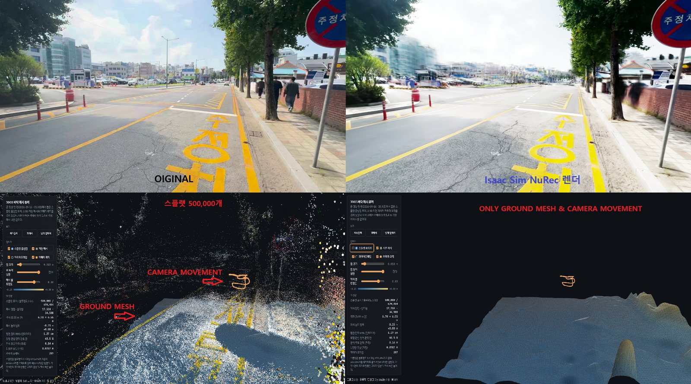
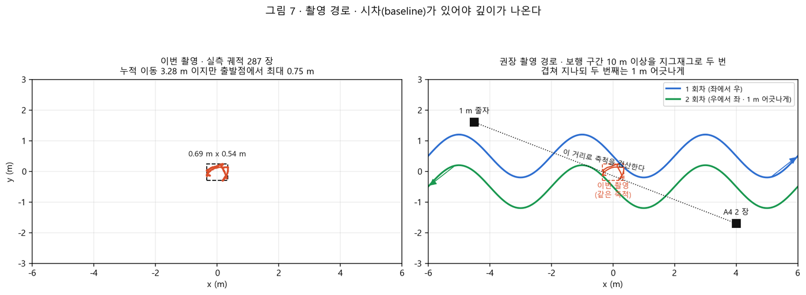
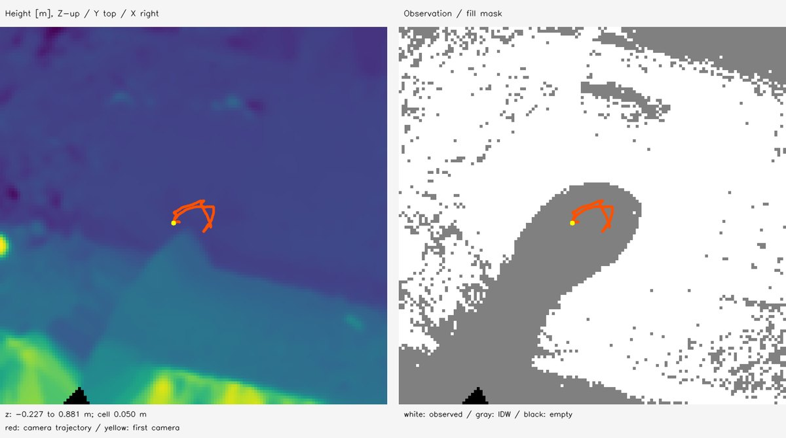

# 실제 장소를 시뮬레이션으로 옮기는 기술 · 가우시안 스플래팅 해설과 Postshot 평가

> 분류: 리서치
> 입구: survey
> 작성: 오흥재 · 2026-09-18 13:40
> 근거: jawset.com 공식 문서와 릴리스노트 13개 버전 전수 · 홈페이지 영상 7편 프레임 추출 · 논문 arXiv 원문 · COLMAP 소스 직접 확인 · 우리 1차 PoC 원자료 재측정
> 요지: 가우시안 스플래팅이 무엇을 담고 어떻게 화면에 찍히는지부터 설명하고, 우리 촬영본으로 무엇이 되고 무엇이 안 되는지를 보인 뒤, 그 위에서 Postshot 이라는 상용 도구를 평가한다. 파는 기능의 거의 전부가 공개 구현에 대응하고, 움직이는 사람은 도구가 아니라 동기 카메라가 가른다
> 상태: 초안
> 판: v2.0
> 이슈: #430

---

## 0. 이 문서를 읽는 법

### 0-1. 무엇을 다루나

**기술 해설이 먼저고 도구 평가가 나중이다.** 순서를 바꾸면 「이 제품은 이런 기능이
있다」는 소개문이 되어 버린다. 우리에게 필요한 것은 **그 기능이 무엇을 하는
물건인지 알고 우리 것으로 고르는 눈**이다.

1절에서 가우시안 스플래팅 자체를 그림으로 설명한다. 2절에서 **우리가 찍은 광주
도로 영상**으로 실제로 무엇이 되고 무엇이 안 되는지 본다. 3절과 4절이 그 「안
되는 것」 둘의 원인이다. 5절에서 왜 트윈이 둘로 갈리는지, 6절부터 Postshot 이다.

### 0-2. 이 문서가 다시 쓰지 않는 것

`inbox/jay/20260916-3dgs-test/DESIGN-real-to-sim.md` (작성 오흥재) 가 이미 답한
것은 가리키기만 한다.

| 물음 | 어디 |
|---|---|
| 트윈을 충돌 지형과 배경으로 왜 쪼개나 | DESIGN 1-2 |
| 1차 PoC 진단 전체 | DESIGN 3 |
| 지면 복원 후보 A부터 E와 측정표 | DESIGN 5-1 · 5-3 |
| 표면 복원 6종의 Windows 미지원과 WSL2 방침 | DESIGN 5-1-1 |
| 재촬영 설계서와 현장 체크리스트 | DESIGN 7 |
| 축척 확정 절차 | DESIGN 6 |

### 0-3. 세 줄

1. **Postshot 은 배경을 만드는 도구다.** 메시를 내보내는 기능이 아예 없어서 충돌
   지형에는 원리적으로 쓸 수 없다
2. **그 도구가 파는 기능의 거의 전부가 Apache-2.0 공개 구현에 대응한다.** 정체를
   모르는 것은 `Splat3` 프로파일 하나뿐이다
3. **움직이는 사람은 어느 쪽을 써도 동기 카메라 없이는 안 된다.** 도구의 한계가
   아니라 삼각측량의 한계다

---

## 1. 가우시안 스플래팅이 무엇인가

### 1-1. 삼각형을 버리고 «흐릿한 타원» 을 쓴다

우리가 아는 3D 모델은 삼각형 메시다. 점을 찍고 삼각형으로 잇고 그 위에 사진을
입힌다. 이 방식은 **면이 분명한 것**에 강하다. 책상, 벽, 기계 부품.

그런데 실제 장면에는 면이 분명하지 않은 것이 훨씬 많다. 나뭇잎, 잔디, 철망,
머리카락, 반투명한 유리. 삼각형으로 옮기려면 어마어마한 수가 필요하고, 그래도
잎사귀 가장자리는 톱니처럼 남는다.

**가우시안 스플래팅은 면을 포기한다.** 대신 **가운데가 진하고 가장자리로 갈수록
흐려지는 타원**을 공간에 수십만 개 띄운다. 그것을 겹쳐 칠해서 장면을 만든다.
잎사귀 한 장을 삼각형으로 재현하는 대신, 잎사귀처럼 보이는 흐릿한 얼룩을 그
자리에 두는 것이다.

### 1-2. 숫자 59개

타원 하나가 들고 있는 것은 위 그림처럼 숫자 **59개**가 전부다.

| 무엇 | 개수 | 뜻 |
|---|---|---|
| 위치 | 3 | 공간 어디에 있나 |
| 크기 | 3 | 세 축으로 각각 얼마나 퍼지나 |
| 회전 | 4 | 어느 쪽으로 누웠나 |
| 불투명도 | 1 | 얼마나 진한가 |
| 색 | 48 | **보는 각도마다 다른 색** |

크기가 축마다 다른 것이 중요하다. 벽이나 바닥 같은 **납작한 면은 얇고 넓은
타원 하나**로 덮을 수 있다. 공 모양만 쓸 수 있었다면 같은 면을 덮는 데 수십 배가
든다.

### 1-3. 색이 48개나 되는 이유 · 「사진 같다」의 정체

색이 하나가 아니라 48개인 것이 이 기술이 사진처럼 보이는 핵심이다.

실제 물체의 밝기는 **보는 각도에 따라 변한다.** 젖은 아스팔트, 광택 나는 바닥,
금속, 유리. 고개를 옮기면 반짝이는 자리가 따라 미끄러진다. 사람 눈은 바로 그것을
보고 「진짜인지 모형인지」를 가른다.

각도마다 다른 색을 적으려면 숫자가 여러 개 필요하고, 그 표현법이 구면조화
함수(SH)다. 채널마다 16개씩 세 채널이니 48개다.

**이것이 없으면 두 가지 중 하나가 일어난다.** 모든 각도의 평균 색으로 칠해져
번들거림이 사라진 플라스틱처럼 보이거나, 각도마다 다른 밝기를 **기하로 설명하려
들어 허공에 떠다니는 얼룩을 만든다.** 뒤쪽이 더 흔하고 더 나쁘다.

### 1-4. 화면에 찍히는 네 단계

그림 1의 오른쪽이 그 과정이다.

1. **납작하게 누른다** · 공간의 3D 타원을 카메라에서 본 2D 타원으로 투영한다
2. **앞뒤로 줄 세운다** · 카메라에 가까운 것부터 정렬한다
3. **겹쳐 칠한다** · 앞에서부터 쌓고, 진한 것이 뒤를 가린다
4. **사진과 견준다** · 틀린 만큼 59개 숫자를 조금씩 고친다

4번을 수만 번 반복하면 타원들이 제자리를 찾아간다. **학습이라고 부르지만 신경망을
쓰지 않는다.** 숫자를 사진에 맞춰 밀어 넣는 것이다.

NeRF 와 갈리는 지점이 여기다. NeRF 는 픽셀 하나를 칠하려고 그 방향 광선 위 수십
곳을 신경망에 물어본다. 스플래팅은 타원을 화면에 바로 뿌린다. 빈 공간에는 비용이
아예 안 든다. 그래서 학습이 수십 시간에서 수십 분으로 줄었다.

### 1-5. ★ 이것이 «표면» 이 아니라는 것

**우리 프로젝트에서 가장 중요한 한 줄이다.**

가우시안은 흐릿한 얼룩이지 면이 아니다. 발을 디딜 수 있는 바닥이 아니고, 광선을
쏘아 높이를 잴 대상도 아니다. **보기에 바닥처럼 보이는 것과 물리적으로 바닥인
것은 다른 물건이다.**

그래서 시뮬레이션에 쓰려면 **충돌 지형을 따로 만들어야 한다.** 이것이 DESIGN 1-2
가 말하는 「트윈이 둘로 갈린다」이고, NVIDIA 공식 파이프라인도 같은 구조다
(5절).

---

## 2. 우리 자료로 보면 이렇다

말로만 하면 안 와닿는다. **우리가 실제로 찍고 돌린 결과**다.

이 한 장에 세 가지가 들어 있다.

**되는 것** · 오른쪽 위를 보면 **발밑 노면과 노란 차선, 보도블록 이음매가 원본과
거의 구분이 안 된다.** 가까운 바닥은 정말 잘 나온다. 우리가 걷게 할 곳이 바로
거기라는 점에서 다행이다.

**안 되는 것 하나** · **원경 건물이 뭉개져 흐른다.** 원본에서 또렷하던 간판과
창문이 물감 번지듯 되어 있다.

**안 되는 것 둘** · **원본 왼쪽에 걸어가던 사람 둘이 사라졌다.** 지워진 것이
아니라 애초에 복원되지 않았다.

그리고 아래 왼쪽의 주황색 고리가 **카메라가 움직인 궤적 전부**다. 장면 크기에
비해 얼마나 작은지 보인다. 아래 오른쪽은 지면 메시만 남긴 것인데 **카메라 주변만
복원되고 나머지는 아예 없다.**

3절과 4절이 이 두 가지 「안 되는 것」의 원인이다. **둘은 원인이 다르다.**

---

## 3. 왜 원경이 뭉개졌나 · 시차

### 3-1. 깊이는 «각» 에서 나온다

한 장의 사진만으로는 거리를 알 수 없다. 작은 것이 가까이 있는지 큰 것이 멀리
있는지 구분할 방법이 없다. 그래서 **두 자리에서 같은 점을 보고, 두 시선이 만나는
각으로 거리를 잰다.** 사람 눈이 둘인 이유와 같다.

각이 좁아지면 두 광선이 거의 나란해진다. 나란한 두 선은 **어디서 만나는지가
불분명하다.** 그림 오른쪽의 길쭉한 얼룩이 그 「불분명함」이다.

관계는 간단하다. **깊이 오차는 각에 반비례하고, 거리와는 무관하다.**

| 두 시점이 이루는 각 | 깊이 오차 |
|---|---|
| 16도 | 0.18 % |
| 1.5도 | 1.9 % |
| 0.5도 | 5.7 % |
| 0.1도 | **29 %** |

### 3-2. 한자리에서 돌리면 «수학적으로» 깊이가 없다

각이 좁아서 부정확해지는 정도가 아니다. **카메라가 제자리에서 회전만 하면 깊이
정보가 원리적으로 0 이다.** 회전만 한 두 장 사이의 대응 관계는 거리와 무관한
변환 하나로 완벽히 설명되기 때문이다.

COLMAP 소스 주석이 이것을 그대로 말한다.

> *"it is checked whether the geometry describes a planar scene or panoramic view
> (pure rotation) ... This is a degenerate case, since epipolar geometry is only
> defined for a moving camera."*

그리고 논문은 **그런 쌍에서는 아예 점을 만들지 않는다**고 적는다. 결과적으로 모든
쌍이 그렇게 분류되면 **유효한 시작 쌍을 영원히 못 찾는다.**

### 3-3. 우리 촬영이 지탱할 수 있었던 거리

1차 촬영의 실측은 이렇다 (DESIGN 3-2 가).

| 잰 것 | 값 |
|---|---|
| 36초 동안 첫 프레임에서 가장 멀리 간 거리 | **0.80 m** |
| 프레임 사이 이동 중앙값 | 8.7 mm |
| 누적 이동거리 | 3.28 m |

**누적 3.28 m 는 8.7 mm 씩 287 번 흔들린 합이다.** 폰은 사실상 한자리에 서서
둘러봤다.

COLMAP 이 첫 쌍에 요구하는 각이 16도이고, 그 각을 만들려면 **피사체 거리의 약
28 %** 만큼 옆으로 움직여야 한다. 0.80 m 를 거꾸로 풀면 **2.85 m** 다. 영상
입력이면 임계가 절반(8도)으로 낮아지므로 **5.72 m** 까지다.

> **어느 쪽이든 그 너머는 도구와 무관하게 복원이 불가능했다.** 상용 프로그램을
> 샀어도 같았다. 이것이 2절에서 원경이 뭉개진 이유다.

### 3-4. 그래서 어떻게 찍어야 하나

현장 규칙 하나로 줄이면 **인접 촬영 시점 사이가 15도에서 30도**다. COLMAP 의 16도
임계를 안전하게 감싼다.

공식 문서가 직접 말하는 것도 같다. **「같은 자리에서 회전만 하지 말고 매 촬영마다
몇 걸음 옮길 것」.** 그 밖에 노출과 조리개와 ISO 를 수동으로 잠그고, 초점도
수동으로 두고, 손으로 들었으면 최소 1/125 초로 찍는다.

알아 둘 것이 하나 더 있다. **COLMAP 은 피사체를 향해 일직선으로 다가가는 촬영도
거부한다**(`init_max_forward_motion`). 전진 방향으로 생기는 시차는 삼각측량에 거의
쓸모가 없기 때문이다. **로봇 주행 경로를 그대로 따라 걸으며 찍으면 정확히 이
함정이다.**

---

## 4. 왜 사람이 사라졌나 · 정적 장면 가정

### 4-1. 원인이 다르다

원경이 뭉개진 것은 **각이 좁아서**다. 사람이 사라진 것은 **대상이 움직여서**다.
고쳐야 할 것이 서로 다르다.

가우시안 스플래팅은 **장면이 움직이지 않는다고 가정하고 만들어졌다.** 여러 사진을
동시에 만족시키는 타원 한 벌을 찾는 방식이라, 사진마다 팔이 다른 자리에 있으면
그 한 벌로는 둘 다 만족시킬 수 없다.

옵티마이저는 이때 세 가지 중 하나를 한다. 반투명한 타원을 여러 겹 쌓아 두 자리에
반쯤 존재시키거나, 타원을 길게 늘여 궤적 전체를 덮거나, **그 각도에서만 보이도록
색에 숨긴다.** 우리 자료에서는 사람이 아예 안 잡히는 쪽으로 나타났다.

Postshot 문서가 이것을 스스로 적어 둔다.

> *"Postshot's models assume the input images depict strictly static scenes."*
> *"The moving shadows create holes in the ground of the radiance field."*

**움직이는 그림자가 지면에 구멍을 낸다**고까지 말한다. 우리가 야외 보도를 찍을 때
정확히 걸릴 자리다.

### 4-2. 왜 카메라 한 대로는 원리적으로 안 되나

정지한 대상은 내가 걸어다니는 동안 그대로 있으므로, 시각이 달라도 **같은 점**에
광선이 모인다. 움직이는 대상은 다르다. **어느 한 순간에 그 점을 보는 광선이
하나뿐**이다.

0.5초 뒤 다른 각도에서 어깨를 다시 봐도 소용없다. 그것은 **다른 시각의 다른
위치의 어깨**다. 삼각측량할 두 광선이 영원히 생기지 않는다.

그리고 광선이 하나뿐이면 **「깊이가 변한 것」과 「물체가 그 광선을 따라 움직인
것」이 구분되지 않는다.** 정보 자체가 없다.

### 4-3. 그래서 리그의 본질은 각도가 아니라 «같은 순간» 이다

여러 대를 쓰는 이유는 각도를 얻으려는 것이 아니라 **동시에 찍으려는** 것이다.
그래서 동기 정확도가 그대로 공간 정확도가 된다.

| 사지 속도 | 1 ms 어긋남 | 60 fps 한 프레임 (16.7 ms) | 30 fps 한 프레임 (33.3 ms) |
|---|---|---|---|
| 1 m/s · 천천히 걷는 손 | 1 mm | 17 mm | 33 mm |
| 3 m/s · 보통 제스처 | 3 mm | 50 mm | **100 mm** |

30 fps 카메라를 소프트웨어로만 맞춰 한 프레임씩 어긋나면, 움직이는 손이 **10 cm
어긋난 두 광선**으로 삼각측량된다. 그 교점은 **어느 프레임에도 존재하지 않는
점**이고, 거기에 허깨비가 생긴다.

### 4-4. 그러면 상용 도구의 「움직이는 사람」 은 무엇인가

Postshot 홈페이지에 **Model Sequence Rendering** 이라는 항목이 있고, 사람이 쿵푸
동작을 하는 장면을 자유롭게 돌려 본다. 4D 복원처럼 보인다.

**아니다.** 릴리스 노트 원문이다.

> *"Import (drag and drop) multiple .PSHT or .PLY files. Each file will correspond
> to one frame."*

**이것이 전부다.** 시간축을 학습하는 표현이 없다. **독립적인 정적 복원을 N개 따로
만들어 놓고 순서대로 재생하는 것**이다. 쇼케이스 영상의 타임라인 길이가 737 이니
**모델 파일이 737개**라는 뜻이다.

그 영상을 만든 곳은 볼류메트릭 캡처 스튜디오이고, **동기화된 6K 머신비전 카메라
어레이**로 초당 3.4 GB 를 디스크에 쏟아붓는다. 홈페이지 헤더 영상에서 움직이는
인물이 나오는 네 장면도 마찬가지로 **동기 카메라 50대에서 240대**를 쓰는 곳들의
작품이다.

> **그 영상들은 「이 프로그램이 움직이는 것을 찍는다」는 증거가 아니라 「한 순간을
> 수십 대가 동시에 찍으면 그 정지된 순간을 복원할 수 있다」는 증거다.**

### 4-5. 재생과 재구동은 다른 물건이다

움직이는 사람을 다루는 방법은 크게 셋이고, 우리에게 중요한 구분은 **결과물로
무엇을 할 수 있느냐**다.

| | 프레임별 독립 | 4D · 변형장 | 파라메트릭 아바타 |
|---|---|---|---|
| 필요한 촬영 | 동기 멀티카메라 | 멀티뷰 권장 | **모노큘러 가능** |
| 가진 입력 | 시각 t | 시각 t | **자세 값** |
| 할 수 있는 것 | **재생** | **재생** | **새 동작으로 구동** |
| 대상 | 아무 장면 | 아무 장면 | 사람만 |

**앞의 둘은 찍은 것을 되감기만 한다.** 아바타 방식만 「한 번도 찍지 않은 동작」을
시킬 수 있다. 시뮬레이션 안에 사람을 세워 로봇과 상호작용시키려면 마지막 것이어야
한다.

주의할 것이 하나 있다. 논문들이 「모노큘러로 된다」고 말하는 데이터 상당수가
사실은 멀티뷰다. 피사체가 제자리에서 한 바퀴 도는 촬영은 **사람 기준으로 보면
턴테이블 스캔**이고, 21대 리그에서 한 대만 뽑아 쓴 것을 모노큘러라 부르기도 한다.
멀티뷰 단서가 진짜로 없으면 품질이 **1에서 2 dB, 복잡한 동작에서는 4에서 5 dB**
떨어진다는 측정이 있다. 4 dB 는 「조금 나쁨」이 아니라 다른 물건이다.

---

## 5. 그래서 트윈이 둘로 갈린다

1-5 에서 말한 대로 가우시안은 표면이 아니다. 그래서 우리 파이프라인은 처음부터
둘로 갈라진다.

| | 무엇 | 필요한 것 |
|---|---|---|
| **충돌 지형** | 발이 닿는 면. 정책의 높이 스캔이 광선을 쏘는 대상 | **형상 정확도.** 1 cm 단차가 보행을 가른다 |
| **배경** | 사람과 카메라에게 보이는 것 | **보이는 품질** |

이것은 우리만의 발상이 아니다. **NVIDIA 공식 스테레오 파이프라인이 정확히 같은
구조**다. 깊이에서 메시를 만드는 경로와 외관을 학습하는 경로가 따로 돌고 하나의
파일에 정렬된 채로 담긴다.

그리고 **공식 문서가 「스마트폰 한 대 경로에는 충돌 메시가 없다」고 인정한다.**
그 경로의 안내는 「로봇이 딛고 설 것이 있도록 바닥 평면을 직접 추가하라」다. 폰
한 대로 지면 형상을 얻을 수 없다는 것을 만든 쪽이 말하고 있다.

우리 1차 PoC 는 이 분리가 실제로 동작함을 보였다. 같은 스플랫을 배경으로 띄우고
충돌은 별도 메시가 맡게 해서 **Windows Isaac Sim 안에서 정책을 걷게 했다**
(`RESULTS-3dgs-terrain.md` 7절).

---

## 6. Postshot 은 어떤 물건인가

이제 맥락 위에서 보면 평가가 쉽다.

### 6-1. 할 수 있는 것

사진이나 영상을 넣으면 카메라 위치를 스스로 풀고 가우시안을 학습해 **PLY 또는 SPZ
파일로 내보낸다.** Unreal Engine 플러그인이 있다. 처리가 전부 로컬에서 돌아
현장 자료를 클라우드에 올리지 않아도 된다.

**미터 단위 정렬 수단이 하나 있다.** 현장에 실측 크기를 아는 마커를 깔고 찍으면
그것으로 씬을 실세계 크기에 맞춘다. 단안 복원이 구조적으로 못 정하는 절대 크기를
넣는 유일한 공식 통로다.

### 6-2. 못 하는 것

| | |
|---|---|
| **메시 출력** | **기능 자체가 없다.** 충돌 지형에 못 쓴다 |
| 움직이는 대상 | 정적 장면 가정. 시퀀스는 재생일 뿐 |
| 플랫폼 | **Windows 전용.** Linux 빌드 없음 |
| Isaac Sim 연동 | 없음. PLY 를 직접 다뤄야 한다 |
| 어안 · 360 | 문서에 언급 자체가 없다 |

### 6-3. 값과 함정

무료판은 **비상업용이고 결과물을 파일로 내보낼 수 없다.** 시뮬레이터로 옮기려면
유료판이 필요하고, **우리가 실제로 쓸 기능 둘(배치 실행과 마커 정렬)은 가장 비싼
등급에 있다.**

조용한 함정도 하나 적어 둔다. 씬을 원점 근처로 옮긴 값이 **파일 메타데이터에만**
저장되고, 공식 문서가 *"software using these exports must reference the world
origin stored in the PLY metadata"* 라고 적는다. **우리 로더가 그 값을 안 읽으면
오류 없이 씬 전체가 어긋난 자리에 놓인다.**

---

## 7. Postshot 없이 되는가

**된다.** 프로파일 이름과 동작 서술로 역산하면 대응이 이렇게 붙는다.

| Postshot 기능 | 공개 대응 | 라이선스 |
|---|---|---|
| Splat MCMC 프로파일 | `gsplat` 의 MCMC 전략 | Apache-2.0 |
| Splat ADC 프로파일 (구형) | 기본 전략 | Apache-2.0 |
| **Splat3 (현재 권장)** | **대응 불명** | 미확인 |
| 노출 · 비네팅 보정 | bilateral grid | Apache-2.0 |
| 앤티에일리어싱 | Mip-Splatting 필터 | Apache-2.0 |
| 최대 스플랫 수 | 상한 지정 옵션 | Apache-2.0 |
| **PLY · SPZ 내보내기** (유료) | `splat-transform` · `spz` | **MIT · 무료** |

**Jawset 은 어떤 논문도 인용하지 않는다.** 그래서 위 대응은 이름과 동작으로 푼
것이고, `Splat3` 만 근거를 못 찾았다.

### 7-1. 그런데 앤티에일리어싱은 옵션이 아니다

이 항목 하나가 「사진 같다」와 「영상 같다」를 가른다.

| Mip-NeRF360 | 학습한 해상도에서 | **8배 물러선 시점에서** |
|---|---|---|
| 기본 3DGS | 29.19 | **19.59** |
| Mip-Splatting | 29.39 | **26.22** |

**학습 해상도에서는 0.2 dB 차이인데 카메라가 물러서면 6.6 dB 차이다.** 논문
표준 성적표는 학습 카메라와 같은 자리에서 재기 때문에 이 차이를 거의 못 잡는다.
**로봇이 장면 안을 자유롭게 돌아다니는 순간 전부 드러난다.**

### 7-2. Windows 에서 무엇을 쓰나

| 스택 | 라이선스 | Windows |
|---|---|---|
| `gsplat` | Apache-2.0 | 네이티브 |
| `Brush` | Apache-2.0 | **사전빌드 실행파일.** CUDA · 컴파일러 · 파이썬 전부 불필요 |
| 원조 3DGS 구현 | **비상업** | 참조용으로만 |
| `3DGRUT` | Apache-2.0 | 공식 지원. 어안 · 롤링셔터 |

`Brush` 에 주의할 점이 하나 있다. **난수 씨앗을 고정해도 결과가 재현되지 않는
미해결 문제**가 있다. 재현성이 필요한 파이프라인에는 실질 위험이다.

**라이선스 연쇄도 미리 봐야 한다.** 원조 3DGS 의 렌더링 커널이 상업 사용을
금지하는데 파생 저장소 대부분이 그것을 그대로 가져다 쓴다. **자기 코드가 MIT 라도
그 커널에서 막힌다.** 대회나 전시를 넘어설 계획이 있으면 `gsplat` 이나 `Brush`
쪽으로 가야 한다.

---

## 8. 우리 프로젝트가 염두에 두는 기술

여기까지의 결론을 우리 계획으로 옮기면 이렇다.

### 8-1. 배경 쪽 · 이미 돌려 봤다

**가우시안 스플래팅을 쓴다.** 1차 PoC 에서 스플랫을 Isaac Sim 이 읽는 형식으로
바꿔 **Windows 에서 렌더까지 확인했다.** 그 변환 경로가 CPU 로만 돌아 무거운 개발
도구 설치가 필요 없었다는 점이 우리에게 크다.

학습은 `gsplat` 또는 `Brush` 로 간다. 켤 것은 셋이다. **MCMC 전략**(점군이
부실해도 살아남는다) · **앤티에일리어싱**(7-1) · **카메라 자세 최적화**. 마지막
것이 의외로 크다. 이동하며 찍은 자료에서 **자세 최적화를 끈 손실이 롤링셔터나
모션블러 보정을 끈 손실보다 컸다.**

### 8-2. 충돌 쪽 · 스플랫에서 뽑지 않는다

**보이는 품질로 접촉 물리의 정확도를 주장하지 않는다.** 지면은 깊이를 모아
만드는 경로로 간다. 후보 비교는 DESIGN 5-1 에 있고, 이 문서가 더할 것은
**「어느 방법이 낫다」고 말해 주는 공개 자료가 우리 용도에는 없다**는 사실이다.
표면 복원 논문들은 전부 실내 물체나 건물 벤치마크로 겨루고, **야외 지면의 절대
높이 정확도를 잰 것이 없다.** 우리가 재야 한다.

### 8-3. 움직이는 사람 · 지금은 안 한다

동기 카메라 리그가 필요하고 우리에겐 없다. **MVP 범위 밖이다.**

다만 나중에 필요해지면 **파라메트릭 아바타 쪽**이다(4-5). 그것만이 새 동작으로
구동할 수 있고 휴대폰 촬영으로도 된다. 시뮬레이션 안에 보행자를 세워 로봇이
피해 가게 하려면 그 길이다.

### 8-4. 촬영 · 여기가 실제 병목이다

**포즈 추정 도구를 바꿔서 얻을 것이 거의 없다.** 우리 규모(수백 장)에서는 지금
쓰는 것이 이미 정확도 포화이고, 더 빠르다는 대안도 실제 배속은 1.6배 수준이다.
**시간을 쓸 곳은 촬영 프로토콜이다.**

---

## 9. 관문 제안 셋

1. **학습 전 등록 수 대조.** 복원이 여러 조각으로 갈리면 도구가 오류 없이 조각을
   여럿 내놓고 **읽는 쪽은 보통 첫 조각만 읽는다.** 실제로 우리 1차 자료가
   3장 · 12장 · 287장 세 조각이다. 우리 세션은 287장짜리를 골라 기록해 두었지만,
   기본 경로를 쓰는 다음 사람은 **3장으로 학습하고도 오류를 못 본다**
2. **인접 시점 15도에서 30도** 를 현장 규칙으로 고정한다 (3-4)
3. **노출 · 화이트밸런스 · 초점 수동 고정.** 못 하면 학습에서 보정을 켠다

---

## 10. 확인하지 못한 것

- `Splat3` 프로파일의 알고리즘. Jawset 이 어떤 논문도 인용하지 않는다
- Postshot 의 어안 · 360 카메라 지원 여부. 문서에 언급 0건
- Postshot 내부 카메라 추정이 공개 도구를 감싼 것인지. 구현 비공개
- 무료판 파일과 유료판의 호환 방향. 가격 페이지 문구가 모호하다
- NVIDIA 공개 데이터셋으로 파이프라인을 세우는 시험. **접근 승인이 선행 조건**이고
  9개 환경 전부에 메시가 있는 것도 아니다
- RTX 5080 16 GB 에서 시뮬레이터와 스플랫 렌더를 함께 돌릴 때의 실제 여유. 미측정

---

## 11. 출처

**논문** · 2308.04079 (3DGS) · 2404.09591 (MCMC) · 2311.16493 (Mip-Splatting) ·
2404.10484 · 2403.15530 · 2406.15643 · 2403.14166 · 2402.00525 · 2412.12507 ·
2407.07090 · 2406.00448 · 2403.13327 · 2403.17888 · 2403.17822 · 2308.09713 ·
2310.08528 · 2312.16812 · 2210.13445 · 2412.04457 · 2407.21686 · 2503.10625 ·
2407.20219 · 2503.11651 · 2409.19152 · 1705.05548

**공식 문서** · jawset.com/docs (User Guide 전체와 릴리스노트 v0.1 ~ v1.1.69) ·
colmap.github.io/tutorial.html · docs.gsplat.studio · nerfbaselines.github.io ·
NVIDIA NuRec 재구성 문서

**저장소** · nerfstudio-project/gsplat · ArthurBrussee/brush · nv-tlabs/3dgrut ·
playcanvas/splat-transform · nianticlabs/spz · colmap/colmap

**우리 원자료** · `inbox/jay/20260916-3dgs-test/_out/colmap/sparse/{0,1,2}` ·
`_out/viewer/` · `figs/fig7_shooting_path.png` · `RESULTS-3dgs-terrain.md` ·
`DESIGN-real-to-sim.md`

---

## 판 이력

| 판 | 날짜 | 무엇 | 근거 |
|---|---|---|---|
| v1.0 | 2026-09-18 | 처음 씀. 조사 결과를 표로 정리 | 공식 문서 · 논문 원문 · 우리 원자료 |
| v2.0 | 2026-09-18 | **다시 씀.** 팀장 지적(「기술 설명이 없다 · 그림을 쓰라」)에 따라 해설 중심으로 재구성하고 그림 3장을 새로 그렸다. 우리 촬영본과 지면 메시 사진을 넣고, 기술 설명을 먼저 둔 뒤 도구 평가를 뒤로 옮겼다. 8절(우리가 염두에 두는 기술)을 신설했다 | 위와 같음 + 새 그림 |
