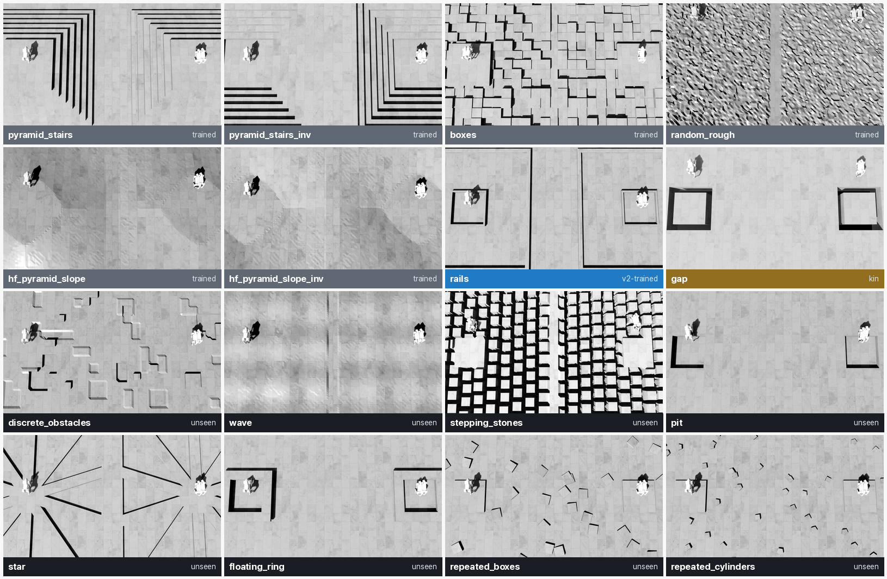
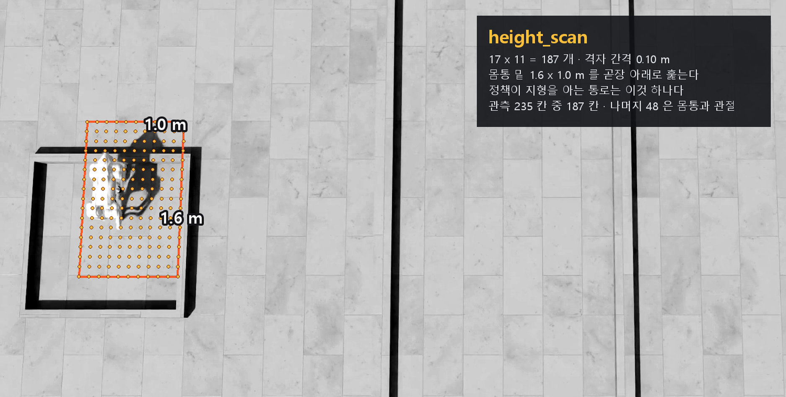

# v2 종합보고서 · 처음 보는 지형에서 무엇을 얻었나

> 분류: 리서치
> 작성: 오흥재 · 2026-09-28 23:30
> 근거: 실측 (`sim/eval/results/20260928-v2-sweep/sweep_long.csv` 1,182 줄 · 지형마다 속도마다 100 에피소드) · 각 판의 학습 시각 저장본 `params/env.yaml` 전수 · Isaac Lab 과 rsl_rl 소스 직접 확인
> 요지: 어느 판도 학습에 넣지 않은 여덟 지형에서 NVIDIA 43.9 % 가 88.5 % 가 됐다. 못 넘는 것은 `stepping_stones` 하나다
> 상태: 확정
> 판: v2.5

---

## 0. 이번에 한 일

`foothold-v2` 로 **`v2g2-feetair01` iter3000** 을 배포한다. 이 문서는 그
판이 무엇을 할 수 있고 무엇을 못 하는지, 그리고 **어떤 물음을 거쳐 거기에
닿았는지**를 적는다.

```
1  학습에 없던 여덟 지형에서  NVIDIA 43.9 %  ->  v2 88.5 %
2  그 중 일곱은 99.7 % 이상이고 stepping_stones 하나만 8.0 % 다
3  정책 수준(보상·명령)의 탐색은 멈출 선에 닿았다. 다음은 관측이다
```

**배포 기준을 다 채운 것은 아니다.** 축 2 아홉 칸 중 여덟이다. 그런데도
이것을 2 차 배포로 내세우는 까닭은 (1) 축 1 이 네 체크포인트 전부에서 진짜
하락 0 이고 (2) 축 2 를 처음으로 재서 **남은 한 칸을 이름으로 적을 수 있게**
되었기 때문이다. 남은 칸은 다음 실험의 목표다.

---

## 1. 먼저 「미경험」이라는 말부터 바로잡는다 `확인됨`

평가 지형 열여섯 종 중 열 종을 우리는 `unseen10` 이라고 불러 왔다. 그런데
**v2 에게는 그 말이 틀리다.** 학습 설정을 열어서 확인했다.

```
params/env.yaml  sub_terrains        (2026-09-28 · 학습 로그에서 직접 읽음)

  NVIDIA 배포본   6종   rough6
  foothold-v1     7종   rough6 + forward_gap
  v2 (v2g2)       8종   rough6 + omni_gap + rails
```

`rails` 는 **평가 목록에 있는 바로 그 지형**이고 v2 가 학습에 넣었다. 함수도
인자도 같다 (`mesh_terrains:rails_terrain` · thickness (0.08, 0.18) ·
height (0.05, 0.18) · platform 1.5). **미경험이 아니다.**

`gap` 은 사정이 다르다. 평가는 `MeshGapTerrainCfg` 이고 v2 학습은
`omni_gap_terrain(mode=ring)` 이다. **함수가 다르다.** 폭 범위만 같다.
그래서 「친척을 봤다」로 따로 센다.

그래서 이 보고서는 숫자를 **네 묶음**으로 나눠 적고, **머리기사는 여덟 종으로**
쓴다.

| 묶음 | 지형 | 뜻 |
|---|---|---|
| **어느 판도 학습 안 한 8종** | `discrete_obstacles` · `floating_ring` · `pit` · `repeated_boxes` · `repeated_cylinders` · `star` · `stepping_stones` · `wave` | **머리기사는 이것으로 쓴다** |
| 친척 학습 1종 | `gap` | v1 은 `forward_gap`, v2 는 `omni_gap` |
| v2 학습 1종 | `rails` | v2 에게는 학습 지형이다 |
| 셋 다 학습 6종 | `rough6` | NVIDIA 가 연습한 지형 |

### 네 묶음이 실제로 어떻게 생겼나



한 칸은 타일 2 x 2 이고 로봇 넷이 크기 자를 겸한다. 배포본
`v2g2-feetair01` iter3000 을 같은 카메라로 태워 찍었다.

**대비를 폈다.** 원본은 밝기가 184 ~ 191 에 몰려 있어 일곱 종이 거의 안
읽혔다 (흩어짐 9.7 ~ 15.4). 재질이 균일한 밝은 회색이고 조명이 부드러워서다.
카메라를 45 도로 기울여도 안 고쳐졌다 (9.7 -> 8.6). 각도가 아니라 조명
문제였다. 그래서 **휘도만** 백분위 0.5 ~ 99.5 로 폈다. 채널마다 펴면 없는
색이 생긴다 (`hf_pyramid_slope_inv` 가 보라색이 됐다).

**펴는 것은 표시 방식이지 없는 요철을 만드는 것이 아니다.** 원본 스틸과
펴기 전후 값은 `sim/eval/results/20260928-terrain-shots/stills/index.json`
에 그대로 있다.

---

## 2. 일반화 성적 · 한 장


난이도 0.5 · 지형마다 속도마다 100 판. **칸은 지형 x 속도 셋**이다
(8종이면 8 x 3 = 24 칸). 곧 아래 값은 **세 속도(0.5 · 1.0 · 1.5 m/s)의
평균**이다.

> **허브 첫 화면 카드와 수가 다른 까닭.** 그 카드는 **1.0 m/s 한 속도**만
> 잰다 (카드에 조건이 적혀 있다). 같은 여덟 종이 거기서는 62 -> 90 이고
> 여기서는 43.9 -> 88.5 다. 둘 다 맞고 **재는 범위가 다르다.**
>
> 속도별로 펴 보면 까닭이 한 줄이다. 여덟 종 난이도 0.5 실측이다.
>
> | 속도 | NVIDIA | **v2** |
> |---|---|---|
> | 0.5 m/s | 60.9 | 87.5 |
> | 1.0 m/s | 62.0 | 90.5 |
> | **1.5 m/s** | **8.8** | 87.4 |
> | 세 속도 평균 | **43.88** | **88.46** |
>
> **NVIDIA 만 1.5 m/s 에서 무너진다** (8.8 %). 그래서 세 속도 평균에서
> 차이가 +44.6 %p 로 벌어지고, 1.0 m/s 만 보면 +28.5 %p 다. 다만 1.5 m/s 는
> NVIDIA 의 학습 명령 범위 밖이므로 그 사실을 같이 읽어야 한다 (3 절).

| 묶음 | 칸 | NVIDIA | foothold-v1 | **v2** |
|---|---|---|---|---|
| 평가 전체 | 48 | 41.17 | 88.88 | **94.19** |
| 셋 다 학습한 6종 | 18 | 50.78 | 99.33 | **100.00** |
| **어느 판도 학습 안 한 8종** | 24 | **43.88** | 86.71 | **88.46** |
| 그 중 7종 (`stepping_stones` 뺀) | 21 | 50.14 | 99.10 | **99.95** |

**읽는 법이 셋이다.**

1. **NVIDIA 대비**는 크다. 여덟 종에서 43.88 -> 88.46, **+44.58 %p** 다
2. **v1 대비**는 작다. 86.71 -> 88.46, **+1.75 %p** 다. 이것은 시드만 바꿔도
   생기는 흔들림 1.25 %p 와 같은 크기다 (8 절)
3. **여덟 종 평균 88 을 끌어내리는 것은 `stepping_stones` 하나다.**
   그것을 빼면 99.95 % 다

---

## 3. 성공률만으로는 안 보이는 것

성공률은 넷의 AND 다. 그 넷을 펴 보면 **NVIDIA 가 왜 41 % 인지**가 달라진다.

| 성분 (d0.5 · 48칸) | NVIDIA | v1 | **v2** | 무엇을 재나 |
|---|---|---|---|---|
| `survival_rate` | **87.3** | 95.0 | **96.6** | 안 넘어졌나 |
| `progress_success_rate` | 66.8 | 92.4 | **95.3** | 앞으로 갔나 |
| `tracking_success_rate` | **44.5** | 90.7 | **95.4** | 명령 속도를 따라갔나 |
| `direction_success_rate` | 63.8 | 90.7 | **95.3** | 진로를 지켰나 |

**NVIDIA 의 41 % 는 「넘어져서」가 아니다.** 넘어지지 않는 비율은 87.3 이다.
**명령 속도를 못 따라간다** (44.5). 험지에서 느려지고, 그러면 통과 판정에
걸린다.

**이것을 안 펴면 「NVIDIA 는 험지에서 자빠진다」고 잘못 읽는다.**

### 속도별

| 판 | 0.5 m/s | 1.0 m/s | 1.5 m/s |
|---|---|---|---|
| NVIDIA | 55.1 | 57.4 | **10.9** |
| foothold-v1 | 90.8 | 90.4 | 85.4 |
| **v2** | 93.7 | 95.2 | **93.6** |

**1.5 m/s 에서 갈린다.** 다만 1.5 m/s 는 NVIDIA 의 학습 명령 범위
`lin_vel_x (-1, 1)` **밖**이다. 그 사실을 같이 적어야 공정하다.

---

## 4. 지형 하나하나


| 꼬리표 | 지형 | NVIDIA | v1 | **v2** | v2 - NVIDIA |
|---|---|---|---|---|---|
| 미경험 | `stepping_stones` | 0.0 | 0.0 | **8.0** | +8.0 |
| 미경험 | `floating_ring` | 0.3 | 93.7 | **99.7** | +99.3 |
| 미경험 | `discrete_obstacles` | 62.7 | 100.0 | **100.0** | +37.3 |
| 미경험 | `pit` | 3.0 | 100.0 | **100.0** | +97.0 |
| 미경험 | `repeated_boxes` | 67.0 | 100.0 | **100.0** | +33.0 |
| 미경험 | `repeated_cylinders` | 68.7 | 100.0 | **100.0** | +31.3 |
| 미경험 | `star` | 82.7 | 100.0 | **100.0** | +17.3 |
| 미경험 | `wave` | 66.7 | 100.0 | **100.0** | +33.3 |
| 친척 학습 | `gap` | 0.3 | 86.0 | **99.7** | +99.3 |
| **v2 학습** | `rails` | 2.7 | 46.3 | **99.7** | +97.0 |
| 셋 다 학습 | `boxes` | 36.7 | 99.7 | **100.0** | +63.3 |
| 셋 다 학습 | `hf_pyramid_slope` | 66.7 | 100.0 | **100.0** | +33.3 |
| 셋 다 학습 | `hf_pyramid_slope_inv` | 74.7 | 100.0 | **100.0** | +25.3 |
| 셋 다 학습 | `pyramid_stairs` | 63.7 | 100.0 | **100.0** | +36.3 |
| 셋 다 학습 | `pyramid_stairs_inv` | 8.0 | 100.0 | **100.0** | +92.0 |
| 셋 다 학습 | `random_rough` | 55.0 | 96.3 | **100.0** | +45.0 |

**`rails` 의 46.3 -> 99.7 은 일반화가 아니라 학습이다.** v1 은 안 배웠고
v2 는 배웠다. 그래서 이 줄을 일반화 근거로 인용하지 않는다.

**`pyramid_stairs_inv` 에서 NVIDIA 가 8.0 인 것**은 그것이 NVIDIA 의 학습
지형인데도 그렇다. 1500 회 배포본의 한계이지 우리 평가의 결함이 아니다
(같은 하네스에서 v1 과 v2 가 100.0 을 낸다).

---

## 5. 난이도를 올리면 어떻게 되나


**어느 판도 학습 안 한 여덟 종**

| 난이도 | NVIDIA | v1 | **v2** | v2 - NVIDIA |
|---|---|---|---|---|
| 0.1 | 53.7 | 86.8 | **93.5** | +39.8 |
| 0.2 | 48.2 | 76.5 | **85.0** | +36.7 |
| 0.3 | 46.4 | 79.6 | **87.0** | +40.7 |
| 0.4 | 43.9 | 83.7 | **88.5** | +44.6 |
| 0.5 | 43.9 | 86.7 | **88.5** | +44.6 |
| 0.6 | 41.5 | 87.3 | **87.5** | +46.0 |
| 0.7 | 39.9 | 87.0 | **87.5** | +47.6 |
| 0.8 | 36.6 | 85.4 | **87.4** | +50.8 |
| 0.9 | 34.4 | 83.6 | **87.2** | **+52.8** |
| 1.0 | 31.9 | 없음 | 없음 | |

**NVIDIA 는 53.7 에서 31.9 로 내려가고 v2 는 93.5 에서 87.2 로 버틴다.**
차이가 +39.8 에서 +52.8 로 **벌어진다.**

**그런데 v1 과의 차이는 반대로 간다.** +6.8 에서 시작해 중간 난이도에서
+0.2 까지 좁아졌다가 +3.6 으로 끝난다. **중간 난이도의 여유는 시드 폭
1.25 %p 안이라 구별되지 않는다** (8 절).

### 여기서 조심할 것

`unseen10` 열 종으로 그리면 v1 과의 차이가 +9.3 에서 +11.7 로 **벌어진다.**
두 묶음이 다른 것은 `rails` 와 `gap` 뿐이고 **그 둘이 v2 가 학습한
지형이다.** 어려워질수록 학습 지형의 우위가 커지는 것은 일반화가 아니다.

그래서 이 보고서는 **여덟 종 쪽을 정본으로** 쓴다.

### 지형마다 난이도를 다르게 탄다

| 지형 | v2 · d0.1 | v2 · d0.9 |
|---|---|---|
| `stepping_stones` | 100.0 | **0.0** |
| `floating_ring` | 48.0 | **100.0** |
| `pit` | 100.0 | 98.0 |
| 나머지 다섯 | 100.0 | 100.0 |

**`floating_ring` 은 어려울수록 «쉬워진다».** 난이도가 고리 치수를 바꾸는
방향 때문으로 보이나 **아직 안 뜯어봤다** `미확인`.

---

## 6. 여기까지 어떻게 왔나 · 문제 파악 · 가설 · 실험 · 검증

여기서부터가 **이 판이 어떻게 나왔는지**다. 숫자만 보면 어느 설정을 왜
건드렸는지 안 보인다.


**G 가 가장 낮고 (82.83) F 가 가장 높다 (89.71).** `heading` 을 아예 끄면
무너지고, 노출을 지형으로 옮긴 쪽이 이겼다. 아래에서 하나씩 본다.

### 6-0. 출발점 · NVIDIA Go2 rough

```
학습 지형 6종   pyramid_stairs · pyramid_stairs_inv · boxes · random_rough
                hf_pyramid_slope · hf_pyramid_slope_inv
명령            lin_vel_x (-1, 1) · lin_vel_y (-1, 1) · ang_vel_z (-1, 1)
학습량          1500 회 · learning_rate 1.0e-3 · 처음부터
신경망          actor · critic 각 [512, 256, 128] · elu · 관측 235 차원
```

### 6-1. A · B → `foothold-v1` · 왜 하필 `gap` 이 첫 타자였나

**문제 파악.** 높이 스캔 한 줄기가 내는 값이 이렇다.

```
평지        -0.10   바닥이 발밑에 있다
턱이 솟음   -0.30   값이 더 음수로
바닥이 꺼짐  +1     광선이 아무것도 못 맞힌다
```

**기존 학습 6종에는 솟은 것만 있고 꺼진 것이 없다.** 그래서 **구멍을 어떻게
처리하는지 코드로 다룬 적이 한 번도 없었다.** 양수 쪽 값을 정책이 학습에서
만난 적이 없다는 뜻이다.

**가설.** 기대 효과가 가장 클 자리가 여기다. 학습 지형에 틈을 넣으면 건넌다.

**실험.** 임석헌이 만든 gap 레시피를 재현한 것이 A 이고, 학습 틈 폭을 평가
기준과 같게 넓힌 것이 B 다. **둘의 차이는 `gap_width_range` 한 줄뿐이다.**

**검증.** B 가 `gap` 86 % 까지 올라 `foothold-v1` 으로 배포됐다.

**그런데 대가를 치렀다.**

| 명령 | NVIDIA | `foothold-v1` |
|---|---|---|
| `lin_vel_x` | (-1, 1) | **(0.5, 1.5)** |
| `lin_vel_y` | (-1, 1) | **(0, 0)** |
| `ang_vel_z` | (-1, 1) | **(0, 0)** |
| `rel_standing_envs` | 0.02 | **0.0** |

**전진 전용이다. 멈출 줄도 돌 줄도 모른다.**

### 6-2. 「전진 성공률만 보고 있다」가 왜 문제인가

**(1) 숫자가 능력보다 커 보인다.** `foothold-v1` 의 `gap` 86 % 는 **항상 틈을
향해 서 있던 조건**에서 나온 값이다. 명령이 전진뿐이라 로봇이 딴 데를 볼 수가
없었다. 그 조건의 주행 성적이지 일반화 능력의 크기가 아니다.

**(2) 못하는 것이 안 보인다.** 능력 열세 가지 중 재고 있던 것이 셋뿐이었다.
못 멈추고 못 도는데 성적표에 그 칸이 없었다.

**(3) 쓸 수가 없다.** 사람 앞에서 못 서는 로봇은 험지를 아무리 잘 건너도
내보낼 수 없다.

### 6-3. D · 명령 능력을 되찾는다

**가설.** 닫았던 명령을 열면 되찾는다.

**실험.** `foothold-v1` 설정에서 **필드 다섯**을 되돌렸다.

```
lin_vel_x         (0.5, 1.5) -> (0.0, 1.5)
ang_vel_z         (0.0, 0.0) -> (-1.0, 1.0)
heading_command   False      -> True
rel_heading_envs  0.0        -> 1.0
rel_standing_envs 0.0        -> 0.02
```

**그리고 축 2 하네스를 새로 만들었다.** 평지에서 명령에만 반응시키는
프로브다. 지형을 섞으면 정지 실패가 명령 탓인지 지형 탓인지 안 갈린다.

여기서 소스를 읽어 한 쌍을 찾았다. **`heading_command` 와 `ang_vel_z` 는 한
쌍이다** (`velocity_command.py:155`).

```python
clip(stiffness × heading_error, ang_vel_z[0], ang_vel_z[1])
```

`ang_vel_z` 가 (0,0) 이면 heading 을 켜도 **회전이 죽는다.**

**검증.** 멈추고 도는 것은 배웠는데 **`gap` 을 잃었다** (86 -> **33.3**).

### 6-4. `gap` 하락의 원인 · 이것은 **문제 파악**이다

**처음 가설** 「학습량이 모자라다」 -> **버렸다.**

**문제 파악.** **노출 구조**다. 명령을 넓히면 로봇이 틈을 향해 서지 않는다.
그러면 커리큘럼이 틈 난이도를 올려 주지 않고, **안 만난 것은 못 배운다.**

`terrain_levels_vel` 이 **직선 거리**로 승급을 정하는데
(`curriculums.py:47-51` · size/2 = 4 m), 로봇이 옆으로 돌면 그 거리가 안 늘어난다.

**학습량 대조도 실제 노출 계측도 아직 안 했다** `미확인`.

### 6-5. E · F · G · 설정 하나가 두 일을 한다

**문제 파악.** `heading` **하나가 두 일**을 한다.

| `heading` 이 하는 일 | 무엇을 정하나 |
|---|---|
| **노출** | 로봇이 틈을 향해 서는가 |
| **방향 유지 압력** | 진로를 얼마나 지키는가 |

범위를 어디에 둬도 둘이 같이 움직인다. **어느 쪽이 효과인지 못 가른다.**

**실험.** 셋을 걸었다.

```
E = D + lin_vel_x 하한 0.4 + rel_heading 0.75
F = D + lin_vel_x 하한 0.4 + 지형을 omni_gap 으로   <- 노출을 지형으로 옮긴다
G = D + lin_vel_x 하한 0.4 + heading 끔             <- 방향 유지 압력만 뗀다
H = F 의 지형 + D 의 명령 (하한 0.0 으로 되돌림)
```

**검증** (난이도 0.5 · 48칸)

| 판 | 48칸 | 미경험 10종 | 학습 6종 | **8종** | **`gap`** |
|---|---|---|---|---|---|
| D | 87.19 | 80.40 | 98.50 | 85.71 | **33.3** |
| E | 88.23 | 82.17 | 98.33 | 86.62 | **99.7** |
| F | **89.71** | **83.93** | 99.33 | 84.25 | 99.0 |
| G | **82.83** | **73.10** | 99.06 | **76.46** | 80.7 |
| H | 86.33 | 79.20 | 98.22 | 85.71 | 73.7 |

1. **E 가 `gap` 을 되찾았다** (33.3 -> 99.7)
2. **F 가 48칸 89.71 로 가장 높다.** 노출을 지형으로 옮긴 쪽이 이겼다
3. **G 가 82.83 으로 가장 낮다.** `heading` 을 아예 끄니 8종이 76.46 으로
   무너졌다. **방향 유지 압력을 다 떼면 안 된다**

**다만 셋 다 D 에서 «두 칸» 씩 바뀌었다.** `lin_vel_x` 하한 0.4 가 공통이라
**단일 원인 귀속이 안 된다** `미확인`.

### 6-6. 왜 `omni_gap` 이었나

**틈을 «사방에» 두면 로봇이 어디를 보든 틈을 만난다.** 명령을 열어 둔 채로도
노출이 유지된다. 명령으로 노출을 만들려다 실패했으니 **지형이 대신 만들게**
한 것이다.

```
forward_gap   +x 에만 있는 한 줄 틈.  로봇이 돌면 안 만난다
omni_gap      스폰을 둘러싼 고리.      어디로 돌든 만난다  (mode: ring · ring_radius 2.5)
```

### 6-7. 축을 둘로 못 박는다

| | 무엇 | 어떻게 |
|---|---|---|
| **축 1** | 험지 주행 | 16 지형 × 3 속도 × 100 판 · d0.5 · 시드 42 · `foothold-v1` 대비 Wilson 95 % |
| **축 2** | 명령 응답 | 평지 · 프로브 아홉 칸 |

**둘의 AND 이고 체크포인트 넷(1500 · 2000 · 2500 · 3000)에서 다** 통과해야
한다.

### 6-8. v2a · 왜 `rails` 를 넣었나

**문제 파악.** `omni_gap` 으로 노출은 풀었는데 학습 지형이 여전히 **평면 위의
요철** 중심이다. **솟은 것을 넘는 동작**이 학습에 없다.

**근거가 된 경험.** A 에서 `gap` 을 0.1 비율로 넣었을 때 얻은 것이 있었다.
**지형 한 종을 0.1 로 더하는 것만으로 그 종류의 능력이 붙는다**는 것이다.

**가설.** 같은 관점으로 `rails` 를 0.1 로 더하면 솟은 것을 넘는 능력이 붙는다.

**실험.** 학습 지형을 8종으로. 명령은 D 의 복원을 유지하되 `lin_vel_x` 하한을
0.4 로 다시 좁혔다. `lin_vel_y` 는 **잠근 채**(0,0) 뒀다.

```
pyramid_stairs 0.15 · pyramid_stairs_inv 0.15 · boxes 0.15 · random_rough 0.15
hf_pyramid_slope 0.10 · hf_pyramid_slope_inv 0.10 · omni_gap 0.10 · rails 0.10
```

**검증**

| | iter 1500 | iter 2000 | iter 2500 | iter 3000 |
|---|---|---|---|---|
| 48칸 평균 | 90.79 | 92.62 | 91.96 | **93.00** |
| 축 1 진짜 하락 | 2 | 1 | 2 | **0** |
| 축 2 회전 낙상 | **0.9219** | 0.1562 | 0.2812 | 0.3438 |

**축 1 은 올랐고 축 2 회전이 무너졌다.** iter1500 에서 64 판 중 59 판이
넘어진다.

**그리고 스스로 한 칸을 깎았다.** `rails` 가 학습과 평가에 둘 다 있으므로
「미경험 험지」 주장에서 뺀다.

### 6-9. v2b · 왜 «속도 하한» 이 아니라 `rel_standing_envs` 였나

**문제 파악.** 회전 낙상. 그리고 v2a 는 `lin_vel_x` 하한이 0.4 라 **「멈춤」을
명령으로 배울 기회가 거의 없다.**

**왜 속도 하한을 0 으로 안 내렸나.** 원문을 열어서 확인했다
(`velocity_command.py:141,162-163`).

```python
self.is_standing_env[env_ids] = r.uniform_(0.0, 1.0) <= self.cfg.rel_standing_envs
standing_env_ids = self.is_standing_env.nonzero(as_tuple=False).flatten()
self.vel_command_b[standing_env_ids, :] = 0.0
```

**`rel_standing_envs` 는 환경의 «일부» 를 골라 명령을 통째로 0 으로 만든다.**
안 고른 환경은 `lin_vel_x` 에서 뽑은 속도를 그대로 받는다.

```
속도 하한을 0 으로      모든 환경이 느려질 수 있다 -> 직선 거리가 안 늘어난다
                       -> 커리큘럼이 안 올린다 -> 6-4 의 노출 붕괴가 다시 온다
rel_standing_envs 올림  일부만 완전 정지 · 나머지는 0.4 ~ 1.5 m/s 로 그대로 간다
```

**정지를 배우는 자리와 험지를 배우는 자리를 나눈 것이다.**

**실험.** **한 칸만** 바꿨다. `rel_standing_envs` 0.02 -> **0.1**.

**검증**

| | iter 1500 | iter 2000 | iter 2500 | iter 3000 |
|---|---|---|---|---|
| 48칸 평균 | 93.08 | 93.31 | **93.60** | 93.44 |
| 축 1 진짜 하락 | **0** | **0** | **0** | **0** |
| 축 2 회전 낙상 | **0.0625** | **0** | 0.2969 | **0.0469** |

**한 칸이 두 축을 같이 올렸다.** 회전 낙상 0.9219 -> 0.0625.

### 6-10. v2b 의 자식들 · `feet_air_time` 을 왜 건드렸나

**문제 파악.** 우리 기획서가 이미 적어 둔 것이다.

> 현재 정책은 관절이 **63.7 cm 까지 발을 들 수 있는데 3.25 cm 만 든다.**
> `feet_air_time` 이 **높이가 아니라 시간**을 점수로 주고, 발 높이 항이 없다.
> **여기가 실패 5종의 공통 뿌리다**

그리고 `rails` 는 **평지 위로 솟은 사각 테두리 두 겹**이다. 넘으려면 **발을
들어야** 한다.

**가설.** 발 드는 행동에 보상을 **조금** 주면 넘는다.

**실험.** `feet_air_time` 이 발 관련 보상항의 전부다. 한 칸만 바꿔 둘을 걸었다.

```
기준 (v2a · v2b · v2n · v2s)   0.01
v2g                            1.0     (100 배)
v2g2                           0.1     ( 10 배)
```

**검증** (네 체크포인트 · 48칸 평균)

| 판 | 바꾼 한 칸 | iter 1500 | iter 2000 | iter 2500 | **iter 3000** |
|---|---|---|---|---|---|
| `v2b-r` | 없음 (기준 재현) | 92.06 | 93.08 | 93.12 | 92.79 |
| `v2n-noise02` | height scan 잡음 ±0.10 -> ±0.02 | 91.88 | 92.90 | 93.06 | 93.44 |
| `v2s-stones10` | `stepping_stones` 10 % 추가 | 92.77 | 91.92 | 93.38 | 91.79 |
| `v2g-feetair1` | `feet_air_time` **1.0** | 91.29 | 92.71 | 93.23 | 93.08 |
| **`v2g2-feetair01`** | **`feet_air_time` 0.1** | **92.94** | **93.56** | 93.19 | **94.19** |
| `v2sg` | 위 둘 결합 | 91.25 | 90.25 | 92.27 | 91.69 |

**0.1 이 최고이고 1.0 은 오히려 낮다. 「조금」이 맞았다.**

그리고 `stepping_stones` 를 학습에 넣은 `v2s` 가 오히려 91.79 로 낮다.
**그 지형을 학습에 넣는 것이 답이 아니었다.**

### 6-11. 시드 재현 · v2g3 · v2g4

같은 레시피를 시드만 바꿔 둘 더 걸었다.

| 판 | 시드 | iter 1500 | iter 2000 | iter 2500 | **iter 3000** |
|---|---|---|---|---|---|
| `v2g2-feetair01` | 42 | 92.94 | 93.56 | 93.19 | **94.19** |
| `v2g3-feetair01-s43` | 43 | 91.83 | 92.83 | 93.27 | 92.94 |
| `v2g4-feetair01-s44` | 44 | 92.48 | 93.08 | 93.44 | 93.52 |

**이 셋의 폭이 멈출 기준의 바닥선이 된다** (8 절).

---

<details>
<summary><b>학습이 터진 기록</b> (보여주기용 아님 · 실험 기록용)</summary>


```
RuntimeError: normal expects all elements of std >= 0.0
```

**시드를 바꾸면 터지고 같은 설정이 다른 시드에서 완주했다.**

```
실패 로그 9 건 · 서로 다른 실행 이름 8 개
```

둘을 같이 적는 까닭 · `v2b-s3instr` 이 두 번 걸려 **두 번 다 같은 1670 에서**
죽었다. 재실행도 실제 실패 1 건이다. **이 수는 독립 설정의 수가 아니다.**

**내가 세운 가설** 「표준편차 매개화가 원인이다. `log` 로 바꾸면 음수가 안
나온다.」 -> **`scalar` 대 `log` 2 × 2 를 걸었다.**

**가설이 틀렸다.** `log` 도 터졌다 (`v2LG-log-feet01-s44` · 마지막 완료 출력
번호 2923 · 같은 문구).

체크포인트 2800 · 2850 · 2875 · 2900 을 다 열어 텐서 68 개를 봤는데 비유한수가
**하나도 없었다.** **최초로 비유한수가 생긴 갱신 번호는 미확인이다.**

수학에서 `exp()` 는 양수지만 float 연산에서는 underflow · overflow · NaN 이
다 가능하고, torch 의 `std.min() >= 0` 검사는 **NaN 에서도 실패한다.**

| 매개화 | 일어났을 수 있는 것 |
|---|---|
| `scalar` | std 가 음수가 됐을 수 있다 |
| `log` | `log_std` 가 NaN 이 됐을 수 있다 |

**두 칸 다 개별 원인 미확인이다.**

**라이브러리에 관문이 없다** `확인됨`. `rsl_rl/modules/actor_critic.py` 전체에서
`clamp` · `clip` · `isnan` · `isfinite` 를 찾았다. **하나도 없다.**

gradient 자르기는 있는데 **NaN 을 막지 않는다. 퍼뜨린다.**

```
넣은 gradient               [1.0, 2.0, NaN, 3.0]
clip_grad_norm_(..., 1.0)
나온 gradient               [NaN, NaN, NaN, NaN]
```

전체 norm 이 NaN 이면 곱하는 계수가 NaN 이라 **전부** NaN 이 된다.

**그리고 팀장이 잡은 것.** 16 판은 요인 설계가 아니고 교란이 섞여 있다. 시드
43 안에서는 `feet_air_time` 0.01 넷이 다 죽고 0.1 하나가 살았고, 시드 44
안에서는 `scalar` 0.01 둘이 죽고 `log` 0.01 이 살았다. **표본이 작고 조건이
통제되지 않아 어느 쪽으로도 말할 수 없다.**

그런데 **모든 판에 똑같이 있던 것**이 하나 있었다. **`resume`** 이다.

팀장이 여러 번 「터지는 게 뭔가 이상하다」고 말했다. 나는 그것을 **「어느
설정이 터뜨리나」** 로 옮겨 읽었다. 실험하는 사람이 보는 자리다.
**변하지 않는 변수는 그 방법으로 안 보인다.**

</details>

---

## 7. 레시피 · v2 가 무엇으로 학습했나

배포본 `v2g2-feetair01` 의 학습 시각 저장본 `params/env.yaml` 과
`params/agent.yaml` 에서 읽었다.

### 시작점 · 맨바닥에서 배운 것이 아니다 `확인됨`

```
params/agent.yaml   (2026-09-28 · 학습 로그에서 직접 읽음)

  resume: true
  load_run: nvidia_pretrained_source
  load_checkpoint: nvidia_pretrained.pt
```

**v2 는 NVIDIA 가중치에서 «이어» 3000 회를 돈 판이다.** 그래서 이 보고서의
「NVIDIA 대비」는 서로 다른 두 학습의 비교가 아니라 **같은 가중치에서
3000 회를 더 돌린 것과 안 돌린 것의 비교**다.

`model_0.pt` 를 「NVIDIA 원본」이라고 부르지는 않는다. actor 가중치를 직접
맞춰 봤더니 원본과 다르다 (`a32b4ad7..` 대 `df93a7e1..`). 첫 갱신 «뒤»
저장본이다. 원본 자체는 `nvidia_pretrained.pt` 하나뿐이고, 축 1 · 축 2 의
`NVIDIA` 열이 그것이다.

### 학습 지형 여덟 종

```
pyramid_stairs        0.15      hf_pyramid_slope      0.10
pyramid_stairs_inv    0.15      hf_pyramid_slope_inv  0.10
boxes                 0.15      omni_gap              0.10
random_rough          0.15      rails                 0.10
```

### 명령

| 설정 | 값 | 뜻 |
|---|---|---|
| `lin_vel_x` | (0.4, 1.5) | 앞으로 가는 속도 명령의 범위 |
| `lin_vel_y` | (0, 0) | 옆으로 가는 명령. **잠가 뒀다** |
| `ang_vel_z` | (-1.0, 1.0) | 제자리에서 도는 속도 명령 |
| `heading_command` | true | 바라볼 방향을 주고 요를 자동으로 맞춘다 |
| `rel_heading_envs` | 1.0 | 그 방식을 쓰는 환경의 비율 |
| `rel_standing_envs` | **0.1** | **명령을 통째로 0 으로 두는 환경의 비율** |
| `heading_control_stiffness` | 0.5 | 방향 오차를 요 명령으로 바꾸는 계수 |

### 커리큘럼과 규모

| 설정 | 값 | 뜻 |
|---|---|---|
| `max_init_terrain_level` | **2** | 학습 시작 때 열어 두는 난이도 층. 0 이면 전부 가장 쉬운 줄에서 시작한다 |
| `num_envs` | 4096 | 동시에 돌리는 환경 수 |
| `max_iterations` | 3000 | 학습 횟수 |
| 커리큘럼 규칙 | `terrain_levels_vel` | **직선 거리** > size/2 = 4 m 면 올리고, `\|cmd_xy\| × 길이 × 0.5` 보다 짧으면 내린다 |

### 보상항 · 무엇을 잘하라고 가르쳤나

`feet_air_time` 만 기준에서 바꿨다 (0.01 -> **0.1**). 나머지는 NVIDIA 기본값
그대로다. **발 관련 보상항은 이것 하나뿐이고, 높이가 아니라 «떠 있던 시간» 을
점수로 준다.**

---

## 8. 어디서 멈췄나 · 멈출 기준

규칙은 두 줄이다.

```
규칙 1   한 칸 바꿔 얻은 것 <= 시드만 바꿔 생기는 흔들림
         -> 정책 탐색을 멈춘다. 더 흔들면 잡음을 재는 것이다

규칙 2   시드 흔들림이 판정 폭만큼 크다
         -> 튜닝 말고 «자» 를 고친다. 표본을 늘리거나 값과 구간을 같이 적는다
```

**둘은 다른 상황이다.** 규칙 1 은 「정책이 천장에 닿았다」이고 규칙 2 는
「자가 무뎌서 천장이 어디인지 못 본다」이다.

### 바닥선을 어떻게 얻나

**같은 레시피를 시드만 바꿔 최소 셋 돌리고 그 지표의 폭을 잰다.** 그 폭이
그 뒤 모든 비교의 바닥선이다. 그보다 작은 차이는 차이가 아니다.

| 지표 | 시드 폭 | 어떻게 얻었나 |
|---|---|---|
| 축 1 · 48 칸 평균 | **1.25 %p** | 시드 42 · 43 · 44 = 94.19 · 92.94 · 93.52 |
| 축 2 · 아홉 칸 | **4 칸 / 9** | 같은 세 시드 = 8/9 · 4/9 · 7/9 |

### 실제로 어디서 멈췄어야 했나

`v2b` 에서 한 칸씩 바꾼 자식 여섯의 폭은 **2.50 %p** 이고 최고 자식이
기준보다 **+1.40 %p** 였다.

**+1.40 과 1.25 가 거의 같다. 규칙 1 에 걸린다.**

| 구간 | 얻은 것 | 시드 폭 | 판정 |
|---|---|---|---|
| `v2a` -> `v2b` | 축 1 하락 `2·1·2·0` -> `0·0·0·0` | 1.25 %p | **잡음보다 큼. 계속할 이유가 있었다** |
| `v2b` -> `v2g2` | 48 칸 93.44 -> 94.19 (+0.75) | 1.25 %p | **잡음 안. 멈출 자리였다** |

**`v2b` 에서 멈췄어야 했고 자식 다섯 판과 시드 두 판이 초과였다.**

그리고 규칙을 그대로 적용하면 이렇게 된다.

> **`v2g2` 가 `v2b` 보다 낫다고 말할 수 없다.** 48 칸 평균이 94.19 대 93.44 로
> `v2g2` 가 높지만 시드 폭 1.25 %p 안에 들어간다.

**그러면 왜 `v2g2` 를 골랐나.** 성적이 나아서가 아니라 **가장 두껍게 잰
판**이기 때문이다. 기준선은 잘하는 판이 아니라 잘 잰 판이어야 한다.

### 축 2 는 왜 사정이 다른가

축 2 는 **규칙 2** 에 해당한다. 아홉 칸이 전부 문턱을 넘었나 못 넘었나 둘 중
하나인데, 정책들이 하필 문턱 위아래에 몰려 있다.

```
v2g2 의 wz +1.00    0.3994      문턱 0.40
                    0.0006 차이로 한 칸이 통째로 미달이 된다
```

**표본을 늘려도 참값이 문턱 위에 앉아 있으면 안 갈린다.** 64 env 에서
1024 env 로 올려 실제로 확인했더니 **미달 칸이 `회전 낙상` 에서 `wz +1.00` 으로
옮겼을 뿐 개수는 8/9 그대로**였다.

**그래서 축 2 에서 할 일은 정책을 흔드는 것이 아니라 자를 고치는 것이다.**

| 무엇 | 기준이 바뀌나 | 다시 재야 하나 | 비용 |
|---|---|---|---|
| 값과 구간(Wilson)을 같이 **적는다** | 아니오 | **아니오** | **0** |
| 표본을 64 -> 1024 로 | 아니오 | 예 | 칸당 약 2.5 분 |
| 문턱 값 자체를 바꾼다 | **예** | 아니오 | 절차 필요 · **결과를 본 뒤에는 하지 않는다** |

---

## 9. 축 2 · 아홉 칸이 무엇인가

평지에서 명령에만 반응시키는 프로브다. 지형을 섞으면 정지 실패가 명령
탓인지 지형 탓인지 안 갈린다.

| # | 시나리오 | 지표 | 문턱 | 무엇을 묻나 |
|---|---|---|---|---|
| 1 | `stop` | `fell_ratio` | <= 0.03 | 4 초 전진 뒤 명령 0 을 주면 넘어지지 않고 서나 |
| 2 | `hold` | `fell_ratio` | <= 0.03 | 20 초 내내 명령 0 이어도 안 넘어지나 |
| 3 | `hold` | `residual_speed_mps` | <= 0.005 | 선 뒤에 미끄러지지 않나 |
| 4 | `hold` | `joint_target_delta_tail` | <= 0.01 | 선 뒤에 관절이 떨지 않나 |
| 5 | `turn` | `fell_ratio` | <= 0.10 | 제자리 회전에서 안 넘어지나 |
| 6~9 | `turn` | `yaw_follow_ratio` (-1.0 · -0.5 · +0.5 · +1.0) | >= 0.40 | 요 명령 네 크기를 각각 따라 도나 |

**아홉 칸이 된 까닭도 코드에 적혀 있다** (`verdict_manifest.py:89-102`).
2026-09-23 에 8 에서 9 로 올렸다.

> **NVIDIA 원본이 9/9 다.** 거기서 출발했는데 8/9 를 통과로 부르면 출발점보다
> 나쁜 것을 배포하면서 성공이라 하는 셈이다.

그때 `D` 판정이 뒤집혔다 (옛 기준 통과 -> 새 기준 미달).

**`ramp` 는 재지만 판정하지 않는다.** `AXIS2_THRESHOLDS` 에 키가 없다.

### 9-2. 확장 축 · 판정에 안 쓰고 «기록만» 한다

아홉 칸 말고도 하네스가 들고 있는 시나리오가 더 있다. **판정에 넣지 않는다.**
문턱을 결과를 본 뒤에 정하면 그것은 자가 아니다. 대신 **자료를 쌓는다.**

| 시나리오 | 무엇을 묻나 | 하네스 | 돌린 판 |
|---|---|---|---|
| `slow010` ~ `slow040` | 아주 느린 명령(0.10 ~ 0.40 m/s)을 따라가나 | 있음 | 19 |
| `turn_rest` | 멈춘 채로 도는가 | 있음 | 2 |
| `turn_rev` | 반대로 도는가 | 있음 | 2 |
| `push_robot` | 외란을 견디나 | 있음 | 0 |
| 험지 회전 · 횡보 · 장거리 | | **없음** | 0 |

**저속 명령 · 잔류 속도 (m/s · 64 env · 낮을수록 좋다)**

| 판 | `slow010` | `slow020` | `slow030` | `slow040` |
|---|---|---|---|---|
| NVIDIA | **0.006** | **0.075** | **0.226** | **0.350** |
| `foothold-v1` | 0.205 | 0.206 | 0.285 | 0.372 |
| D | 0.076 | 0.173 | 0.279 | 0.379 |
| v2a @3000 | 0.126 | 0.209 | 0.279 | 0.371 |
| v2b @3000 | 0.136 | 0.234 | 0.303 | 0.394 |
| **`v2g2` @3000 (배포본)** | 0.199 | 0.280 | 0.314 | 0.377 |

**NVIDIA 가 저속에서 가장 낫다.** 우리는 `lin_vel_x` 하한을 0.4 로 좁혀 놓았고
**0.4 아래를 명령으로 배울 기회가 거의 없다.** 이 표가 그 대가를 보여 준다.

`slow010` 낙상은 `foothold-v1` 이 **0.359** 로 가장 나쁘다 (64 판 중 23 판).
전진 전용 레시피가 아주 느린 명령에서 무너지는 자리다.

**배포본 `v2g2` 를 같은 조건으로 쟀다** (2026-09-28). `v2b` 와 한 글자도
다르지 않다 · env 64 · 시드 42 · `pushes_enabled` False · 지형 plane (무한 평면). 그래서 같은
표에 올릴 수 있다.

`v2g2` 는 저속 잔류에서 `v2b` 보다 더 나쁘다 (`slow010` 0.136 -> 0.199).
**저속은 v2 계열이 계속 지고 있는 자리다.** `lin_vel_x` 하한 0.4 를 그대로
두고 3000 회를 더 돈 것이 이 칸을 고쳐 주지 않았다.

**낙상 (64 env · 낮을수록 좋다)**

| 판 | `slow010` | `turn_rest` | `turn_rev` |
|---|---|---|---|
| NVIDIA | 0.0000 | 안 쟀다 | 안 쟀다 |
| `foothold-v1` | 0.3594 | 안 쟀다 | 안 쟀다 |
| D | 0.0000 | 0.0312 | 0.0156 |
| **`v2g2` @3000 (배포본)** | 0.0312 | **0.0781** | **0.1562** |

**`turn_rev` 0.1562 은 64 판 중 열 판이다.** D 의 0.0156(한 판)보다 열 배
나쁘다. 반대로 도는 명령에서 무너지는 자리가 남아 있다. **판정 아홉 칸에는
`turn_rev` 가 없다.** 그래서 이 하락은 성적표에 안 나온다.

`push_robot` 은 안 넣었다. 견줄 판이 하나도 없어서 혼자 재면 읽을 수가 없다.

---

## 10. 배포본과 참고 비교군

**배포는 `v2g2` iter3000. 강력한 참고 비교군은 `v2b-r` iter2500.**

| | `v2b-r` @2500 | `v2g2` @3000 | 시드 폭 |
|---|---|---|---|
| 48 칸 평균 (d0.5) | 93.12 | **94.19** | 1.25 %p |
| 미경험 10종 | 89.10 | **90.70** | |
| 셋 다 학습 6종 | 99.83 | **100.00** | |
| 축 1 진짜 하락 (그 점) | 0 | 0 | |
| 축 1 진짜 상승 (그 점) | 5 | **8** | |
| **축 1 네 점 하락** | **2 · 0 · 0 · 0** | **0 · 0 · 0 · 0** | |
| 축 2 (1024 env) | **9 / 9** | 8 / 9 | 4 칸 |
| `stepping_stones` 1.0 m/s | 0 % | **24 %** | |
| 시드 재현 | **없음** | 있음 (43 · 44) | |

**두 판은 성적으로 구별되지 않는다.** 48 칸 차이 1.07 %p 는 시드 폭 안이고,
축 2 의 한 칸 차이도 시드 폭 네 칸 안이다.

**`v2g2` 를 고른 근거는 「더 잘한다」가 아니다.** 축 1 네 점에서 `v2b-r` 은
iter1500 에 하락 2 가 있고 `v2g2` 는 넷 다 0 이다. 체크포인트를 골라야 하는
부담이 `v2g2` 쪽이 작다. 그리고 `v2g2` 만 다른 시드로 재현을 재 봤다.

`v2b-r` 의 9/9 는 네 점 중 한 점이고 회전 낙상이
0.344 -> 0.109 -> **0.031** -> 0.3125 로 한 점만 내려앉는다. **봉우리다.**

---

## 11. 다음 단계


### 지금 정책이 보는 것



그림은 **실제 촬영 위에 실척으로 그린 것**이다. 카메라를 trace 에서 그대로
세워 점마다 투영했고 (`target` 이 화면 정중앙으로 떨어지는 것으로 검산했다),
격자 규격은 `params/env.yaml` 의 `height_scanner` 에서 읽었다.

**187 이라는 수를 체크포인트로 반증했다.** `actor.0.weight` 가 (512, 235) 이고
몸통·관절이 3+3+3+3+12+12+12 = 48 이므로 235 - 48 = 187 이다 `확인됨`.

`params/env.yaml` 의 `observations.policy` 여덟 항목이다.

| 항목 | 무엇인가 |
|---|---|
| `base_lin_vel` | 몸통이 지금 나아가는 속도 (앞뒤 · 좌우 · 위아래) |
| `base_ang_vel` | 몸통이 지금 도는 속도 (구르기 · 끄덕임 · 요) |
| `projected_gravity` | 중력이 몸통 기준으로 어느 쪽인가. 기울기를 아는 자리 |
| `velocity_commands` | 지금 받은 명령 (앞으로 얼마 · 옆으로 얼마 · 얼마나 돌라) |
| `joint_pos` | 관절 열둘이 지금 어디에 있나 (기준 자세에서의 차이) |
| `joint_vel` | 관절 열둘이 지금 얼마나 빨리 움직이나 |
| `actions` | 바로 앞 걸음에 내보낸 관절 목표각 |
| **`height_scan`** | **발밑 격자에 광선을 쏘아 잰 바닥 높이. 지형 정보는 이것 하나뿐이다** |

**앞 일곱은 몸통과 관절의 상태다.** 지형을 아는 통로는 `height_scan` 하나다.

### 신경망을 바꾸면 이 일이 버려지나

**버려지는 것은 가중치 파일 하나다.** 관측 차원과 뜻이 바뀌면 resume 이 안
되므로 체크포인트는 못 쓴다. 그 외는 남는다.

| 남는 것 | 왜 |
|---|---|
| 평가 하네스 | 정책을 지형에 올리고 행동만 잰다. 관측이 무엇이든 상관없다 |
| 기준선 숫자 | 새 구조가 넘어야 할 선. 없으면 「더 낫다」를 반증할 수 없다 |
| 환경의 함정 | 커리큘럼 붕괴 · `ang_vel_z` 와 `heading` 의 한 쌍 · 노출 구조 |
| 명령·보상 설정 | 새 구조도 명령을 받고 보상으로 배운다. 출발 설정이 된다 |
| 멈출 기준 | 시드 폭보다 작은 차이는 차이가 아니다 |

**진짜로 버려지는 것은 「정책 수준에서 마지막 몇 %p 를 더 짜내는 시간」이다.**
그래서 신경망 교체가 예정돼 있으면 **규칙 1 에 닿는 순간 멈추는 것**이 맞다.

### 다음에 주목할 것 여섯

| | 무엇 | 왜 |
|---|---|---|
| **가** | **관측을 어떻게 다룰 것인가** | 지형 통로가 `height_scan` 하나다. 격자 그대로 넣을까 · 요약해 넣을까 · 기억을 둘까 · 가려진 곳의 값을 무엇으로 둘까 |
| **나** | **축 2 확장 축을 v2 부터 쌓는다** | 저속 넷 · `turn_rest` · `turn_rev` 는 **배포본까지 쟀다** (9-2). 남은 것은 험지 회전 · 횡보 · 장거리 · `push_robot` 이고 **하네스가 없다.** `turn_rev` 가 0.1562 로 나빠진 것부터 본다. **평가 지표로는 안 쓰고 자료와 영상으로 남긴다.** 같이 고칠 것 하나 더 · **축 2 하네스가 trace 를 안 내서 그 컷 아홉에 HUD 를 못 붙인다** (13 절) |
| **다** | **축 2 의 자를 고친다** | 값과 Wilson 구간을 같이 적는다 (비용 0). 표본을 1024 로 올린다 |
| **라** | **resume 실험을 재개한다** | 터진 판 열여섯에 공통으로 있던 것이 `resume` 이다. `fs1` · `fs2` 를 v2 정리 뒤에 다시 본다 |
| **마** | **난이도 구멍을 메운다** | 0.8 이 아무 판에도 없었다. 이번에 v1 · v2 열두 칸을 새로 쟀다 |
| **바** | **최종 배포본 확정 뒤 학습 전체 영상** | 정속 20 초 두 번으로 「이렇게 학습된다」를 보이고, 빨리감기로 학습이 되어 가는 과정을 40 ~ 50 초에 담는다 |

**`stepping_stones` 가 「가」의 시험지다.** 정책 수준에서 여덟 종 중 일곱을
풀었는데 이것 하나가 8.0 % 로 남았다. 발 디딜 곳이 띄엄띄엄한 지형이라
「발밑 한 점의 높이」로는 부족한 것이 아닌가를 검증할 자리다.
**아직 그 가설을 시험하지 않았다** `미측정`.

---

## 12. 재현

```
평가 (축 1 · 한 칸)
  python sim/eval/eval_generalization.py \
      --checkpoint <정책.pt> --terrain_set unseen10 --terrains all \
      --difficulty 0.5 --episodes 100 --envs_per_terrain 10 \
      --command_vx 1.0 --eval_duration 6.0 \
      --min_progress_m 3.0 --max_lateral_drift 0.75 \
      --seed 42 --headless --output_dir <결과폴더>

판정 (축 2 · 네 점)
  python sim/eval/axis2_fourpoint.py --root <축2결과> --policies v2g2-feetair01

표 다시 굽기
  python _out/loop/v2_sweep.py --out sim/eval/results/20260928-v2-sweep

도식 다시 굽기
  python tools/make_v2_figs.py --write
  python tools/svg_selfcontained.py --dir docs/assets/visual --write
  python tools/svg_theme.py --write
```

**도식의 숫자는 손으로 적은 것이 하나도 없다.** 넉 장 전부 `sweep_long.csv` 를
읽어서 그린다. 표가 바뀌면 그림도 같이 바뀐다.

---

## 13. 근거 영상 전체

**영상마다 «무엇을 보여 주려고 찍었는지» 를 적는다.** 실험 하나를 그냥
랜더한 것이 아니다.

> **HUD 가 붙은 컷과 안 붙은 컷이 있다** `확인됨`. 21 편을 전수로 재서 적는다.
>
> | HUD | 컷 |
> |---|---|
> | 있음 (8) | 계보 `gap` 셋 · 판정 밖 하락 둘 · `stepping_stones` · 한 섹션 확대 · 학습 진행 |
> | **없음 (13)** | **축 2 아홉** · 회전 낙상 둘 · 대군 둘 |
>
> 까닭은 하네스가 다르기 때문이다. HUD 는 `overlay/render.py` 가 «trace»
> (`foothold-trace/2`) 를 읽어 그린다. 그 trace 는 축 1 녹화기
> (`record_terrain_demo.py --trace_csv`) 가 낸다. **축 2 는 다른 하네스**
> (`eval_command_response.py`) 로 도는데 그것은 trace 를 안 낸다 (`per_env.json`
> 과 시계열 parquet 만 남긴다). 그래서 지금 있는 컷에 HUD 를 «나중에» 붙일
> 수가 없다. 붙이려면 축 2 를 영상과 trace 를 함께 내도록 고쳐 다시 돌려야
> 한다. **다음 단계로 적어 둔다** (11 절 (나)).
>
> 갤러리 48 컷은 전부 HUD 가 붙어 있다 (48/48 전수 확인).

### 축 1 · 48 칸 (갤러리)

지형 열여섯 종 × 속도 셋. `foothold-v1` 판의 기준선 둘(NVIDIA · v1)과 같은
자리를 같은 카메라로 찍었으므로 **세 열을 나란히 견줄 수 있다.**

| 어디서 보나 | 무엇 |
|---|---|
| [갤러리 · v2](/gallery/) | 48 컷 전부 · 평가 칸 144 |
| [판 비교 (3열)](/gallery/compare/) | NVIDIA · v1 · v2 를 같은 칸에서 |

**기본으로 뜨는 칸은 `rails 1.0` 이다.** 세 판이 8 · 48 · 100 으로 가장 크게
갈리는 자리다 (48 칸 전부를 「세 값의 이웃 간 최소 간격」으로 줄 세워 골랐다).
다만 **`rails` 는 v2 가 학습에 넣은 지형**이므로 그 칸은 일반화가 아니라
학습을 보여 준다. 화면에도 그렇게 적는다.

### 축 2 · 명령 응답 · 세 판을 같은 컷으로

**여기가 v2 의 핵심이다.** 축 1(전진 성공률)만 보면 `foothold-v1` 은 좋은
판이다. 그런데 명령을 주면 무너진다. 같은 시나리오를 세 판에 걸어 봤다.

| 시나리오 · 값 | NVIDIA | `foothold-v1` | **`foothold-v2`** |
|---|---|---|---|
| `stop` 낙상 | 0.0000 | **0.2031** | 0.0000 |
| `hold` 낙상 | 0.0000 | **0.0781** | 0.0000 |
| `hold` 잔류 속도 (m/s) | 0.0011 | 0.0240 | **0.0005** |
| `hold` 관절 떨림 | 0.0015 | **0.1258** | **0.0003** |
| `turn` 낙상 | 0.0625 | **1.0000** | 0.1094 |

`foothold-v1` 의 `turn` 은 **64 판이 64 판 다 넘어진다.** 전진 성공률만 보고
달렸을 때 무엇을 잃었는지가 이 한 칸에 있다.

#### `stop` · 4 초 전진 뒤 명령 0

**볼 것: 명령이 0 이 된 뒤에도 미끄러져 나가는가.**


#### `hold` · 20 초 내내 명령 0

**볼 것: 선 채로 떨지 않는가.** 관절 떨림이 `foothold-v1` 0.125841 대
`foothold-v2` 0.000257 로 **490 배**다 (위 표는 넷째 자리에서 끊은 값이라
그것끼리 나누면 419 가 나온다. 배율은 원자료로 잰 것이다). 화면에서는 발을
계속 고쳐 딛는 것으로 보인다.


#### `turn` · 제자리 요레이트 계단 다섯

**볼 것: 도는가, 아니면 자빠지는가.**


세 컷의 길이가 다른 것이 **결과 그 자체다.** `stop` 10 초 · `hold` 20 초 ·
`turn` 18 초가 규격인데 `foothold-v1` 의 `turn` 만 4.9 초에서 멈춘다.

### 그 한 칸을 왜 못 넘나 · 회전 낙상

**볼 것: `rel_standing_envs` 한 칸을 0 에서 0.1 로 올린 것이 회전을 살린다.**


**`rel_standing_envs` 한 칸**만 다른 두 판이다. 숫자로는 0.9219 대 0.0625 인데
화면에서는 옆으로 자빠지는 것과 네 발로 버티며 도는 것으로 갈린다.

**판정에는 이 컷의 수를 쓰지 않는다.** `--scenario turn` 만 따로 돌리면
`stop -> ramp -> turn -> hold` 를 이어 돌 때와 난수 소비가 달라
0.8438 대 0.0312 가 나온다. **판정 값은 네 시나리오를 이어 돈 것**이고
이 컷은 **장면으로 보여 주는 용도**다.

### 계보의 전환점

**볼 것: 같은 `gap` 을 세 판이 어떻게 건너는가.** 명령을 열었더니
(`foothold-v1` -> `D`) 틈을 잃었고, `omni_gap` 을 넣었더니 (`D` -> `v2`)
되찾았다. `gap` 성공률이 **86.0 -> 33.3 -> 99.7** 이다.

**그 수는 난이도 0.5 의 «세 속도 평균» 이다.** 세 컷은 전부 난이도 0.5 ·
**1.0 m/s 한 칸**이고, 그 칸만 보면 `foothold-v1` 도 `v2` 도 100 % 다
(`sweep_long.csv` 실측). 곧 **이 컷들은 하락을 숫자로 보이는 자리가 아니라
건너는 «방식» 이 어떻게 달라졌는지를 보이는 자리다.**

`foothold-v1` 의 `gap` 세 칸을 펴 보면 **0.5 m/s 90 % · 1.0 m/s 100 % ·
1.5 m/s 68 %** 이고 평균이 86.0 이다. 곧 평균을 끌어내린 것은 **1.5 m/s** 다.
`v2` 는 같은 세 칸이 100 · 100 · 99 다.


**그런데 v2 가 학습한 것은 `gap` 이 아니라 `omni_gap` 이다.** 둘은 함수가
다르다. 지형 자체의 생김새는 **그림 1** 에서 볼 수 있다.

| 무엇 | 어디 | 생김새 |
|---|---|---|
| 평가의 `gap` | 그림 1 · `gap` 타일 | 사각 구멍이 바닥에 뚫려 있다 (`MeshGapTerrainCfg`) |
| v1 이 학습한 `forward_gap` | 평가 목록에 없다 | 스폰 **+x 쪽에만** 틈이 있다 |
| v2 가 학습한 `omni_gap` | 평가 목록에 없다 | 스폰을 **둘러싼 고리**다 (`mode=ring`) |
| 고리의 눈으로 보는 것 | 그림 1 · `floating_ring` 타일 | 사각 테두리가 스폰을 감싼 모양 |

`forward_gap` 은 앞으로만 가면 되는 틈이라 **명령을 열면 옆·뒤에서 틈을
만난다.** 그것이 `D` 에서 33.3 % 로 떨어진 까닭이고, `omni_gap` 으로 바꾼 것이
99.7 % 로 되돌린 까닭이다.

### 아직 못 넘는 것 · 되레 나빠진 것

**볼 것: 무엇을 못 하는가.** `stepping_stones` 는 미경험 여덟 중 **유일하게
못 넘는다** (8.0 %). 디딜 곳이 점점이 떨어져 있어 발을 «어디에» 놓을지가
문제인데, 지금 정책이 지형을 아는 통로는 `height_scan` 하나다 (11 절).


세 속도 전부는 [갤러리](/gallery/) 에서 `stepping_stones` 를 고르면 볼 수 있다.

**볼 것: 축 1 이 안 재는 자리에서 v2 가 v1 보다 나빠진다.**
`pyramid_stairs_inv` 난이도 0.9 · 1.5 m/s 에서 `foothold-v1` 이 90 % 인데
`foothold-v2` 는 3 % 다. **축 1 은 난이도 0.5 에서만 재므로 이 87 %p 하락은
성적표에 한 줄도 안 나온다.**


### 학습 진행 · 48.4 초

같은 지형 · 같은 카메라에서 **정책만 갈아 끼운다.** 저장본 열여섯을 고르게
뽑았다 (0 · 200 ~ 2800 · 3000). 각 조각 왼쪽 위에 `v2 · iter N` 이 붙는다.

```
   0 ~ 12 초   model_0     정속   이어 학습 시작점
  12 ~ 34 초   14 자리     훑기   200 -> 2800 · 자리마다 1.6 초
  34 ~ 48 초   model_3000  정속   3000 회 뒤
```

**이 영상은 「못 걷다가 걷게 된다」가 아니다.** 7 절에 적었듯 v2 는 NVIDIA
가중치에서 이어 학습했으므로 `model_0` 이 이미 1 m/s 로 걷는다. 이 영상이
보이는 것은 **3000 회 동안 걸음이 어떻게 다듬어지는가** 다.


2,420 장 · 48.4 초 · 검은 장 0. 원본 1080p 는
`sim/eval/results/20260928-train-progress/train-progress.mp4` 에 있고 여기
실린 것은 720 p 사본이다.

### 여러 험지 위 로봇 무리

**볼 것: 한 마리가 운이 좋았던 것이 아니다.** 학습에 쓴 험지 여섯 종 타일
위에 1,024 마리를 한꺼번에 세웠다.


전체 컷은 로봇이 점처럼 작다. 그래서 한 구역만 크게 본다.


지형은 `rough6` 다. **우리 학습 지형 여덟 종 중 여섯**이고 `omni_gap` 과
`rails` 가 빠진다 (집합 등록이 `unseen10` · `rough6` 둘뿐이다 ·
`sim/eval/terrains.py:TERRAIN_SETS`). 그래서 「학습 지형」이라고 뭉뚱그리지
않고 **「학습에 쓴 험지 6 종」** 이라고 적는다.

### 한 섹션 확대

`random_rough` 난이도 0.5 를 10 초. 갤러리 컷(6 초)보다 길게 두어 **걸음
주기와 발 놓는 자리**를 볼 수 있게 했다.


500 장 · 10.0 초 · 검은 장 0.

**「험지 여섯 종 위 로봇 무리」 전체 컷은 내지 못했다.** 찍어 보고 버렸다.
로봇 원점은 세계 원점이고 지형 상자 중심은 다른 자리라, 지형을 키울수록
무리가 화면 밖으로 밀린다 (8 x 8 타일에서 카메라가 28.8 m 뒤에 서고 로봇은
지평선의 흰 점이 된다). 로봇을 따라가는 카메라로 바꾸면 틀은 맞지만 한
마리만 잡힌다. **그래서 무리 대신 한 마리를 크게 내고, 여럿이라는 근거는
48 칸 x 100 판이 댄다.**

### 처음부터 학습 (참고)

`fs1` · `fs2` 는 MVP 판정에서 뺀다. 기록으로만 남긴다.

---

## 14. 자료

| 무엇 | 어디 |
|---|---|
| 스윕 원자료 1,182 줄 | `sim/eval/results/20260928-v2-sweep/sweep_long.csv` |
| 난이도 x 속도 요약 | 같은 폴더 `sweep_matrix.md` |
| 지형 x 난이도 (속도별) | 같은 폴더 `sweep_terrain_v*.md` |
| 빠진 칸 | 같은 폴더 `MISSING.md` · **0 건** |
| 갤러리 v2 | `/gallery/` 에서 v2 를 고른다 |
| 계보 실측 | `inbox/jay/20260928-v2-mvp/LINEAGE-FACTS.md` |
| 멈출 기준 정본 | `inbox/jay/20260928-v2-mvp/STOPPING-RULE.md` · **규칙과 수는 8 절에 본문으로 다 적었다** |
| 평가 규격 | [평가 프로토콜 정본](research-20260911-eval-protocol-v2.html) |
| 계보 전체 | [우리는 왜 여덟 번 방향을 틀었나](research-20260928-rl-lineage.html) |
| 지형 카탈로그 스틸 16 장 | `sim/eval/results/20260928-terrain-shots/stills/` · 펴기 전후 값은 같은 폴더 `index.json` |
| 학습 진행 48.4 초 | `sim/eval/results/20260928-train-progress/train-progress.mp4` · 웹 사본 `docs/assets/video/v2-train-progress.mp4` |
| 한 섹션 확대 10 초 | `sim/eval/results/20260928-v2-clips/army-section/army-section.hud.mp4` · 웹 사본 `docs/assets/video/v2-one-section.mp4` |
| 확장 축 2 (v2g2) | `sim/eval/results/20260928-v2g2-axis2-ext/v2g2-feetair01-iter3000/probe_manifest.json` |

---

## 판 이력

| 판 | 날짜 | 무엇 |
|---|---|---|
| v2.5 | 2026-09-29 | 2 절에 **세 속도 평균임과 허브 카드(1.0 m/s 단독)와의 차이**를 속도별 표로 밝힘 · 13 절에 **HUD 없는 컷 13 편**을 전수로 적음 · 허브 첫 화면이 정정 전 10종 대신 **정직한 8종**을 머리기사로 쓰게 고침 |
| v2.4 | 2026-09-28 | **그림 8 · 실제 촬영 위에 그린 `height_scan`** (187 점을 점마다 투영 · 체크포인트 235-48 로 반증) · `stepping_stones` 컷을 보고서에 직접 검 · `omni_gap` 과 `forward_gap` 차이 설명 |
| v2.3 | 2026-09-28 | **구워 놓고 웹에 안 올렸던 컷 18 편을 건다** · 축 2 세 판 나란히(stop·hold·turn × NVIDIA·v1·v2) · 회전 낙상 v2a·v2b · 계보 gap D·v1·v2 · 판정 밖 하락 · 대군 1,024 |
| v2.2 | 2026-09-28 | 지형 카탈로그 열여섯 종(그림 1) · **7 절에 시작점(`resume: true`) 추가** · 학습 진행 48.4 초와 한 섹션 확대 10 초 · 확장 축 2 에 v2g2 줄 · 그림 번호 문서 차례로 |
| v2.1 | 2026-09-28 | 계보 도식 · 터진 판 도식 · 근거 영상 전체 절 |
| v2.0 | 2026-09-28 | 계보 절(A -> v2g2 · 자식들 · 시드 재현) · 성분 분해 · 레시피 · 축 2 아홉 칸 · 학습이 터진 기록 · 재현 · 난이도 0.8 실측 · NVIDIA 난이도 곡선 열 점 |
| v1.0 | 2026-09-28 | 처음 씀. 「미경험」을 여덟 종으로 바로잡음 · 도식 넉 장 · 멈출 기준 · 다음 단계 |
