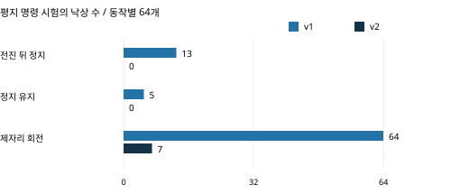

# 근거 부록: 판단에 쓰는 자료와 참고 자료

> 분류: 리서치
> 작성: 맹라현 · 2026-10-07 15:06
> 근거: 기존 원문·팀 원자료와 문서별 사용 범위 · 작성 도구 Codex (맹라현 요청 · 승격 때 작성자 줄에서 옮김)
> 요지: A는 결론의 직접 근거, B는 주장 범위의 제약, C는 환경·시장·기술 참고로 구분한다.
> 상태: 조사완료
> 판: v1.0
> 이슈: #518

[판단 질문·하나의 결론·근거 요약 본문](20261007-underground-recon-service-review.md).

이 부록은 **자료의 사실 여부와 자료를 쓰는 목적을 함께 표시**한다. A와 B가 본문의 판단에 쓰인다. C는 참고용이며 항목 수·사고 규모·타사 성과를 더해 우리 서비스의 효과나 구매 의향으로 환산하지 않는다. 환경 후보를 확정하는 팀 결정이나 새 인터뷰·실험 계획은 포함하지 않는다.

## 1. 판단에 직접 쓰는 근거 A

**A1 · 성능 평가가 의사결정에 쓰이는 근거.** NIST는 반복 시험으로 능력을 객관적으로 비교하고 구매·배치 판단에 활용하는 원칙을 설명한다. 공식 페이지의 6천만 달러 초과 조달은 C-IED 대응 로봇의 요구 사양에 시험 방법이 쓰인 기록이다. 우리가 NIST 시험·인증을 수행했거나 이 규모가 우리 시장이라는 뜻은 아니다. 시뮬 평가가 실기 시험과 동등하다는 근거도 아니다. [NIST 원칙과 조달 활용](https://www.nist.gov/el/intelligent-systems-division-73500/standard-test-methods-response-robots/ground-robot-tests).

**A2·A3 · 팀의 실제 분석 기록.** 본문의 활용 후보에 직접 연결되는 것은 아래의 실행 조건·낙상·정지 판정·조건별 보행 집계다. 평지 명령 수행과 험지 보행은 별도 시험이다. 이를 한 번의 점검 임무로 합치지 않는다.

### 평지 명령 시험

판단 근거 A2의 표는 2026년 9월 29일 v1·v2의 평지·시드 42·동작별 64개 환경 결과다. 시드는 난수 설정이며 이 환경들이 독립적인 실현장 64건인 것은 아니다. 4초 전진 뒤 정지 시험은 전체 10초, 정지 유지는 20초, 제자리 회전은 최대 18초다. per_env.json 6개·384행의 낙상 수를 manifest 집계와 대조하고 두 정책 파일 해시·실행 설정을 확인했다. `확인됨` [평가 원자료](https://github.com/foothold-project/foothold-lab/tree/main/sim/eval/results/20260929-axis2-fall).

원자료의 fell은 낙상 여부다. stop_time_s는 정지 명령 뒤 전 명령이 0인 상태에서 속도 **0.05 m/s 미만을 1초 연속 유지한 최초 시간**이다. 전진 후 정지 조건 도달은 v1 53 / 64개, v2 55 / 64개다. 그 후 넘어질 수 있으므로 조건 도달 수만으로 성공을 판정하지 않는다. 종료 시각까지 생존·정지 유지 여부를 함께 봐야 한다. [정지 판정 코드](https://github.com/foothold-project/foothold-lab/blob/main/sim/eval/command_response_metrics.py).

비교한 두 모델은 정지 학습·회전 명령·다방향 틈 노출 등 여러 설정이 달라 개별 변경 하나의 효과를 귀속하지 않는다. [팀 보고서 6·9·13절](https://github.com/foothold-project/foothold-lab/blob/main/docs/research/20260928-v2-mvp-report.md).

### 별도 험지 집계와 선택 영상

| 선택 장면 | v1 | v2 |
| --- | --- | --- |
| 전진 후 정지 | [v1](https://github.com/foothold-project/foothold-lab/blob/main/docs/assets/video/v2/axis2-stop-v1.mp4) | [v2](https://github.com/foothold-project/foothold-lab/blob/main/docs/assets/video/v2/axis2-stop-v2.mp4) |
| 정지 유지 | [v1](https://github.com/foothold-project/foothold-lab/blob/main/docs/assets/video/v2/axis2-hold-v1.mp4) | [v2](https://github.com/foothold-project/foothold-lab/blob/main/docs/assets/video/v2/axis2-hold-v2.mp4) |
| 제자리 회전 | [v1](https://github.com/foothold-project/foothold-lab/blob/main/docs/assets/video/v2/axis2-turn-v1.mp4) | [v2](https://github.com/foothold-project/foothold-lab/blob/main/docs/assets/video/v2/axis2-turn-v2.mp4) |

아래 험지 집계는 평지 명령 시험과 별도다. 선택한 8종·속도·난이도·성공 판정과 집계 복원 방법은 다음 항목에 명시한다. 조건별 100회는 한 지형 타일에서 출발 위치·방향을 흔든 반복으로, 여러 실현장의 바닥·폭·높이 분포를 대표하는 표본이 아니다.

위의 명령 응답 비교 영상은 기존 팀 기록의 환경 번호 8이다. v1은 정지·유지·회전에서 모두 넘어지고 v2는 모두 넘어지지 않은 선택 장면이다. 동작별 전체 64개 결과를 함께 표시하며 장면 하나를 전체 성과로 일반화하지 않는다. 시뮬 외부 카메라 기록이므로 실제 관측 카메라 영상·피해자 탐지의 성과도 아니다.

### 험지 집계의 비교 대상·필터·분모

본문의 세 정책은 NVIDIA 시뮬 사전학습 기준 정책 nv, 팀 v1, 팀 v2다. **nv는 실기 Unitree 순정 제어기가 아니다.** 비교 집계는 sweep_long.csv의 난이도 0.5·속도 0.5/1.0/1.5 m/s·아래 8종을 모델별로 선택한 24행에서 복원했다. 팀 보고서의 기준 시드는 42다. 종합 성공은 생존·전진·속도 추종·진로 유지의 동시 충족이다. 행마다 episodes=100이며 성공률×100이 정수 성공 수에 대응하는지 확인했다. 모델당 2,400개 원시 시행을 다시 판정했다고 표시하지 않는다.

8종은 discrete_obstacles·floating_ring·pit·repeated_boxes·repeated_cylinders·star·stepping_stones·wave다. rails는 v2 학습에 포함되므로 이 미학습 묶음에서 제외한다. 학습 지형까지 포함한 16종 집계와 이 8종 집계를 섞지 않는다. [팀 보고서의 학습·평가 구분](https://github.com/foothold-project/foothold-lab/blob/main/docs/research/20260928-v2-mvp-report.md).

| 속도 · 각 모델 800회 | nv 성공 | v1 성공 | v2 성공 |
| --- | --- | --- | --- |
| 0.5 m/s | 487 · 60.88% | 695 · 86.88% | 700 · 87.50% |
| 1.0 m/s | 496 · 62.00% | 699 · 87.38% | 724 · 90.50% |
| 1.5 m/s | 70 · 8.75% | 687 · 85.88% | 699 · 87.38% |
| 합계 · 각 모델 2,400회 | 1,053 · 43.88% | 2,081 · 86.71% | 2,123 · 88.46% |

nv의 학습 전진 명령은 -1~1 m/s다. 1.5 m/s의 큰 차이를 같은 명령 범위에서의 성능 우위라고 읽지 않는다. v1→v2의 총 차이는 42 / 2,400 × 100 = **+1.75%p**다. 이 값에 유의성·현장 성공률·개별 변경의 인과 효과를 부여하지 않는다. 보고서의 1.0 m/s 비교만 보더라도 학습 조건이 달라 상용 제어기보다 우수하다는 결론으로 이어지지 않는다.

### 평균 성적을 실패 분석으로 바꿔 읽는 예시

| 미학습 지형 · 1.0 m/s · 각 100회 | v1 성공 | v2 성공 |
| --- | --- | --- |
| discrete_obstacles | 100 | 100 |
| floating_ring | 99 | 100 |
| pit | 100 | 100 |
| repeated_boxes | 100 | 100 |
| repeated_cylinders | 100 | 100 |
| star | 100 | 100 |
| stepping_stones | 0 | 24 |
| wave | 100 | 100 |

v2의 90.50%는 7종 700 / 700회와 디딤돌 24 / 100회를 묶은 값이다. v1→v2의 이 속도에서의 증가 25회 중 24회가 디딤돌에 해당한다. **자료의 쓰임은 개선이 어디에 집중됐고 높은 평균에도 어떤 실패가 남는지 설명하는 것**이다. 다른 시드의 디딤돌 결과 1·3·19·0회와 함께 읽으면 24회를 안정적 환경 성능으로 일반화할 수 없다. [집계 CSV](https://github.com/foothold-project/foothold-lab/blob/main/sim/eval/results/20260928-v2-sweep/sweep_long.csv), [시드별 개별 기록](https://github.com/foothold-project/foothold-lab/tree/main/sim/eval/results/20260929-seed-spread).

조건별 표·판정 코드·실행 설정·실패 영상을 연결하면 “평균이 높다”에서 “어떤 조건에서 어떤 지표가 남는가”로 판단의 단위를 바꿀 수 있다. 이 설명은 현재 기록으로 만들 수 있지만, 분석 보고서의 유료 수요나 다른 도구보다 높은 편의성은 이 집계의 측정 대상이 아니다.

## 2. 결론의 범위를 제한하는 근거 B

**B1 · 팀 목표의 범위.** 8월 19일 결정과 계획은 A의 시뮬 정책·평가·트윈과 B의 순정 Go2 보행 위 SLAM·Nav2 항법을 구분한다. 자체 정책의 실기 이전은 목표에서 제외됐다. 두 트랙을 자체 정책의 현장 효과로 연결하지 않는다. [팀 결정](https://github.com/foothold-project/foothold-lab/blob/main/docs/DECISIONS.md), [프로젝트 계획](https://github.com/foothold-project/foothold-lab/blob/main/docs/REPORT.md).

**B2 · 시험과 환경의 대응 범위.** 명령 응답 manifest의 지형은 무한 평면이다. 별도 험지 평가의 타일 크기는 8×8 m이고 지형별 행 수는 1이다. 지하 공동구의 폭·천장·바닥 상태나 긴 관측 경로를 대표하도록 검증한 결과는 이번 평가에 없다. [명령 시험 조건](https://github.com/foothold-project/foothold-lab/blob/main/sim/eval/results/20260929-axis2-fall/v2/probe_manifest.json), [험지 설정](https://github.com/foothold-project/foothold-lab/blob/main/sim/eval/generalization_env_cfg.py).

**B3 · 실패 범위와 시드 해석.** v2의 좁은 디딤돌 stepping_stones는 1.0 m/s·난이도 0.5·시드별 100회에서 시드 42·1·2·3·4의 종합 성공이 **24·1·3·19·0회**다. 개별 500행을 재집계했다. 24회는 다섯 시드 중 최고값으로 보고할 범위는 0~24 / 100회다. 실행 manifest는 지형 생성과 출발 조건이 함께 바뀐다고 명시한다. 어느 한쪽 원인만 분리한 시험이 아니다. 시드 점검은 v2·1.0 m/s에 한정되므로 v1·nv·다른 속도까지 같은 편차로 읽지 않는다. 발 지지 문제를 통로 폭·회전 여유·천장 통과 성능으로 바꾸지도 않는다. [팀 원자료](https://github.com/foothold-project/foothold-lab/tree/main/sim/eval/results/20260929-seed-spread).

**B4 · 기존 대안과 비교 조건.** 본문 4절은 역할 비교이며 성능 순위가 아니다. 우리 v1·v2 비교의 기준선은 팀의 이전 학습 정책이다. 동일 조건의 상용 제품 대비 결과가 없으므로 촬영·지도·디지털 트윈·학습 제어 자체를 고유한 경쟁 차별성으로 제시하지 않는다.

비교 대상별 기능과 FOOTHOLD의 제공 범위는 본문 4절의 표에 모았다. 근거가 되는 제조사 기능 설명은 [Spot](https://bostondynamics.com/products/spot/), [Go2](https://www.unitree.com/go2/)이고, 외부 운용·학습 제어기의 상세 수치는 아래 C1·C3에 기록한다.

## 3. 참고로 알아둘 자료 C

### C1. 반복 점검 업무·검사 기록·사업 형태

**참고 목적:** 실제 기관이 무엇을 점검하고 어떤 데이터를 모으는지, 어떤 서비스 형태를 요구하는지 이해한다. **결론에 사용하지 않는 주장:** FOOTHOLD의 구매 의향·현장 효과·매출·특정 환경 우선 채택.

UK Power Networks는 **47개 터널·연 160회 초과 점검·터널과 수직구 유지관리비 연 £100만 초과**를 공개한다. 2022-10-03~2024-08-30 프로젝트 예산은 £43.2만이다. 위험 장소 체류시간 최대 50% 감소·연 £15만 초과(2028년 £30만 초과) 절감은 예상이다. 예산·추정 절감액을 실제 집행·기체 가격·우리 매출로 사용하지 않는다. [운영기관 원문](https://innovation.ukpowernetworks.co.uk/projects/automatic-tunnel-and-shaft-inspections).

초기 ENA 종료 기록은 성과·새 교훈 미도출을 명시한다. 해당 단계는 2022~2023년이고 Expenditure는 £25만으로 표시된다. 후속 UKPN 2023/24 보고서 45~46쪽은 자체 자금 전환·시험 진행과 **터널 안에서 사람의 조종이 필요했던 한계**를 설명한다. 단계·기간·회계 항목이 다르므로 두 금액을 합치지 않는다. 이 사례가 필요한 기술은 항법·센싱·통신 통합을 포함하므로 우리 보행 개선만으로 해결됐다고 읽지 않는다. [초기 종료 기록](https://smarter.energynetworks.org/projects/nia_ukpn0085/), [후속 보고서](https://smarter.energynetworks.org/media/nhhp0cbs/uk-power-networks-annual-nia-summary-202324.pdf#page=45).

AutoInspect의 **IEEE Transactions on Field Robotics 2025 논문**, DOI 10.1109/TFR.2025.3586831은 JET의 35일 배치에서 **81회 임무·검사 동작 571 / 653개 성공(87.44%)**을 보고한다. 3회는 일부 성공·8회는 실패이며 실패 중 4회는 계획된 중단이다. 최장 15일 중대 개입 없는 운용은 달력 기간이고 실제 임무 수행은 총 19시간 30분이었다. 영상 60장 쌍별 비교의 오프셋은 1920×1000 픽셀 영상에서 가로 54±71·세로 51±42 픽셀이다. 정지 제어 하나의 효과·결함 탐지 정확도·보행 실패율이 아니다. [수락본 12~14쪽](https://robots.ox.ac.uk/~mfallon/publications/2025TFR_staniaszek.pdf#page=14), [Oxford 최종 서지](https://ora.ox.ac.uk/objects/uuid%3Ac11ae19f-8649-43a1-ac51-29839cb692dc). UKAEA의 하루 두 차례 수집 발표는 같은 배치이므로 독립 실증으로 합산하지 않는다. [UKAEA 공식 발표](https://www.gov.uk/government/news/autonomous-robot-paves-the-way-for-future-fusion-maintenance).

Sellafield의 2026-01-29 공식 사례는 2023/24 C5 구역에서 맞춤 Spot의 검사 경로·영상·방사선 수집과 2025년 부지 경계 밖 원격 시연을 기록한다. Go2나 지하 공동구의 효과·비용 절감률로 전용하지 않는다. [운영기관 원문](https://www.gov.uk/government/case-studies/how-are-robot-dogs-helping-clean-up-sellafield).

2026년 9월 정부 조달 공고는 Scottish Hydro Electric Transmission의 로봇 장비·분석·유지보수·수명주기 책임을 묶은 **£455만(VAT 포함) 관리형 검사 서비스**를 명시한다. 2026년 9월 공고의 계약 상태 표기는 Pending이다. 실제 집행·절감 실적이나 FOOTHOLD의 제공 능력으로 해석하지 않는다. [정부 조달 공고](https://www.sell2wales.gov.wales/search/show/search_view.aspx?ID=SEP658487&catID=).

### C2. 환경별 요구와 기존 대안

**참고 목적:** 적용 환경마다 요구하는 기체·센서·항법·통신이 다르다는 점을 이해한다. **결론에 사용하지 않는 주장:** Go2의 지하 특화·재난 적합성·우선 환경 확정.

ITRI의 2026년 가을 공식 설명은 화재 정찰과 좁은 공동구 검사용 기체를 구분한다. 공동구용 설계는 계단·낮은 공간 통과·최대 1 km의 점검 경로를 다룬다. 이 설계 요구를 우리가 충족했다는 자료는 없다. Go2 공식 표의 EDU 단차 약 16 cm·기체 15 kg은 제조사 사양이며 센서 장착 후 통로 적합성·현장 인증이 아니다. “$1,600부터”를 EDU 가격으로 쓰지 않는다. [ITRI 원문](https://itritoday.itri.org/126/content/en/unit_01-2.html), [Go2 공식 사양](https://www.unitree.com/go2/).

EU-OSHA의 2023 사례 연구 ID10은 압력 탱크에 4 m 검사 암·보어스코프·초음파와 자석 바퀴 로봇을 사용하는 방식을 기록한다. 기존 관계자 인터뷰 기반 사례이며 무작위 비교가 아니다. 사람 진입을 줄이는 가치가 사족보행만의 가치인 것은 아니다. [기관 원문 1~2쪽](https://osha.europa.eu/sites/default/files/AI-support-inspection-maintenance-oil-en.pdf#page=2).

NASA/JPL의 SubT 구성은 정찰 후 바퀴·궤도·다리·비행 로봇을 환경에 맞게 선택한다. 이동 방식 우열의 동일 조건 시험이 아니다. Spot의 공식 설명에는 경로 재생·영상 수집·환경 변화 대응이 이미 존재한다. NIOSH의 2018 SME 학회 프리프린트는 Gemini-Scout 이동과 배터리·구동 모터·조명 요구를 기록하며 CDC 서지는 Peer Reviewed False다. 공급사 Elios 3의 Lyon 싱크홀·Swiss Alps 붕괴 터널 사례도 기존 대안의 참고이고 동일 조건 비교가 아니다. [NASA/JPL](https://www.nasa.gov/centers-and-facilities/jpl/nasa-robots-compete-in-darpas-subterranean-challenge-final/), [Spot 설명](https://bostondynamics.com/blog/automated-inspections-made-simple/), [NIOSH 원문](https://stacks.cdc.gov/view/cdc/227698/cdc_227698_DS1.pdf#page=2), [CDC 서지](https://stacks.cdc.gov/view/cdc/227698), [Lyon 사례](https://www.flyability.com/casestudies/underground-drone-emergency-response), [Swiss Alps 사례](https://www.flyability.com/casestudies/collapsed-tunnel-landslide).

### C3. 보행 제어·관측·통합 운용의 기술 배경

**참고 목적:** 제어기 개선의 기술적 가능성, 명령 수행·관측의 관계, 통합 운용에 필요한 구성과 기존 연구를 이해한다. **결론에 사용하지 않는 주장:** 우리 정책의 실기 효과·새 학습법·경쟁 우위·지하 환경의 특화 성능.

Lee의 **Science Robotics 2020 논문**, DOI 10.1126/scirobotics.abc5986 표 1은 ANYmal의 기존/학습 제어기 속도를 이끼 0.199/0.452 m/s·진흙 0.197/0.338 m/s, 기계적 COT를 0.625/0.423·0.931/0.692로 기록한다. 속도 비는 2.27배·1.72배, COT 감소는 32.3%·25.7%다. 기준선이 걸은 구간만 측정하고 실패 후 사람이 재설정했으며 표에 반복 수·신뢰구간은 없다. 배터리 수명·운영비·Go2 수치가 아니다. [수락본 5쪽](https://arxiv.org/pdf/2010.11251#page=5).

Miki의 **Science Robotics 2022 논문**, DOI 10.1126/scirobotics.abk2822는 단차 높이별 10회·5초 이내 통과를 평가한다. 제안 제어기는 30.5 cm까지 통과 성능을 유지했고 그림 4의 장애물 경로 실행은 33초·보조 없음 대 75초·인력 보조 있음이다. 반복 평균이 아니다. [저자본 5·7·8쪽](https://leggedrobotics.github.io/rl-perceptiveloco/assets/pdf/wild_anymal.pdf#page=7).

DreamWaQ++의 **IEEE T-RO 2026 논문**, DOI 10.1109/TRO.2026.3653774의 arXiv v2는 Go1의 50계단 경주에서 35초·수평 30.03 m, 내장 제어기 기체 6.38 m 후 미완료를 기록한다. 기체·센서·적재·명령이 달라 제어기 하나의 효과로 해석하지 않는다. V.B.2의 동일 Go1 순차 비교는 별도 기록이다. 표 IV의 시뮬 1,000개·20초·20 cm 계단에서 전체 모델 97.8%·정보 융합 제거 60.7%의 차이는 37.1%p다. 순정 제어기·Go2·실기 성공률이 아니다. [v2 원문](https://arxiv.org/html/2409.19709v2), [출판 DOI](https://doi.org/10.1109/TRO.2026.3653774).

CERBERUS의 **Field Robotics 2024 논문**, DOI 10.55417/fr.2024009 표 3은 2021 SubT 결선 60분 동안 네 ANYmal 합계 **1,738 m·유효 물체 보고 23개·낙상 없음**을 기록한다. 센서·SLAM·통신·감독자를 포함한 대회 결과이며 실제 구조 성과가 아니다. Miki의 결선 기록과 같은 사건이므로 독립 실증으로 합산하지 않는다. [Oxford 수락본 39·54쪽](https://ora.ox.ac.uk/objects/uuid%3Ac203da77-8014-4ad5-924d-042dd2bf9870/files/sjm214r20w#page=39).

NIST 연구자의 2018 원문 15쪽은 몸체 기울기가 원격 카메라의 운용자 기준을 뒤틀어 조종을 방해할 수 있다고 설명한다. 명령·자세와 관측의 관련성을 이해하는 참고이며 정지 제어에 따른 영상 판독률 향상을 측정하지 않았다. NIST의 2026 로봇 프로그램도 환경·응용 요구와 검증의 연결을 강조한다. 우리 시뮬이 실제 환경을 대표한다고 승인한 자료는 아니다. [2018 원문](https://tsapps.nist.gov/publication/get_pdf.cfm?pub_id=922383#page=15), [2026 프로그램](https://www.nist.gov/el/robotics).

### C4. 국내 안전·기관 업무·실패 사례

**참고 목적:** 위험의 배경·기관 계획·실패 유형을 파악한다. **결론에 사용하지 않는 주장:** 전체 사고·시설 수를 우리 고객·시장으로 환산하거나 타사 실패를 우리 정책의 해결 성과로 해석.

| 공식 자료 | 확인한 사실 | 참고할 범위 |
| --- | --- | --- |
| 2026 고용노동부·안전보건공단 가이드 | 2016~2025년 154건·재해자 315명·사망자 132명, 구조 진입 사망 30명 | 전체 밀폐공간 통계. Go2 적용 가능 현장 수가 아님 |
| 서울소방 2026 계획 | 공동구 등 선제 투입·라이다·8종 가스·통신 대응 | 기관의 추진 업무. 출동 성적·우리 구매 의향과 구분 |
| 서울시 2025 예산안 | 순찰 2대·사족보행 1대 시범 사업 합계 3억원 제안 | 1대 가격·낙찰·집행액이 아님 |
| 서울시 2025 시설 집계 | 38개 사업소·98개 사업장 내 밀폐공간 2,399개 | 탱크·맨홀 포함. 고객 수·Go2 통로 수가 아님 |
| 인천항만공사 2026 S-D-24 | 실시간 가스 감시·경보·자동 환기·관제 요구 | 설치형 센서·공조 수요. 사족보행 구매 요구가 아님 |

[2026 가이드 14·42쪽](https://info.cak.or.kr/download.do?uuid=08d223c3-5233-436a-8427-0ddbf304da60.pdf#page=14), [서울소방 계획](https://news.seoul.go.kr/safe/archives/517409), [서울시 예산안](https://www.seoul.go.kr/news/news_report.do?nttNo=421947), [시설 집계](https://news.seoul.go.kr/safe/archives/516791), [공공 수요기술 PDF 48쪽](https://www.inu.ac.kr/bbs/startup/592/380374/download#page=48).

132/315=41.9%는 재해자 중 사망 비율, 30/132=22.7%는 사망자 중 구조 진입 사망 비율이다. 구조하러 들어간 전체 사람의 사망 확률이 아니다. 2025 보도자료의 2015~2024년 재해자 298명·사망자 126명·확인·구조 진입 사망 23명은 기간이 겹치므로 합산하지 않는다. 가이드 25~26쪽의 교정·실제 작업 위치 측정·감시·통제와 외부 채기관 측정은 이동 로봇만으로 대체할 수 있다는 근거가 아니다. [2025 보도자료](https://www.korea.kr/common/download.do?fileId=198158641&tblKey=GMN).

Robinson의 ACM THRI 최종 초록은 모의 수색 16회·10시간에서 사람 개입 조건의 발견 수 10.52%·거리 12.71%·탐색 범위 10.56%·안전 사건 간 시간 34% 증가와 통상 조건의 비슷한 성적을 보고한다. 최종 통계표를 검증하지 않았고 혼합 로봇 팀의 결과다. DARPA의 5 m 위치 보고 채점도 대회 규칙이며 우리 요구 정밀도가 아니다. [최종 출판 기록](https://research.monash.edu/en/publications/human-robot-team-performance-compared-to-full-robot-autonomy-in-1/), [DARPA 설명](https://www.darpa.mil/research/programs/darpa-subterranean-challenge).

CDC의 Sago 사고 보고는 내부 정보 부재를, MSHA 원문은 영상·가스 전송 뒤 주행 중 선로 이탈·기울음·구동부 손상으로 중단된 상황을 기록한다. MSHA는 구조팀 시간 손실이 없었다고 명시한다. Murphy의 2010 해설은 선정 재난 5곳·지상 로봇 9대의 이동 제약을, CSIR의 2013 학회 자료는 관계자 21명 워크숍의 영상·관측·개입 요구를 정리한다. 국내 고객 조사나 우리 제어기의 효과가 아니다. [CDC](https://www.cdc.gov/mmwr/preview/mmwrhtml/mm5751a3.htm), [MSHA 질의응답](https://arlweb.msha.gov/sagomine/sagominerescueeffortq%26a.pdf#page=3), [MSHA 내부 검토](https://arlweb.msha.gov/Readroom/FOIA/2007InternalReviews/Sago%20Internal%20Review%20Report.pdf#page=124), [Murphy 원문](https://www.jstage.jst.go.jp/article/jrsj/28/2/28_2_142/_pdf#page=2), [CSIR 원문](https://researchspace.csir.co.za/bitstream/handle/10204/7208/Green_2013.pdf#page=5).

### 실제 실패 기록과 기존 팀 평가의 관계

**이 표는 C4의 참고 사례**다. 실패 현상·원인·우리 평가 범위를 구분한다. 행 수를 독립 사고 수나 우리 해결 성과로 세지 않는다.

표의 근거 수준은 연구진의 원인 설명, 연구진의 추정, 실패 현상 확인을 구분한다. CTU는 체코공과대학교 팀이고, MARBLE은 별도 참가팀 이름이다. 외부 실패와 팀 평가의 관계는 해석 범위를 설명한다. 여러 행이 같은 연구에서 나온 경우가 있어 사고 건수로 합산하지 않는다.

| ID | 장비·실패 유형 | 원문에서 확인한 내용과 수준 | 기존 팀 평가와의 관계 |
| --- | --- | --- | --- |
| F1 | LT2-F 궤도 로봇 · 레일 걸림 | 낮은 지상고로 120 m 이동 후 걸림. 연구진 원인 설명 | 레일·몸통 접촉 문제의 참고. 해당 외부 실패를 해결한 결과는 없음 |
| F2 | Vision60 초기형 · 레일 주행 실패 | 최장 40 m. 레일에서 미끄러졌다는 연구진 추정 | 접촉·미끄러짐 문제의 참고. 현장 레일 마찰과 직접 비교한 결과는 없음 |
| F3 | MARBLE팀 Spot · 거친 지형 낙상 | 넘어져 남은 주행에서 이동 중단. 실패 현상 확인 | 낙상 현상의 참고. 구체적인 원인과 팀 모델의 해결 효과는 미확인 |
| F4 | CTU팀 Spot 1 · 지형 오판 후 낙상 | 미관측 구역을 통과 가능으로 판단하고 너무 늦게 수정. 연구진 원인 설명 | 현재 보행 평가가 실제 관측 누락·진입 오판을 해결한 근거는 없음 |
| F5 | LT2-F · 체인·궤도 이탈 | 작은 돌이 구동부에 끼어 이탈·정비 부담 발생. 연구진 원인 설명 | 구동계 고장은 기존 보행 평가에 포함되지 않음 |
| F6 | MARBLE팀 Spot · 내려가는 계단 탐사 제한 | 라이다가 바로 앞 아래쪽 바닥을 충분히 관측하지 못함. 연구진 원인 설명 | 실제 센서 시야의 한계는 기존 보행 평가에 포함되지 않음 |
| F7 | CTU팀 Spot 2 · 라이다 데이터 단절 | 라이다 연결 컴퓨터 고장·재시작 후 데이터 소실. 연구진 원인 설명 | 보행 학습의 개선 대상으로 포함하지 않음 |
| F8 | 후쿠시마 변형 크롤러 · 틈새 끼임 | 그레이팅 판 사이 접합 틈에 오른쪽 궤도부가 끼인 상태 확인 | 틈·접촉 폭 참고 사례. Go2의 해당 현장 적용 근거는 아님 |

F1·F2·F5의 출처는 Hudson 등의 **Field Robotics 2022 출판 논문 저자 공개본**이다. F4·F7은 Bayer 등의 **Field Robotics 2023 출판 논문 저자 공개본**, F3·F6은 Miles 등의 **Frontiers in Robotics and AI 2023 출판 논문**이다. F8은 도쿄전력(TEPCO)의 조사 결과를 국제폐로연구개발기구(IRID)가 공개한 공식 자료다. MARBLE과 CTU는 서로 다른 팀이다.

[Hudson PDF 9·30·31쪽](https://sites.cc.gatech.edu/ai/robot-lab/online-publications/FRJ.pdf#page=30), [Bayer PDF 26·27쪽](https://comrob.fel.cvut.cz/papers/fr23mre.pdf#page=27), [Miles 4.3절·그림 14](https://www.frontiersin.org/journals/robotics-and-ai/articles/10.3389/frobt.2023.1249586/full), [TEPCO 결과 PDF 14쪽](https://irid.or.jp/wp-content/uploads/2015/04/20150430_e.pdf#page=14).

**F1~F3은 이동 중 접촉·미끄러짐·낙상과 이동 중단에 관한 참고다.** 팀의 기존 평가가 이 현장 실패를 재현하거나 해결한 것은 아니다. F4·F6은 관측·센서 판단, F5·F7은 하드웨어 고장으로 보행 성과와 구분한다. F8은 틈 접촉의 참고이며 Go2 투입처 근거가 아니다.

### 실제 낙상 장면

Miles, Biggie, Heckman의 2023년 논문 그림 14는 MARBLE팀 Spot의 낙상 과정을 보여준다. CTU팀 Spot 1의 지형 오판과 다른 사례다. 사진은 실패 현상의 근거이며 마찰·발 디딤·충돌 중 세부 원인을 확정하지 않는다. 원본 그림 변경 없음. Photo credit DARPA. Article CC BY 4.0. [논문 4.3절·그림 14](https://www.frontiersin.org/journals/robotics-and-ai/articles/10.3389/frobt.2023.1249586/full), [라이선스](https://creativecommons.org/licenses/by/4.0/).

[원본 낙상 그림 14 보기](https://www.frontiersin.org/journals/robotics-and-ai/articles/10.3389/frobt.2023.1249586/full#F14). 원본 이미지는 제출 묶음에 복제하지 않는다.
## 기존 자료에서 판단할 수 있는 범위

**A의 자료 쓰임·팀 기록과 B의 범위 제약을 연결해 Go2 보행 평가·개선 분석의 활용 후보를 제안한다. C는 그 결론에 더하지 않는 참고 자료다.** 고객 구매·상용 우위·지하 특화·자체 정책의 실기 효과는 확인되지 않았다. 시뮬 광선 처리를 실제 라이다 가림 대응으로 읽지 않는다. 신규 인터뷰·통합 정찰 실험을 실행 과제로 추가하지 않는다. [관측 코드](https://github.com/foothold-project/foothold-lab/blob/main/sim/policy/gap_observations.py).

## 판 이력

| 판 | 날짜 | 변경 |
| --- | --- | --- |
| v1.0 | 2026-10-07 | 제출 전 정리. A 직접 근거·B 범위 제약·C 참고의 역할과 금지 추론을 명시 |
