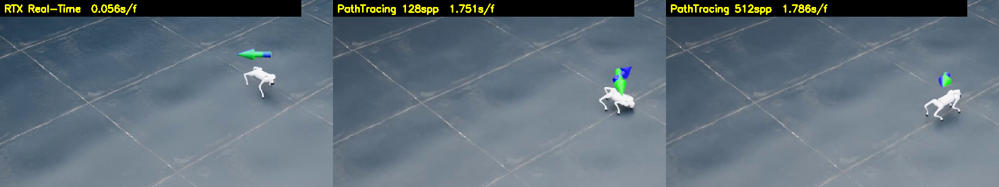
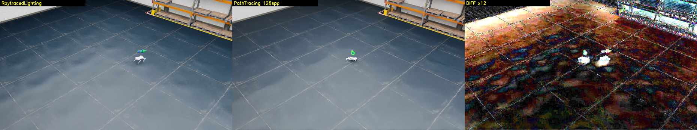
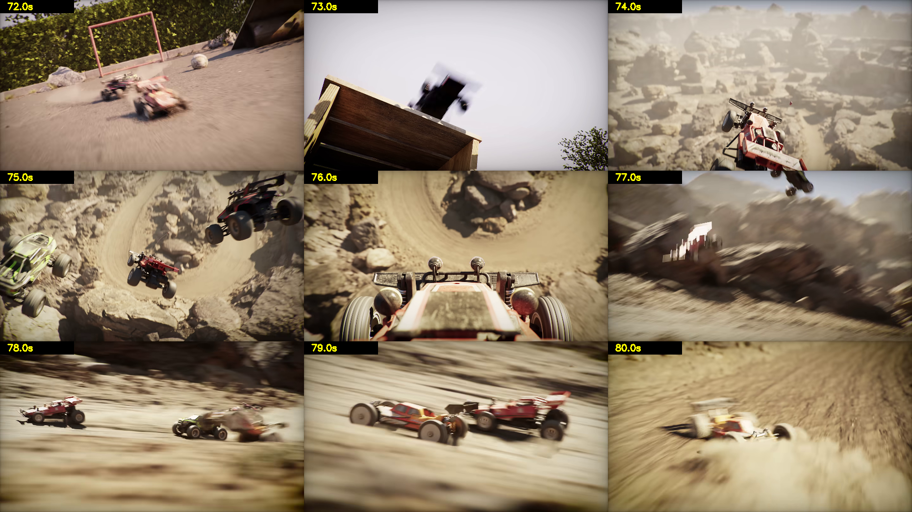
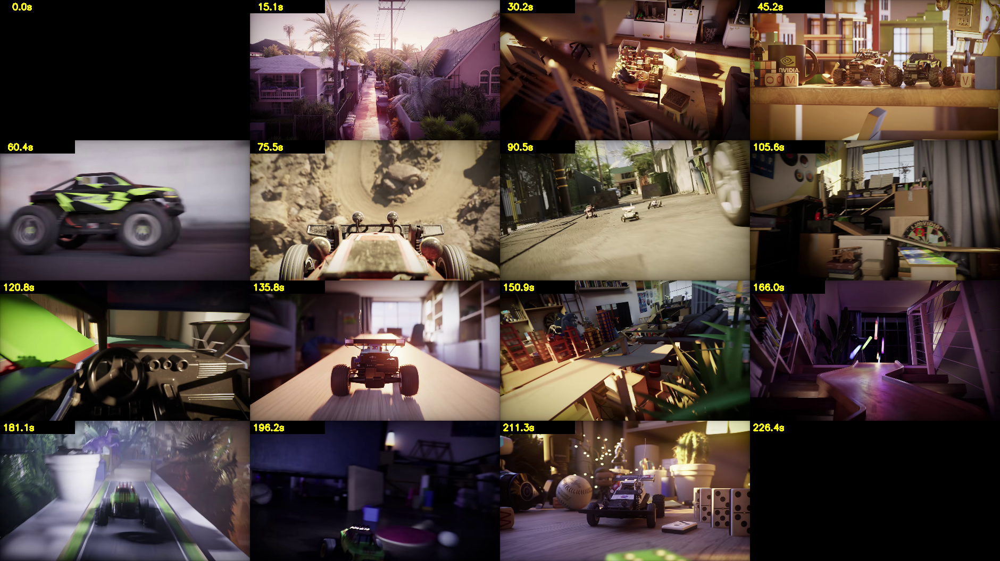

# 렌더 실측: Path Tracing 은 얼마나 걸리는가

> 분류: 실험
> 작성: 오흥재 · 2026-08-10 12:33
> 근거: 실측
> 요지: 1080p Path Tracing 128spp = 프레임당 1.75초(30초 영상 44분). 렌더 시간은 병목이 아니다.
> 상태: 확정
> 판: v1.0

> 작성 2026-08-10 · 워크스테이션 세션 · 장비 **RTX 5080 ×2** (VRAM 16GB/장)
> **목적**: "극사실주의 렌더가 현실적인가"를 추정이 아니라 실측으로 답한다.
> 결론만 보려면 §3.

---

## 0. 왜 이 측정이 필요했나

이 프로젝트의 최종 산출물 중 하나는 **실사와 구분되지 않는 데모 영상**이다.
그런데 *"Path Tracing 을 쓰면 예뻐진다"*는 말만으로는 일정을 짤 수 없다.
**프레임당 몇 초인지**를 알아야 발표 영상의 길이와 재작업 횟수를 정할 수 있다.

> 커널 §2-1: **실측 없이 ETA를 보고하지 않는다.**
> 2026-07-25 에 회선 스펙으로 "9~10시간"이라 보고했다가 실측 22시간이었던 실패의 반복을 막는다.

---

## 1. ★ 이 측정에서 밟은 함정 3개: 팀원은 여기서 시간 쓰지 말 것

측정보다 **함정을 찾는 데 시간이 더 걸렸다.** 세 번 다 "성공했다고 보고하지만 실제로는 안 된" 경우였다.

### 함정 ① `--kit_args` 로 넘긴 렌더 설정은 **무시된다**

```powershell
# ❌ 이렇게 하면 아무 일도 일어나지 않는다 (에러도 안 남)
python play.py --kit_args="--/rtx/rendermode=PathTracing"
```

세 가지 렌더 조건을 돌렸더니 **전부 35~42초로 같았고**, 이미지도 **픽셀상 동일**했다.
`exit=0` 이고 mp4 도 만들어졌다. **조용한 실패다.**

```python
# ✅ Kit 기동 뒤 carb 로 직접 설정
import carb
s = carb.settings.get_settings()
s.set("/rtx/rendermode", "PathTracing")
```

### 함정 ② 설정했다는 사실은 증거가 아니다. **되읽어 확인할 것**

```python
s.set("/rtx/rendermode", "PathTracing")
print(s.get("/rtx/rendermode"))    # ★ 이 한 줄이 함정 ①을 잡았다
```

### 함정 ③ 애니메이션에서 `totalSpp` 는 **아무 일도 안 한다**

| 설정 | 뜻 | 애니메이션 캡처에서 |
|---|---|---|
| `/rtx/pathtracing/spp` | **한 번 그릴 때 쓰는 샘플 수** | ✅ 이것이 품질을 결정 |
| `/rtx/pathtracing/totalSpp` | 가만히 두면 누적할 목표 샘플 수 | ❌ 프레임마다 새로 그리므로 무의미 |

`totalSpp` 만 128 → 512 로 올렸을 때 시간이 **5%만** 늘었다(0.1255 → 0.1315초).
4배 샘플에 5% 시간이면 **그 손잡이는 가짜다.**

**검증 (알려진 답 테스트, 1280×720):**

| `spp` | 프레임당 | 4spp 대비 |
|---|---|---|
| 4 | 0.131초 | 1.0배 |
| 32 | 0.589초 | **4.5배** |
| 128 | 1.121초 | **8.5배** |

시간이 실제로 늘었다 → **`spp` 가 진짜 손잡이다.**
(선형이 아닌 이유: 프레임당 고정 비용(물리 스텝·인코딩) + GPU 병렬 흡수)

---

## 2. 측정 방법: 2점법으로 기동 시간을 소거한다

Isaac Sim 은 뜨는 데만 **약 30초**가 걸린다. 총 시간을 프레임 수로 나누면 이 30초가 섞여 틀린다.

```
같은 조건으로 N₁ 프레임과 N₂ 프레임을 재고

    프레임당 = (T_N₂ − T_N₁) ÷ (N₂ − N₁)      ← 기동 시간이 소거된다
```

- 씬: `Environments/Simple_Warehouse/warehouse.usd`
- 정책: 우리 A 정책(플래그 없음, 300 iteration)의 JIT `exported/policy.pt`
- 스크립트: `C:\isaac\IsaacLab\play_go2_in_usd.py`

---

## 3. ★ 결과: 1920×1080 (발표 해상도)

| 렌더러 | 프레임당 | 5초(250f) | **30초(1500f)** | 2분(6000f) |
|---|---|---|---|---|
| **RTX Real-Time** | **0.056초** | 0.2분 | **1.4분** | 5.6분 |
| **Path Tracing 128spp** | **1.751초** | 7.3분 | **43.8분** | **2.9시간** |
| Path Tracing 512spp | 1.786초 | 7.4분 | 44.7분 | 3.0시간 |

**Path Tracing 은 Real-Time 의 약 31배 느리다.**

### ⚠️ 512spp 는 128spp 대비 아무것도 주지 않는다

시간이 **2% 차이**(1.751 → 1.786초)다. 배경 픽셀 차이도 0.9로 미미하다.
→ **이 캡처 경로에서 실효 상한은 128spp 다.** 그 이상은 설정해도 낭비다.

### 참고: 1280×720

| 렌더러 | 프레임당 |
|---|---|
| RTX Real-Time | 0.050초 |
| Path Tracing 128spp | 1.121초 |

1080p 는 720p 대비 픽셀이 2.25배인데 PT 시간은 1.56배다(1.121 → 1.751).
**해상도를 올려도 선형으로 비싸지지 않는다.**

---

## 4. 화질 차이: 눈으로 본 것



1920×1080 프레임의 일부를 확대한 것. 왼쪽부터 Real-Time / PT 128spp / PT 512spp.

- **Real-Time**: 바닥이 매끈하고 평평하다. 로봇 아래 접지 그림자가 약하다
- **Path Tracing**: 바닥 표면 디테일과 대비가 살아난다. **로봇 아래 접지 그림자가 뚜렷하다**
- **512spp**: 128spp 와 육안 차이가 사실상 없다

> **다만 정직하게: 이 창고 씬에서는 차이가 크지 않다.**
> 바닥이 거의 디퓨즈이고 조명이 단순해서 Path Tracing 이 자랑할 게 없다.
> 역광·다중 반사·복잡한 재질이 있는 씬이라야 격차가 벌어진다.

---

### 참고: 720p 에서의 같은 비교



왼쪽 Real-Time · 가운데 Path Tracing 128spp · 오른쪽은 차이를 12배 증폭한 것.
바닥 반사가 실제로 다르다. 다만 이 창고 씬은 조명이 단순해 격차가 작다.

---

## 4-2. ★ 참고: «실사처럼 보이는 것»의 정체 (Racer RTX 분석)

NVIDIA 가 Omniverse 로 만든 [Racer RTX](https://www.youtube.com/watch?v=AsykNkUMoNU) 를
직접 받아 프레임 단위로 확인했다. 조사 요약을 옮겨 적는 대신 **눈으로 봤다.**





| 요소 | 실제로 시뮬레이션됐나 |
|---|---|
| 차체 물리 · 서스펜션 · 점프 · 착지 | ✅ **확실히 시뮬레이션**(강체 물리). 74초 공중 → 75초 착지 |
| 흩날리는 모래 · 모래폭풍 | ❌ **거의 없다.** 사막 지형은 정적 메시 + 텍스처 |
| 차 뒤 먼지 | 🟡 약하게 있음(72초·80초). 규모가 작다 |
| **흐릿함의 정체** | ⚠️ **대부분 모션블러다** |

> ### ★ 우리에게 좋은 소식
> **«실사처럼 보이는 것»의 상당 부분은 물리 시뮬이 아니라 렌더링 기법**
>모션블러 · 얕은 심도 · 룩뎁: **이다.**
> 즉 모래를 물리로 시뮬레이션하지 않아도 «모래밭을 질주하는 느낌»을 낼 수 있다.
> **Isaac Lab 이 모래를 지원하지 않는 제약이 최종 영상 품질의 제약은 아니다.**

⚠️ 다만 발표에서는 **연출과 시뮬레이션을 구분해서** 말해야 한다.
VFX 로 얹은 물보라는 로봇의 학습에 아무 영향을 주지 않았다.

---

## 5. 이 숫자가 프로젝트에 의미하는 것

```
30초 편집본 @1080p PT128 = 약 44분   → 하룻밤에 여러 번 다시 뽑을 수 있다
2분 완성본  @1080p PT128 = 약 3시간   → 하루 한 번
```

> ### **렌더 시간은 이 프로젝트의 병목이 아니다.**
> 병목은 **씬을 만드는 시간**이다. 자갈 배치, 재질, 조명, 카메라 워크.

### 남은 위험

| | 내용 |
|---|---|
| ⚠️ **멀티 GPU** | Movie Capture 가 **GPU 1장만 쓴다**는 보고가 있다(L40S 4장 환경). 5080 두 장 중 한 장이 놀 수 있다. 최종 파이프라인에서 확인 필요. `미확인` |
| ⚠️ **캡처 경로** | 여기 쓴 `gym.wrappers.RecordVideo` 는 프레임마다 즉시 넘어간다. **누적형 고품질 정지 프레임에는 `Movie Capture` 확장이 맞는 도구다** |
| ⚠️ **씬 복잡도** | 이 측정은 기본 창고 씬 기준이다. Megascans 자갈 + HDRI + 다중 광원이면 **더 느려진다.** 씬이 정해지면 재측정할 것 |

---

## 6. 재현 명령

```powershell
conda activate isaac311
cd C:\isaac\IsaacLab
$env:OMNI_KIT_ACCEPT_EULA="YES"

$ck = "C:\isaac\IsaacLab\logs\rsl_rl\unitree_go2_rough\2026-08-09_14-00-20\exported\policy.pt"

# Path Tracing 128spp, 1920x1080
python play_go2_in_usd.py --checkpoint $ck --steps 75 --headless --video `
  --res 1920x1080 --renderer PathTracing --spp 128 --tag pt128

# 2점법으로 프레임당 시간 구하기: steps 를 15 와 75 로 두 번 돌리고
#   프레임당 = (T75 - T15) / 60
```

로그에 아래가 찍히는지 **반드시 확인**할 것 (함정 ②):
```
[RENDER] 요청=PathTracing  실제 /rtx/rendermode=PathTracing
[RENDER] spp=128  totalSpp=128
[RENDER] 해상도 1920x1080
```

---

## 연결

- 시각 증거 → [visual-evidence.md](visual-evidence.md)
- 학습 수치 → [training-benchmarks.md](training-benchmarks.md)
- 아키텍처 결정 → [architecture-decision.md](architecture-decision.md)

## 판 이력

| 판 | 언제 | 무엇이 바뀌었나 | 근거 |
|---|---|---|---|
| v1.0 | 2026-08-10 | 처음 씀 | 이전 이력은 git 에 |
