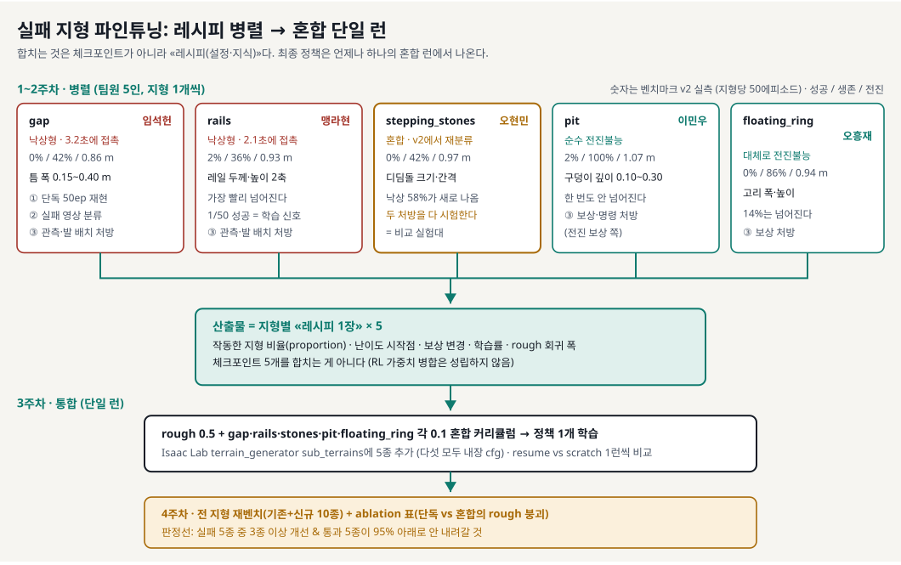

# 실패 지형 파인튜닝 실행 계획: 레시피 병렬, 혼합 단일 런

> 분류: 계획
> 작성: 오흥재 · 2026-08-27 12:10
> 근거: 실측
> 요지: 일반화 벤치마크 실패 5종을 5인이 하나씩 맡아 레시피를 찾고, 최종은 혼합 단일 런 1개로 합친다.
> 상태: 확정

> 입력: [일반화 벤치마크 v2](generalization-benchmark-10-terrains.md) (실패 5종·모드 지도, 지형당 50에피소드 `실측`) + [벤치마크 하네스 설정](benchmark-setup-lim.md) (10종 cfg 원문) + 문헌 조사 (하단 출처)
> 답하는 질문 (팀장 8/22): "팀원별로 지형을 나눠 병렬 강화학습하는 게 의미가 있는가? RL은 순차로 쌓아야 하지 않나?"
> 공식 Go2 rough cfg를 먼저 읽는 장은 [험지 학습 커리큘럼](go2-rough-training.md).

## 0. 원리 두 줄

1. **체크포인트를 나눠 만들면 합칠 방법이 없다.** 각자 파인튜닝한 정책 2개의 가중치 병합은 RL에서 성립하지 않는다. 그리고 단일 지형만으로 파인튜닝하면 기존 rough 성능이 무너진다 (catastrophic forgetting, ICML 2024에서 메커니즘 규명) `공식 문서`.
2. **그렇다고 순차도 아니다.** RL의 표준은 "A 끝내고 B"가 아니라 **혼합 동시 학습**: 한 런의 수천 개 병렬 환경이 서로 다른 지형 위에서 동시에 하나의 정책을 업데이트한다. Isaac Lab terrain generator가 바로 그 장치이고, **실패 5종의 지형 cfg는 다섯 개 모두 Isaac Lab에 내장**되어 있다 `확인됨`. 우리 벤치마크 하네스가 이미 그 다섯을 그대로 쓰고 있다 ([benchmark-setup-lim.md](benchmark-setup-lim.md) §지형 cfg).

따라서 병렬로 나누는 것은 **학습이 아니라 연구(레시피 찾기)**이고, 최종 학습은 언제나 **혼합 단일 런 1개**다.

> **2026-08-27 정정**: 이 문서의 앞 판은 병렬 갈래를 **4개**로 그렸다 (`gap`·`rails`·`stepping_stones`·`pit`). `floating_ring` 이 빠져 있었고, 그 근거로 "4종 cfg 내장"이라고 적혀 있었다. **틀렸다.** `MeshFloatingRingTerrainCfg` 도 내장이고 우리 하네스가 이미 쓰고 있다. 실패는 5종이고 팀은 5인이므로 갈래도 다섯이다. 도식·비율·산출물 수를 전부 고쳤다.

## 1. 지형 배정 (2026-08-27 확정)

실패는 5종이고 팀은 5인이라 **한 사람이 한 지형을 온전히 소유한다.** 소유한다는 것은 그 지형의 진단·레시피·최종 성능표에 대해 그 사람이 답한다는 뜻이다.

| 지형 | 담당 | v2 실측 (성공 / 생존 / 전진) | 실패 모드 | 손대야 할 곳 |
|---|---|---|---|---|
| `gap` | **임석헌** | 0% / 42% / 0.86 ± 0.11 m | 낙상 우세 (평균 3.2초에 몸통 접촉) | 관측 · 지형 커리큘럼 |
| `rails` | **맹라현** | 2% (1/50) / **36%** / 0.93 ± 0.32 m | 낙상 우세 (평균 2.1초) · **가장 빨리 넘어진다** | 관측 · 발 배치 보상 |
| `stepping_stones` | **오현민** | 0% / 42% / 0.97 ± 0.24 m | **혼합** (v1 전진불능 → v2에서 58% 낙상으로 재분류) | 두 처방을 다 시험해야 하는 유일한 지형 |
| `pit` | **이민우** | 2% (1/50) / **100%** / 1.07 ± 0.18 m | 순수 전진 불능 (한 번도 안 넘어짐) | 보상 · 명령 커리큘럼 |
| `floating_ring` | **오흥재** | 0% / 86% / 0.94 ± 0.20 m | 대체로 전진 불능 | 보상 커리큘럼 |

**배정의 근거**: 실패 모드가 두 종류라 처방이 갈린다. 낙상형 둘(`gap`·`rails`)은 관측과 발 배치, 전진불능형 둘(`pit`·`floating_ring`)은 보상 균형이다. `stepping_stones` 는 v2에서 둘 다 나타난 유일한 지형이라 **두 처방의 비교 실험대**가 된다. 이 자리는 A/평가 주담당(오현민)이 맡는 것이 맞다. 판정 기준을 만든 사람이 두 처방을 같은 자로 재야 하기 때문이다.

**시작 절차**: 각자 이슈를 하나 만들고 작업 영역은 `A/정책학습`, 마일스톤은 `MVP · 중간발표 9/30` 을 고른다. 제목은 `[지형이름] 진단 → 레시피` 로 통일한다.

### 1-1. 각자 만질 파라미터 (하네스 cfg 원문 기준 `확인됨`)

난이도 지도를 그릴 때 **무엇을 몇 단계로 나눌지**가 사람마다 달라지면 나중에 합칠 수 없다. 각자 아래 값을 기준으로 3~4단계를 만든다.

| 담당 | cfg 클래스 | 지금 값 | 난이도를 만드는 숫자 |
|---|---|---|---|
| 임석헌 | `MeshGapTerrainCfg` | `gap_width_range=(0.15, 0.40)` | 틈 폭. 좁은 쪽부터 넓힌다 |
| 맹라현 | `MeshRailsTerrainCfg` | `rail_thickness_range=(0.08, 0.18)` · `rail_height_range=(0.05, 0.18)` | 레일 두께와 높이. 두 축이라 격자로 본다 |
| 오현민 | `HfSteppingStonesTerrainCfg` | `stone_width_range=(0.35, 0.65)` · `stone_distance_range=(0.08, 0.20)` · `stone_height_max=0.12` | 디딤돌 크기와 간격 |
| 이민우 | `MeshPitTerrainCfg` | `pit_depth_range=(0.10, 0.30)` · `double_pit=False` | 구덩이 깊이 |
| 오흥재 | `MeshFloatingRingTerrainCfg` | `ring_width_range=(0.25, 0.60)` · `ring_height_range=(0.05, 0.16)` · `ring_thickness=0.12` | 고리 폭과 높이 |

전 지형 공통으로 `platform_width=1.5` 이고 `proportion` 은 벤치마크에서 각 0.1이다. 파인튜닝 런에서는 §3의 비율로 바꾼다.

### 1-2. 먼저 넘어야 할 물리 관문 (맹라현 조사, [`#61`](https://github.com/foothold-project/foothold-lab/issues/61) 2026-08-27)

**배정만으로 다섯이 동시에 출발하지 않는다.** 「같은 맵·같은 센서로 RL만 해서 되는가」를 먼저 가른 조사가 있고, 결론은 **지금 그대로 돌려도 되는 것은 `rails` 하나**다. 나머지 넷은 각자 자기 관문을 먼저 닫아야 학습이 의미를 갖는다. 관문을 안 닫고 돌린 런은 "학습이 부족한 것"인지 "물리적으로 불가능한 것"인지 구분이 안 되고, 그 구분이 안 되면 4주가 통째로 버려진다.

| 지형 | 담당 | 지금 상태 | 먼저 닫을 관문 | 못 닫으면 |
|---|---|---|---|---|
| `rails` | 맹라현 | **바로 가능** | 없음. 갈리는 것은 지지 폭이고 단차 중간 약 11.5 cm 로 감각선 안 | (해당 없음) |
| `gap` | 임석헌 | **보류** | 지금 맵 중간 틈 **약 27.5 cm** 를 Go2 가 건널 수 있는가. 공식 문서에 「몇 cm 틈을 건넌다」 항목이 없다 `미확인` | 맵을 고정한 채로는 물리 벽. `gap_width_range` 하한을 낮춘 맵으로 다시 정의해야 한다 |
| `stepping_stones` | 오현민 | **미측정** | 발을 빠뜨리는 틈 **약 14 cm** 가 height scan 격자 0.1 m · 노이즈 0.1 m 와 겹친다. 같은 센서로 보이는가 | 관측 문제이지 학습 문제가 아니다. 스캔 해상도나 돌 간격 중 하나를 바꿔야 한다 |
| `pit` | 이민우 | **보류** | 맵을 그대로 두면 다시 오르는 단차가 **약 20 cm** 다. 실무 감각선 약 16 cm 를 넘는다 (`추측`, [험지 커리큘럼](go2-rough-training.md) §Go2 조정) | `pit_depth_range` 상한을 낮춘 맵으로 다시 정의한다. 지금 깊이는 학습으로 열리는 벽이 아닐 수 있다 |
| `floating_ring` | 오흥재 | **가장 어려움** | 현재 정책의 height scan 으로는 **링 아래가 안 나온다.** 카메라나 2D 라이다를 넣는 순간 «센서가 바뀐 실험»이 되어 비교가 끊긴다 | 같은 센서로 안 되면 MVP 대상에서 뺀다. 대신 「왜 못 하는가」를 관측 한계 사례로 남긴다 (이것도 결과다) |

**이 표가 §2 진단의 0단계다.** 각자 자기 칸을 먼저 닫고, 닫힌 사람부터 §2로 넘어간다. `rails` 는 관문이 없으니 맹라현이 먼저 출발해 **레시피 형식의 본보기 1장**을 만든다. 나머지 넷은 그 형식을 따라간다. 이렇게 하면 다섯 장의 모양이 저절로 같아진다.

> **숫자 하나를 정정한다.** `#61` 은 16 cm 를 「공식」이라 불렀는데, 우리 문서에서 그 숫자의 근거는 **실무 감각(`추측`)** 이지 Unitree 공식 사양이 아니다. 결론(pit 20 cm 가 부담스럽다)은 그대로 유효하지만, **근거의 등급을 올려 적으면 나중에 그 위에 쌓은 판단이 함께 흔들린다.** 공식 등판 사양이 필요하면 [우리 Go2 사양](../ROBOT-SPEC.md)에 실측이나 공식 출처로 채워 넣는다.

## 2. 1주차: 진단 (5인 병렬)

각자 자기 지형 하나를 소유한다. 작업 단위:

0. **§1-2의 자기 관문을 먼저 닫는다.** 닫혔다는 것은 「이 맵·이 센서로 돌릴 수 있다」를 숫자로 말할 수 있다는 뜻이다. 못 닫으면 그 사실 자체를 진단 1장에 적고 다음으로 넘어가지 않는다.
1. 자기 지형 **단독** sub-terrain cfg로 기준선 정책을 50에피소드 평가 (v2 하네스 그대로). **위 표의 숫자를 재현하는 것이 첫 관문이다.** 안 나오면 하네스를 잘못 돌린 것이니 여기서 멈춘다.
2. 실패 영상을 보고 분류: 어디서 넘어지나 / 왜 멈추나. [벤치마크 문서 §4](generalization-benchmark-10-terrains.md)에 10종 전부의 주행 영상이 붙어 있으니 자기 것부터 본다.
3. 관측 점검: height scan이 그 지형의 위험(구멍·레일·고리)을 실제로 보는가. **스캔 격자 간격 0.1 m 와 자기 지형 특징 크기를 직접 대조한다.** 예: `gap_width` 최소 0.15 m 는 격자 1~2칸이다. 이게 위험을 표현하기에 충분한 해상도인지가 낙상형의 첫 가설이다.
4. 자기 지형의 **난이도 파라미터 지도** 작성: §1-1의 숫자를 3~4단계로 나눠 각 단계 성공률 측정 → "어디까지는 되고 어디부터 안 되나".

**산출물**: 지형 진단 1장 (실패 모드 + 난이도 경계 + 관측 판정). 다섯 장의 형식이 같아야 3주차에 합칠 수 있다.

## 3. 2주차: 레시피 탐색 (5인 병렬)

1. 학습 cfg: **기존 rough 혼합 0.6 + 자기 지형 0.4** (신규 지형 단독 금지: 혼합이 곧 망각 방지 rehearsal)
2. 기준선 체크포인트에서 **resume** 파인튜닝, 학습률 하향 (1e-3 → 1e-4 급), 커리큘럼은 §1-1에서 찾은 **가장 쉬운 단계부터**
3. 바꿔볼 것 (**한 번에 하나**):
   - 지형 비율 (0.2 / 0.4 / 0.6)
   - 난이도 범위 (진단에서 찾은 경계 전후)
   - 보상 가중치. **낙상형(임석헌·맹라현)은 발 배치·접촉 페널티 쪽, 전진불능형(이민우·오흥재)은 전진 보상 쪽.** 오현민은 두 방향을 각각 돌려 비교한다
   - 에피소드 길이
4. **모든 런에서 rough 회귀 지표 필수 계측.** 기존 지형 성공률이 떨어지면 즉시 표시한다 (forgetting 감시). 이 열이 비어 있는 런은 결과로 인정하지 않는다.
5. 실험 대장에 기록: cfg · 커밋 해시 · 결과 CSV · 텐서보드 링크

**산출물**: 지형별 **레시피 1장** × 5 (작동한 비율 · 난이도 시작점 · 보상 변경 · 하이퍼파라미터 · rough 회귀 폭)

## 4. 3주차: 통합 (단일 런)

1. 레시피 5장을 합쳐 전체 혼합 cfg 구성: **rough 계열 합계 0.5 + 신규 5종 각 0.1**
2. resume 런과 scratch 런을 1개씩 병행해 비교
3. 특정 지형이 뒤처지면 그 지형의 `proportion` 상향 (비율이 곧 커리큘럼 압력)

여기서부터는 담당이 사라진다. **정책은 하나이고 책임도 하나다.** 다섯이 각자 자기 지형의 숫자를 지키는 것이 아니라, 다섯 지형이 함께 올라가는 설정을 찾는 것이 목표다.

## 5. 4주차: 마감

전 지형(기존 rough + 신규 10종) 재벤치마크 → 최종 성능표. **ablation 표** (단독 파인튜닝 vs 혼합의 rough 붕괴 비교)는 forgetting을 눈으로 보여주는 발표 소재가 된다.

**MVP·중간발표(9/30) 판정선**: 실패 5종 중 **3종 이상**에서 성공률이 0~2%에서 유의하게 올라가고, 통과 5종의 성공률이 **95% 아래로 내려가지 않는 것**. 뒤 조건이 앞 조건보다 중요하다. 새 지형을 얻으려고 있던 것을 잃으면 그건 진전이 아니다.

## 6. 특권 관측(teacher-student)은 필요 없다

그 기법은 "시뮬에선 보이지만 실기 센서로는 안 보이는" 관측 격차 때문에만 존재한다 (Lee et al. 2020, RMA) `공식 문서`. 우리 정책은 실기에 배포하지 않고(트랙 B는 순정 보행 위의 항법이다), height scan은 이미 관측에 들어 있으므로 불필요한 복잡도다.

## 출처

[Rudin et al., Learning to Walk in Minutes](https://arxiv.org/abs/2109.11978) (혼합 지형 커리큘럼 원조) · [legged_gym terrain_proportions](https://github.com/leggedrobotics/legged_gym) · [Isaac Lab terrains API](https://isaac-sim.github.io/IsaacLab/main/source/api/lab/isaaclab.terrains.html) (실패 5종 cfg 전부 내장) · [Wołczyk et al., ICML 2024](https://arxiv.org/abs/2402.02868) (RL 파인튜닝 망각) · [Robot Parkour Learning](https://arxiv.org/abs/2309.05665) (specialist 병렬→증류, 스트레치 옵션) · [Lee et al., Science Robotics 2020](https://www.science.org/doi/10.1126/scirobotics.abc5986) (특권 관측)
