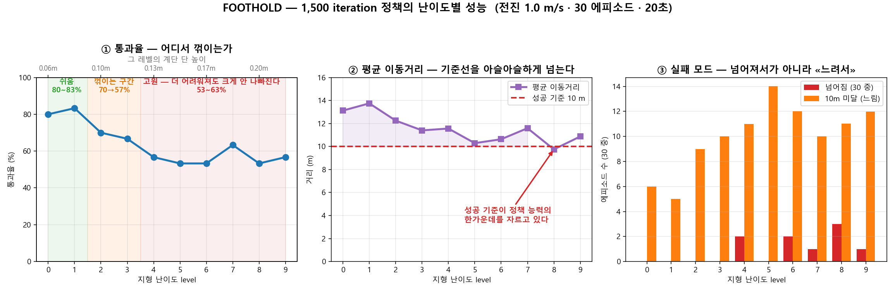

# 학습 성능 실측 — Go2 험지 (AI-WS01)

> 작성 2026-08-09 · 측정 환경 **AI-WS01** (RTX 5080 ×2 · Threadripper 7970X · 256GB RAM · Windows 11)
> 성격: **웹 조사가 아니라 이 기계에서 실제로 돌린 숫자.** 전부 로그에서 추출.
> 관련: [`SETUP_GUIDE`](../../../02_team/SETUP_GUIDE.md) · `cloud-gpu-options.md` · `ros2-isaacsim-integration.md`

---

## 0. 세 줄

1. **험지 학습 처리 속도 = 약 23,000 steps/s** (4096 envs, RTX 5080 1장). 1 iteration 4.17초. **1,500 iteration 완주 = 약 104분.**
2. **🔴 `collisionApproximateCylinders=true` 플래그는 봉인한다.** 속도는 2.4배 오르지만
   **같은 시간을 줘도(B 700회 24분 vs A 300회 22분) A의 34%(보상 4.80 vs 13.94)에 그치고 정체된다.**
   느린 게 아니라 **물리가 달라져 도달 상한이 낮아진 것**이다. 시드 고정 후 3회 측정으로 확정.
3. **학습은 실제로 된다** — 300 iteration에 보상 −0.47 → **+13.94**, 에피소드 길이 11.87 → **938.7 step**(최대 1000의 93.9% = 18.8초 생존).

---

## 1. 측정 조건 (재현용)

```powershell
conda activate isaac311
cd C:\isaac\IsaacLab
$env:OMNI_KIT_ACCEPT_EULA="YES"

python train_go2_win.py --task Isaac-Velocity-Rough-Unitree-Go2-v0 `
    --num_envs 4096 --max_iterations 300 --seed 42 --headless
```
※ `train_go2_win.py` = Windows 우회 래퍼(네이티브 확장 선점 import). `SETUP_GUIDE` §5 참조.

**환경 설정 (실제 파일에서 확인)**

| 항목 | 값 | 파일 |
|---|---|---|
| `num_steps_per_env` | **24** | `.../go2/agents/rsl_rl_ppo_cfg.py:13` |
| `max_iterations` (기본) | **1500** | 같은 파일 `:14` — NVIDIA 기본값, 변경 가능 |
| `sim.dt` | **0.005초** (200Hz) | `velocity_env_cfg.py:311` |
| `decimation` | **4** → 정책 **50Hz** | `:308` |
| `episode_length_s` | **20.0초** → 최대 **1000 step** | `:309` |
| 지형 | 8m×8m 타일 **10행 × 20열 = 200개** | `terrains/config/rough.py` |

**단위 환산**
```
1 step        = 물리 4틱 = 0.02초 (정책 1회 명령)
1 iteration   = 4096 envs × 24 step = 98,304 env-steps
              = 로봇 1대 기준 32.8분치 경험
에피소드 최대 = 20초 = 1000 step
```

---

## 2. ★ 플래그 A/B — `collisionApproximateCylinders`

**배경**: 사전조사에서 *"Go2 험지가 평지 대비 6배 느리다. 원인은 다리 실린더 콜리전. 우회 플래그 있음"*으로 나왔으나 **미검증 상태**였다.

```powershell
# B 조건에만 추가
--kit_args="--/physics/collisionApproximateCylinders=true"
```

### 1차 측정 (30 iteration, ⚠️ **시드 미고정**)

| | A (플래그 없음) | B (플래그 있음) | 차이 |
|---|---|---|---|
| **처리 속도** | 23,591 steps/s | **53,141 steps/s** | **+125%** |
| iteration 1회 | 4.17초 | **1.85초** | −56% |
| 벽시계 (30 iter) | 2.64분 | 1.43분 | |
| 샘플 수 | 28 (워밍업 2회 제외) | 28 | |
| 범위 | 21,602 ~ 24,740 | 44,656 ~ 60,342 | **겹치지 않음** |
| 학습 총량 | 2,949,120 | 2,949,120 | 동일 |
| 마지막 평균 보상 | −2.32 | −2.49 | |
| **마지막 평균 에피소드 길이** | **425.53 step** | **212.82 step** | ⚠️ **절반** |

### ★★ 2차 측정 (300 iteration, **시드 42 고정**) — 결론

| | **A (플래그 없음)** | **B (플래그 있음)** |
|---|---|---|
| 벽시계 | 22.07분 | **9.48분** (2.33배) |
| 처리 속도 | 22,867 steps/s | **54,898 steps/s** (2.40배) |
| **마지막 20회 평균 보상** | **13.94** | **3.54** |
| **마지막 20회 평균 에피소드 길이** | **938.7 step** (93.9% · 18.8초) | **551.1 step** (55.1% · 11.0초) |
| 첫 보상 / 첫 에피길이 | −0.47 / 11.87 | −0.45 / 11.87 (동일 출발) |

> ### 🔴 결론: **플래그는 공짜가 아니다**
> **시드를 똑같이 고정했는데도 차이가 크다.** 1차의 "에피소드 절반"은 우연이 아니었다.
> **같은 300번을 갱신했는데 B는 보상이 A의 1/4, 버티는 시간이 절반**이다.
> → **속도 2.4배를 얻는 대신 학습 품질을 크게 잃는다.**

**원인 가설(미검증)**: 플래그가 Go2 정강이의 **원통 콜리전을 근사**하므로 접촉 형상이 달라진다. 발이 지형에 걸리거나 미끄러지는 양상이 바뀌어 로봇이 더 자주 넘어진다.

### ★★★ 3차 — 같은 벽시계 시간을 B에게 줬다 (공정 비교) `확인됨`

"B는 2.3배 빠르니 같은 시간에 더 많이 돌면 따라잡지 않을까?" 를 검증했다.

| | **A (플래그 없음)** | **B (플래그 있음)** |
|---|---|---|
| iteration | **300회** | **700회** (2.33배 더 많이) |
| 벽시계 | 22.07분 | **24.02분** (9% 더 오래 씀) |
| steps/s | 22,867 | 49,114 |
| **최종 보상** | **13.94** | **4.80** ← A의 **34%** |
| **최종 에피소드 길이** | **938.7 step** (18.8초) | **605.4 step** (12.1초) |

**B의 진행 곡선 — 정체가 명확하다**
```
B  300 iteration : 보상 3.52 / 에피길이 533.92
B  700 iteration : 보상 4.76 / 에피길이 604.28
   → 400번을 더 돌렸는데 보상 +1.24, 에피길이 +70 에 그침
```
A는 300번 만에 13.94에 도달했다. **B는 더 돌린다고 따라잡을 곡선이 아니다.**

> ## 🔴 최종 판정: **플래그를 봉인한다**
> 이건 *"느리게 배우는 것"*이 아니라 **다른(망가진) 물리에서 배우는 것**이다.
> 원통 콜리전을 근사하면서 접촉이 부정확해졌고, **로봇이 도달할 수 있는 상한 자체가 낮아졌다.**
> **속도 2.4배는 실재하지만, 그 속도로 도달하는 곳이 다르다.**

*(부수 관찰: 700회 실행에서 49,114 steps/s 로 300회 때(54,898)보다 떨어졌다. 커리큘럼이 어려운 지형으로 승급하며 충돌 계산이 늘어난 것으로 **추정**된다 — 미검증.)*

### 실무 권고 — 확정

| 상황 | 권고 |
|---|---|
| **모든 학습** | 🔴 **플래그를 쓰지 않는다.** 속도 이득보다 품질 손실이 훨씬 크다 |
| 사전학습 체크포인트와 비교 | **특히 금지** — 그 체크포인트는 기본 물리로 학습됐다. 켜고 비교하면 사과와 오렌지 |
| "험지가 느리다"는 문제 | **다른 해법을 찾아야 한다.** 이 플래그는 답이 아니었다 |

**→ `SETUP_GUIDE` §9의 "미검증 플래그" 항목은 이것으로 해소됐다. 결론: 쓰지 않는다.**

### 실무 함의 (속도만 놓고 보면)

| | 1,500 iteration 학습 시간 | 하루(8시간) 가능 횟수 |
|---|---|---|
| A | **104분** | 약 4~5회 |
| B | **46분** | 약 10회 |

> ⚠️ **단 GPU 처리량이 병목이 아니다.** 1 사이클 = 학습(46~104분) + 결과 판독(15분) + 판단(30분) + 수정(15분).
> **사람의 판단이 병목**이므로 실질 사이클은 하루 4~5회다.

---

## 3. 학습이 실제로 되는가 — 진행 곡선

**같은 실행(A 조건, 시드 42) 안에서의 변화:**

| iteration | Mean reward | Mean episode length | 최대 대비 | 실제 생존 |
|---|---|---|---|---|
| 1 | −0.47 | 11.87 step | 1.2% | 0.24초 |
| 30 | **−2.32** | 425.53 step | 42.6% | 8.5초 |
| 193 | +10.78 | 983.82 step | 98.4% | 19.7초 |
| 277 | +13.32 | 898.35 step | 89.8% | 18.0초 |
| **300** | **+13.94** | **938.7 step** | **93.9%** | **18.8초** |

> ⚠️ **193 → 277에서 에피소드 길이가 내려간 것은 나쁜 신호가 아니다.**
> Isaac Lab은 **지형 커리큘럼**을 쓴다 — 로봇이 잘하면 **더 어려운 지형으로 승급**시킨다.
> 그래서 **보상은 오르는데 에피소드 길이는 출렁이는 것이 정상**이다. 어려운 데 가서 다시 넘어지기 때문이다.

**읽는 법**
- **보상이 음수 → 양수로 넘어갔다.** 음수는 *"벌이 상보다 크다"* = 아직 못 걷는다. 양수는 걷는다는 뜻
- **에피소드 길이 983.82 / 1000** = 20초 중 19.7초를 버틴다. 거의 안 넘어진다
- 30 iteration일 때 −2.32였던 건 **정상**이다. `train.py`는 사전학습 체크포인트를 쓰지 않고 **랜덤 초기화에서 시작**한다

> ⚠️ **혼동 주의**: `play.py --use_pretrained_checkpoint`로 보는 영상은 **NVIDIA가 1,500 iteration 완주시킨 정책**이다.
> `train.py`는 **처음부터** 배운다. 둘은 다른 실험이다.

---

## 4. 보상 설계 — 우리가 실제로 건드릴 곳

**위치**: `source/isaaclab_tasks/isaaclab_tasks/manager_based/locomotion/velocity/velocity_env_cfg.py` 의 `class RewardsCfg`

| 항목 | 가중치 | 뜻 |
|---|---|---|
| `track_lin_vel_xy_exp` | **+1.0** | 명령한 속도대로 감 — **가장 큰 상** |
| `track_ang_vel_z_exp` | **+0.5** | 명령한 회전대로 함 |
| `feet_air_time` | **+0.125** | 발을 적절히 공중에 띄움 (질질 끌기 방지) |
| `lin_vel_z_l2` | **−2.0** | 위아래로 튐 — **가장 큰 벌** |
| `undesired_contacts` | **−1.0** | 발 아닌 부위가 땅에 닿음 (무릎·몸통) |
| `ang_vel_xy_l2` | −0.05 | 좌우로 기우뚱 |
| `action_rate_l2` | −0.01 | 명령이 급변 (덜덜 떨기 방지) |
| `dof_torques_l2` | −1.0e-5 | 관절 힘 소모 |
| `dof_acc_l2` | −2.5e-7 | 관절 가속 |
| `flat_orientation_l2` / `dof_pos_limits` | 0.0 | 험지에선 꺼둠 |

**출처**: NVIDIA Isaac Lab 기본값. 계보는 Rudin et al. 2021 legged_gym.

> ⚠️ **한 번에 하나씩만 바꿀 것.** NVIDIA 본인들도 평지→험지 전환에 **7곳을 연동 변경**했고
> 그중 `feet_air_time`은 **0.01 → 0.25로 25배** 바뀌었다. 여러 개를 동시에 바꾸면 무엇 때문인지 알 수 없다.

**"Mean reward"의 정의** (rsl_rl 소스 확인): 에피소드 하나가 끝날 때 그동안 받은 보상을 **전부 더한 값(총점)**을 기록하고, **최근 100개 에피소드 총점의 평균**을 표시한다. 스텝당 평균이 아니다.

---

## 5. 멀티 GPU — ❌ **판정 완료: Windows 에서는 구조적으로 불가** `확인됨`

- **RTX 50 시리즈에는 NVLink가 없다.** 실측 확인: Isaac Sim 기동 로그에 `CUDA peer access: Not supported`
- → **VRAM 16+16=32GB로 합쳐지지 않는다.** 각 GPU는 여전히 16GB
- `train.py` 에 `--distributed` 플래그는 실재한다(`:31`)

### 실측 (2026-08-11)

```
python -m torch.distributed.run --nnodes=1 --nproc_per_node=2 train_go2_win.py --distributed ...
```

| 시도 | 결과 |
|---|---|
| 1차 | `torch.distributed.DistStoreError: use_libuv was requested but PyTorch was built without libuv support` |
| 2차 (`USE_LIBUV=0`) | 같은 오류 — 표면 증상이었다 |
| **근본 원인 확인** | `torch.distributed.is_nccl_available()` → **`False`** |

```
torch      : 2.7.0+cu128
GPU 개수   : 2
NCCL 사용가능 : False      ← ★ 이것이 판정
gloo 사용가능 : True
```

> ### **PyTorch Windows 빌드에는 NCCL 이 들어가지 않는다.**
> NCCL 은 GPU 끼리 직접 데이터를 주고받는 라이브러리이고, DDP GPU 학습은 이것이 있어야 한다.
> `gloo` 는 대체재지만 CPU 를 거쳐서 GPU 학습용으로는 쓰지 못한다.

### 앞선 추론에 대한 정정

이전 판(v1)에 *"구조적으로 유리할 것으로 보인다 — 교환할 것은 gradient뿐인데 학습이 0.14초, 시뮬이 4초다"*
라고 적었다. **그 추론 자체는 여전히 타당하지만, Windows 에서는 시험할 수조차 없다.**
**추론을 실측이 대체한 것이 아니라, 실측이 "시험 불가"를 확정했다.**

### 이것이 뜻하는 것

| | Windows | Ubuntu |
|---|---|---|
| GPU 1장 학습 | ✅ 실측 22.07분/300 iter | ✅ |
| **GPU 2장 DDP** | ❌ **불가** | ✅ (미측정) |
| GPU 2장에 **서로 다른 학습 2개** | ✅ 가능 (`--device cuda:0` / `cuda:1`) | ✅ |

> **두 번째 5080 은 지금 "1개 학습을 2배 빠르게"에는 못 쓴다. "다른 실험을 동시에"에는 쓸 수 있다.**
> 우분투 전환이 «하면 좋은 것»에서 «안 하면 장비 절반이 노는 것»으로 바뀌었다.
> DDP 실측은 우분투 전환 후로 이월한다.

---

## 5-2. ★ 평가 파이프라인 v1 — 첫 착수와 그 과정에서 잡은 함정 3개

`C:\isaac\IsaacLab\eval_go2.py` (2026-08-11 신설)

**목적**: 지금까지 «보상 13.94» 같은 학습 지표만 있었다. 그건 *학습이 잘 됐다*는 뜻이지
**로봇이 실제로 목적을 달성하는가**를 말해주지 않는다.

**성공 정의 (임시안 v1)**: ① 전진 10m 이상 ② 넘어짐 없음 ③ 제한시간(20초) 내
→ CSV 헤더 주석에 명시한다. 정의가 바뀌면 CSV 도 같이 바뀌게.

### 함정 ① Isaac Sim Kit 은 stdout 을 가로챈다

`print()` 가 로그 파일에 **하나도 남지 않는다.** 스크립트는 정상 종료(exit=0)하고 CSV 도 쓰는데
화면에는 아무것도 없다. **"화면에 안 보이는 것"과 "실행되지 않은 것"이 구분되지 않는다.**
→ **진단은 반드시 파일로 쓴다.**

### 함정 ② 평가 조건을 학습 조건과 다르게 만들면 정책이 얼어붙는다

명령을 «전진 1.0 m/s 고정»으로 두려고 `heading_command=False`, `resampling_time_range=(1e6,1e6)` 로 바꿨더니
**로봇이 20초 내내 미동도 하지 않았다**(실제 vx = −0.00, 이동 0.59m).
기본 랜덤 명령으로 두면 4.80m 를 갔다.

**학습 원본 설정**(`velocity_env_cfg.py:94`):
```
lin_vel_x (-1,1) · lin_vel_y (-1,1) · ang_vel_z (-1,1) · heading (-π,π)
heading_command=True · rel_standing_envs=0.02 · resampling_time_range=(10,10)
```
→ **평가는 학습 분포에서 최소한만 벗어나야 한다.** 지금은 `lin_vel_x` 범위와
`rel_standing_envs` 만 바꾼다.

### 함정 ③ ★ PLAY 설정은 로봇을 랜덤 난이도 지형에 떨어뜨린다

`UnitreeGo2RoughEnvCfg_PLAY` 는 `max_init_terrain_level=None` + `curriculum=False` 다.
진단에서 실제로 이런 스폰이 나왔다:

```
루트 위치 z = -0.187          ← 지면 아래
중력[6:9] = [0.294, 0.255, -0.921]   → 기울기 22.9도
명령[9:12] = [1.0, 0.0, 0.321]       ← 명령은 정상 전달됨
```

**로봇이 지형에 파묻힌 채 기울어져 시작한다.** 그 에피소드는 **정책 실력과 무관하게 0m 로 기록된다.**
→ 평가에서는 `max_init_terrain_level` 을 **고정한다**(`--level`). 평가의 생명은 일관성이다.

### 진단 코드 자신의 버그도 하나 잡았다

관측 인덱스를 `6:9` 가 명령이라고 가정했는데 **거기는 `projected_gravity`** 였다.
정확한 배치:

```
0:3    base_lin_vel        3:6    base_ang_vel
6:9    projected_gravity   9:12   velocity_commands   ← 명령은 여기
12:24  joint_pos          24:36   joint_vel
36:48  actions            48:235  height_scan (187)
```

**`height_scan` 187 의 정체** (`velocity_env_cfg.py:66`):
```
격자 1.6m × 1.0m · 해상도 0.1m → x축 17점 × y축 11점 = 187점
몸통 20m 위에서 아래로 광선을 쏴 지면까지 거리를 잰다 (ray_alignment="yaw")
관측에 넣을 때 ±0.1m 노이즈 + (-1,1) clip
```

---

## 5-3. ★★ 첫 성능 기록 — 학습량 대비 «실제로 걷는가» (2026-08-11)

### 이 절의 한 줄

> # **보상 13.94 는 «잘 걷는다»를 뜻하지 않았다.**
> 같은 정책의 실제 통과율은 **0%** 였다. 학습 로그만 봤다면 «잘 되고 있다»고 보고했을 것이다.

### 1,500 iteration 완주 실측

| | 값 |
|---|---|
| 벽시계 | **134.42분** (추정 104분 대비 **+29.2%**) |
| 최종 보상(마지막 20회) | **22.878** |
| 에피소드 길이 | **974.84** / 1000 |
| 실행 | `logs/rsl_rl/unitree_go2_rough/2026-08-11_20-32-58` |

**⚠️ 추정이 29% 틀린 이유 — 실험 설계 때문이다.**
추정 104분은 «300회 22.07분 × 5»로 **단독 실행**을 전제했다. 그런데 그 134분 내내
**GPU 1 에서 평가 실험을 병행**했다. GPU 는 나뉘어도 **CPU·메모리 대역폭은 공유**한다.
→ 단독이면 104분에 가까울 것이나 **재보지 않았으므로 추정이다.**
→ **교훈: 벤치마크 중에는 같은 기계에서 다른 작업을 돌리지 않는다.**

### 학습 곡선 (100 iteration 간격)

| iter | 보상 | 에피길이 |
|---|---|---|
| 1 | −0.47 | 11.9 |
| 101 | 6.12 | 936.0 |
| **301** | **14.37** | 946.0 |
| 501 | 19.13 | 945.5 |
| 901 | 20.22 | 954.1 |
| 1301 | **23.36** | 973.9 |
| 1500 | 22.28 | 979.2 |

**500회 이후 상승이 완만하다.** 19 → 23 으로 1,000 iteration 에 4 밖에 안 올랐다. **수확 체감이 뚜렷하다.**

### ★ 평가 결과 — 같은 프로토콜로 30 에피소드씩

**프로토콜**: 전진 1.0 m/s 고정 · 지형 난이도 level 0 · 20초 · 관측 노이즈 끔 · 30 에피소드
**성공 정의**: 전진 10m 이상 · 넘어짐 없음 · 제한시간 내

| 정책 | 명령 | **통과율** | 평균 이동 | 넘어짐 | 시간초과 |
|---|---|---|---|---|---|
| 300회 | **고정 1.0** | **0.0%** (0/30) | 0.62 m | 3 | 27 |
| 300회 | 랜덤 | 20.0% (6/30) | 6.11 m | 3 | 27 |
| **1,500회** | **고정 1.0** | **★ 86.7%** (26/30) | **13.73 m** | **0** | 30 |
| 1,500회 | 랜덤 | 26.7% (8/30) | 8.52 m | 1 | 29 |

### 읽는 법

**① 학습량이 실제 성능을 바꾼다 — 그런데 지표보다 훨씬 극적으로 바꾼다**
```
보상    13.94 → 22.88   (1.64배)
통과율   0.0% → 86.7%   (0 에서 86.7 로)
넘어짐      3 → 0
```
**보상은 1.6배 올랐는데 통과율은 0 에서 86.7% 가 됐다.** 학습 지표의 선형 개선이
실제 성능에서는 **문턱을 넘는 형태**로 나타난다. **지표만 보면 이 문턱을 못 본다.**

**② 300회 정책이 «고정 명령에서 얼어붙은» 것은 평가 도구의 결함이 아니었다**
영상으로 확인한 결과 **다리를 벌리고 몸을 낮춘 자세로 버티기만 했다.**
보상이 높았던 이유는 «넘어지지 않아서»(에피소드 길이 938)이지 «잘 걸어서»가 아니다.
1,500회 정책은 같은 조건에서 **넘어짐 0회로 13.73m** 를 갔다. **도구가 아니라 대상이 문제였다.**

**③ 랜덤 명령의 통과율이 낮은 것은 당연하다 — 성공 정의 때문이다**
성공 정의가 «10m 전진»인데 랜덤 명령은 방향이 계속 바뀐다. 로봇이 잘 걸어도
시작점에서 멀어지지 않으면 실패로 기록된다.
→ **평가 프로토콜은 «고정 전진 명령»을 전제한다.** 랜덤 명령 수치는 참고값으로만 쓴다.

### 산출물

```
docs/assets/eval/cmp_300_fixed.csv     0.0%  (0/30)
docs/assets/eval/cmp_300_random.csv   20.0%  (6/30)
docs/assets/eval/cmp_1500_fixed.csv   86.7% (26/30)   ← 기준선
docs/assets/eval/cmp_1500_random.csv  26.7%  (8/30)
```

CSV 는 에피소드별 `success · distance_m · fell · time_s · steps · timeout` 을 담고,
**헤더 주석에 성공 정의와 실행 조건을 함께 기록**한다 — 정의가 바뀌면 CSV 도 같이 바뀌게.

### 이것이 여는 것

> **«우리는 무엇을 개선했는가»에 답할 수 있는 축이 생겼다.**
> 지금 기준선은 **86.7% @ level 0, 1.0 m/s** 다.
> 다음 질문은 «난이도를 올리면 어디서 무너지는가»이고, 그 지점이 **우리 프로젝트의 문제 정의**가 된다.

---

## 5-4. ★★★ 난이도 곡선 — **어디서 무너지는가 = 우리 문제 정의** (2026-08-12)



### 먼저 `level` 이 무엇인가

지형은 **6종이 섞여** 있고, 난이도(행 번호)에 따라 각 지형의 파라미터가 커진다.

| 지형 | 비율 | 난이도로 변하는 것 |
|---|---|---|
| 계단 오름 | 20% | 단 높이 **0.05 → 0.23 m** |
| 계단 내림 | 20% | 단 높이 **0.05 → 0.23 m** |
| 랜덤 박스 | 20% | 박스 높이 **0.05 → 0.20 m** |
| 무작위 요철 | 20% | 요철 **0.02 → 0.10 m** |
| 경사 오름 | 10% | 기울기 **0 → 0.4** (약 22도) |
| 경사 내림 | 10% | 기울기 **0 → 0.4** |

```
difficulty = (행번호 + 랜덤 0~1) / 전체행수          (terrain_generator.py)
단 높이    = 0.05 + difficulty × (0.23 − 0.05)      (mesh_terrains.py:76)
```

**level 5 ≈ 계단 14 cm · 박스 13 cm · 요철 6 cm · 경사 12도.**
Go2 몸통 높이가 약 35 cm 이므로 **14 cm 턱은 다리 길이의 절반 가까이**다.

### 결과 (1,500 iteration 정책 · 전진 1.0 m/s · 30 에피소드 · 20초)

| level | 계단 높이 | **통과율** | 평균 이동 | 넘어짐 | 시간초과 |
|---|---|---|---|---|---|
| 0 | 0.06 m | 80.0% | 13.12 m | 0 | 30 |
| 1 | 0.08 m | **83.3%** | 13.75 m | 0 | 30 |
| 2 | 0.10 m | 70.0% | 12.25 m | 0 | 30 |
| 3 | 0.11 m | 66.7% | 11.40 m | 0 | 30 |
| 4 | 0.13 m | 56.7% | 11.56 m | 2 | 28 |
| 5 | 0.15 m | 53.3% | 10.29 m | 0 | 30 |
| 6 | 0.17 m | 53.3% | 10.63 m | 2 | 28 |
| 7 | 0.19 m | 63.3% | 11.59 m | 1 | 29 |
| 8 | 0.20 m | 53.3% | **9.75 m** | 3 | 27 |
| 9 | 0.22 m | 56.7% | 10.87 m | 1 | 29 |

### ★ 읽는 법 — 세 가지가 나온다

**① 꺾이는 지점은 level 1 → 4 사이다**
```
level 0~1 : 80~83%   쉬움
level 2~3 : 70→67%   ← 여기서 꺾이기 시작
level 4~9 : 53~63%   고원 — 더 어려워져도 크게 안 나빠진다
```
**level 4 이후로는 난이도를 두 배로 올려도 통과율이 거의 안 떨어진다.**
즉 이 정책은 **«어려운 지형 일반»에 대해 일정한 실력**을 갖고 있고,
그 실력의 천장이 **50%대**다.

**② ★ 실패의 원인은 «넘어짐»이 아니라 «느림»이다 — 이것이 핵심 발견**

| | 30 에피소드 중 |
|---|---|
| 넘어져서 실패 | **0 ~ 3개** |
| **10 m 를 못 가서 실패** | **5 ~ 14개** |

**거의 모든 에피소드가 20초를 다 쓰고 끝난다(시간초과 27~30).**
로봇은 **넘어지지 않는다. 다만 험지에서 느려진다.**

> ### **→ 우리가 개선할 것은 «안 넘어지게»가 아니라 «험지에서도 속도를 유지하게»다.**
> 이것이 프로젝트의 **첫 구체적 문제 정의**다. 그리고 이건 보상 설계에서 손댈 수 있다
> (`track_lin_vel_xy_exp` 가중치 · 지형별 속도 커리큘럼 등).

**③ 성공 기준 10 m 가 정책 능력의 한가운데를 자르고 있다**
평균 이동거리가 **13.75 m → 9.75 m** 로 줄면서 **기준선 10 m 를 걸치고 지나간다.**
그래서 통과율이 민감하게 흔들린다(53~63% 진동).

이건 **지표 설계의 문제이기도 하다.** 기준을 8 m 로 낮추면 대부분 통과하고,
12 m 로 올리면 대부분 실패한다. **10 m 는 지금 정책에 대해 «변별력이 가장 높은» 지점**이라
초기 기준으로는 적절하나, **정책이 좋아지면 기준도 올려야** 한다.

### 실패 모드가 바뀌지 않는다는 것의 의미

넘어짐이 level 8 에서도 3/30 뿐이다. **안정성(넘어지지 않기)은 이미 확보돼 있다.**
남은 것은 **주행 성능**이다. 이건 좋은 신호다 — **더 위험한 문제가 이미 풀려 있다.**

### 산출물

```
docs/assets/eval/lvl0.csv ~ lvl9.csv        난이도별 에피소드 원본
docs/assets/visual/09_difficulty_curve.png  곡선 그림 3종
docs/assets/video/eval_lv0/3/6/9.mp4        난이도별 주행 영상
```

---

## 6. 미확인 / 다음 측정

| 항목 | 상태 |
|---|---|
| ~~300 iteration 시드 고정 A/B~~ | ✅ **완료** (§2) |
| ~~플래그가 물리를 바꾸는가~~ | ✅ **판정 완료 — 바꾼다. 봉인** (§2 3차) |
| ~~GPU 2장 DDP 효과~~ | ✅ **판정 완료 — Windows 는 구조적 불가** (§5). 우분투로 이월 |
| ~~1,500 iteration 완주 실측~~ | ✅ **완료 — 134.42분** (§5-3) |
| ~~평가 파이프라인~~ | ✅ **v1 완료 — 기준선 86.7%** (§5-3) |
| ~~GUI 모드 렌더 성능 (Path Tracing)~~ | ✅ **완료** → [render-benchmarks.md](render-benchmarks.md) |
| **난이도별 성능 곡선** | **미측정** ← 다음. 어디서 무너지는가 = 우리 문제 정의 |
| **1,500회 정책 단독 학습 시간** | 미측정 (134분은 평가 병행 상태) |
| **NVIDIA 공식 체크포인트 통과율** | 미측정 — 같은 프로토콜로 재면 «남의 기록» 비교가 된다 |
| 우분투에서 DDP 효과 | 미측정 (전환 후) |
| 700회에서 steps/s가 떨어진 이유 | 추정만 (커리큘럼 승급 → 충돌 증가) |

## 변경 이력
- 2026-08-09 v1: 플래그 A/B 1차(30 iter) + 학습 진행 곡선(193 iter) 기록. 300 iter 재측정 진행 중.
- 2026-08-11 v2: DDP 판정(§5) · 평가 파이프라인 v1 과 함정 4개(§5-2) ·
  **1,500 iteration 완주와 첫 성능 기준선 86.7%(§5-3)**.
  핵심 발견: **보상 13.94 는 «잘 걷는다»를 뜻하지 않았다** — 같은 정책의 통과율은 0% 였다.
