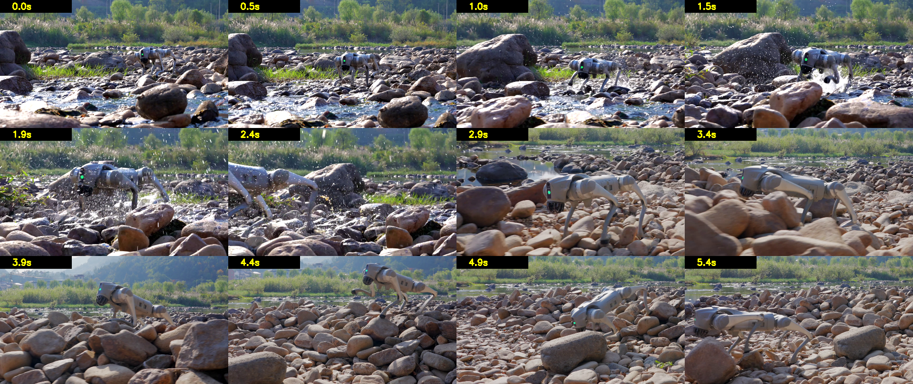
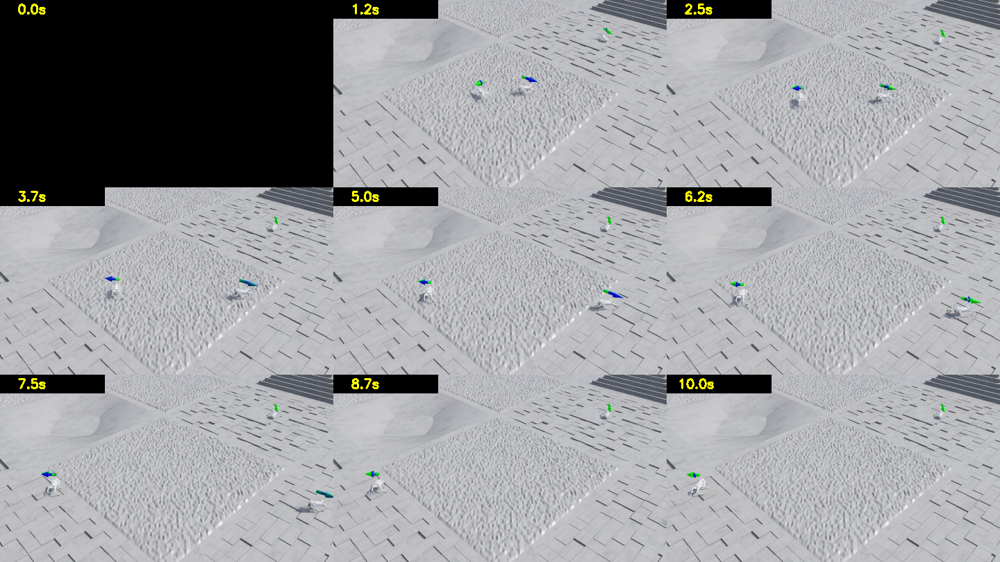
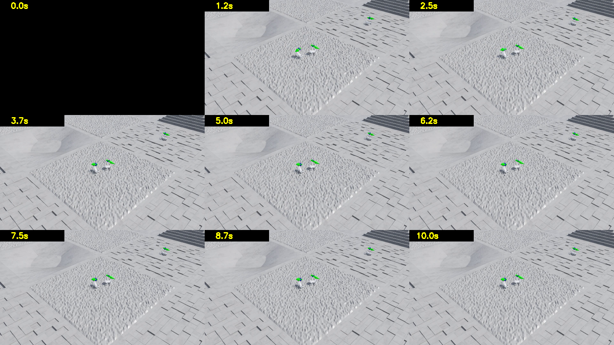
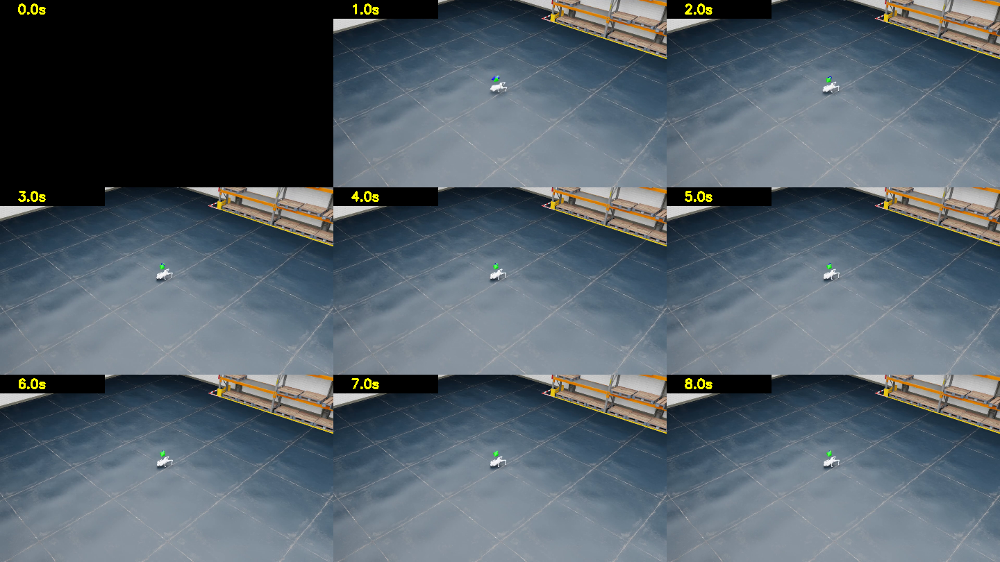
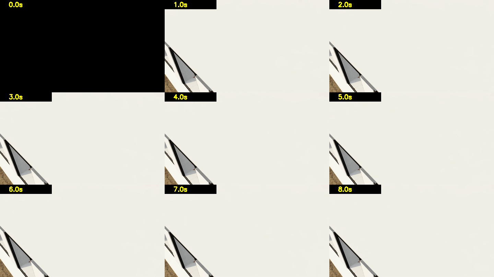
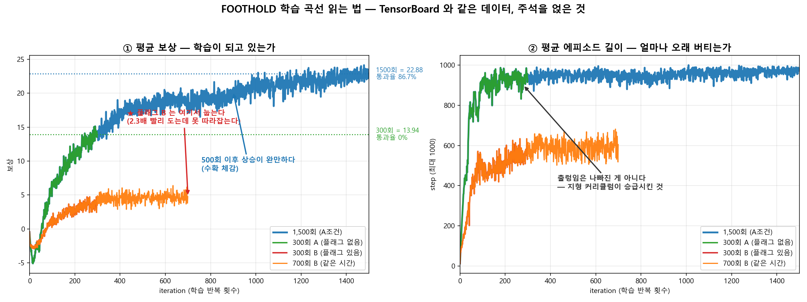
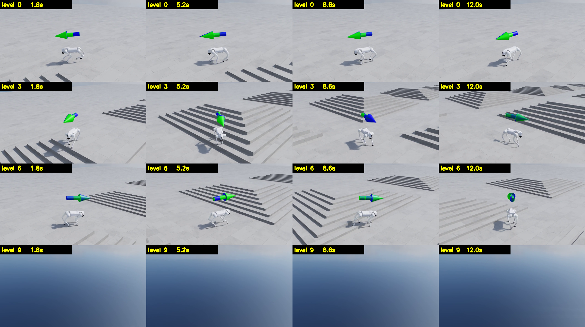

# 시각 증거: 우리가 실제로 본 것

> 분류: 실험
> 작성: 오흥재 · 2026-08-09 23:48
> 근거: 실측
> 요지: 숫자로만 보던 학습 결과를 눈으로 확인한 기록. 보상 13.94 정책이 실제로는 걷지 못하는 것을 영상이 잡았다.
> 상태: 확정
> 판: v1.0

> 작성 2026-08-09 · 워크스테이션 세션
> **이 문서의 목적**: 학습 결과를 숫자로만 보지 않고 **눈으로 확인한 기록**을 남긴다.
> 로봇공학을 모르는 사람이 봐도 "무슨 일이 있었는지" 알 수 있게 쓴다.

모든 이미지는 영상에서 **1초 간격으로 프레임을 뽑아 격자로 붙인 것**이다.
왼쪽 위 노란 숫자가 영상 안에서의 시각(초)이다.

---

## 왜 프레임을 뽑았나

학습 결과는 보통 **숫자 두 개**(보상, 에피소드 길이)로만 확인한다.
그런데 숫자만으로는 *"로봇이 실제로 어떻게 움직이는지"*를 모른다.

영상에서 프레임을 뽑아 나란히 놓으면 **로봇이 화면 어디에 있는지**가 보인다.
**위치가 변하면 걷는 것이고, 안 변하면 제자리에 있는 것이다.** 이게 가장 확실한 검증이다.

> 커널 원칙 3: *사용자가 겪는 층위에서 확인한다.*
> 학습 로그의 숫자는 대리 신호(proxy)다. 영상은 결과 그 자체다.

**추출 방법** (도구 설치 불필요, 이미 있는 것으로 됨):
`imageio_ffmpeg` 패키지에 동봉된 ffmpeg + OpenCV. 스크립트 40줄.

> ⚠️ **영상 파일(mp4)은 이 저장소에 없다.** `.gitignore:19`가 `*.mp4`를 막는다(팀 정책, 대용량 산출물).
> 아래 표의 `assets/video/…` 경로는 **워크스테이션 로컬에만 존재**한다.
> 이 PNG 컨택트시트들이 영상을 대신하는 공유용 증거다.
> (영상 자체를 공유하려면 정책 예외를 두거나 외부 호스팅이 필요. **미결정**)

---

## 00. 목표 지점: Unitree 공식 영상



| | |
|---|---|
| 출처 | Unitree 공식 Go2 홍보 영상 (`00_reference/unitree-go2-official.mp4`) |
| 사양 | 1920×1080 · 50fps · 5.4초 |

아래는 Unitree **공식 YouTube 채널**(@unitreerobotics)의 Go2 소개 영상이다(공식 채널 확인 2026-08-12).
우리 레퍼런스 클립(계곡 보행)과 같은 제품·같은 촬영 톤이지만 **같은 영상은 아니다**:
계곡 클립의 공식 채널 게재 여부는 `미확인`. 재생은 우리 서버가 아니라 공식 채널 스트리밍 임베드다.


> ⚠️ **영상 파일을 우리 서버에 재호스팅하지 않는다.** 원본이 Unitree 의 저작물(홍보 영상)이라
> 공개 페이지에 파일로 올리면 저작권 문제가 된다. 프레임 인용(비교·연구 목적)과
> 공식 채널 YouTube 임베드(위)까지가 합법 경로다.
> 다운로드 원본은 팀 내부 참고용으로만: NAS `media/reference/` (팀 채널 안내 참조).

**★ 중요한 사실: 이것은 CG가 아니라 실물 로봇 실사 촬영이다.**

보이는 것: 강가 자갈밭, **역광**, 물보라 입자가 빛을 받아 반짝임, **얕은 심도**로 배경 나무가 흐려짐,
낮은 카메라 앵글, 젖은 돌의 스페큘러, 크기가 제각각인 실제 자갈, 원경의 산.

우리 목표가 *"이 수준으로 렌더한다"*라면, 정확히는
**"실사 촬영물과 구분되지 않는 CG를 만든다"**. VFX에서 가장 어려운 과제다.

---

## 00-1. 프로젝트의 첫 렌더: NVIDIA 체크포인트 재생 (2026-07-29)


| 항목 | 값 |
|---|---|
| 날짜 | **2026-07-29** (파일 타임스탬프. 이 프로젝트에서 렌더된 가장 오래된 영상) |
| 무엇 | NVIDIA 공식 사전학습 체크포인트(1,500 iteration)를 받아 **처음으로 걷는 것을 확인**한 기록 |
| 의미 | «우리 환경이 정상이다»의 첫 증거. 이때는 아직 우리가 학습한 정책이 없었다 |

> 이 영상이 있었기에 이후의 모든 비교(우리 300회 vs 1,500회 vs 공개 정책)가 가능했다.
> 기록이 늦게 등록된 것 자체가 교훈이다: **산출물은 만든 날 문서에 붙인다.**

---

## 01. A 정책: 플래그 없음, 300 iteration



| 항목 | 값 |
|---|---|
| 실행 | `logs/rsl_rl/unitree_go2_rough/2026-08-09_14-00-20` |
| 조건 | 기본 설정 (추가 플래그 없음), seed 42 |
| 학습 시간 | **22.07분** (300 iteration) |
| 처리량 | 22,867 steps/s |
| **마지막 20회 평균 보상** | **13.94** |
| **마지막 20회 평균 에피소드 길이** | **938.7 step** (최대 1000) |
| 영상 | 1280×720 50fps 10초 |

**읽는 법: 로봇의 화면상 위치를 보라:**

| 시각 | 위치 |
|---|---|
| 1.2초 | 중앙 타일에 2마리 |
| 7.5초 | **화면 왼쪽 끝까지 이동** |
| 10.0초 | 왼쪽 가장자리 |

**→ 로봇이 화면을 가로질러 이동한다. 걷고 있다.**


**화살표 읽는 법**: Isaac Lab은 로봇 위에 화살표 2개를 그린다.
- **초록 = 명령받은 속도** (가라고 시킨 방향·크기)
- **파랑 = 실제 속도** (진짜 가고 있는 방향·크기)

A에서는 **둘 다 뚜렷하다** = 시킨 대로 가고 있다.

---

## 02. B 정책: 플래그 있음, 300 iteration



| 항목 | 값 |
|---|---|
| 실행 | `logs/rsl_rl/unitree_go2_rough/2026-08-09_14-22-51` |
| 조건 | `--kit_args="--/physics/collisionApproximateCylinders=true"`, seed 42 |
| 학습 시간 | **9.48분** (300 iteration): A의 **2.3배 빠름** |
| 처리량 | 54,898 steps/s |
| **마지막 20회 평균 보상** | **3.54**: A의 **25%** |
| **마지막 20회 평균 에피소드 길이** | **551.1 step** |

**읽는 법:**

| 시각 | 위치 |
|---|---|
| 1.2초 | 중앙 타일 |
| 10.0초 | **거의 같은 자리** |

**→ 10초 동안 화면상 위치가 거의 변하지 않는다. 제자리에서 주저앉아 있다.**


화살표: **초록(명령)만 크고 파랑(실제)이 거의 없다** = 시켰는데 못 간다.

### 그 플래그가 무엇이었나

`collisionApproximateCylinders=true`: Go2의 정강이는 **원통(cylinder) 충돌체**다.
원통은 충돌 계산이 비싸다. 이 스위치는 그 원통을 **더 단순한 모양으로 근사**하게 만든다.

**계산은 2.4배 빨라졌지만, 발이 땅에 닿는 방식이 부정확해져서 로봇이 제대로 못 배웠다.**

> 비유: 달리기 연습을 하는데 **신발 밑창의 요철을 뭉갠 것**. 계산은 편해지지만
> 실제로 어떻게 미끄러지는지를 못 배운다.

### 공정성 검증: 같은 시간을 줘도 못 따라잡는다

*"B가 2.3배 빠르니 그만큼 더 돌리면 되지 않나?"* 를 실측했다.

| | A (300회) | B (700회) |
|---|---|---|
| 벽시계 시간 | 22.07분 | **24.02분** (9% 더 씀) |
| 보상 | **13.94** | 4.80 |
| 에피소드 길이 | **938.7** | 605.4 |

**→ B는 2.33배 더 돌리고 9% 더 써도 A의 34%에 머문다. 정체됐다. 플래그 봉인 확정.**

### 학습 곡선 (A)

| iteration | 보상 | 에피소드 길이 |
|---|---|---|
| 1 | −0.47 | 11.87 |
| 30 | −2.32 | 425.53 |
| 193 | +10.78 | 983.82 |
| 277 | +13.32 | 898.35 |
| 300 | **+13.94** | 938.7 |

**에피소드 길이가 193→277에서 줄어든 것은 나빠진 게 아니다.**
지형 커리큘럼이 **로봇을 더 어려운 지형으로 승급**시켰기 때문이다
(잘하면 위 행으로, 못하면 아래 행으로. 함수: `terrain_levels_vel`).
보상은 그 구간에도 계속 올랐다.

---

## 03. ★ 학습 씬 ≠ 렌더 씬: 분리 실증 (성공)



| 항목 | 값 |
|---|---|
| 정책 | **A 정책** (회색 절차생성 험지에서 학습한 것) |
| 씬 | `Environments/Simple_Warehouse/warehouse.usd`: **학습에 쓴 적 없는 씬** |
| 스크립트 | `C:\isaac\IsaacLab\play_go2_in_usd.py` (NVIDIA 공식 튜토리얼의 Go2판) |
| 소요 | 1.78분 (400 스텝 = 8초) |


**이것이 증명한 것:**

> **회색 무텍스처 지형에서 학습한 정책을, 정책 파일만 들고 나와서,
> 텍스처와 조명이 있는 완전히 다른 씬에서 걷게 할 수 있다.**

바닥에 타일 텍스처와 반사가 있고, 배경에 선반과 팔레트가 보인다.
01·02의 회색 지형과 비교하면 시각적 차이가 명백하다.

### 왜 이것이 프로젝트의 주춧돌인가

| 단계 | 구성 | 목적 | 산출물 |
|---|---|---|---|
| **학습** | 회색 무텍스처 · 로봇 4,096마리 · 렌더 끔(headless) | 속도. 예쁠 필요가 0 | `model.pt` (6.9MB) |
| **렌더** | 로봇 1마리 · 실사 지형 · Path Tracing · 시네마틱 카메라 | 품질. 느려도 됨 | 영상 프레임 |

두 단계 사이를 넘어가는 것은 **정책 파일 하나뿐이다.** 그것이 이 문서가 증명하는 지점이다.


**이는 VFX 파이프라인과 같은 구조다**. 시뮬레이션 캐시를 굽고, 라이팅·렌더를 따로 한다.
시뮬 단계에서 예쁠 필요가 없다.

### 핵심 코드 (한 줄)

```python
env_cfg.scene.terrain = TerrainImporterCfg(
    prim_path="/World/ground",
    terrain_type="usd",              # ← 절차생성 지형 대신
    usd_path="...warehouse.usd",     # ← USD 파일을 통째로 지형으로
)
```

---

## 04. 같은 방법의 실패 사례: 사무실 씬



| 항목 | 값 |
|---|---|
| 씬 | `Environments/Office/office.usd` |
| 결과 | 스크립트는 **exit=0으로 정상 종료**, mp4도 생성됨. **그러나 화면에 로봇이 없다** |
| 소요 | 5.39분 (warehouse의 3배: 씬이 무겁다) |

화면 대부분이 흰 벽이다. **카메라가 벽 안쪽에 박혔거나, 로봇이 벽 안에 스폰됐다.**

### 여기서 배운 것. 두 가지

**① USD 씬을 바꾸는 것은 "한 줄"이지만, 씬마다 스폰 위치와 카메라를 맞춰야 한다.**
warehouse는 원점에 넓은 바닥이 있어 우연히 됐고, office는 원점에 벽이 있다.
실사 지형(3DGS 스캔)을 넣을 때도 같은 작업이 필요하다.

**② 이것이 "조용한 실패"의 교과서적 사례다.**

> 스크립트는 **성공(exit=0)을 보고했고, mp4 파일도 만들었다.**
> 프레임을 눈으로 보지 않았다면 **"사무실 씬도 성공"이라고 보고했을 것이다.**

커널 원칙 2: *조용한 실패를 소리 나게 만든다.* 그리고 원칙 3: *사용자가 겪는 층위에서 확인한다.*
**프레임을 뽑아 본 것이 이 실패를 잡았다.**

---

## 04-2. 평가에서 «걷지 못하는 정책»은 어떻게 보이는가


300 iteration 정책에 **전진 1.0 m/s 를 고정**으로 주고 20초를 재생한 것이다.
**다리를 벌리고 몸을 낮춘 자세로 버티기만 한다.** 20초에 **0.56 m** 밖에 못 갔다.


같은 정책에 **기본 랜덤 명령**을 준 것. 같은 웅크린 자세지만 명령이 계속 바뀌니
조금씩 밀려 나가 **4.81 m** 를 간다.

> ### ★ 이 두 장이 말하는 것
> 이 정책의 **보상은 13.94** 였다. 학습 로그만 봤다면 «잘 되고 있다»고 보고했을 것이다.
> **영상을 보고서야 걷지 못한다는 것을 알았다.** 실제 통과율은 **0%** 였다.
> 같은 조건에서 1,500 iteration 정책은 **86.7%** 를 낸다 →
> [training-benchmarks.md](training-benchmarks.md)

---

## 05. ★ 학습 곡선 읽는 법: TensorBoard 를 대신하는 그림



**왜 스크린샷이 아닌가**: 스크린샷은 확대하면 깨지고 화살표·설명을 얹을 수 없다.
**TensorBoard 와 같은 이벤트 파일을 직접 읽어** 그린 뒤 «무엇을 봐야 하는가»를 그림 안에 적었다.

### 이 그림에서 봐야 할 것 네 가지

**① 초반 급상승 후 완만해진다 (수확 체감)**
0~500 iteration 에서 보상이 −0.5 → 19 로 오르고, 그 뒤 1,000 iteration 동안 19 → 23 밖에 안 오른다.
**«더 오래 돌리면 계속 좋아진다»가 아니다.**

**② ★ 플래그 B(빨강·주황)는 낮은 데서 눕는다**
2.3배 빨리 도는데도 A 를 못 따라잡고 보상 5 근처에서 평평해진다.
**곡선의 «모양»이 다르다**. 이것이 숫자 두 개(13.94 vs 3.54)로는 안 보이던 것이다.

**③ 에피소드 길이의 출렁임은 나빠진 게 아니다**
지형 커리큘럼이 **로봇을 더 어려운 지형으로 승급**시키면 일시적으로 짧아진다.
보상은 그 구간에도 계속 오른다. **두 곡선을 같이 봐야 오해하지 않는다.**

**④ ★★ 보상 높이가 «걷는다»를 뜻하지 않는다**
```
보상 13.94 (300회)  → 실제 통과율   0.0%
보상 22.88 (1500회) → 실제 통과율  86.7%
```
보상은 1.64배인데 통과율은 0 에서 86.7 이다. **지표만 보면 이 문턱을 못 본다.**
→ 그래서 [평가 파이프라인](training-benchmarks.md#5-3)이 필요하다.

### TensorBoard 를 직접 보려면

```
http://<워크스테이션>:6006     (실제 주소는 팀 채널에)
```
왼쪽 목록에서 실행을 골라 겹쳐 볼 수 있다. 볼 것은 `Train/mean_reward`,
`Train/mean_episode_length`, 그리고 **`Curriculum/terrain_levels`**(승급이 눈에 보인다).

---

## 06. 난이도별 주행: 눈으로 보는 차이



1,500 iteration 정책을 난이도 **0 / 3 / 6 / 9** 에서 각각 재생한 것이다.


> **level 9 영상에서 화면을 덮는 파란 영역의 정체**: 하늘(스카이 돔)이다.
> 높은 난이도 스폰은 지형 가장자리 근처라, 로봇을 따라가는 카메라(낮은 앵글)가
> 지형 바깥의 빈 하늘을 크게 잡는 구간이 생긴다. 렌더 오류가 아니라 **카메라 앵글 문제**이며,
> 다음 렌더부터 카메라 높이를 올려 잡는다.

| level | 통과율 | 지형 |
|---|---|---|
| 0 | 80.0% | 계단 6 cm · 거의 평지 |
| 3 | 66.7% | 계단 11 cm |
| 6 | 53.3% | 계단 17 cm |
| 9 | 56.7% | 계단 22 cm: Go2 몸통 높이의 2/3 |

**로봇은 난이도가 올라가도 거의 넘어지지 않는다. 다만 느려진다.**
자세한 숫자와 해석 → [training-benchmarks.md §5-4](training-benchmarks.md)

---

## 부록: 재현 방법

```powershell
conda activate isaac311
cd C:\isaac\IsaacLab
$env:OMNI_KIT_ACCEPT_EULA="YES"

# 학습한 정책을 원래 지형에서 재생 (영상 저장)
#   ⚠️ --checkpoint 는 파일명이 아니라 전체 경로를 받는다 (play.py:109)
python play_go2_win.py --task Isaac-Velocity-Rough-Unitree-Go2-Play-v0 `
  --num_envs 16 --headless --video --video_length 500 `
  --checkpoint "C:\isaac\IsaacLab\logs\rsl_rl\unitree_go2_rough\2026-08-09_14-00-20\model_299.pt"

# 학습한 정책을 다른 USD 씬에서 재생
#   ⚠️ 이쪽은 JIT(TorchScript)로 익스포트된 exported/policy.pt 를 받는다
python play_go2_in_usd.py `
  --checkpoint "C:\isaac\IsaacLab\logs\rsl_rl\unitree_go2_rough\2026-08-09_14-00-20\exported\policy.pt" `
  --env_usd "Environments/Simple_Warehouse/warehouse.usd" `
  --steps 400 --headless --video --tag warehouse
```

**프레임 추출**: `scratchpad/frames.py` 참조 (OpenCV + `imageio_ffmpeg` 동봉 ffmpeg).

---

## 연결

- 수치 정본 → [training-benchmarks.md](training-benchmarks.md)
- 아키텍처 결정 → [architecture-decision.md](architecture-decision.md)
- 곡선으로 보기 → TensorBoard `logs/rsl_rl/unitree_go2_rough` (LAN: `:6006`)

## 판 이력

| 판 | 언제 | 무엇이 바뀌었나 | 근거 |
|---|---|---|---|
| v1.0 | 2026-08-09 | 처음 씀 | 이전 이력은 git 에 |
