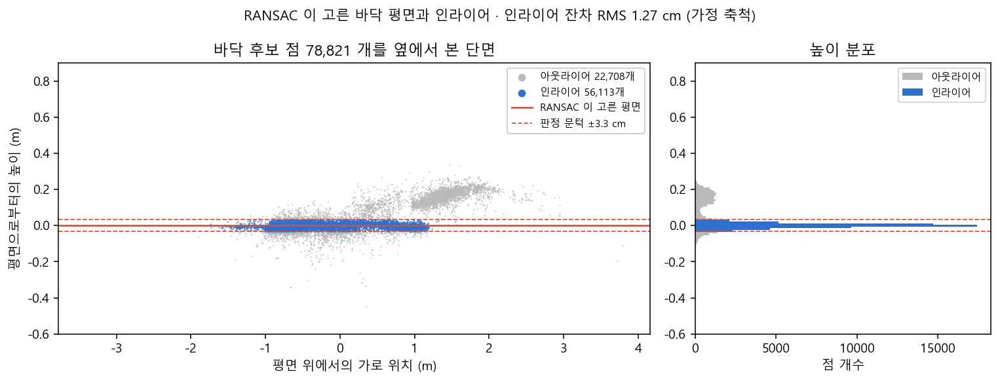
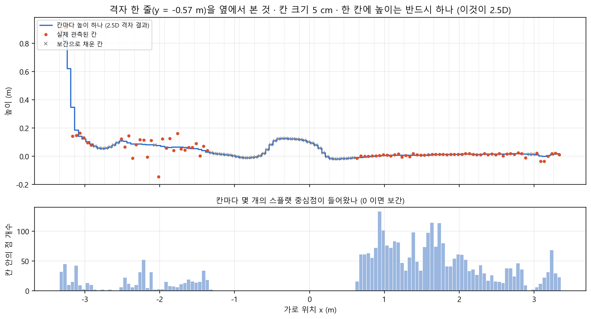
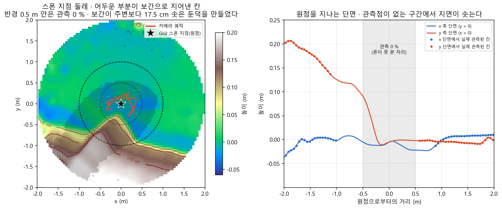
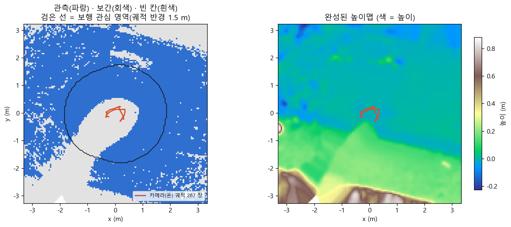
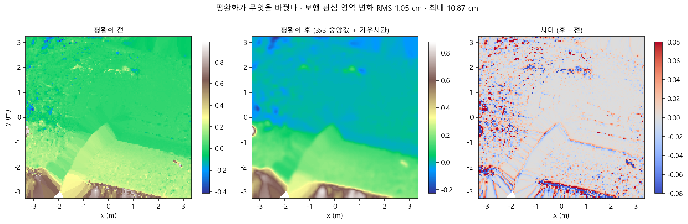
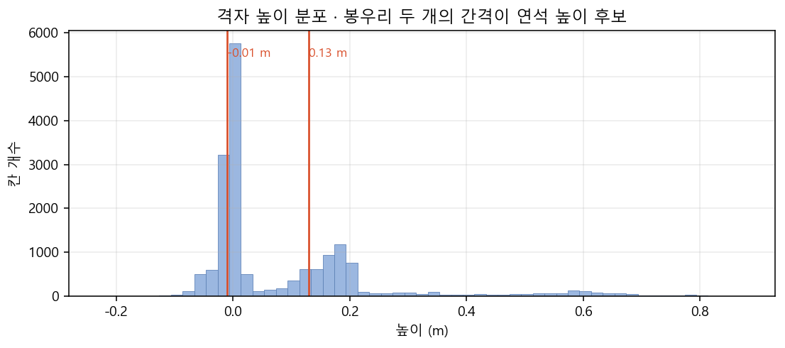
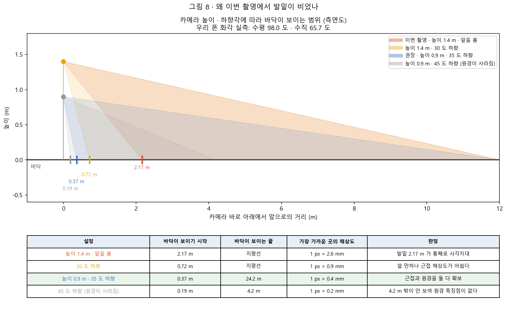
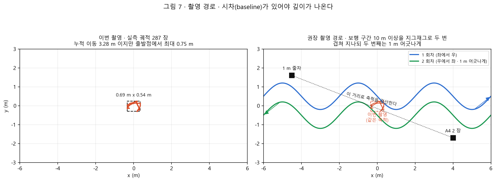
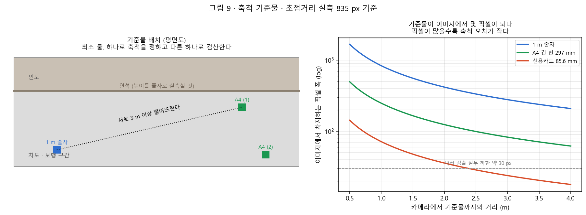

# FOOTHOLD Real-to-Sim 설계안 · 실제 지형을 시뮬레이션으로 옮겨 정책을 검증하기까지

> 분류: 계획
> 작성: 오흥재 · 2026-09-17 16:40
> 근거: 1차 PoC 원자료 재측정(`_out/mesh/plane_audit.npz` · `grid_audit.npz` · `ground_stats.json`) · `models/foothold-v1.env.yaml` 직접 확인 · 공식 소스와 논문 조사 · `RESULTS-3dgs-terrain.md` v1.5
> 요지: 1차 PoC 는 파이프라인이 성립함을 보였고, 동시에 입력 영상이 제자리 촬영이라 지면의 절반 가까이가 지어낸 값임을 드러냈다. 그러므로 복원 방법을 비교하기 전에 촬영을 다시 하고 축척 기준을 만든다.
> 상태: 검토중
> 판: v1.0
> 이슈: #430

---

## 0. 이 문서를 읽는 법

### 0-1. 표기 규칙

| 표기 | 뜻 |
|---|---|
| `확인됨` | 이 세션이 원자료나 소스 코드를 직접 열어 재측정했다 |
| `추측` | 근거는 있으나 확인하지 못했다. 근거를 함께 적는다 |
| `미측정` | 재지 않았다 |
| `미확인` | 알 수 없다 |

**이 문서의 모든 길이 값은 「가정 축척」 위에 있다.** 1차 PoC 는 폰 높이를 1.4 m 라고 가정해 축척을 정했다(6절에서 고친다). 그래서 「1.27 cm」 같은 값은 가정이 맞을 때의 값이다.

### 0-2. 이 문서가 답하려는 질문

팀장 지시의 핵심은 다음 한 줄이다.

> 우리가 왜 이 기술을 골랐고, 무엇을 해결하려 하며, 그 결정이 설득력이 있는가.

그래서 이 문서는 세 부분으로 되어 있다. 1절과 2절이 **왜·무엇을**, 3절이 **지금 어디까지 왔고 무엇이 틀렸나**, 4절부터가 **그러면 다음에 무엇을 어떻게 하는가**이다.

### 0-3. 이 문서가 고치는 것

이 세션이 앞서 구두로 설명하면서 두 군데를 틀리게 말했다. 문서에서 바로잡는다.

| 틀리게 말한 것 | 사실 |
|---|---|
| 「Brush 가 부족한 곳은 쪼개서 늘리고(densify) 쓸모없는 것은 지운다」 | 그것은 **원본 3DGS** 의 방식이다. Brush v0.3.0 은 clone/split 을 쓰지 않는다. 지운 개수만큼을 **기존 가우시안 중에서 불투명도 가중으로 뽑아 복제**하는 방식이다 (2-5절) `확인됨` |
| 「메시가 2.5D 인 이유는 정책의 height_scan 이 2.5D 라서」 | 두 가지를 한 문장에 넣어 혼동을 만들었다. **메시 제작에 height_scan 은 전혀 쓰이지 않았다.** 둘은 각각 따로 2.5D 이고, 그것이 방법 선택의 「근거」였을 뿐이다 (2-7절) |

---

## 1. 우리가 풀려는 문제

### 1-1. 최종 목표

FOOTHOLD 는 Unitree Go2 가 **미경험 험지**에서 다음 걸음을 이어가게 하는 프로젝트다. 시뮬레이션에서 정책을 학습하고, 그 정책을 실제 로봇에 올린다.

문제는 시뮬레이션과 현실이 다르다는 것이다(sim-to-real gap). 우리가 학습에 쓴 지형은 Isaac Lab 이 절차적으로 만든 계단·자갈·경사·틈이고, 실제로 로봇이 걸을 곳은 광주의 인도와 데크와 잔디다. **학습 지형에서 잘 걷는다고 실제 장소에서 잘 걷는다는 보장이 없다.**

### 1-2. 그래서 Real-to-Sim 을 한다

순서를 거꾸로 돌린다. 실제 장소를 먼저 측정해서 시뮬레이션 안에 다시 세우고(Real-to-Sim), 그 안에서 우리 정책을 걸려 본다. 통과하면 실기로 간다.

```
실제 장소 ──촬영──> 3D 복원 ──> 시뮬 지형(충돌체) ──> 정책 보행 검증 ──> 실기
                          └──> 시뮬 배경(보이는 것)
```

이것이 **디지털 트윈**이다. 여기서 「트윈」이 둘로 갈리는 것이 이 프로젝트의 핵심 설계 결정이다.

| 무엇 | 쓰임 | 필요한 정확도 |
|---|---|---|
| **충돌 지형(physics mesh)** | 발이 실제로 닿는 면. 정책의 높이 스캔이 광선을 쏘는 대상 | **형상 정확도가 전부.** 1 cm 단차가 보행을 가른다 |
| **배경(visual)** | 사람과 카메라에게 보이는 것. 발표·홍보·CV 학습 데이터 | 형상보다 **보이는 품질** |

**둘을 하나로 만들려 하면 둘 다 나빠진다.** 사진처럼 보이는 표현(가우시안 스플래팅)은 물리적으로 정확한 면이 아니고, 물리적으로 정확한 면은 사진처럼 보이지 않는다. 그래서 따로 만들어 겹친다. 1차 PoC 는 이 분리가 실제로 동작함을 보였다(3-1절). 이것이 팀장이 앞서 정리한 방향과 같다.

### 1-3. 이 결정이 우리만의 발상이 아니라는 근거

| 사례 | 무엇을 했나 |
|---|---|
| NVIDIA NuRec 공식 스테레오 파이프라인 | 센서 캘리브레이션 · 포즈 · metric depth 를 먼저 얻고, **nvblox 로 메시**를, **3DGRUT 로 외관**을 각각 만든다. 처음부터 갈라져 있다 |
| GaussGym (arXiv 2510.15352) | 렌더는 가우시안, 충돌은 별도 메시로 분리 |
| QuadVerse (arXiv 2606.07118) | 기하 제약을 건 가우시안에서 TSDF 메시를 뽑고, **알려진 마커로 metric scale** 을 잡고, 실제 궤적으로 마찰·구동기를 보정 |

공통점은 **시각 품질만으로 접촉 물리의 정확도를 주장하지 않는다**는 것이다. 우리도 그렇게 한다.

---

## 2. 용어 사전 · 우리 데이터로 설명

이 절은 처음 보는 사람을 위한 것이다. 모든 그림은 **우리가 이번 PoC 에서 실제로 만든 데이터**에서 그렸다.

### 2-1. 특징점(feature point)과 SIFT

컴퓨터가 두 사진을 보고 「이 두 사진의 이 지점은 같은 곳이다」라고 말하려면, 각 사진에서 **주변과 구별되는 작은 무늬**를 찾아야 한다. 그것이 특징점이다.

COLMAP 은 SIFT 라는 방법을 쓴다. 여러 배율에서 주변보다 밝거나 어두운 얼룩과 모서리를 찾고, 그 주변의 밝기 변화 방향을 숫자 목록(기술자 descriptor)으로 만든다. 다른 사진에서 같은 숫자 목록을 가진 곳을 찾으면 짝이다.

**필요한 것은 「무늬가 있을 것」이 아니라 「반복되지 않는 무늬가 있을 것」이다.**

| 바닥 | 특징점 | 왜 |
|---|---|---|
| 콘크리트 · 아스팔트 | 잘 잡힌다 | 균열 · 골재 알갱이 · 얼룩이 제각각이라 구별된다. 이번 영상에서 32,727 점이 나온 것이 그 증거 `확인됨` |
| 도색된 차선 · 노면 문자 | 아주 잘 잡힌다 | 경계가 뚜렷하다 |
| **나무 데크** | **어렵다** | 판자 무늬가 **반복**된다. 옆 판자와 구별이 안 되어 짝이 틀리게 맞는다 |
| 잔디 | 어렵다 | 바람에 움직이고 자기 유사성이 높다 |
| 하늘 | 안 잡힌다(잡혀도 해롭다) | 구름이 움직여 「같은 곳」이 아니다 |

**대책은 영화 촬영의 그린스크린 마커와 완전히 같은 발상이다.** 데크 위에 구별되는 표식을 두면 된다(7절 촬영 설계).

### 2-2. 핀홀(PINHOLE)과 왜곡 보정(undistort)

팀장 설명이 절반 맞다. 핀홀은 원래 「바늘구멍으로 빛이 들어와 상이 맺히는」 가장 단순한 카메라를 가리키는 말이 맞다. 다만 여기서 쓰는 뜻은 **「렌즈 왜곡이 전혀 없는 이상적인 카메라 모델」**이다.

실제 렌즈는 직선을 조금 휘어 찍는다. 화면 가장자리의 직선이 바깥으로 불룩하거나(배럴) 안으로 오므라든다(핀쿠션). 3D 계산은 「직선은 직선으로 찍힌다」를 전제로 하므로, 먼저 그 휨을 펴야 한다. 이것이 undistort 다. 이 과정은 VFX 의 렌즈 디스토션 제거와 같은 일이다.

우리 영상 `확인됨`:

```
카메라 모델 OPENCV · fx 835.17 · fy 835.58 · cx 960 · cy 540
왜곡계수 k1 -0.00132 · k2 -0.00010 · p1 -0.00034 · p2 0.00100
```

왜곡계수가 거의 0 이다. **폰이 이미 내부에서 보정해 내보낸 영상으로 보인다** `추측`. COLMAP 은 그래도 undistort 를 거쳐 1916x1077 PINHOLE 이미지 287 장을 만들었고, 그것을 3DGS 학습에 넣었다.

### 2-3. SfM(Structure from Motion)과 재투영 오차

**SfM 은 「여러 장의 사진에서 3D 구조와 카메라 위치를 동시에 푸는 것」**이다. 사진마다 특징점을 찾고, 사진 사이에서 짝을 맞추고, 「이 3D 점이 여기 있고 카메라가 저기 있었다면 모든 사진의 관측이 설명된다」가 되도록 전부를 한꺼번에 조정한다(번들 조정 bundle adjustment).

**재투영 오차(reprojection error)** 는 그 결과를 검산한 값이다. 계산해 낸 3D 점을 각 사진에 다시 투영해 보고, 원래 특징점 위치와 몇 픽셀 어긋나는지 잰다.

우리 값은 **평균 0.579 px** 다 `확인됨`. 1080p 영상 SfM 에서 1 px 아래면 잘 수렴한 것이고 0.5 px 대는 좋은 축에 든다.

**그런데 이 값이 좋다고 「길이가 정확하다」는 뜻은 아니다.** 두 가지 이유가 있다.

1. **축척이 없다.** 사진만으로는 「크다」와 「가깝다」를 구별할 수 없다. 장면 전체를 2 배로 키우고 카메라 위치도 2 배로 키우면 사진은 똑같이 나온다. 그래서 어딘가에서 실제 길이 하나를 넣어 줘야 한다.
2. **드리프트(drift)가 있을 수 있다.** 궤적이 길면 전체가 조금씩 휘어도 각 사진 안에서는 잘 맞아서 재투영 오차가 낮게 나온다.

따라서 「실제 길이 정확도」라고 부르려면 **기준 거리가 최소 둘** 필요하다. 하나로 축척을 맞추고 다른 하나로 검산한다. 이번 영상은 촬영 범위가 0.8 m 뿐이라 드리프트는 작을 것으로 본다 `추측`.

### 2-4. 3DGS(3D Gaussian Splatting)

**한 줄로: 장면을 「색과 투명도를 가진 수백만 개의 반투명 타원」으로 표현하고, 그것을 화면에 뿌려서(splat) 사진을 재현하는 방법이다.**

폴리곤 메시가 아니다. 각 가우시안은 위치 · 3축 크기 · 회전 · 색(구면조화 계수) · 불투명도를 가진 작은 흐릿한 타원이다. 이것을 카메라에서 본 순서대로 겹쳐 그리면 사진 같은 그림이 나온다.

학습 절차는 이렇다.

1. SfM 이 만든 점 32,727 개를 씨앗으로 가우시안을 만든다.
2. 사진 한 장을 고른다. 현재 가우시안들로 그 시점을 렌더한다.
3. 실제 사진과 비교해 차이(손실)를 구하고, 모든 가우시안의 위치 · 크기 · 색 · 불투명도를 조금씩 고친다.
4. 2 와 3 을 30,000 번 반복한다.

**한 스텝이 사진 한 장을 쓴다** `확인됨` (원본 3DGS `train.py` 의 `randint` 로 무작위 한 장, Brush 도 `SceneBatch` 가 이미지 1 장). 우리 실행은 30,000 스텝 / 287 장이므로 각 사진을 평균 **104.5 번** 본 셈이다. 938 초가 걸렸으니 한 스텝에 31.3 ms 다. 「한 장당 3.2 초」가 아니다.

### 2-5. 가우시안이 늘고 주는 기준 (densify / prune)

팀장이 가장 중요하게 본 지점이다. **「무엇을 부족하다고 보고 무엇을 쓸모없다고 보는가」가 곧 복원의 신뢰도를 정하기 때문이다.** 답부터 적으면 이렇다.

> **두 기준 모두 「사진을 얼마나 잘 재현하는가」이지 「실제 표면 위에 있는가」가 아니다.**

**원본 3DGS (graphdeco-inria) 기본값** `확인됨`:

| 항목 | 값 | 무엇을 뜻하나 |
|---|---|---|
| 총 스텝 | 30,000 | |
| densify 구간 | 500 스텝부터 15,000 스텝까지 · 100 스텝마다 | 뒤쪽 절반은 개수를 안 늘리고 다듬기만 한다 |
| densify 기준 | 화면 위치 기울기 평균 크기 > **0.0002** | 「이 가우시안을 화면에서 어느 쪽으로 옮기면 사진이 더 맞겠다」는 신호가 센 것 |
| clone 인가 split 인가 | 크기 ≤ 0.01 x 장면 크기 이면 **복제**, 그보다 크면 **둘로 쪼개고** 크기를 1.6 으로 나눔 | 작은 것이 신호가 세면 「덮을 면이 모자란다」, 큰 것이 신호가 세면 「한 덩어리가 여러 것을 뭉뚱그린다」 |
| 제거 기준 | 불투명도 < **0.005** 또는 화면 반지름 > 20 px 또는 크기 > 0.1 x 장면 크기 | 있으나 마나 하거나 지나치게 커진 것 |
| 불투명도 초기화 | 3,000 스텝마다 전부 0.01 근처로 깎음 | 살아남아야 할 것만 다시 올라오게 하는 완화책 |

**Brush v0.3.0 은 방식이 다르다** `확인됨`:

| 항목 | 값 | 원본과의 차이 |
|---|---|---|
| refine 주기 | 200 스텝마다 | 원본은 100 |
| 성장 기준 | 기울기 > **0.00004**, 그 중 **10 %** 만 실제로 성장 | 임계값 정의가 원본과 달라 숫자를 직접 비교할 수 없다 |
| 성장 종료 | 15,000 스텝 | 원본과 같다 |
| 상한 | 1,000 만 개 | 원본에는 없는 개념. 우리 결과 227 만 개는 상한 근처가 아니다 |
| 제거 기준 | 불투명도 < 2/255(0.0078) · log 크기 < -15 · 장면 중심에서 median 크기의 10 배 밖 | |
| **clone/split** | **없다.** 지운 개수만큼 기존 가우시안 중에서 **불투명도 가중 무작위 추출로 복제**해 채운다 | 이것이 앞서 잘못 설명한 부분이다 |

**공중에 뜬 가우시안(floater)이 왜 살아남는가.** 원논문이 한계로 직접 인정한다 `확인됨`.

> 최적화가 입력 카메라 근처의 floater 에 갇힐 수 있고, 학습 뷰가 잘 덮지 못한 영역에서는 최적화로 제거되지 않는 floater 가 더 많다.

**이유는 구조적이다.** 소수의 뷰에서만 보이는 floater 라도 그 소수 뷰의 사진 손실을 낮춰 주면 기울기 기준과 불투명도 기준을 모두 통과한다. 이 파이프라인에는 **여러 시점의 기하가 서로 모순되지 않는지 검사하는 항이 아예 없다.**

그래서 **스플랫의 점 분포를 곧 실제 표면이라고 볼 수 없다.** 팀장이 뷰어에서 본 「잘못 떠 있는 포인트들」이 바로 이것이다. 이 한계를 정면으로 고치려는 것이 5절의 표면 복원 계열이다.

### 2-6. RANSAC 과 인라이어 · 바닥 평면을 어떻게 골랐나

**RANSAC**(RANdom SAmple Consensus)은 「잡음이 섞인 점 무리에서 다수가 동의하는 모델을 찾는」 알고리즘이다. 절차가 단순하다.

1. 점 3 개를 무작위로 뽑아 평면 하나를 만든다.
2. 그 평면에서 **문턱 거리 안에 있는 점**을 센다. 그 점들이 **인라이어(inlier)** 다. 밖의 점은 아웃라이어다.
3. 1 과 2 를 2,000 번 반복한다.
4. 인라이어가 가장 많았던 평면을 고르고, **그 인라이어만으로 다시 최소제곱 적합**한다.

우리 실행의 실제 값 `확인됨`:

| 항목 | 값 |
|---|---|
| 바닥 후보 점 | 78,821 개 (불투명도 0.1 이상 · 크기 0.3 m 이하 · 카메라 아래 깊이 층에서 고른 것) |
| 반복 | 2,000 회 |
| 판정 문턱 | 0.417 유닛 = **3.28 cm** |
| 인라이어 | **56,113 개** (71.2 %) |
| 아웃라이어 | 22,708 개 |
| 인라이어 잔차 RMS | 0.1609 유닛 = **1.27 cm** |



*그림 1. 바닥 후보 점 78,821 개를 옆에서 본 단면. 가로축은 평면 위에서의 위치, 세로축은 평면으로부터의 높이. 파란 점이 인라이어, 회색이 아웃라이어. 빨간 실선이 RANSAC 이 고른 평면이고 점선이 ±3.3 cm 판정 문턱이다. 오른쪽으로 갈수록 +0.2 m 로 올라가는 회색 무리가 인도 쪽이다. 이 그림은 저장된 `plane_audit.npz` 에서 이 세션이 다시 그렸고, 잔차 RMS 1.27 cm 가 보고서 값과 일치하는 것으로 계산을 검산했다* `확인됨`.

**그래서 1.27 cm 는 무엇인가.** 팀장 질문에 정확히 답하면 이렇다.

| 해석 | 맞나 |
|---|---|
| 「실제 바닥과 복원 바닥의 오차가 1.27 cm」 | **아니다** |
| 「고른 평면에 인라이어들이 얼마나 잘 붙어 있는가」 | **맞다** |
| 「A4 같은 실측 기준이 있으면 1.27 cm 가 실제 오차가 되는가」 | **부분적으로만** |

실측 기준이 생기면 **단위는 진짜 cm 로 확정된다.** 그리고 그 자리 바닥이 실제로 평평하다면 이 값을 **복원 잡음의 크기**로 읽어도 된다. 그러나 「실제 바닥과의 오차」는 여전히 아니다. 두 가지가 빠져 있기 때문이다.

- 문턱 3.28 cm 밖의 점 22,708 개는 **계산에서 이미 빠졌다.** 남은 것들만으로 잰 흩어짐이다.
- 평면 자체가 실제 바닥에서 **통째로 기울거나 떠 있어도** 잔차는 그대로 작다. 인라이어끼리만 비교하기 때문이다.

오차라고 부르려면 **실측한 높이(예: 연석 높이)와 메시 높이를 직접 빼 봐야 한다.** 그것이 6절이다.

### 2-7. 2.5D 높이 격자 · 「매끄럽게 메시화」의 실제 내용

**앞서 혼동을 만든 부분을 갈라서 적는다.**

#### (가) 메시는 어떻게 만들었나 (height_scan 과 무관하다)

팀장 요약이 정확하다. 순서는 COLMAP → Brush → RANSAC 바닥 평면 → 메시이고, **여기에 정책의 height_scan 은 한 번도 쓰이지 않았다.**

메시 제작의 실제 절차는 이렇다 `확인됨`.

1. 바닥 평면의 법선을 Z 축 위로 정렬한다(즉 바닥이 수평이 되게 장면 전체를 회전시킨다).
2. 바닥을 **5 cm x 5 cm 칸**으로 자른다. 131 x 134 = 17,554 칸.
3. **칸마다 그 안에 들어온 점들의 높이 중앙값 하나**를 취한다.
4. 점이 하나도 없는 칸은, 1 m 안에 관측 칸이 있으면 가까운 관측 칸 4 개의 거리 가중 평균으로 채운다(보간).
5. 3x3 중앙값 필터와 가우시안 필터를 한 번씩 걸어 다듬는다.
6. 칸의 꼭짓점을 이어 삼각형 34,508 개를 만든다.

**한 칸에 높이가 반드시 하나뿐이다.** 그래서 처마 · 동굴 · 수직 벽을 표현할 수 없다. 이렇게 「가로세로 위치마다 높이 하나」인 표현을 **2.5D(높이맵 heightmap)** 라고 부른다. 3D 가 아니라 2.5D 인 이유가 이것이다.



*그림 2. 격자 한 줄(y = -0.57 m)을 옆에서 본 것. 위: 파란 계단이 최종 높이(칸마다 하나), 빨간 점이 실제로 관측된 칸, 회색 x 가 보간으로 채운 칸. 아래: 칸마다 들어온 점의 개수. **x = -1.26 m 부터 0.59 m 까지 1.90 m 구간은 점이 하나도 없다.** 그런데 그 구간 안에서 지면이 14.6 cm 오르내린다. 전부 보간이 지어낸 값이다* `확인됨`.

#### (나) 정책의 height_scan 도 2.5D 다 (별개의 이야기)

팀장 이해가 맞다. `models/foothold-v1.env.yaml` 실측 `확인됨`:

| 항목 | 값 |
|---|---|
| 센서 | `RayCaster`, 로봇 `base` 에 부착 |
| 광선 시작 높이 | 몸통 기준 **+20.0 m** |
| 방향 | (0, 0, **-1**) · 수직 아래 한 방향뿐 |
| 격자 | 1.6 m x 1.0 m · 간격 0.1 m → 17 x 11 = **187 개** |
| 회전 추종 | `ray_alignment: yaw` · 몸통의 좌우 회전만 따라간다 |
| 대상 | `/World/ground` |

광선이 **수직 아래로만** 가므로 정책도 「가로세로 위치마다 높이 하나」만 본다. 그래서 정책의 관측도 2.5D 다. `foothold-v1` 의 `height_scan_with_gap` 은 광선이 아무것도 못 맞혔을 때 miss 값 +1.0 을 넣어 「밑이 뚫렸다」를 알리는 변형이다. 팀장 설명 그대로다.

#### (다) 그래서 왜 2.5D 격자를 골랐나

근거는 둘이었다.

1. **이 머신에서 돌릴 수 있는 것이 그것뿐이었다.** 표면 복원 계열(2DGS · SuGaR · GOF)은 CUDA 커널을 컴파일해야 하는데 이 머신에 nvcc 와 MSVC 가 없다. 격자 방식은 numpy 와 scipy 만으로 **3 초**에 끝났다.
2. **정책이 어차피 2.5D 로만 보므로, 충돌 지형을 2.5D 로 만들어도 정책이 볼 수 있는 정보는 다 담긴다.**

**두 번째 근거는 절반만 맞다.** Codex 검토 메모가 정확히 짚었고 우리도 동의한다.

> 정책의 관측이 2.5D 라고 해서 실제 발이 닿는 충돌체까지 2.5D 로 단순화해도 된다는 결론은 나오지 않는다.

발은 연석의 **옆면**에 부딪힌다. 높이맵은 옆면을 한 칸 너비(5 cm)의 경사로로 만든다. 즉 10 cm 높이의 수직 연석이 「5 cm 당 10 cm 오르는 경사면」이 된다. 정책은 그 경사를 높이 스캔으로 볼 수 있지만, 발이 **걸려 넘어지는 물리**는 재현되지 않는다. **이것이 2.5D 격자의 근본 한계이고, 5절에서 대안을 재는 이유다.**

### 2-8. nvcc · MSVC · 표면 복원

| 용어 | 무엇 |
|---|---|
| **MSVC** | Microsoft Visual C++ 컴파일러. Windows 에서 C++ 코드를 기계어로 바꾸는 도구. Visual Studio Build Tools 로 설치한다 |
| **nvcc** | NVIDIA CUDA 컴파일러. GPU 에서 돌 코드(커널)를 컴파일한다. CUDA Toolkit 에 들어 있다 |
| **wgpu** | GPU 를 부리는 크로스플랫폼 API 층. Vulkan · DirectX 12 · Metal 위에서 돈다. **하드웨어가 아니다.** Brush 가 이것을 써서 CUDA 툴킷 없이 같은 RTX 5080 을 쓴다 |
| **표면 복원(surface reconstruction)** | 점이나 가우시안 무리에서 **연속된 면(메시)** 을 뽑아내는 것. 「어디까지가 물체의 껍질인가」를 정하는 문제다 |

nvcc 와 MSVC 를 설치하면 **더 빨라지는 것이 아니라 못 하던 것을 하게 된다.** 열리는 방법은 5절에 있다.

### 2-9. 마찰 관련 용어

| 용어 | 무엇 |
|---|---|
| **정지 마찰(static friction)** | 멈춰 있는 물체가 미끄러지기 시작하는 데 필요한 힘의 비율 |
| **운동 마찰(dynamic friction)** | 이미 미끄러지는 중에 걸리는 저항의 비율 |
| **combine mode** | 두 물체의 재질이 다를 때 유효 마찰을 정하는 규칙. 평균 · 최소 · 곱 · 최대 중 하나. **바닥에 1.0 을 넣어도 그것이 곧 유효 마찰이 아니다** |
| **domain randomization** | 학습 중에 물리값(마찰 · 질량 등)을 매번 무작위로 바꿔, 정책이 특정 값에 의존하지 않게 만드는 기법 |

---

## 3. 1차 PoC 진단 · 무엇이 됐고 무엇이 틀렸나

### 3-1. 된 것 · 파이프라인이 성립한다

7 단계 전부가 끝까지 돌았다. 이것 자체가 성과다 `확인됨` (출처는 `RESULTS-3dgs-terrain.md` v1.5).

| 단계 | 도구 | 결과 | 시간 |
|---|---|---|---|
| 1 프레임 추출 | ffmpeg | 287 장 x 2 벌 | 미기록 |
| 2 SfM | COLMAP 4.2.0 | 287/287 등록 · 재투영 0.579 px | 추출 11 초 · 매칭 56 초 · mapper 630 초 |
| 3 3DGS | Brush v0.3.0 | 가우시안 2,270,126 · PLY 535.8 MB | 938 초 |
| 4 지면 메시 | 자체 스크립트 | 삼각형 34,508 | **3 초** |
| 5 USD 충돌체 | Isaac Sim | 검사 9/9 통과 | 앱 기동 5 초 |
| 6 Go2 보행 | Isaac Lab | A · B 둘 다 로드 · 추론 · 이동 | 각 약 47 초 |
| 7 스플랫 배경 | 3DGRUT transcode | NuRec USDZ · Isaac Sim 5.1 에서 렌더됨 | 변환 8 초 |

**중요한 것 셋.**

1. **시스템 설치 없이 여기까지 왔다.** VS Build Tools 도 CUDA Toolkit 도 설치하지 않고 도달했다. 다음 단계에서 설치를 하더라도, 이 경로가 「설치 없이 되는 최소 경로」로 남아 팀원이 따라오기 쉽다.
2. **충돌과 배경의 분리가 실제로 동작한다.** 스플랫은 시각 전용으로 두고 충돌은 메시가 담당하는 구성이 Isaac Sim 안에서 확인됐다.
3. **두 정책 모두 복원 지형 위에서 추론이 돌았다.** 관측 차원이 235 로 체크포인트와 맞았고, 첫 스텝 높이 스캔이 187/187 유한값이었다.

### 3-2. 틀린 것 · 가장 큰 문제는 방법이 아니라 입력이다

이 세션이 원자료를 다시 재면서 찾은 것이다. **보고서에 없던 내용이고, 다음 단계의 순서를 바꾼다.**

#### (가) 촬영이 제자리에서 이루어졌다 `확인됨`

| 측정 | 값 |
|---|---|
| 카메라 중심 287 개의 x 범위 | **0.69 m** |
| y 범위 | **0.54 m** |
| z 범위 | 0.30 m (높이 1.16 ~ 1.46 m) |
| 첫 프레임에서 가장 멀리 간 거리 | **0.80 m** |
| 프레임 사이 이동 중앙값 | **8.7 mm** |
| 누적 이동거리 | 3.28 m |

**「누적 3.28 m」는 8.7 mm 씩 287 번 흔들린 것의 합이다.** 폰은 사실상 한 자리에 서서 둘러봤다.

이것이 여러 증상을 한꺼번에 설명한다.

| 팀장이 본 증상 | 원인 |
|---|---|
| 원경이 흐리고 포인트가 안 잡힌다 | **시차(baseline)가 없다.** 삼각측량은 두 시점 사이의 거리에서 깊이를 얻는데, 0.8 m 밖에 안 움직였으니 멀리 있는 것은 두 시점에서 거의 같은 자리에 찍힌다. 거리를 알 수 없다 |
| 바닥 메시가 카메라 주변 일부만 생겼다 | 서 있던 자리 주변만 봤다 |
| 바닥 메시가 정확하지 않다 | 아래 (나)·(다) |

#### (나) 로봇이 스폰되는 자리가 관측 0 % 다 `확인됨`

| 원점에서의 반경 | 칸 수 | 관측된 칸 | 보간된 칸 |
|---|---:|---:|---:|
| 0.5 m | 316 | **0 (0.0 %)** | 316 (100 %) |
| 1.0 m | 1,260 | 411 (32.6 %) | 849 (67.4 %) |
| 1.5 m | 2,832 | 1,698 (60.0 %) | 1,134 (40.0 %) |
| 2.0 m | 5,033 | 3,617 (71.9 %) | 1,416 (28.1 %) |

원점 칸 자체의 **최근접 관측 칸까지 거리는 0.57 m** 이고, 반경 0.5 m 안에서는 중앙값 0.42 m · 최대 0.74 m 다.

**폰은 자기가 선 자리의 바닥을 못 본다.** 1.4 m 높이에서 앞을 보고 있으면 발밑은 화각 밖이다. 그런데 Go2 는 바로 그 자리, 원점에 스폰됐다.



*그림 3. 왼쪽: 스폰 지점 둘레. 어두운 반투명 영역이 보간으로 지어낸 칸이고, 빨간 선이 카메라 궤적, 별이 Go2 스폰 지점이다. 점선 원이 반경 0.5 m, 파선 원이 1.0 m. 오른쪽: 원점을 지나는 두 단면. 회색 띠 구간(±0.5 m)에는 관측점이 하나도 없다* `확인됨`.

`RESULTS` 가 기록한 「낙상 5 건의 몸통 위치에 가장 가까운 격자 칸이 다섯 곳 모두 보간 칸이었다」는 관찰이 이것과 맞물린다. **다만 낙상의 원인이 지형인지 스폰 자세인지 정책인지는 여전히 `미확인` 이다.** 갈라 보는 방법은 11절에 있다.

#### (다) 보간이 지형을 지어낸다 `확인됨`

| 측정 | 값 |
|---|---|
| 보간 칸의 최근접 관측 거리 · 중앙값 | 0.18 m |
| 같은 값 · 상위 10 % | 0.60 m |
| 같은 값 · 최대 | 1.00 m (구멍 메움 한도) |
| 가장 긴 무관측 구간(그림 2 의 줄) | **1.90 m** |
| 그 구간 안에서 만들어진 높이 변화 | **14.6 cm** |
| 반경 0.5 m 안(관측 0 %)의 높이 폭 | **13.8 cm** |

**1.90 m 에 걸쳐 관측이 하나도 없는데 지면이 14.6 cm 오르내린다.** 이것은 측정된 지형이 아니라 양쪽 끝(차도와 인도)의 높이를 부드럽게 이은 결과다. 실제로 그 자리에 무엇이 있었는지는 이 데이터로 알 수 없다.

**보간 자체가 잘못된 것이 아니다.** 문제는 지금 보고서의 「보행 관심 영역 관측 68.5 %」 라는 숫자가 **로봇이 실제로 밟는 자리의 품질을 말해 주지 않는다**는 것이다. 로봇이 밟는 중심부가 바로 0 % 구간이다.

#### (라) 나머지 확인된 문제

| 문제 | 실측 | 근거 |
|---|---|---|
| **축척이 가정값** | 폰 높이 1.4 m 가정 → 1 유닛 = 0.0787 m. 카메라 높이 사분위가 1.27 ~ 1.43 m 로 흩어져 있다 | `ground_stats.json` `확인됨` |
| **단차가 뭉개진다** | 연석 후보는 높이 분포의 두 봉우리 -0.01 m 와 0.13 m 의 차이 **약 0.14 m** 로 추정했을 뿐, 형상은 5 cm 격자 + 평활화로 경사로가 됐다 | `확인됨` · 실제 연석인지는 `추측` |
| **마찰이 임의값** | `ground.usd` 정지 1.0 / 운동 1.0 / 반발 0. 검증된 값이 아니라 자리표시다 | `poc_mesh_to_usd.py` 127 행 `확인됨` |
| **로봇이 서로 겹쳐 걷는다** | `filter_collisions: true` 라 4 개 env 가 서로 통과한다. 통계에는 영향 없지만 그림으로는 틀렸다 | `foothold-v1.env.yaml` 90 행 `확인됨` |
| **렌더가 밝게 날아간다** | Isaac Lab 환경이 **DomeLight intensity 750** 에 맑은 하늘 HDRI(`kloofendal_43d_clear_puresky_4k.hdr`)를 켜고 `visible_in_primary_ray: true` 로 둔다. 스플랫 색에는 이미 그날의 햇빛이 구워져 있는데 그 위에 야외 하늘을 한 번 더 비춘 것이다 | `foothold-v1.env.yaml` 479~499 행 `확인됨` · 이것이 유일한 원인인지는 `미확인` |
| **프레임이 이미 톤매핑됐다** | HLG 원본을 `zscale + tonemap=hable` 로 SDR 변환한 판을 학습에 썼다. Isaac Sim 의 RTX 후처리 톤매퍼가 한 번 더 걸린다 | `poc_frames.py` 97 행 `확인됨` |



*그림 4. 왼쪽: 관측(파랑) · 보간(회색) · 빈 칸(흰색)과 카메라 궤적. 검은 원이 「보행 관심 영역」(궤적 반경 1.5 m)이다. 가운데가 통째로 비어 있는 도넛 모양인 것이 한눈에 보인다. 오른쪽: 완성된 높이맵* `확인됨`.



*그림 5. 평활화가 무엇을 바꿨나. 보행 관심 영역에서 칸별 높이 변화 RMS 1.05 cm, 최대 10.87 cm. 전체 산포(표준편차 6.64 → 6.47 cm)는 거의 안 줄었지만 국소적으로는 10 cm 넘게 움직인 자리가 있다* `확인됨`.



*그림 6. 격자 높이 분포. 봉우리가 -0.01 m 와 0.13 m 두 곳에 있고 그 간격 0.14 m 가 연석 높이 후보다. 실제 연석인지는 확인하지 못했다* `추측`.

### 3-3. 진단의 결론

> **1 차 PoC 의 지면 메시 품질은 「2.5D 격자라는 방법」의 한계보다 「제자리에서 찍은 36 초 영상」이라는 입력의 한계가 지배한다.**

그래서 다음 순서가 정해진다. 지금 데이터로 표면 복원 방법 넷을 비교하면, **어느 방법이 없는 데이터를 더 그럴듯하게 메우는가**를 비교하게 된다. 그것은 우리가 알고 싶은 것이 아니다.

**재촬영이 먼저다.** 그리고 재촬영은 축척 기준물을 함께 놓으면 같은 비용으로 6 절(축척)까지 해결한다.

---

## 4. 성공 기준 · 팀장 지정 다섯 가지를 측정 가능하게

팀장이 지정한 다섯 가지를 각각 「무엇으로 어떻게 재는가」로 바꾼다. **이것이 다음 PoC 의 합격선이다.**

| # | 팀장 지정 | 측정 항목 | 합격선(제안) |
|---|---|---|---|
| 1 | 기술 파악 · 성과 검증 · 설득력 | 해설 문서 1 편(13절) + 방법 비교표(5절). 각 선택에 「왜 이것인가 · 무엇을 포기했나」가 근거와 함께 |  팀장 검토 통과 · hub-tech 게재 |
| 2 | 바닥 메시가 실측 ±2 cm | **실측한 연석 높이 · 기준 거리와 메시의 차이.** 인라이어 잔차가 아니라 실측 대비 오차 | 보행 구간에서 절대 오차 중앙값 ≤ 2 cm · 90 백분위 ≤ 4 cm |
| 3 | 배경(보이는 것) | 같은 카메라의 원본 프레임과 NuRec 렌더의 밝기 히스토그램 차이 · 육안 판정 | 조명 이중 적용을 제거한 뒤 평균 밝기 차 ≤ 10/255 |
| 4 | 큰 환경 대응 방법론 | 두 구역을 따로 복원해 한 좌표계로 합치고, 겹침 구간에서 두 복원의 차이를 잰다 | 겹침 구간 지면 높이 차 RMS ≤ 3 cm |
| 5 | foothold-v1 이 넘어지지 않고 걷는다 | `sim/eval` 규격 2 하네스로 heading 고정 · 100 에피소드 | 성공률과 Wilson 신뢰구간을 보고. **합격선은 기준선(평지 100 판)과 비교해 정한다** |

**2 번이 이번 설계의 중심이다.** 나머지는 2 번이 서면 따라온다.

---

## 5. 지면 복원 방법 비교 설계

### 5-1. 후보

같은 입력(재촬영본), 같은 카메라 포즈(COLMAP), 같은 측정표를 쓴다. **입력을 고정하지 않으면 비교가 아니다.**

| 후보 | 무엇 | 설치 필요 | 왜 넣나 |
|---|---|---|---|
| **A. 2.5D 높이 격자 (개선판)** | 지금 방법에 적응형 해상도와 강건 추정을 더한 것 (5-2절) | 없음 | 현재 기준선. 가장 싸고 빠르다(3 초) |
| **B. Poisson 표면 복원** | 점마다 법선(면이 향하는 방향)을 추정하고, 그 법선장과 맞는 매끈한 닫힌 면을 한 번에 푼다 | open3d wheel | 곡면이 자연스럽다. 다만 법선이 흔들리면 물결이 생기고 데이터 없는 경계가 부풀어 오른다 |
| **C. COLMAP dense MVS** | SfM 으로 카메라 위치를 안 뒤 **픽셀마다** 이웃 사진과 대조해 깊이를 구하고 합친다 | 없음(이미 설치됨) | **스플랫과 완전히 무관한 대조군.** 사진측량 표준. 3DGS 의 floater 문제가 없다 |
| **D. 2DGS 계열 표면 복원** | 가우시안을 3D 타원이 아닌 **2D 원반**으로 만들어 표면에 붙게 강제하고, 렌더한 깊이를 융합해 메시를 뽑는다 | **CUDA + MSVC** | 2-5절의 「표면 검사가 없다」는 구조적 한계를 정면으로 고치는 계열 |
| **E. lingbot-map (포즈 대조군)** | 영상을 넣으면 반복 최적화 없이 한 번에 점구름 · 카메라 포즈 · 프레임별 깊이를 내는 모델 | CUDA 12.8 · **Linux** | 큰 환경에서 COLMAP mapper 가 느려질 때의 대안. **우선순위 낮음** |

### 5-1-1. D 후보에 대한 경고 · 전부 Windows 공식 지원이 없다

조사 결과 **표면 복원 여섯 가지 중 Windows 를 공식 지원하는 것이 하나도 없다** `확인됨`.

| 기법 | 메시 추출 방식 | CUDA | Windows |
|---|---|---|---|
| **SuGaR** | Poisson | 11.8 명시 | **README 가 비호환을 직접 인정**: 경로 처리 관행 때문에 현재 코드가 Windows 와 호환되지 않는다 |
| **2DGS** | TSDF 융합(Open3D) | 환경 파일에 버전 없음 | 공식 지원 없음. 뷰어 바이너리와 비공식 포크만 |
| **GOF** | Marching Tetrahedra | 11.3 명시(환경 파일은 11.6 로 불일치) | 공식 지원 없음. 이슈에 WSL 우회 사례 |
| **MILo** | Delaunay + 학습된 SDF | 11.8 만 시험됨 | **Windows 언급이 아예 없다** |
| **RaDe-GS** | TSDF + Marching Cubes | 13.0 | 언급 없음. 구 저장소 이슈에 MSVC 비호환 빌드 실패 보고 |
| **PGSR** | TSDF + Marching Cubes | 유연(예시 11.8, 교체 가능) | 언급 없음 |

**그리고 여섯 기법 모두 「도로 · 지면 전용 정량 평가」가 논문에도 저장소에도 없다** `확인됨`. 전부 DTU · Tanks and Temples · Mip-NeRF360 벤치마크 기준이다. 즉 **우리 용도(야외 도로 지면의 절대 높이 정확도)에서 어느 것이 나은지 말해 주는 공개 자료가 없다.** 우리가 재야 한다.

**그래서 D 는 이렇게 다룬다.**

1. **WSL2 에서 PGSR 또는 2DGS 하나만** 빌드를 시도한다. 둘 다 CUDA 버전 요구가 가장 느슨하고 TSDF 경로라 Open3D 로 후처리가 이어진다.
2. **빌드에 하루 이상 걸리면 중단하고 A · B · C 만으로 비교한다.** D 는 「해 보고 안 되면 기록으로 남긴다」 수준이다.
3. SuGaR 는 저자가 Windows 비호환을 명시했으므로 **후보에서 뺀다**.

**이것이 이번 설계의 가장 큰 기술 위험이다.** C(COLMAP dense)가 Windows 에서 확실히 도는 유일한 「스플랫과 무관한」 대조군이므로, **C 를 반드시 돌린다.**

### 5-2. A 개선판의 구체 내용

팀장이 물은 「단차 근처만 평활화를 끄고 격자를 촘촘히」가 정확히 이것이다.

| 무엇 | 지금 | 개선판 |
|---|---|---|
| 격자 해상도 | 전 영역 5 cm 고정 | **적응형**: 높이 변화가 큰 칸(단차 후보) 둘레는 2 cm, 평탄한 곳은 5 cm |
| 칸 대표값 | 중앙값 | 중앙값 + **관측 수와 분산으로 신뢰도 판정**. 점이 3 개 미만이거나 분산이 크면 「신뢰 낮음」으로 표시 |
| 평활화 | 전 영역 3x3 중앙값 + 가우시안 | 단차 후보 둘레는 **끄고**, 평탄한 곳만 건다 |
| 보간 | 1 m 안이면 무조건 채움 | **보행 구간 안에서는 0.3 m 로 줄인다.** 못 채운 칸은 「구멍」으로 남기고 표시 |
| 출력 | 높이맵 하나 | 높이맵 + **신뢰도 맵**. 어디가 측정이고 어디가 지어낸 값인지 메시와 함께 남긴다 |

**평활화를 끄면 뾰족해지는 것이 맞다.** 팀장 지적대로다. 그래서 평활화를 끄는 대신 **칸 대표값 단계에서 잡음을 거른다.** 평활화는 「이미 만들어진 지형을 뭉개는 것」이고 강건 추정은 「애초에 이상한 점을 안 쓰는 것」이라 순서가 다르다.

### 5-3. 측정표 (모든 후보에 같이 적용)

| 항목 | 재는 법 | 왜 |
|---|---|---|
| **실측 대비 오차** | 기준물 · 연석 실측값과 비교 | 성공 기준 2 |
| 보행 구간 관측 비율 | 보간 없이 실제 관측된 칸의 비율 | 지어낸 값의 양 |
| **스폰 반경 0.5 m 관측 비율** | 위와 같으나 로봇이 서는 자리만 | 3-2 (나)의 재발 방지 |
| 가짜 단차 | 실측 평면에서 ±3 cm 밖인 칸의 비율 | 없는 턱을 만들었나 |
| 연석 형상 보존 | 연석 단면의 실제 높이 대비 복원 높이와 **옆면 기울기** | 2.5D 의 근본 한계가 실제로 문제가 되나 |
| 삼각형 수 | 메시 통계 | 높이 스캔이 매 스텝 광선을 쏘므로 10 만 이하 |
| 설치 비용 · 실행 비용 | 벽시계 시간을 따로 기록 | 팀원이 따라 할 수 있는가 |
| VRAM 최대 | nvidia-smi 표본 | |
| 수동 보정량 | 사람이 손댄 횟수와 내용 | 자동화 가능성 |
| 정책 보행 결과 | 11절 하네스 | 최종 목적 |

**실측 기준이 없으면 「실측 대비 오차」와 「가짜 단차」를 잴 수 없고, 그러면 순위를 정할 수 없다.** 그래서 6 절이 5 절보다 먼저 와야 한다.

---

## 6. 축척 확정 · 가정을 측정으로 바꾼다

### 6-1. 왜 필요한가

지금 모든 길이는 「폰 높이 1.4 m」 하나에 매달려 있다. 그 가정이 10 % 틀리면 1.27 cm 는 1.14 cm 도 1.40 cm 도 된다. 연석 0.14 m 도 마찬가지다.

### 6-2. 세 가지 방법을 함께 쓴다

| 방법 | 어떻게 | 신뢰도 | 언제 |
|---|---|---|---|
| **(가) 기준물 촬영** | A4 용지 또는 1 m 줄자를 바닥에 놓고 함께 찍는다 | **가장 높다** | 재촬영 때 |
| **(나) 법정 규격 대조** | 영상에 찍힌 차로 폭 · 차선 폭 · 연석 높이 · 보도블록 규격을 법령 기준값과 대조 | 중간(시공 편차) | **기존 영상에도 적용 가능** |
| **(다) 사후 실측** | 같은 장소에 다시 가서 연석 높이 등을 줄자로 잰다 | 높다 | 기존 영상 구제용 |

**(나)는 팀장 발상이고 맞는 접근이다.** 기존 영상을 버리지 않고 축척을 개선할 수 있다. 다만 「규격대로 시공됐다」는 가정이 남으므로 결과에는 **「규격 추정 축척」**이라고 표기한다.

### 6-2-1. 법정 규격값 · 조사 결과

법령 원문과 지침 PDF 에서 확인했다 `확인됨`. 추천 순위는 **「전국이 같은 값인가」와 「시공 편차가 작은가」** 로 정했다.

| 순위 | 기준자 | 규격값 | 근거 | 왜 이 순위인가 |
|---|---|---|---|---|
| **1** | **차선 도색 폭** | 실선 · 점선 **10 ~ 15 cm**, 중앙선 **15 ~ 20 cm**, 복선 10 ~ 15 cm | 경찰청 「교통노면표시 설치 · 관리 매뉴얼」 제2장 제2절 표 2-1 | **고속도로 · 도시 · 지방 구분 없이 같은 값**이다. 시공 허용오차가 「도면 폭보다 좁으면 안 되고 +1 cm 이내로만 넓게」로 엄격하다(주택공사 전문시방서 41770 3.6.1). 고대비라 복원에도 잘 잡힌다 |
| **2** | **횡단보도 줄무늬 폭** | **45 ~ 50 cm**, 줄무늬 간격은 폭의 **1.5 배**, 단부 90 ~ 100 cm | 「도로교통법 시행규칙」 별표6 일련번호 532 (도면 판독) | 법령 도면에서 직접 확인한 1 차 자료. 크기가 커서 원거리에서도 식별된다. 1 순위와 교차검증에 좋다 |
| **3** | **연석(경계석) 높이** | 실무 표준 **15 cm**, 허용 15 ~ 25 cm. 경사형은 전면경사에 따라 10 cm 또는 15 cm 이하. **법정 상한 25 cm** | 국토교통부 「보도 설치 및 관리 지침」 2-7 절 / 「도로의 구조 · 시설 기준에 관한 규칙」 제16조제2항제1호 | **수직 방향** 검증에 유용하다. 다만 지침은 법적 강제력이 없고 실제 편차가 크다. **단독 사용 금지** |
| 4 | 정지선 폭 | 30 ~ 60 cm | 별표6 일련번호 530 | 범위가 2 배라 정밀도가 낮다. 보조용 |
| 5 | 차로 폭 | 설계속도별 3.00 ~ 3.50 m (소형차도로 3.25 이하) | 「도로의 구조 · 시설 기준에 관한 규칙」 제10조제3항 | **법정 최소값이지 실제 시공폭이 아니다.** 회전차로 · 도시지역 40 km/h 이하는 2.75 m 까지 완화된다. 기준자로 쓰기 위험 |
| - | 보도블록 · 맨홀 · 가로수 보호판 | **고정 치수 없음** | KS F 4419 가 「모양 · 치수 · 색상은 설계서에 따른다」로 규정 | **쓰지 않는다** |
| 참고 | 배리어프리 턱낮춤 | 법정 3 cm 이하 · 실무 권장 2 cm 이하. 시각장애인 인지용 연석 2 cm 연속 확보 | 「장애인 · 노인 · 임산부 등의 편의증진보장에 관한 법률 시행규칙」 별표1 / 「도로안전시설 설치 및 관리지침 · 장애인안전시설편」 | 턱낮춤 구간이 있으면 연석 높이가 그 구간만 다르다. **연석을 기준자로 쓸 때 반드시 확인** |

### 6-2-2. 이 방법을 지금 데이터에 시험해 본 결과

**이미 신호가 하나 있다.**

| 항목 | 값 |
|---|---|
| 우리 복원의 연석 후보(높이 분포 두 봉우리 간격) | **0.14 m** `추측` |
| 지침상 수직형 연석 실무 표준 | **0.15 m** |
| 두 값이 맞으려면 축척을 얼마나 고쳐야 하나 | 0.15 / 0.14 = **1.071 배** |
| 그때 폰 높이는 | 1.4 m x 1.071 = **약 1.50 m** |

즉 **「폰을 1.4 m 가 아니라 1.50 m 높이로 들고 있었다」면 우리 연석이 표준 연석과 맞는다.** 성인이 폰을 들고 앞을 보는 높이로 1.50 m 는 충분히 그럴듯하다.

**다만 이것을 결론으로 쓰면 안 된다.** 가정이 둘 겹쳐 있다.

1. 그 두 봉우리가 실제로 연석인지 확인하지 않았다 `추측`.
2. 그 연석이 표준대로 15 cm 로 시공됐는지 모른다.

**이것은 「방법이 실제로 작동한다」는 예시이지 축척 확정이 아니다.** 차선 폭으로 같은 계산을 한 번 더 해서 두 값이 서로 맞는지 보면 그때 신뢰도가 생긴다. 영상에 차선과 노면 문자가 크게 찍혀 있으므로 **기존 영상만으로 지금 할 수 있다.** 5 절 비교 PoC 보다 먼저 할 일 목록(14 절)에 넣는다.

### 6-3. 기준물은 무엇이 좋은가

핀홀 공식으로 계산한다. 이미지에서 차지하는 픽셀 폭 = 초점거리 x 실제 폭 / 거리.

우리 카메라는 fx = 835 px 다 `확인됨`.

| 기준물 | 실제 폭 | 2 m 거리에서 | 1.4 m 거리에서 |
|---|---:|---:|---:|
| 신용카드 긴 변 | 85.6 mm | 약 36 px | 약 51 px |
| A4 긴 변 | 297 mm | 약 124 px | 약 177 px |
| 1 m 줄자 | 1,000 mm | 약 418 px | 약 596 px |

**픽셀이 많을수록 상대 오차가 작다.** 카드는 36 px 이라 1 px 읽기 오차가 곧 2.8 % 축척 오차다. A4 는 0.8 %, 1 m 줄자는 0.24 % 다.

**권고: 1 m 줄자를 펴 놓거나, A4 를 두 장 이상 떨어뜨려 놓는다.** 카드는 보조용으로만 쓴다. 더 좋은 것은 AprilTag 나 ArUco 마커인데(인쇄해서 바닥에 두면 특징점과 축척을 한 번에 준다) 이번에는 줄자와 A4 로 충분하다.

### 6-4. 축척은 하나로 정하고 다른 하나로 검산한다

기준물을 **최소 둘** 두고 서로 떨어뜨려 놓는다. 하나로 축척을 계산하고 다른 하나의 길이를 예측해서 실제와 비교한다. 그 차이가 축척 신뢰도다. 이것을 문서에 기록한다.

---

## 7. 재촬영 설계서

### 7-1. 목표

> 로봇이 걸을 구간의 지면을 **보간 없이** 채우고, 축척을 측정으로 확정한다.

### 7-1-1. 왜 이번에 발밑이 비었나 · 계산으로 확인한 것

우리 폰의 화각을 초점거리 실측값에서 구했다 `확인됨`. 수평 98.0 도 · 수직 65.7 도다.

**카메라를 1.4 m 높이에서 수평으로 들면 화면 아래 끝이 지면과 만나는 곳이 2.17 m 앞이다.** 그보다 가까운 바닥은 화각 밖이라 아예 찍히지 않는다.



*그림 8. 카메라 높이와 하향각에 따라 바닥이 보이는 범위. 이번 촬영(빨강)은 발밑 2.17 m 가 통째로 사각지대였다. 권장 설정(파랑, 0.9 m · 35 도 하향)은 0.37 m 부터 24 m 까지 덮는다* `확인됨`.

| 설정 | 바닥이 보이기 시작 | 보이는 끝 | 가장 가까운 곳 해상도 |
|---|---|---|---|
| **이번 촬영** 1.4 m · 하향 0 도 | **2.17 m** | 지평선 | 1 px = 2.6 mm |
| 1.4 m · 하향 30 도 | 0.72 m | 지평선 | 1 px = 0.9 mm |
| **권장** 0.9 m · 하향 35 도 | **0.37 m** | 24.2 m | 1 px = 0.4 mm |
| 0.9 m · 하향 45 도 | 0.19 m | **4.2 m** | 1 px = 0.2 mm |

**45 도는 너무 숙인 것이다.** 4.2 m 밖이 안 보이면 멀리 있는 건물 · 표지판 같은 **원경 특징점이 사라져서 카메라 위치 추정 자체가 흔들린다.** 35 도가 근접과 원경을 함께 잡는 지점이다.

### 7-1-2. 경로 · 시차가 없으면 깊이가 없다



*그림 7. 왼쪽이 이번에 실제로 찍은 궤적(실측 287 장). 오른쪽이 권장 경로이고, 같은 축척으로 이번 궤적을 겹쳐 두었다* `확인됨`.

**왼쪽 그림의 작은 점이 36 초 동안 폰이 움직인 전부다.** 오른쪽 크기만큼 걸어야 한다.

### 7-2. 지켜야 할 것

| 항목 | 지금 | 다음 | 왜 |
|---|---|---|---|
| **이동 거리** | 0.8 m (제자리) | **최소 10 m 이상 걸으면서** | 시차가 있어야 깊이가 나온다. 이것이 1 번 문제다 |
| **경로** | 한 자리 회전 | 보행 구간을 **지그재그로 두 번** 왕복. 두 번째는 첫 번째와 1 m 쯤 어긋나게 | 같은 곳을 다른 각도에서 봐야 한다 |
| **카메라 높이** | 1.4 m | **0.8 ~ 1.0 m** | 낮을수록 바닥 해상도가 올라간다. 로봇 눈높이에 가깝다 |
| **각도** | 앞을 봄 | **아래로 30 ~ 45 도** 기울여 바닥을 본다 | 발밑 사각지대를 없앤다 |
| **연석 · 단차** | 위에서만 봄 | 단차의 **옆면이 보이게** 낮은 각도로 따로 한 번 더 훑는다 | 2.5D 의 한계를 재려면 옆면 데이터가 있어야 한다 |
| **기준물** | 없음 | **1 m 줄자 1 개 + A4 2 장**을 서로 3 m 이상 떨어뜨려 바닥에 놓는다 | 6 절 |
| **속도** | 빠른 회전 | 천천히. 급회전 금지 | 모션 블러 |
| **원본** | 재인코딩된 HLG | **폰 원본 파일 그대로.** 가능하면 HDR 끄고 촬영 | 톤매핑을 한 단계 줄인다 |
| **시간대** | 강한 직사광 | 흐린 날이나 그늘이 고른 시간 | 그림자가 스플랫 색에 구워진다 |
| **사진 병행** | 없음 | 같은 구간을 **사진으로도** 촬영(셔터 1/500 이하 · 노출 고정 · 30 % 이상 겹치게) | 사진이 블러가 없어 더 좋다. 영상과 나란히 비교한다 |

### 7-3. 나무 데크 구간의 추가 조치

2-1 절에서 본 반복 무늬 문제 때문에 데크는 그냥 찍으면 실패할 수 있다.

- 데크 위에 **구별되는 표식**을 흩어 둔다. 마스킹 테이프로 만든 X 자, 인쇄한 ArUco 마커, 색이 다른 작은 물건 아무것이나 된다. 서로 다르게 보이면 된다.
- 표식 사이 간격을 1 ~ 2 m 로 두어 화면에 항상 두세 개가 들어오게 한다.
- 촬영 후 표식은 회수한다. **표식은 지형이 아니므로 메시 제작 단계에서 제외할 수 있게 위치를 기록한다.**

### 7-3-1. 기준물 배치



*그림 9. 왼쪽: 기준물 배치 평면도. 오른쪽: 거리에 따라 기준물이 이미지에서 차지하는 픽셀 폭(초점거리 실측 835 px 기준)* `확인됨`.

**최소 둘을 서로 3 m 이상 떨어뜨려 놓는다.** 하나로 축척을 정하고 다른 하나로 검산한다(6-4 절). 두 기준물 사이의 거리도 줄자로 재어 적어 둔다.

### 7-5. 현장 체크리스트 (촬영 직전에 이것만 보면 된다)

**가져갈 것**

- [ ] 1 m 이상 줄자 (펴 놓고 찍을 것 · 촬영 후 회수)
- [ ] A4 용지 2 장 (바람에 날리지 않게 고정할 것)
- [ ] 데크 구간이 있으면 마스킹 테이프 (7-3 절)

**촬영 전**

- [ ] 폰 **HDR 끄기**. 원본 파일을 그대로 받을 것 (재인코딩 금지)
- [ ] 해상도는 1080p 이상 · 프레임레이트 고정
- [ ] 줄자와 A4 를 **서로 3 m 이상 떨어뜨려** 바닥에 놓는다
- [ ] 두 기준물 사이 거리를 줄자로 재어 **적어 둔다**
- [ ] **연석 높이를 줄자로 재어 적어 둔다** (성공 기준 2 의 정답지가 된다)
- [ ] 타일 · 보도블록이 있으면 한 장의 크기도 재어 둔다

**촬영**

- [ ] 카메라 높이 **0.8 ~ 1.0 m**, 아래로 **30 ~ 40 도** (45 도까지 숙이지 말 것)
- [ ] 보행 구간을 **10 m 이상 걸으면서** 찍는다. 제자리 회전 금지
- [ ] **지그재그로 두 번** 왕복. 두 번째는 첫 번째와 1 m 어긋나게
- [ ] 천천히. 급회전 금지 (모션 블러)
- [ ] 연석 · 단차는 **옆면이 보이게** 낮은 각도로 따로 한 번 더 훑는다
- [ ] 기준물이 화면에 **크게** 찍히는 구간을 몇 초 넣는다 (가까울수록 픽셀이 많다)

**같은 구간 사진도 찍는다 (블러가 없어 더 좋다)**

- [ ] 셔터 1/500 이하 · 노출과 초점 고정 · 앞뒤 사진이 **30 % 이상 겹치게**
- [ ] 걸으면서 한 걸음에 한 장 정도

**촬영 후**

- [ ] 원본 파일 그대로 `inbox/jay/20260916-3dgs-test/` 아래에 둔다 (`.gitignore` 대상)
- [ ] 실측한 값(기준물 사이 거리 · 연석 높이 · 블록 크기)을 텍스트로 함께 적어 둔다
- [ ] 촬영 장소 · 시각 · 날씨 · 폰 기종을 적어 둔다

### 7-4. 같은 장소여야 하나

**아니다.** 다만 이왕이면 **최종 로케이션의 실제 보행 구간**을 찍는 것이 낫다. 이번 PoC 는 방법을 보는 것이었고, 다음은 성공 기준 2 와 5 를 재는 것이므로 대상이 실제 목표 지형이면 그대로 자산이 된다.

기존 영상은 버리지 않는다. **다른 기술 점검(NuRec 배경 · 조명 · 도구 비교의 예행)은 기존 영상으로 계속 가능하다.**

---

## 8. 환경 설치 규격 · `twin_env`

### 8-1. 원칙

| 원칙 | 왜 |
|---|---|
| **`isaac311` 을 건드리지 않는다** | 정책 학습 · 평가 환경이다. 깨지면 프로젝트가 멈춘다 |
| 복원 전용 conda 환경 **`twin_env`** 를 새로 만든다 | 이름은 `sim/twin/` 담당 영역과 맞춘다 |
| 팀원이 따라 할 수 있게 쓴다 | 버전 고정 · 설치 스크립트 · 검증 명령까지. **내 로컬에 맞춘 설치는 금지** |
| 시스템 설치(VS Build Tools · CUDA Toolkit)는 별도로 알린다 | Python 가상환경으로 격리되지 않는 부분이다 |
| 드라이버를 바꾸지 않는다 · 시스템 PATH 를 전역으로 덮지 않는다 | 다른 세션의 GPU 작업이 돌고 있다 |

### 8-1-1. 이 머신을 실제로 확인한 결과 · 계획이 바뀐다

설계안을 쓴 뒤 이 머신을 직접 열어 봤다 `확인됨`.

| 확인한 것 | 값 |
|---|---|
| **WSL2 Ubuntu 24.04.3 LTS 가 이미 설치되어 실행 중** | `wsl -l -v` 에서 Running |
| **WSL2 안에서 GPU 가 보인다** | `nvidia-smi` 가 RTX 5080 **두 장**을 드라이버 591.86 으로 보고 |
| gcc | 13.3.0 있음 |
| python3 | 3.12.3 |
| **nvcc** | **없음** |
| WSL 내부 디스크 여유 | 890 GB (`/`) |
| Windows 디스크 여유 | C: 938 GB · E: 923 GB · G: 680 GB |

> **즉 5-1-1 절에서 「전부 Windows 미지원」이라 걱정한 표면 복원 도구들을 위해 새 운영체제를 깔 필요가 없다. 이미 리눅스가 있고 GPU 도 잡힌다.**
>
> **빠진 것은 CUDA Toolkit(`nvcc`) 하나뿐이고, 그것은 WSL2 안에 apt 로 넣으면 된다. 재부팅도 파티션 작업도 필요 없다.**

이것이 8-2 의 순서를 바꾼다. **Windows 에 VS Build Tools 와 CUDA Toolkit 을 시스템 설치하는 것을 우선 보류한다.** 시스템 설치는 되돌리기 어렵고 다른 세션의 GPU 작업에 영향을 줄 수 있는데, 지금 그것이 필요한지부터 WSL2 로 확인할 수 있기 때문이다.

### 8-2. 설치 순서 (고친 판)

**두 갈래로 나눈다. 후보마다 필요한 것이 다르기 때문이다.**

| 후보 | 어디서 | 왜 |
|---|---|---|
| A(2.5D 격자) · B(Poisson) · C(COLMAP dense) | **Windows · conda `twin_env`** | 결과를 Isaac Sim USD 로 넘겨야 하고 Isaac Sim 은 Windows 쪽에 있다. COLMAP 도 이미 Windows 에 설치돼 있다 |
| **D(표면 복원)** · E(lingbot-map) | **WSL2 Ubuntu** | 저자들이 리눅스만 지원한다 |

#### (가) Windows 쪽 · `twin_env`

1. `conda create -n twin_env python=3.11`
2. open3d · trimesh · scipy · opencv · plyfile · numpy 설치. 버전을 `environment.yml` 에 고정
3. **PyTorch 는 지금 넣지 않는다.** A · B · C 에 필요 없다. 필요해지면 그때
4. 검증: 작은 PLY 로 Poisson 을 한 번 돌리고, 기존 `poc_mesh_grid.py` 가 이 환경에서도 도는지 확인
5. **`isaac311` 은 건드리지 않는다.** USD 생성과 Go2 보행은 기존대로 `isaac311` 에서 한다

**VS Build Tools 와 Windows CUDA Toolkit 은 이 단계에 필요 없다.** 넣지 않는다.

#### (나) WSL2 쪽 · D 후보 시험

1. WSL2 Ubuntu 안에 **CUDA Toolkit** 설치 (`nvcc`). 드라이버는 Windows 쪽 591.86 을 그대로 쓴다. **WSL 안에 드라이버를 설치하면 안 된다**(NVIDIA 공식 지침)
2. `nvcc --version` 과 `python -c "import torch; print(torch.cuda.is_available())"` 로 검증
3. **PGSR 또는 2DGS 하나만** 빌드 시도
4. **작업 파일은 WSL 내부 디스크(`/`, 890 GB 여유)에 둔다.** `/mnt/c` 를 거치면 파일 입출력이 느리다
5. 결과 메시(PLY · OBJ)만 Windows 쪽으로 복사해 A · B · C 와 같은 측정표에 올린다

**시간 상한을 둔다. 하루 안에 빌드가 안 되면 중단하고 기록으로 남긴다**(5-1-1 절).

#### (다) 기록

각 단계의 실제 명령 · 출력 · 소요 시간을 남긴다. **「설치 허용」이 「모든 최신판을 동시에 설치」라는 뜻은 아니다.** 팀원이 따라 할 수 있도록 설치 스크립트와 검증 명령까지 문서로 남긴다.

### 8-2-1. 네이티브 우분투(멀티부트)는 지금 하지 않는다

별도 검토 문서로 다룬다(`HANDOFF-os-migration.md` 참조). 요지만 적으면 이렇다.

- **지금 막힌 것은 WSL2 로 풀린다.** 그러므로 지금 멀티부트를 할 기술적 이유가 없다
- 네이티브 우분투가 실제로 필요해지는 시점은 **ROS 2 Jazzy · Nav2 · Isaac ROS 를 쓰는 실기 단계**다
- 이 머신은 팀의 유일한 Isaac Sim · 정책 학습 · Orca 오케스트레이션 거점이다. 듀얼부트는 **두 환경을 동시에 못 쓴다**는 비용이 크다

### 8-3. Isaac Sim 6.0

현재 5.1 기준선을 덮지 않는다. 필요해지면 **별도 환경에서 비교**하고, 5.1 산출물은 그대로 둔다.

---

## 9. 마찰과 접촉 물성

### 9-1. 확인된 사실 · foothold-v1 은 마찰을 무작위화하지 않았다

`models/foothold-v1.env.yaml` 을 직접 열어 확인했다 `확인됨`.

| 항목 | 값 | 위치 |
|---|---|---|
| `events.physics_material` 함수 | `randomize_rigid_body_material` | 667 행 |
| `static_friction_range` | **(0.8, 0.8)** | 692 행 |
| `dynamic_friction_range` | **(0.6, 0.6)** | 694 행 |
| `restitution_range` | (0.0, 0.0) | 696 행 |
| 적용 시점 | `startup` | 703 행 |
| 지형 물리 재질 | 정지 1.0 / 운동 1.0 / 반발 0 | 328~330 행 |
| `friction_combine_mode` | **multiply** | 331 행 |

**함수 이름은 「무작위화」인데 범위의 양 끝이 같다.** 즉 상수다. 학습 내내 로봇 발은 정지 0.8 · 운동 0.6 하나만 겪었다. 지형은 1.0 이고 combine mode 가 곱이므로 유효 마찰은 정지 0.8 · 운동 0.6 이다.

**이것이 우리 선택인지 물려받은 것인지 확인했다.** Isaac Lab 상류 소스의 `LocomotionVelocityRoughEnvCfg` 기본값이 정확히 `static_friction_range=(0.8, 0.8)` · `dynamic_friction_range=(0.6, 0.6)` 이고, `UnitreeGo2RoughEnvCfg` 는 `physics_material` 이벤트를 **오버라이드하지 않는다** `확인됨`.

> **즉 우리가 의도적으로 고정한 것이 아니라 Isaac Lab 기본값을 그대로 물려받은 것이다.** 상류가 「무작위화」라는 이름의 함수에 양 끝이 같은 범위를 넣어 둔 것이고, 우리는 그것을 건드린 적이 없다.

이것은 나무랄 일이 아니라 **몰랐던 사실을 이제 안 것**이다. 비교 대상이 분명해졌다.

| 출처 | 마찰 무작위화 범위 | 비고 |
|---|---|---|
| **우리 foothold-v1** | 정지 (0.8, 0.8) · 운동 (0.6, 0.6) | 상수 |
| Isaac Lab 기본 (상류) | 같음 | 상수 |
| legged_gym (ETH) | **[0.5, 1.25]** | 단일 스칼라 · 64 버킷 |
| Rudin et al. 2021 「Learning to Walk in Minutes」 | **[0.5, 1.25]** | 논문 원문: 각 로봇이 이 범위에서 균일 추출된 마찰계수를 갖는다 |
| unitree_rl_gym (Unitree 공식) | [0.5, 1.25] | legged_gym 계보 |
| walk-these-ways (Go1 sim2real) | [0.5, 1.25] | |

**사족보행 sim2real 의 사실상 표준이 [0.5, 1.25] 인데 우리는 점 하나를 썼다.** 이것이 v2 에서 고칠 가장 분명한 항목이다.

PoC 의 `ground.usd` 도 1.0 / 1.0 이라 같은 조건이었다 `확인됨`.

### 9-1-1. combine mode · 바닥에 넣은 숫자가 유효 마찰이 아닌 이유

| 모드 | 계산식 |
|---|---|
| average | (a + b) / 2 |
| min | 작은 쪽 |
| multiply | a x b |
| max | 큰 쪽 |

**두 재질의 모드가 다르면 우선순위가 높은 쪽이 이긴다.** 우선순위는 `average < min < multiply < max` 다 `확인됨`.

Isaac Lab 의 재질 기본 모드는 `average` 지만 **로코모션 지형은 `multiply` 로 명시 설정**되어 있고, 우리 설정도 `multiply` 다 `확인됨`. 상류 메인테이너가 밝힌 이유는 이렇다.

> 발 마찰이 1.0 이고 바닥이 마찰 0 이면 평균은 0.5 가 된다. 그러나 결과는 0 이어야 한다. 그래서 로코모션 예제 전부에서 곱을 기본으로 둔다.

**그래서 우리 유효 마찰은 정지 0.8 x 1.0 = 0.8, 운동 0.6 x 1.0 = 0.6 이다.** 지형 값을 0.5 로 바꾸면 유효 마찰은 0.5 가 아니라 0.4 와 0.3 이 된다. 민감도 평가를 설계할 때 이것을 틀리면 축이 어긋난다.

### 9-2. 재질별로 다르게 넣을 수 있나

**넣을 수 있다.** USD 에서 영역별로 physics material 을 따로 붙이면 콘크리트 구역과 데크 구역의 마찰을 다르게 줄 수 있다.

**문제는 숫자다.** 마찰계수는 재질 이름이 아니라 「Go2 발 고무 vs 그 바닥」의 **조합**으로 정해지고, 건습 · 오염 · 마모 · 하중 · 속도에 따라 달라진다.

### 9-2-1. 문헌값 · 있는 것과 없는 것

`확인됨` (Engineering ToolBox · RoyMech, 두 출처가 서로 일치하는 항목만 적는다).

| 접촉 | 정지 마찰 | 운동 마찰 |
|---|---|---|
| 고무 - 콘크리트 · 건조 | **0.6 ~ 0.85** | 별도 표기 없음 |
| 고무 - 콘크리트 · 습윤 | **0.45 ~ 0.75** | 별도 표기 없음 |
| 고무 - 아스팔트 · 건조 | 0.9 | 0.5 ~ 0.8 |
| 고무 - 잔디 · 건조 | **0.35** | 별도 표기 없음 |
| **고무 - 목재(데크)** | **핸드북급 출처를 못 찾았다** | 못 찾았다 |
| 고무 - 흙 | 못 찾았다 | 못 찾았다 |

**우리 최종 로케이션에 나무 데크가 있는데, 바로 그 값이 문헌에 없다.** 커뮤니티 답변으로 0.75 ~ 1.0 이라는 수치가 돌아다니지만 1 차 출처가 아니라 채택하지 않는다.

> **그러므로 데크 마찰은 실측할 수밖에 없다.** 이것이 9-3 의 2 단계를 선택이 아니라 필수로 만든다.

범위가 넓은 이유도 출처가 밝힌다. 표면 상태 · 시험법 · 윤활 · 온도 · 오염 · 하중 속도에 따라 값이 달라진다. 그래서 「콘크리트는 0.7」 같은 한 숫자를 넣고 그것을 검증이라고 부를 수 없다.

**Go2 발 형상** `확인됨`: Unitree 공식 URDF 의 발 충돌체는 **반지름 0.022 m 의 구**이고 질량 0.04 kg 이다. PoC 의 발 관통 대리 지표는 0.02 m 를 썼으므로 **2 mm 차이가 있다.** Isaac Lab 이 쓰는 USD 자산 내부 값은 바이너리라 확인하지 못했다 `미확인`. 다음 측정에서는 실제 USD 에서 읽어 맞춘다. 발 재질이 「천연고무」라는 것은 판매처 설명에만 있고 Unitree 공식 사양서로 확인하지 못했다 `추측`.

### 9-3. 순서

| 단계 | 무엇 | 왜 |
|---|---|---|
| **1. 민감도 평가 (재학습 없음)** | 같은 복원 지형에서 지형 마찰을 0.3 부터 1.2 까지 훑으며 `foothold-v1` 을 걸린다. 어디서 무너지는지 기록 | **DR 이 필요한지 아닌지를 데이터로 정한다.** 가장 싸고 먼저 할 일 |
| **2. 실측** | Go2 발 고무 시편의 **경사판 시험**. 표준이 있다: **ASTM G219-18** 「경사판 장치를 이용한 시험 짝의 정지 마찰계수 측정 표준 지침」. 시편을 올린 판을 천천히 기울여 미끄러지기 시작하는 각도 α 를 재고 **정지 마찰 = tan α** 로 구한다. 콘크리트 · **데크** · 잔디에서 각각 | 저위험이고 하루면 된다. **데크는 문헌값이 없어 이 단계가 필수다** |
| **3. vN 학습에 DR 넣기** | 실측 범위에 여유를 더해 `static_friction_range` · `dynamic_friction_range` 를 진짜 범위로 준다. **출발점은 사족보행 표준인 [0.5, 1.25]** 로 두고 실측으로 조정 | |
| **4. 평가는 고정값으로** | 재질별 실측값을 고정해서 평가 | 학습은 범위, 평가는 값 |

**팀장 질문에 대한 답: domain randomization 은 「정책이 업데이트된 뒤 최종에 돌리는 것」이 아니라 「학습 중에 넣는 것」이다.** 학습이 끝난 정책에 나중에 DR 을 적용할 수는 없다. 그러므로 v2 학습 설계에 들어간다.

**버전 N 차로 쌓는 설계와 맞는다.** v1 이 gap 과 pit 를 해결했으니, v2 의 후보는 (a) 마찰 DR, (b) 명령 분포 확장(번외 절)이다. 둘을 한 판에 넣을지 나눌지는 1 단계 민감도 결과를 보고 정한다.

### 9-4. 「잘 걷도록 마찰을 맞추는 것」은 검증이 아니다

Codex 메모의 지적이 맞고 그대로 채택한다. 실기 데이터가 생기면 **시뮬이 실제 행동을 재현하는지**를 봐야 한다.

**「미끄러지지 않은 데이터로는 마찰을 식별할 수 없다」에 1 차 출처가 있다** `확인됨`. Kim 외, 「Online Friction Coefficient Identification for Legged Robots on Slippery Terrain Using Smoothed Contact Gradients」(IEEE RA-L 2025, arXiv:2502.16843).

> 사족보행 로봇이 미끄러지지 않을 때 상태 이력은 마찰계수에 대해 제한된 정보만 준다. 반면 미끄러지는 계의 데이터는 이 계수를 식별하는 데 더 유익하다.

논문은 그 이유까지 적는다. 접촉이 고착된 상태에서는 **동역학 자체가 마찰계수와 무관해진다.** 그러니 마찰이 얼마든 같은 움직임이 나오고, 데이터에서 값을 되찾을 방법이 없다.

**설계에 주는 함의: 마찰 실측을 위한 실기 주행에는 「의도적으로 살짝 미끄러지는 조건」이 포함되어야 한다.** 안전하게 걷기만 한 데이터는 마찰 식별에 쓸 수 없다. 이것은 안전과 충돌하므로 별도 계획이 필요하다.

자갈 이동 · 모래 침하 같은 것은 정적 메시와 마찰 한 숫자로 표현되지 않는다는 것도 함께 기록한다.

---

## 10. 큰 환경 대응 · ACC 에서 5.18 민주광장까지

### 10-1. 팀장 발상이 맞다

Nuke 와 3D Equalizer 에서 넓은 공간을 나눠 트래킹한 뒤 로컬라이징으로 합치는 것과 **같은 개념이 그대로 적용된다.** 사진측량에서는 이것을 model merging 과 alignment 라고 부른다.

### 10-2. 설계

| 단계 | 무엇 | 주의 |
|---|---|---|
| 1. 구역 나누기 | 로봇이 걸을 경로를 따라 30 ~ 50 m 구간으로 자른다 | |
| 2. **겹침 확보** | 인접 구역이 **같은 건물 · 표지판 · 바닥 무늬를 30 % 이상 공유**하게 찍는다 | 겹침이 없으면 합칠 방법이 없다 |
| 3. 구역마다 기준물 | 각 구역에 기준물을 최소 2 개. 인접 구역과 **공유하는 기준물 1 개** | 축척이 구역마다 달라지는 것을 막는다 |
| 4. 구역별 SfM | 구역마다 COLMAP. 장수가 많으면 vocab tree 매칭 | |
| 5. **합치기** | 겹침 이미지를 이용해 두 모델을 한 좌표계로 정합 | 자동 정합 결과도 실측을 대신하지 않는다 |
| 6. 검산 | 겹침 구간에서 두 복원의 지면 높이 차를 잰다 | 성공 기준 4 |
| 7. 3DGS 는 구역별로 | VRAM 한계 때문에 구역마다 학습해 공통 좌표계에 배치 | NuRec 은 여러 USDZ 를 한 스테이지에 놓을 수 있는지 확인 필요 |
| 8. **바닥 메시는 경로 주변만 고해상도** | 건물은 외관(스플랫)만. 로봇이 밟지 않는 곳에 삼각형을 쓰지 않는다 | 삼각형 수 상한 |

### 10-3. 드론 없이

폰으로 걸으면서 찍어도 된다. **광장 규모에서는 촬영 계획(경로 · 겹침 · 기준물 배치)이 결과를 좌우하므로 촬영 전에 설계서를 만든다.** 7 절을 확장한 별도 문서가 필요하다.

### 10-4. 추가 촬영으로 기존 복원을 키울 수 있나

**된다.** 공식 문서에서 확인한 절차다 `확인됨`.

#### (가) 기존 모델에 새 이미지 붙이기

```
1. feature_extractor   --image_list_path <새 이미지 목록>
2. vocab_tree_matcher  --VocabTreeMatching.match_list_path <새 이미지 목록>
3. image_registrator   --input_path <기존 모델>  --output_path <새 모델>
4. bundle_adjuster     (선택)
```

**주의 세 가지가 공식 문서에 적혀 있다.**

- `image_registrator` 는 **번들 조정도 삼각측량도 하지 않는다.** 이미 있는 3D 점에 새 카메라를 맞춰 넣기만 한다. 더 정밀한 결과가 필요하면 `image_registrator` 대신 `mapper --input_path <기존 모델>` 로 재구성을 이어가라고 문서가 권한다.
- `mapper` 나 `bundle_adjuster` 를 돌리면 **모델의 좌표계가 바뀔 수 있어 dense 재구성은 처음부터 다시 돌려야 한다.** 우리 경우 3DGS 학습도 다시 해야 한다는 뜻이다.
- **3DGS(Brush)는 증분 학습이 없다.** 이미지를 합쳐 다시 학습한다. 우리 규모에서 약 16 분이라 부담은 크지 않다.

#### (나) 따로 만든 두 복원 합치기

```
model_merger  --input_path1 <모델 A>  --input_path2 <모델 B>  --output_path <합본>
bundle_adjuster  (권장)
```

**성공 조건은 하나다. 두 모델에 공통으로 등록된 이미지가 있어야 한다** `확인됨`. 최소 몇 장인지는 문서에 수치가 없다 `미확인`. 그래서 10-2 의 「겹침 30 %」가 설계 조건이 된다.

#### (다) 실측 좌표로 축척 · 정렬 맞추기

```
model_aligner  --input_path <모델>  --output_path <정렬본>
               --ref_images_path <이미지별 기준 위치 파일>
               --ref_is_gps 0
               --alignment_type custom
               --alignment_max_error <RANSAC 오차 임계>
```

- **최소 3 장**의 기준 위치가 있어야 3D 상사변환(축척 + 회전 + 이동)을 추정할 수 있다. 옵션 기본값도 `--min_common_images 3` 이다 `확인됨`.
- **`--robust_alignment` 옵션은 COLMAP 3.9 이상에서 제거됐다.** RANSAC 이 항상 적용되고 `--alignment_max_error` 로 조절한다. 오래된 예제를 그대로 쓰면 오류가 난다 `확인됨`.
- `--ref_is_gps` 기본값이 `true` 라 GPS 좌표로 해석된다. **우리처럼 로컬 실측 좌표를 쓸 때는 반드시 0 으로 둔다.**

#### (라) 매칭 방식 선택 기준

| 이미지 수 | 방식 | 근거 |
|---|---|---|
| 수백 장까지 | `exhaustive_matcher` | 공식 튜토리얼: 상대적으로 적은 수(수백 장까지)에 적합 |
| **수천 장** | `vocab_tree_matcher` | 공식 튜토리얼: 큰 이미지 모음(수천 장)에 권장되는 방식 |
| 아주 큰 규모 | `hierarchical_mapper` | FAQ: 증분 방식이 너무 느려지는 아주 큰 규모에 유용. **구체적 장수 임계값은 문서에 없다** `미확인` |

우리 287 장은 exhaustive 로 충분했고, ACC 규모에서는 vocab tree 로 간다.

#### (마) 하늘 제외 마스크

```
feature_extractor --ImageReader.mask_path <마스크 폴더>
```

- 마스크 파일 이름은 **「원본 이름 + .png」** 이고 같은 하위 경로에 둔다. `images/abc/012.jpg` 에 대응하는 마스크는 `masks/abc/012.jpg.png` 다.
- **검은 픽셀(값 0)인 영역에서는 특징점을 뽑지 않는다.** 즉 하늘을 검게 칠한 마스크를 주면 된다.
- 전 이미지에 같은 마스크를 쓰려면 `--ImageReader.camera_mask_path`.
- 하늘 마스킹이 관행이라는 **공식 문서 문장은 못 찾았다** `미확인`. 다만 기능 자체는 공식이고, 하늘 특징점이 해로운 이유(구름이 움직여 「같은 곳」이 아니다)는 2-1 절에 적은 대로다.

#### (바) 반복 무늬(나무 데크) 대책

공식 FAQ 의 「매칭이 부족할 때」 항목에 있는 옵션들이다 `확인됨`.

```
--SiftExtraction.estimate_affine_shape true
--SiftExtraction.domain_size_pooling true     (DSP-SIFT)
--FeatureMatching.guided_matching true
```

추가로 반복 구조 전용 도구 `cvg/sfm-disambiguation-colmap` 이 있다. 기하 검증 전에 의심스러운 이미지 쌍을 걸러 낸다. **데크 구간에서 매칭이 무너지면 이 도구를 검토한다.** 다만 7-3 절의 물리적 표식이 더 확실하고 싸다.

---

## 11. 정책 평가 · A 대 B 를 제대로 비교하기

### 11-1. 무엇을 비교하는가

팀장 이해가 맞다. **NVIDIA 사전학습 정책(A)과 우리 `foothold-v1`(B)을 같은 복원 지형 위에 올려 비교하는 것**이다.

**1 차 PoC 의 6 단계 표는 비교 자료가 아니다.** 이유를 명시한다.

| 왜 비교가 안 되나 | |
|---|---|
| 표본이 6 ~ 7 에피소드 | 통계가 아니다 |
| yaw 무작위 | 로봇마다 다른 방향으로 갔다. x 변위가 진행 거리가 아니다 |
| 관측 처리가 다름 | A 는 클리핑, B 는 miss 값 +1 |
| 스폰 자리가 관측 0 % | 3-2 (나) |

### 11-2. 제대로 재는 법

`sim/eval` 의 규격 2 하네스를 쓴다. 담당은 오현민이고 `sim/` 아래 변경은 브랜치와 PR 로 올린다.

| 설정 | 값 |
|---|---|
| 지형 | 복원 USD (5 절에서 고른 방법의 산출물) |
| heading | **고정**(무작위 금지) |
| 에피소드 | **100 판** 이상 |
| 스폰 | **관측된 칸 위로 지정.** 보간 칸에 세우지 않는다 |
| 정책 | A · B 각각. 같은 seed |
| 지표 | 성공률 + Wilson 신뢰구간 · 낙상 시각 · 발 관통 대리 지표 · 높이 스캔 유한값 비율 |
| 기준선 | 같은 하네스의 평지 100 판과 나란히 |

### 11-3. 낙상 원인 가르기

1 차에서 낙상이 지형 때문인지 스폰 때문인지 정책 때문인지 못 갈랐다. 다음 셋을 나란히 돌리면 갈린다.

| 조건 | 무엇을 가리나 |
|---|---|
| 복원 지형 + 관측 칸 스폰 | 기준 |
| **완전 평면** + 같은 스폰 | 지형이 원인인가 |
| 복원 지형 + 보간 칸 스폰 | 스폰 자리가 원인인가 |

### 11-4. 영상은 따로 만든다

통계용 실행과 발표용 영상을 분리한다.

- 통계: num_envs 여러 개, `filter_collisions: true` 그대로. 겹쳐 보이는 것은 상관없다.
- **영상: num_envs 1**, 또는 간격을 충분히 벌리고 카메라를 로봇 추적형으로. **로봇이 겹쳐 보이는 그림은 쓰지 않는다.**

### 11-5. 번외 · 감속에서 「얼음」이 되는 문제 (인지 세션 브리프)

오현민 팀원의 CV 시험에서 나온 문제다. 1.0 m/s 로 걷다가 속도 명령 0 을 주면 서서히 멈추지 않고 그 자리에서 굳는다. 장애물 앞 정지 · 우회 · 경로 재설정을 하려면 **고속에서 저속으로 완만하게 내려오는 것**이 먼저 돼야 한다.

#### (가) 설정을 열어 본 결과 · 원인은 보상 가중치가 아니다

`models/foothold-v1.env.yaml` 실측 `확인됨`.

| 항목 | 우리 foothold-v1 | Isaac Lab 상류 기본 | 참고: Spot | 참고: H1 · G1 |
|---|---|---|---|---|
| `lin_vel_x` 범위 | **(0.5, 1.5)** | (-1.0, 1.0) | (-2.0, 2.0) | (0.0, 1.0) |
| `lin_vel_y` | (0.0, 0.0) | (-1.0, 1.0) | | |
| `ang_vel_z` | (0.0, 0.0) | (-1.0, 1.0) | | |
| **`rel_standing_envs`** | **0.0** | **0.02** | **0.1** | |
| `heading_command` | false | true | | |
| `resampling_time_range` | (10.0, 10.0) | (10.0, 10.0) | | |

> **핵심: 우리 정책은 학습 내내 속도 0 명령을 한 번도 본 적이 없다.**
>
> 최저 명령이 0.5 m/s 이고, 「가만히 서 있으라」는 환경의 비율(`rel_standing_envs`)이 **0 %** 다. 상류 기본은 2 %, Spot 은 10 % 다. 우리만 0 이다.

즉 속도 0 은 **학습 분포 밖(out of distribution)** 이다. 분포 밖 입력에 정책이 이상하게 반응하는 것은 결함이 아니라 당연한 결과다.

#### (나) 보상 가중치는 팀장 기억과 다르다

`확인됨`. 실제 보상 항과 가중치 전부다.

| 보상 항 | 가중치 | 무엇 |
|---|---:|---|
| `track_lin_vel_xy_exp` | **+1.5** | 선속도 명령 추종. **벌점이 아니라 보상**이다 |
| `track_ang_vel_z_exp` | +0.75 | 각속도 명령 추종 |
| `lin_vel_z_l2` | -2.0 | 위아래로 튀는 것 벌점 |
| `ang_vel_xy_l2` | -0.05 | 몸통이 흔들리는 것 벌점 |
| `dof_torques_l2` | -0.0002 | 토크 벌점 |
| **`dof_acc_l2`** | **-2.5e-07** | 관절 가속도 벌점 |
| `action_rate_l2` | -0.01 | 행동이 급변하는 것 벌점 |
| `feet_air_time` | +0.01 | 발을 충분히 들었다 놓기 |
| `flat_orientation_l2` · `dof_pos_limits` | 0.0 | 꺼져 있다 |

**팀장이 기억한 「-2.5」는 `dof_acc_l2` 의 `-2.5e-07` 로 보인다.** 속도 추종과 무관한 항이고 값도 2.5 가 아니라 0.00000025 다. 속도 추종은 **+1.5 짜리 보상**이다.

`track_lin_vel_xy_exp` 는 지수형이라 오차가 커지면 보상이 급격히 0 으로 떨어진다(`std` 0.5). 명령이 0 인데 1.0 m/s 로 가고 있으면 오차 1.0 이라 보상이 사실상 0 이 된다. **「무조건 명령을 따르라」는 압력은 맞지만, 그 압력은 학습 중 겪어 본 명령에 대해서만 의미가 있다.** 0 은 겪은 적이 없다.

#### (다) 계단 형태 명령 그래프는 문제가 아니다

팀장이 본 계단 모양 명령 그래프는 **학습 때와 같은 모양**이다. 명령은 10 초마다 한 번씩 뚝 바뀌도록 학습됐다 `확인됨`. 그러므로 계단이라서 못 따라가는 것이 아니다. **문제는 계단의 모양이 아니라 도착점의 값(0)이다.**

#### (라) 그러면 무엇을 하는가

| 순서 | 무엇 | 재학습 | 근거 |
|---|---|---|---|
| **1** | 배포 쪽에서 명령을 1.0 에서 0 까지 1 ~ 2 초에 걸쳐 내린다(램프) | 없음 | **완화책일 뿐이다.** 마지막에 도달하는 0 이 여전히 분포 밖이다. 그리고 **「배포 시 속도 명령에 램프를 건다」는 관행의 1 차 출처를 찾지 못했다** `미확인` |
| **1-2** | 정책 출력(관절 목표각)에 저역통과 필터. `u_t = 0.2 u_{t-1} + 0.8 a_t` | 없음 | 1 차 출처 있음(arXiv:2304.10888). 저자들이 「출력에 저역통과 필터를 걸면 동작이 훨씬 부드러워지고 sim2real 전이가 좋아진다」고 보고 `확인됨` |
| **2** | **v2 학습에서 명령 분포를 고친다.** `lin_vel_x` 하한을 **0.0** 으로, `rel_standing_envs` 를 **0.02 ~ 0.1** 로 | 필요 | 상류 기본과 Spot 사례. H1 · G1 은 하한 0 을 쓴다 `확인됨` |
| **3** | 명령 재샘플링 주기를 10 초에서 **4 초** 로 줄이는 것을 검토 | 필요 | Isaac Lab 메인테이너의 실무 권고. **공식 문서 값은 아니다** `추측` |
| **4** | 학습 중 명령 변화폭을 현재 속도 기준으로 제한(Adaptive Command Scheduling). 다음 명령을 현재 속도 ±1 m/s 안에서 뽑는다 | 필요 | arXiv:2609.13289. **고급 옵션이고 2 번이 먼저다** |

#### (마) 이것이 버전 설계와 만나는 지점

v1 이 gap 과 pit 를 해결했으니 v2 의 후보가 둘이다.

| v2 후보 | 근거 |
|---|---|
| **마찰 도메인 무작위화** | 9 절. 지금 점 하나(0.8 / 0.6)를 쓰고 있고 사족보행 표준은 [0.5, 1.25] |
| **명령 분포 확장(정지 · 저속)** | 이 절 |

**둘을 한 판에 넣을지 나눌지는 데이터로 정한다.** 9-3 의 1 단계(마찰 민감도 평가)를 먼저 돌려 마찰이 실제로 문제가 되는지 확인한 뒤 결정한다. 둘 다 필요하면 한 판에 넣는 것이 학습 비용상 낫지만, 그러면 **무엇이 좋아졌는지 가를 수 없다.** 평가 하네스로 나눠 볼 수 있게 설계한다.

#### (바) 인지 세션에 넘기는 것

- 이 절 전체
- 확인된 설정값: `lin_vel_x=(0.5, 1.5)` · `rel_standing_envs=0.0` · `heading_command=false` · 재샘플링 10 초
- 보상표 (나)
- **12-1 절의 proxy 의존성.** 스플랫 장면에서 시맨틱 · 깊이 데이터를 뽑으려면 proxy 메시가 필요하다. CV 학습 데이터 계획에 직접 영향을 준다

---

## 12. 배경 · 보이는 것의 설계

### 12-1. 지금 상태

같은 스플랫을 NuRec USDZ 로 바꿔 Isaac Sim 5.1 이 렌더하는 것까지 됐다 `확인됨`. 충돌은 메시가, 외관은 스플랫이 담당한다.

**이 분리가 선택이 아니라 강제라는 것이 공식 문서로 확인됐다** `확인됨`.

> 원시 가우시안 볼륨은 PhysX 엔진에 완전히 보이지 않는다.

즉 **스플랫에는 애초에 충돌이 없다.** 1-2 절에서 「둘을 하나로 만들려 하면 둘 다 나빠진다」고 적은 것이 취향 문제가 아니라 엔진 구조다. NVIDIA 는 이를 위해 `proxy` 관계를 두어 **최대 4 개의 메시**를 기하학적 대역으로 지정하게 한다. 용도는 넷이다.

| proxy 의 용도 | 내용 |
|---|---|
| 물리 | 충돌체 |
| 그림자 | 스플랫이 그림자를 주고받게 |
| **합성 데이터** | NuRec 프리미티브는 synthetic data 패스에서 렌더되지 않는다. **시맨틱 ID 같은 것은 proxy 가 제공해야 한다** |
| 센서별 차이 | RGB 는 스플랫을 직접 렌더하지만 **깊이 · 시맨틱 · LiDAR 는 proxy 의 가시성에 의존한다** |

**세 번째와 네 번째가 CV 팀에 직접 영향을 준다.** 오현민 팀원이 인지 학습용 합성 데이터를 이 장면에서 뽑으려면, 스플랫만으로는 세그멘테이션 라벨도 깊이도 나오지 않는다. **proxy 메시를 제대로 붙이는 것이 CV 쪽 전제 조건이다.** 이것은 이번 설계에서 처음 드러난 의존 관계이므로 인지 세션에 전달한다.

### 12-2. 밝게 날아간 것을 고치는 순서

3-2 (라)에서 확인한 대로 후보가 셋이다. **한 번에 하나씩 끄고 같은 프레임을 렌더해 히스토그램을 비교하면 갈린다.**

| 시험 | 무엇을 바꾸나 | 가린다 |
|---|---|---|
| 1 | `sky_light` 의 intensity 를 0 으로 (또는 prim 제거) | 돔 라이트가 원인인가 |
| 2 | RTX 톤매퍼 · 자동 노출 끄기 | 이중 톤매핑인가 |
| 3 | 학습 프레임을 톤매핑 없이(plain) 다시 학습 | 프레임 단계의 톤매핑인가 |

1 번이 가장 싸고 가능성이 높다. **먼저 한다.**

### 12-3. 「메시가 안 드러난다」의 원인을 찾았다

`RESULTS` 7 절이 `미확인` 으로 남긴 것이 있다.

> 메시 보임 판에서도 스틸에 지면 메시가 드러나지 않는다. 스플랫 지면이 같은 높이를 덮거나 proxy 합성 때문일 수 있으나 원인은 `미확인`.

**NVIDIA 문서에 답이 있다** `확인됨`.

> NuRec 씬은 상대 위치가 어떻든 항상 proxy 위에 렌더된다.

즉 **깊이 순서와 무관하게 스플랫이 proxy 메시를 덮는 특수 규칙**이다. 일반적인 z 버퍼 합성이 아니다. 그래서 지면 메시를 proxy 로 지정한 순간, 그 메시는 아무리 앞에 있어도 스플랫에 가려진다. 버그가 아니라 사양이다.

**설계에 주는 함의.**

- 지면 메시를 눈으로 확인하고 싶으면 **proxy 지정을 잠시 풀고** 렌더해야 한다.
- 로봇(일반 폴리곤)은 proxy 가 아니므로 이 규칙의 적용을 받지 않는다. 다만 **로봇이 스플랫에 제대로 가려지는지(occlusion)는 따로 확인해야 한다.** 예를 들어 로봇이 스플랫으로 표현된 담장 뒤로 갔을 때 가려지는지.
- 이 규칙 때문에 「스플랫 배경 + 메시 지면」 화면에서는 **지면의 시각적 표현을 스플랫이 전담**하게 된다. 지면 메시가 스플랫 지면과 높이가 어긋나면 로봇이 공중에 뜨거나 파묻혀 보인다. **높이 정합을 눈으로 검사할 수단이 필요하다.**

주의: 이 인용은 검색 스니펫으로 확인했고 원문 페이지는 403 으로 직접 열지 못했다. **3DGS 세션이 실제 렌더로 재현해 확인한다.**

### 12-4. 여러 구역을 한 스테이지에

**가능하다** `확인됨`. Isaac Sim 5.1 의 NuRec 자산 문서가 있고, 한 스테이지에 여러 스플랫과 폴리곤 지오메트리를 함께 두는 예시가 공식 문서에 있다. 스키마는 `UsdVolVolume` 확장이고 볼륨 렌더링 제어는 `OmniNuRecVolumeAPI` 다. `omni:nurec:useProxyTransform` 을 켜면 첫 proxy 의 변환을 볼륨이 상속한다.

10-2 의 7 번(구역별 3DGS 학습 후 공통 좌표계 배치)이 기술적으로 막히지 않는다는 뜻이다.

### 12-5. 남은 것

- 부유 가우시안으로 보이는 전경 덩어리를 불투명도 · 거리로 잘라낸 USDZ 를 하나 더 만든다.
- 12-2 의 세 시험으로 밝기 원인을 가른다.
- 로봇이 스플랫에 가려지는지(occlusion) 확인.
- 06 과 같은 조건(num_envs 4 · yaw 무작위)으로 다시 측정.

---

## 13. 해설 문서와 hub-tech 반영

### 13-1. 왜 별도 문서인가

`RESULTS-3dgs-terrain.md` 는 **실측 기록**이라 고치지 않는다. 대신 「왜 이렇게 했는가」와 용어 해설을 담은 **별도 문서**를 만든다. 팀장이 지적한 「이 글만 보면 왜 이 단계로 설계했는지 알기 어렵다」와 「초보자에게는 처음 보는 용어가 많다」를 여기서 푼다.

### 13-2. 목차 (제안)

| 절 | 내용 | 그림 |
|---|---|---|
| 0 | 이 문서를 읽는 법 · 표기 | |
| 1 | 우리가 풀려는 문제 · Real-to-Sim 이 무엇인가 | 파이프라인 도식 |
| 2 | 촬영과 프레임 | 원본 프레임 · 블러 분포 |
| 3 | SfM · 핀홀 · 재투영 | undistort 전후 · 카메라 궤적 + 점구름 |
| 4 | 3DGS · 가우시안이 무엇인가 | 스플랫 뷰어 캡처 · 원본 대 렌더 비교 |
| 5 | densify · prune · floater | 불투명도 히스토그램 |
| 6 | RANSAC 과 인라이어 | **그림 1** |
| 7 | 2.5D 높이 격자 | **그림 2** · **그림 4** |
| 8 | 평활화와 단차 | **그림 5** · **그림 6** |
| 9 | USD 충돌체와 height_scan | 스캔 격자 도식 |
| 10 | NuRec 배경 | org / NuRec / 3dgs / mesh 4 분할 비교 |
| 11 | Go2 보행 시험 | run 영상 스틸 |
| 12 | **이번 입력의 한계** | **그림 3** |
| 13 | 다음 설계 | 이 문서 요약 |

**그림 1 ~ 6 은 이미 만들어 `figs/` 에 있다** `확인됨`. 나머지는 3DGS 세션이 원자료에서 뽑는다.

### 13-3. hub-tech 반영

팀장 제안에 동의한다. 절차는 이렇다.

1. 해설 문서를 `inbox/jay/20260916-3dgs-test/` 에 제출한다.
2. 형식은 `docs/decisions/20260912-research-hub-redesign.md` 의 카드 규격을 따른다. 머리 여섯 줄(분류 · 작성 · 근거 · 요지 · 상태 · 판)을 단다.
3. **`docs/` 를 직접 고치지 않는다.** 팀장이 반영하고 super 가 배포한다.
4. em dash 금지. 빌드가 막는다.

기존 `research-omniverse-stack` 과 `research-render-benchmarks` 는 **참고로 두고 대체하지 않는다.** 그때의 문제 정의가 기록으로 남아야 하기 때문이다. 다만 「지금 결정과 다른 부분」을 새 문서에서 명시한다.

---

## 14. 세션 분담과 순서

### 14-1. 분담 (팀장 방침대로 한 세션 한 작업)

| 세션 | 맡는 것 |
|---|---|
| **3DGS 세션** (`vfxpedia/3dgs-terrain-poc`) | 비교 PoC 실행 · `twin_env` 설치 · 해설 문서 초안. **원자료를 가진 쪽이 쓴다** |
| **새 세션 (인지 · 정책)** | 번외 절의 감속 문제 · v2 명령 분포 설계. 작업은 codex 워커 |
| **lead 세션 (이 세션)** | 브랜드 영상. Real-to-Sim 은 이 설계안까지 |
| **super** | 저장소 통합 · 사이트 배포 |

### 14-2. 순서

```
[지금]  이 설계안 팀장 검토
          |
          +--> (0) 차선 폭으로 축척 교차검증 (6-2-2)   기존 영상 · 반나절 · 가장 싸다
          |
          +--> (1) 재촬영 (7절)                        가장 중요. 다른 모든 것의 입력이다
          |
          +--> (2) twin_env 설치 (8절)                 재촬영과 병행 가능
          |
          +--> (3) 마찰 민감도 평가 (9-3 의 1단계)      기존 지형으로 가능
          |
          +--> (4) 배경 조명 시험 (12-2)               기존 데이터로 가능. 싸다
          |
       (5) 비교 PoC (5절)          (1)과 (2)가 끝나야 의미가 있다
          |
       (6) 평가 하네스 (11절)
          |
       (7) 해설 문서 · hub-tech (13절)
```

**(0) (3) (4)는 기존 데이터로 지금 바로 할 수 있고 싸다.** 재촬영을 기다리는 동안 돌린다.

**특히 (0)이 값싸고 효과가 크다.** 영상에 차선과 노면 문자가 크게 찍혀 있고, 차선 폭은 전국이 같은 값에 시공 허용오차가 +1 cm 다. 이것 하나로 지금 문서의 모든 길이 값이 「가정」에서 「규격 추정」으로 올라간다. 연석 후보 0.14 m 와 표준 0.15 m 의 관계(6-2-2)도 이때 갈린다.

### 14-3. 각 세션에 넘기는 것

| 받는 곳 | 무엇 |
|---|---|
| **3DGS 세션** | 이 문서 전체. 특히 5 · 6 · 7 · 8 · 10 · 12 · 13 절. 그림 생성 스크립트. **(0)을 첫 작업으로** |
| **인지 세션(신설)** | 11-5 절 전체 + 12-1 절의 proxy 의존성 |
| **super** | 이 문서의 존재와 (2) 시스템 설치 예정. 저장소 반영 경로 |
| **오현민** | 11 절(평가 하네스 연결) · 11-5 절 |

---

## 15. 위험과 미확인

| 순위 | 항목 | 내용 | 대응 |
|---|---|---|---|
| **1** | **D 후보 전부 Windows 미지원** | 표면 복원 여섯 가지 중 Windows 공식 지원이 **하나도 없다**. SuGaR 는 저자가 비호환을 명시했다 `확인됨` | WSL2 에서 PGSR 또는 2DGS **하나만** 시도하고 하루 넘으면 중단. **C(COLMAP dense)를 반드시 돌려 대조군을 확보한다** |
| **2** | 재촬영이 미뤄지면 | 비교 PoC 가 「누가 더 그럴듯하게 지어내나」 비교가 된다 | (0)(3)(4)를 먼저 하고 (5)를 미룬다 |
| **3** | 야외 지면 정확도 공개 자료 없음 | 여섯 기법 모두 DTU · Tanks and Temples · Mip-NeRF360 으로만 평가했고 **도로 · 지면 전용 정량 평가가 없다** `확인됨` | 우리가 잰다. 그래서 6 절(실측 기준)이 필수다 |
| 4 | 시스템 설치 | VS Build Tools · CUDA 는 다른 세션의 GPU 작업에 영향을 줄 수 있다 | 다른 작업이 없을 때 · super 에 통지 |
| 5 | 데크 마찰값이 문헌에 없다 | 고무 - 목재 핸드북값을 못 찾았다 `확인됨` | 9-3 의 2 단계(경사판 실측)가 선택이 아니라 필수 |
| 6 | 마찰 식별에 미끄러짐이 필요 | 안전하게 걷기만 한 데이터로는 마찰을 식별할 수 없다 `확인됨` | 별도 계획 필요. 안전과 충돌한다 |
| 7 | 낙상 원인 | `미확인` | 11-3 의 세 조건으로 가른다 |
| 8 | 렌더 밝기 원인 | 돔 라이트가 유력하나 `미확인` | 12-2 의 세 시험 |
| 9 | 연석 0.14 m | 실제 연석인지 `추측` | (0) 차선 폭 교차검증 · 실측 |
| 10 | 발 반지름 0.02 대 0.022 | 공식 URDF 는 0.022 m 인데 PoC 대리 지표는 0.02 를 썼다. Isaac Lab USD 내부 값은 `미확인` | 다음 측정에서 실제 USD 에서 읽는다 |
| 11 | NuRec proxy 렌더 규칙 | 검색 스니펫으로만 확인했고 원문 페이지는 403 이었다 | 3DGS 세션이 실제 렌더로 재현 확인 |

**해소된 것.** 이전 판에서 `미확인` 이던 것 중 셋이 풀렸다.

| 무엇 | 결론 |
|---|---|
| `foothold-v1` 의 마찰 고정이 의도인지 | **의도가 아니라 Isaac Lab 상류 기본값을 그대로 물려받은 것** `확인됨` (9-1) |
| 「메시가 안 드러난다」의 원인 | **NuRec 이 상대 위치와 무관하게 proxy 위에 렌더되는 사양** `확인됨` (12-3) |
| 감속에서 굳는 원인 | **속도 0 이 학습 분포 밖.** 보상 가중치 문제가 아니다 `확인됨` (11-5) |

---

## 16. 부록 · 경로와 명령

### 16-1. 이 문서가 읽은 원자료

```
inbox/jay/20260916-3dgs-test/_out/mesh/plane_audit.npz      RANSAC 후보점·인라이어 마스크
inbox/jay/20260916-3dgs-test/_out/mesh/grid_audit.npz       격자 원자료·카메라 중심 287개
inbox/jay/20260916-3dgs-test/_out/mesh/ground_stats.json    축척·평면·연석 통계
models/foothold-v1.env.yaml                                  정책 환경 설정
inbox/jay/20260916-3dgs-test/poc_frames.py                   프레임 추출·톤매핑
inbox/jay/20260916-3dgs-test/poc_mesh_grid.py                격자 메시 생성
inbox/jay/20260916-3dgs-test/poc_mesh_to_usd.py              USD 충돌체·물리 재질
```

### 16-2. 그림 재생성

```
python inbox/jay/20260916-3dgs-test/figs/make_figs.py
```

`_out/mesh/` 의 원자료만 읽고 같은 폴더에 그림 1 ~ 6 을 다시 쓴다. 원자료를 고치지 않는다. 한글 글꼴은 Malgun Gothic 을 쓴다.

**그림은 `figs/` 에 커밋한다**(합계 약 0.6 MB). `_out/` 은 gitignore 대상이라 원자료는 커밋되지 않으므로, 그림이 없으면 문서를 읽을 수 없기 때문이다.

### 16-3. 주요 출처

이 문서가 인용한 1 차 출처다. 상세 URL 은 조사 원문에 있고 3DGS 세션에 함께 넘긴다.

| 절 | 출처 |
|---|---|
| 2-5 | Kerbl 외 2023 「3D Gaussian Splatting for Real-Time Radiance Field Rendering」 논문 5.2 · 7.3 절과 `graphdeco-inria/gaussian-splatting` 의 `arguments/__init__.py` · `scene/gaussian_model.py` · `train.py` |
| 2-5 | `ArthurBrussee/brush` v0.3.0 의 `crates/brush-train/src/config.rs` · `train.rs` · README |
| 5-1-1 | 2DGS(arXiv:2403.17888) · SuGaR(arXiv:2311.12775) · GOF(arXiv:2404.10772) · MILo(arXiv:2506.24096) · RaDe-GS(arXiv:2406.01467) · PGSR(arXiv:2406.06521) 각 저장소 README |
| 6-2-1 | 「도로의 구조 · 시설 기준에 관한 규칙」 제10조 · 제16조 · 「도로교통법 시행규칙」 별표6 · 경찰청 「교통노면표시 설치 · 관리 매뉴얼」 표 2-1 · 국토교통부 「보도 설치 및 관리 지침」 2-7 절 · 「도로안전시설 설치 및 관리지침 · 장애인안전시설편」 |
| 9-1 | Isaac Lab `velocity_env_cfg.py` · `go2/rough_env_cfg.py` · `physics_materials_cfg.py` · `interactive_scene_cfg.py` · PhysX 5.4 `PxCombineMode` |
| 9-2-1 | Engineering ToolBox · RoyMech 마찰계수표 |
| 9-3 | ASTM G219-18 |
| 9-4 | Kim 외 2025 「Online Friction Coefficient Identification for Legged Robots on Slippery Terrain」(arXiv:2502.16843) |
| 10-4 | COLMAP 공식 FAQ · CLI 레퍼런스 · 튜토리얼 · `src/colmap/exe/model.cc` |
| 11-5 | Isaac Lab `commands_cfg.py` · `spot/flat_env_cfg.py` · H1 · G1 env cfg · arXiv:2304.10888 · arXiv:2609.13289 |
| 5-1 E | `Robbyant/lingbot-map` (ECCV 2026 oral · Apache 2.0 · Linux · CUDA 12.8 · 518x378 · 약 20 FPS · metric scale 언급 없음) |
| 12 | Isaac Sim 5.1 `usd_assets_nurec.html` · Omniverse particle-fields 문서 |

### 16-4. 남은 조사

- Isaac Lab 이 쓰는 Go2 USD 자산 내부의 발 충돌 구 반지름 (바이너리라 소스로 확인 불가)
- Unitree 공식 사양서상의 발 재질
- 고무 - 목재 · 고무 - 흙의 핸드북급 마찰계수 (없을 가능성이 높아 실측으로 간다)
- 배포 시 속도 명령 램프의 1 차 출처
- Isaac Sim NuRec 의 정확한 깊이 합성 알고리즘
- `hierarchical_mapper` 권장 이미지 수의 정량 기준 (공식 문서에 정성 표현만 있다)

---

## 마무리 · 이 문서가 새로 찾은 사실 15 가지

이 설계안을 쓰면서 **1 차 PoC 보고서에 없던 것**을 찾았다. 읽는 시간이 없으면 이것만 봐도 된다.

| # | 사실 | 근거 | 영향 |
|---|---|---|---|
| **1** | **촬영이 제자리에서 이루어졌다.** 폰이 출발점에서 최대 0.80 m 밖으로 나간 적이 없다. 「누적 3.28 m」는 프레임당 8.7 mm 흔들림의 합이다 | 카메라 중심 287 개 재측정 `확인됨` | 원경 흐림 · 바닥 일부만 · 발밑 사각지대를 한꺼번에 설명한다. **비교 PoC 보다 재촬영이 먼저다** |
| **2** | **Go2 가 스폰되는 자리(원점 반경 0.5 m)의 관측 비율이 0 %** 다. 316 칸 전부가 보간이고 최근접 관측까지 평균 0.42 m 떨어져 있다 | 격자 원자료 재측정 `확인됨` | 보고서의 「보행 관심 영역 관측 68.5 %」가 로봇이 밟는 자리의 품질을 말해 주지 않는다 |
| **3** | **1.90 m 에 걸쳐 관측이 하나도 없는 구간에서 지면이 14.6 cm 오르내린다.** 측정이 아니라 보간이 만든 값이다 | 같은 자료 `확인됨` | 「가짜 단차」를 측정 항목으로 넣는 근거 |
| **4** | **foothold-v1 의 마찰 고정은 우리 선택이 아니라 Isaac Lab 상류 기본값이다.** 사족보행 업계 표준은 [0.5, 1.25] 인데 우리는 점 하나(0.8 / 0.6)를 쓴다 | 상류 소스 대조 `확인됨` | v2 의 가장 분명한 개선 항목 |
| **5** | **감속에서 굳는 것은 보상 가중치 문제가 아니다.** `lin_vel_x` 하한이 0.5 이고 `rel_standing_envs` 가 0 이라 **속도 0 을 학습에서 한 번도 본 적이 없다.** 상류 기본은 2 %, Spot 은 10 % 다 | 설정 대조 `확인됨` | 명령 램프는 완화책일 뿐. v2 명령 분포를 고쳐야 한다 |
| **6** | 팀장이 기억한 「속도 추종 벌점 -2.5」는 **없다.** 속도 추종은 +1.5 짜리 보상이고, -2.5 는 `dof_acc_l2` 의 -2.5e-07 로 보인다 | 보상표 전수 `확인됨` | 진단의 출발점이 바뀐다 |
| **7** | **렌더가 밝게 날아간 유력 원인을 찾았다.** Isaac Lab 환경이 DomeLight intensity 750 에 맑은 하늘 HDRI 를 켜고 `visible_in_primary_ray: true` 로 둔다. 스플랫 색에는 이미 그날 햇빛이 구워져 있다 | 환경 설정 `확인됨` · 유일한 원인인지는 `미확인` | 가장 싼 시험 하나로 확인 가능 |
| **8** | **「메시가 안 드러난다」는 버그가 아니라 사양이다.** NuRec 은 상대 위치와 무관하게 항상 proxy 위에 렌더된다 | NVIDIA 문서 `확인됨` (원문 403, 스니펫) | 보고서 7 절의 `미확인` 해소 |
| **9** | **스플랫에는 충돌이 없다.** 원시 가우시안 볼륨은 PhysX 에 완전히 보이지 않는다. 깊이 · 시맨틱 · LiDAR 도 proxy 가시성에 의존한다 | NVIDIA 문서 `확인됨` | 「충돌과 배경 분리」가 취향이 아니라 강제다. **CV 팀의 합성 데이터 계획에 직접 영향** |
| **10** | **표면 복원 여섯 가지 중 Windows 공식 지원이 하나도 없다.** SuGaR 는 저자가 비호환을 명시했다. 그리고 여섯 모두 도로 · 지면 전용 정량 평가가 없다 | 각 저장소 README `확인됨` | 이번 설계의 최대 기술 위험. C(COLMAP dense)를 반드시 확보 |
| **11** | **축척을 기존 영상으로 개선할 수 있다.** 차선 도색 폭은 전국이 같은 값(실선 10 ~ 15 cm)이고 시공 허용오차가 +1 cm 다. 우리 연석 후보 0.14 m 는 지침 표준 0.15 m 와 7 % 차이인데, 그 차이를 메우면 폰 높이가 1.50 m 가 된다 | 법령 · 지침 `확인됨` · 연석 해석은 `추측` | 반나절짜리 작업으로 모든 길이가 「가정」에서 「규격 추정」으로 올라간다 |
| **12** | **데크 마찰값이 문헌에 없다.** 고무 - 콘크리트는 건조 0.6 ~ 0.85 로 확인되지만 고무 - 목재는 핸드북급 출처가 없다 | 마찰계수표 `확인됨` | 최종 로케이션이 데크라면 경사판 실측이 필수 |
| **13** | **미끄러지지 않은 데이터로는 마찰을 식별할 수 없다.** 접촉이 고착되면 동역학이 마찰계수와 무관해진다 | arXiv:2502.16843 `확인됨` | 실기 마찰 측정 계획이 안전과 충돌한다 |
| **14** | **Brush 는 원본 3DGS 의 clone/split 을 쓰지 않는다.** 지운 개수만큼 불투명도 가중 추출로 복제한다 | 소스 `확인됨` | 앞서 구두 설명을 정정 |
| **15** | **floater 가 남는 것은 논문이 인정한 구조적 한계다.** 여러 시점의 기하가 모순되는지 검사하는 항이 아예 없다 | 원논문 5.2 · 7.3 절 `확인됨` | 스플랫 점 분포를 표면으로 볼 수 없는 이유 |

---

## 판 이력

| 판 | 언제 | 무엇이 바뀌었나 | 근거 |
|---|---|---|---|
| v1.0 | 2026-09-17 | 처음 씀. 1 차 PoC 원자료 재측정으로 「제자리 촬영 · 스폰 사각지대 · 보간 융기」를 찾아 다음 단계 순서를 재촬영 우선으로 정했다. 앞서 구두로 잘못 설명한 두 가지(Brush 의 densify 방식 · 2.5D 근거)를 0-3 절에서 정정했다. 공식 소스 · 법령 · 논문 조사로 이전 판의 `미확인` 셋(마찰 고정의 출처 · 메시가 안 드러나는 원인 · 감속에서 굳는 원인)을 해소했다 | 원자료 재측정 · 소스 확인 · 공식 문서 조사 |
