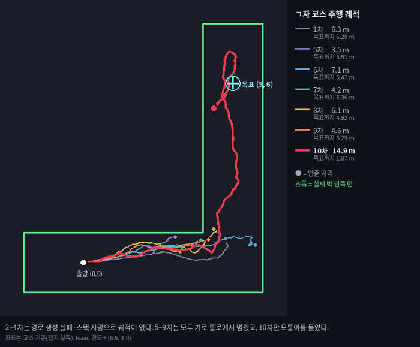
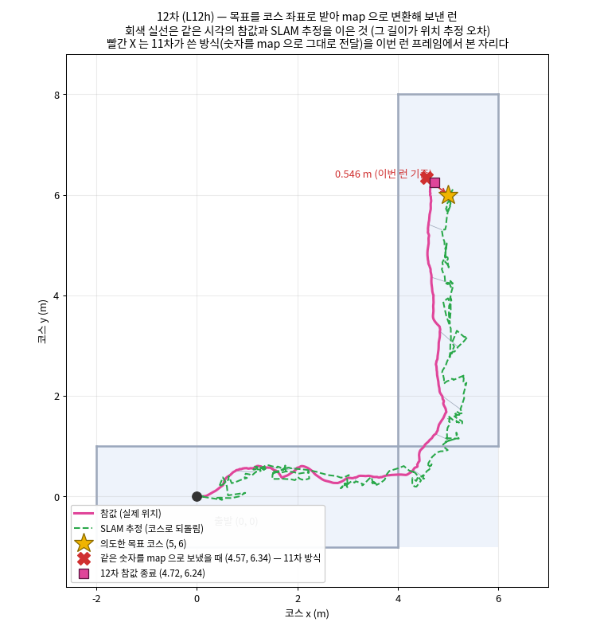

# 20261007 진행 상황 · 이민우

> 분류: 운영
> 작성: 이민우 · 2026-10-07 18:10
> 근거: 1–12차시 런 산출물(`steps.csv` · `gt.csv` · `pose_est.csv` · `feedback.csv` · `events.csv` · `cm_reach.csv` · 지도·코스트맵·경로 npz) · 스택 로그(`stack_nav2.log` · `stack_odom.log` · `stack_slam.log`) · 팟 적용 설정 파일 sha256 · 설치본 nav2·rko_lio 소스 · 교차검증 기록(`교차검증/REVIEW_HANDOFF.md` 작업 001–008)
> 요지: Go2 보행 정책 `foothold-v2` 를 Isaac Sim ㄱ자 코스에 올리고 SLAM + Nav2 로 자율보행시키는 일을 맡고 있다. 12차시 런에서 코스→map 목표 변환을 적용한 뒤 Nav2 가 `SUCCEEDED` 를 선언했고, 참값 기준으로는 0.367 m 가 남아 허용 0.25 m 를 아직 못 넘었다.
> 상태: 진행중

**검증 범위** · 아래 내용은 **시뮬레이션 ㄱ자(L) 코스에서 각 1회 수행한 런**의 결과다.
실기 로봇 주행, 실물 센서 조합(XT16 · L1) 검증, 다른 코스, 반복 안정성은
**아직 하지 않았다.**

## 1. 무엇을 하고 있나

Go2 사족보행 정책 `foothold-v2` 를 Isaac Sim 의 ㄱ자(L) 코스에 올리고, **SLAM(`slam_toolbox`) + Nav2** 로 출발점 코스 `(0, 0)` 에서 목표 코스 `(5.0, 6.0)` 까지 자율보행시킨다.

사람이 넣는 입력은 **목표 좌표와 시작 명령 둘뿐**이어야 한다. 경유점·수동 조작·주행 중 목표 수정은 쓰지 않는다. 즉 「정책이 걷는다」가 아니라 **「지도를 만들며 스스로 경로를 찾아 목표까지 간다」**가 목표다.

## 2. 기술적으로 어떻게 접근하나

역할을 보행 정책과 내비게이션으로 나눠 연결했다. `foothold-v2`는 목표 전진·회전 속도를 받아 다리 보행을 수행한다. Nav2는 로봇 위치와 장애물 정보를 바탕으로 그 속도 명령을 생성한다. 팀 방침대로 관절을 직접 제어하지 않고, 정책이 받는 명령 `(vx, vy, wz)` 만 주고받는다.

1. **위치 추정:** `rko_lio`가 라이다 점군과 IMU를 이용해 이동량·자세·속도를 추정한다. `/rko_lio/odom_at_imu_rate`와 `odom → base_link` TF를 Nav2에 제공한다. TF는 좌표계 사이 위치·회전 관계이며, odom은 초기 위치를 기준으로 누적한 로봇의 이동 좌표계다.
2. **SLAM:** `slam_toolbox`가 라이다 스캔과 odom 정보를 사용해 2차원 점유 지도를 생성하고, `map → odom` TF로 지도와 오도메트리 좌표계를 연결한다. Nav2가 사용하는 로봇 위치는 이 TF 연결을 통해 얻는다.
3. **전역 경로:** Nav2의 `NavfnPlanner`가 전역 코스트맵에서 목표까지 경로를 생성한다. 현재 전역 코스트맵은 장애물·팽창 레이어로 구성되어 있다. SLAM 지도가 발행된다는 사실과 전역 코스트맵의 장애물 관측 범위는 별도로 확인한다.
4. **지역 제어:** MPPI가 여러 미래 이동 궤적을 평가해 전진 속도 `vx`와 회전 속도 `wz`를 선택한다. 경로 추종, 장애물 비용, 목표 접근 등을 함께 평가한다. 예측 구간은 `56 steps × 0.05 s = 2.8 s`, 운동 모델은 `DiffDrive`다.
5. **명령 전달:** velocity smoother와 collision monitor를 거친 명령을 어댑터가 보행 정책에 전달한다. MPPI·smoother·어댑터의 전진 속도 상한은 현재 모두 0.5 m/s다. **이 값은 10–12차시를 같은 자로 비교하기 위한 기준선이며 고정값이 아니다. 추후 상향(1.0 m/s)을 시험할 예정이다** · 세 곳을 함께 올려야 하고, 예측 지평이 지역 코스트맵 창을 넘는 문제를 같이 봐야 한다(§7 ④).
6. **검증:** Nav2 추정 위치와 참값(GT)을 같은 시각·좌표계에서 비교한다. 목표 좌표 변환, TF 갱신, 명령 단절, 경로·코스트맵, 실제 도달 여부를 기록해 실패 원인을 나눠 본다.

이 구성을 선택한 이유는 기존 보행 정책을 유지하면서 지도 작성과 내비게이션 기능을 연결하고, 센서·위치 추정·경로 생성·명령 전달 중 어느 단계에서 문제가 생기는지 따로 계측할 수 있기 때문이다. 주요 참고 자료는 [Nav2 Jazzy MPPI 공식 문서](https://docs.nav2.org/jazzy/configuration_and_development/configuration_guide/controller_plugins/mppi_controller/configuring_mppic/)와 Nav2·rko_lio 구현이다. 별도로 적용한 새 논문 기반 알고리즘은 없음.

### 12차시의 단일 변경 · 목표 좌표계 정렬

11차시까지 목표를 `map` 프레임 숫자 `(5, 6)` 으로 그대로 보냈는데, 그 점이 실제 코스 위에서는 다른 자리였다. 두 가지가 겹친 결과다.

1. **이번 초기조건에서 정책을 실행하면 정지 중 참값 yaw 가 약 +4.01° 로 수렴한다** `확인됨`. (이번 정책·씬·초기조건에서의 관측값이며 정책의 보편적 성질로 일반화하지 않는다.)
2. `rko_lio` 는 **첫 스캔 시점의 자세를 odom 원점(항등)으로 선언**한다 `확인됨` · 설치본 `core/util.hpp:69` 의 기본 생성 `Sophus::SE3s pose;`, 초기자세 파라미터는 config·launch·헤더 통틀어 0건.

그래서 `map`·`odom` 축이 코스 축에서 약 4.01° 돌아간다. 순수 회전만 고려하면 목표 반경 7.81 m 에서 약 0.546 m, 11차시 실측 변환으로 계산한 두 목표 사이 실제 거리는 0.540322 m 다.

12차시는 목표를 코스 좌표로 받아, 런 시작에 로봇이 서 있는 4초 창에서 변환을 실측해 `map` 좌표로 바꿔 보낸다.

```
T_course_odom = T_course_base(t0) × inv(T_odom_base(t0))
T_course_map  = T_course_odom × inv(T_map_odom(t0))
map 목표      = inv(T_course_map) × 코스 목표
map 방향      = wrap(코스 방향 + T_map_course 의 yaw)
```

12차시 실측: `T_map_course = (−0.008457, +0.004547, −4.0714°)` → 코스 `(5, 6, 0°)` 가 `map (5.404924, 5.634405, −4.0714°)` 가 된다. **4.01° 를 상수로 박지 않는다.** 런마다 다시 재고, 최종 목표 송신 관문 다섯 가지(왕복 항등 · 직교축 · 참값 정지 · 목표 흔들림 · 창 완료)를 통과해야 목표를 보낸다. 통과 못 하면 목표를 보내지 않고 런을 중단한다.

## 3. 구성

| 항목       | 값                                                                                     |
| -------- | ------------------------------------------------------------------------------------- |
| 실행 환경    | RunPod 팟 (GPU 1장) · 작업 영역 `/data/leeminwoo`. **세부 Isaac 버전·GPU 모델은 이 보고서에서 확인하지 않았다** |
| 시뮬       | Isaac Sim (headless streaming) · IsaacLab                                             |
| ROS      | ROS 2 Jazzy · `rmw_fastrtps_cpp`                                 |
| Nav2     | `ros-jazzy-nav2-mppi-controller` 1.3.13-1noble.20260921                               |
| SLAM     | `slam_toolbox` 2.8.5                                                                  |
| 센서 입력 | 시뮬 라이다 점군·라이다 스캔, IMU. **기록기 수신 기준 `/points` 약 4.37 Hz · `/scan` 약 4.42 Hz (설계 10 Hz)**. 실물 XT16·L1 조합 검증은 없음 |
| 오도메트리    | `rko_lio` (online IMU-rate node)                                                      |
| 정책       | `foothold-v2` · **팀 고정 체크포인트 사용** (`foothold-v2-cuda0.pt`)                            |
| 코스       | ㄱ자(L): 가로 통로 x −2–6 · y ±1.0 / 세로 통로 x 4–6 · y −1–8 / 폭 2.0 m · 벽 높이 0.60 m        |
| 속도 상한 | **현재 기준선 0.5**: MPPI `vx_max` 0.5 · smoother `[0.5, 0.0, 0.6]` · 어댑터 `--clip 0.5 0.0 0.6`. 🔴 **고정값이 아니다. 추후 1.0 m/s 로 올려 비교할 예정** (§7 ④ · §8 5) |
| 지역 코스트맵  | rolling 3×3 m · 0.05 m/칸 · `robot_radius` 0.35 · `inflation_radius` 0.40              |
| MPPI 지평  | `time_steps 56 × model_dt 0.05 = 2.80 s`                                              |
| 명령 단절 처리 | 마지막 명령이 0.5 s 보다 오래되면 `stale` 로 기록·처리 (`--stale_s 0.5`)                               |

적용 파일은 런마다 **sha256 을 manifest 에 남긴다**(`nav2_params.yaml` · `rko_lio.yaml` · `slam_toolbox.yaml` · `odometry.launch.py` · `corridor_scene.py` · 실행 스크립트 4개).

**MPPI 세부**: 후보 궤적 2,000개 · `iteration_count 1` · `wz_max 0.6` · 운동 모델
`DiffDrive` · 지역 코스트맵 `update_frequency 5.0` / `publish_frequency 2.0`.
🔴 **이 값들은 26.10.04 보관 사본에서 읽은 것이고, 12차시 적용본과 파일 해시가 다르다**
(적용본 `e605486e…` / 사본 `3dc57302…`). 그 사이 변경되었을 수 있으므로 **12차시
확정값이 아니다.** 12차시 manifest 가 직접 기록한 값은 위 표의 지평·속도 상한·지역
코스트맵 크기다.

`visualize: false` 는 MPPI **계산을 끄는 것이 아니라** 계산된 궤적의 **시각화 발행**을
끄는 설정이다. 발행 부하를 줄이고 이전 런과 조건을 맞추기 위해 쓴다.

바꿀 계획이 있는 값과 고정인 값은 §8 「앞으로 바꿔서 돌려볼 조건」에 적었다.

**런 한 번이 남기는 자료**: 어댑터 `steps.csv`(25,000행) · 참값 `gt.csv`(50 Hz) · `pose_est.csv`(TF 질의 정책 12종) · `tf.csv` · `feedback.csv` · `events.csv` · `cmd.csv` · `cm_state.csv` · `cm_latency.csv` · `cm_reach.csv` · 지도/코스트맵/경로 npz · 외부시점·머리카메라 mp4 · 라이다 스캔 npz.

## 4. 지금까지 한 것

| 차수     | 무엇을 했나             | 결과                                                                                                                |
| ------ | ------------------ | ----------------------------------------------------------------------------------------------------------------- |
| 1–4차시   | 첫 통합. Nav2 가 자꾸 끊김 | 목표 도달 0회 · 최장 연속 주행 4초. 원인 4건 특정, 설정 17개 수정                                                                       |
| 5–9차시   | 저속·정지 원인 추적        | 주행은 하나 매우 느림. **세로 통로 최대 y 가 1.16 m 이하로 모퉁이를 못 돌았다.** MPPI 저속 원인 후보 5개를 공식 문서·소스와 대조                              |
| 10차시    | 기준 런 (TF 5.0 Hz)   | `ABORTED`. 이동 14.84 m · **최대 y 7.06 m 로 처음 모퉁이를 돌았다.** `optimizer_reset` 80회. **TF 공백(최대 1.300 s)을 주요 원인 후보로 좁힘** |
| 11차시    | TF 를 IMU 속도로 올림    | TF 50 Hz · 사건 대폭 감소. 참값 종료 거리 0.534 m (최근접 0.451 m)                                                               |
| 11차시 분석 | 왜 안 닿았나            | **목표를 넘기는 프레임이 코스와 약 4.01° 돌아가 있음을 발견**                                                                           |
| 12차시 | 목표를 코스→map 변환해 전달 | **Nav2 는 `SUCCEEDED` · 복구 6→2회. 🔴 그러나 이것은 «Nav2 자신의 추정 기준» 성공이고 실제 도착이 아니다**: 참값으로는 목표에서 0.367 m 떨어져 멈췄고 허용 0.25 m 를 못 넘었다. 주행 내내 허용 안에 든 참값 표본은 0개다 |

### 4.1 11차시 → 12차시 사이에 찾아 고친 것

- **초기 프레임 정렬 누락.** 11차시 1판은 「거짓 성공」·「rko_lio 드리프트」로 결론냈는데, 둘 다 약 4.01° 회전을 빼먹은 결과였다. 네 가지 서술을 철회했다.
- **계측 결함.** Jazzy 는 `Costmap.metadata.update_time` 을 0 으로 둔다(59/59 확인). 이것을 시각 정합에 쓰면 `Time(0)` = 「가장 최신」이 되어 시간 대응이 안 된다. 기록기에서 header stamp 대용으로 바꾸고 그 사실을 열에 남기게 했다.
- **지역 코스트맵의 미관측 처리.** 전역은 `track_unknown_space: true` 인데 지역에는 그 설정이 없어 Nav2 기본값 `false` 가 된다. 즉 **아직 못 본 벽이 「자유」로 들어온다.** 저장된 지역 코스트맵 전부에서 255(모름) 칸이 0개인 것으로 확인했다.
- **보조 점검기 결함.** `slam_check` 가 `/clock` 도착 전에 마감 시각을 계산해 즉시 종료한다. `seconds:=40` → 스캔 0개/1.1 초, `seconds:=261` → 117개/50.5 초로 재현했다. 입력 단절이 아니라 도구 결함이었다.

## 5. 어디까지 됐나

> **상태 표기** · 「구현」은 기능이 돌아가는 것을 **12차시 런에서 확인했다**는 뜻이다.
> 반복 안정성과 절대 정확도는 **보증하지 않는다.** 「진행」은 목표 수준에 아직 못 미친
> 것, 「예정」은 아직 시작하지 않은 것이다. **완전히 끝났다는 뜻의 「완료」는 쓰지 않는다.**

| 단계 | 상태 (완료 · 진행 · 예정) | 근거 (수치 · 영상 · 커밋) |
|---|---|---|
| 보행 정책 ↔ ROS 2 ↔ Nav2 명령 연결 | 구현 · 12차시 확인 | 10–12차시 실제 주행. 12차시 주행 구간 2,164 표본 중 `stale` 3개 = 0.139 % |
| IMU-rate odom · TF 적용 | 구현 · 12차시 확인 | `tf.csv` 의 `odom→base_link` 고유 stamp 실측: 12차시 주행 구간 50.0 Hz · 공백 중앙 0.0200 · 최대 0.0400 s (10차시 5.0 Hz · 최대 1.300 s) |
| SLAM 지도 생성 · TF 연결 | 구현 · 12차시 확인 | `slam_check` PASS · 지도 160×51 · 점유 104 · 자유 1,110. 🔴 **지도 정확도와 관측 범위는 검증하지 않았다** |
| Nav2 기동 · 코스트맵 · 경로 생성 | 구현 · 12차시 확인 | MAP·COSTMAP 관문 통과 · 저장 경로 77개. 🔴 **준비 단계에서 기동이 실패한 사례가 있었고 원인 미확정** (§7 ③) |
| ㄱ자 코너를 돌아 목표 근처까지 이동 | 구현 · 10–12차시 확인 | 10차시 최대 y 7.06 m (5–9차시는 1.16 m 에서 막힘) · 11·12차시 완주 |
| 코스→map 목표 XY·yaw 변환 | 구현 · **절대 정확도 미검증** | `T_map_course −4.0714°` · F0/F0b 통과 · 목표 흔들림 0.037412 m · 저장 경로 77개 끝점이 변환 목표와 최대 0.503 μm 차이. 🔴 **독립 기준점으로 검증한 것이 아니라 같은 변환의 왕복 확인이다** |
| **참값 기준 XY 도달 (허용 0.25 m)** | 진행 | 🔴 12차시 종료 0.367 m · 최근접 0.343 m · 허용 안에 든 참값 표본 0개 |
| 참값 기준 방향 (허용 14.32°) | **12차시 1회 통과 · 반복 미확인** | 종료 방향 오차 12.82° |
| 위치 추정 정확도 | 진행 | 🔴 11차시 중앙 0.1513 m → 12차시 0.3276 m (약 2.2배). 원인 미확정 |
| 잔여 오차 · 주춤거림 원인 분리 | 진행 | TF·피드백·경로·코스트맵 기록 확보. 소비 시각·좌표 정렬 대조 중 |
| 동일 조건 반복 · 속도 1.0 m/s 비교 | 예정 | 아직 실행 결과 없음. 0.5 m/s 기준선 유지 |
| 실기 이식 · 실물 센서 조합 검증 | 예정 | 현재 결과는 시뮬레이션에 한정 |

### 5.1 11차시와 12차시 · 무엇을 다르게 했나

두 런은 **주행 시간과 거리가 거의 같다**(11차시 42.44 s · 11.125 m, 12차시 43.26 s · 11.042 m). 그래서 비교가 깔끔한데, **무엇을 다르게 했는지를 먼저 분명히 해야** 수치 차이를 읽을 수 있다.

**① 의도한 변경 · 목표를 어떻게 넘기느냐, 하나뿐이다**

| | 11차시 | 12차시 |
|---|---|---|
| 목표 전달 | `map` 프레임 숫자 `(5, 6)` 을 그대로 보냄 | **코스 좌표로 받아, 런 시작에 실측한 변환으로 `map` 으로 바꿔 보냄** |
| 목표 방향 | yaw 를 아예 넘기지 않음 | **코스 yaw 를 같이 변환해 넘김** |
| 실제로 보낸 점 | `map (5, 6)` = 코스 약 `(4.578, 6.337)` | `map (5.404924, 5.634405, −4.0714°)` = 코스 `(5, 6, 0°)` |

**② 의도하지 않았지만 함께 바뀐 것** · 이것 때문에 「단일 변수 비교」가 아니다

| | 11차시 | 12차시 |
|---|---|---|
| 참값 발행 | 없음 (`--gt_pose 0`) · 사후에만 알 수 있었다 | **있음 (`--gt_pose 1`)** · 발행자가 하나 늘어 부하가 다르다 |
| 기록 계측 | 기본 | `cm_reach` · `arrival` · `gt_stamp_health` 추가 |
| 실행 전 관문 | A·P 관문 | **F0 · F0b 추가** (정렬 계산 · JSON 재검사). 통과 못 하면 목표를 안 보낸다 |

**③ 같게 둔 것**

```
정책 체크포인트 foothold-v2-cuda0.pt   ·   코스 ㄱ자(L)   ·   벽 높이 0.60 m
속도 상한 세 곳 0.5   ·   지역 코스트맵 rolling 3×3 m
nav2_params.yaml · slam_toolbox.yaml (해시로 확인)
TF 를 IMU 속도로 내는 설정: 11차시에서 넣은 것을 그대로 유지
```

### 5.2 궤적으로 본 진행

**1–10차시 · 5–9차시는 모두 가로 통로에서 멈췄고, 10차시에 처음 모퉁이를 돌았다**



2–4차시는 경로 생성 실패·스택 종료로 궤적이 없다. 5–9차시는 목표까지 4.92–5.51 m 를
남기고 가로 통로에서 멈췄고, 10차시만 14.9 m 를 걸어 모퉁이를 돌아 목표까지 1.07 m
앞에 섰다. (그림 안의 「접지」는 이 보고서의 **「참값」**과 같은 말이다 · 용어를 바꾸기
전에 그린 그림이다.)

**12차시 · 목표는 제자리에 찍혔는데 로봇이 자기 위치를 잘못 알았다**



분홍이 참값(실제 위치), 초록 점선이 SLAM 추정을 코스 좌표로 되돌린 것이다. 둘을 잇는
회색 선의 길이가 그 순간의 위치 추정 오차다. 빨간 ✕ 는 11차시 방식(숫자를 `map` 으로
그대로 전달)이었다면 목표가 찍혔을 자리이고, 노란 ★ 가 의도한 코스 목표 `(5, 6)` 이다.
**12차시는 ★ 로 제대로 보냈지만 참값 종료(분홍 네모)는 0.367 m 떨어져 있다.**

## 6. 다른 사람과 주고받는 것

팀의 고정 보행 체크포인트와 Nav2·SLAM 설정을 입력으로 사용하고 있다. 이를 내비게이션 파이프라인과 연결한 실행 스크립트, 런 로그·영상·계측 결과, 변경 사항과 실패 원인 분석을 공유한다. 팀원별로 새롭게 주고받은 추가 산출물은 없음.

구현과 분석에는 Claude를 사용하고, Codex와 브릿지를 통해 코드·수치·가설을 교차검증하고 있다. `REVIEW_HANDOFF.md`에 검토 질문과 자료 경로를 적고, 수정본·검토 회신을 Markdown으로 남긴다. 실행 승인과 기술적 검증 완료는 구분하며, 검토에서 확인되지 않은 원인은 추정으로 표시한다.

## 7. 막힌 것 · 판단이 필요한 것

**① 해당 구간 위치 추정 오차가 왜 2.2 배로 커졌는지 모른다** `미계측`
짚이는 것은 12차시가 참값 발행(`--gt_pose 1`)으로 발행자를 하나 늘린 것이나, 런별 편차와 가를 자료가 없다.
→ **동일 조건 반복을 최우선으로 진행한다. 필요한 반복 횟수와 런 예산을 협의하고, 종료 오차·추정 오차·출발 과도현상을 비교한다.**

**② 라이다 수신률이 낮다**
기록기 수신 기준 `/points` 약 4.37 Hz · `/scan` 약 4.42 Hz (설계 10 Hz) `확인됨`. **저하 원인은 미계측.**
→ **센서 생성 · 브리지 송신 · 기록기 수신을 구분한 계측부터 진행한다.**

**③ Nav2 기동 경합 · 팀 판단 요청**
L12f 에서 `local_costmap` 이 활성화 중 `odom→base_link` 를 못 찾아 기동 전체가 중단됐다 (12차시 결과 문서의 L12f 로그 인용 기준).
`initial_transform_timeout` 의 **현재 유효값과 설치본 적용 범위는 아직 확인하지 못했다.** 활성화 전 TF 대기 한도만 바꾸는 설정임을 확인하면 **기동 전용 변경으로 분류하는 안**을 제안한다. 기동 성공률·기동 시간은 별도 조건으로 비교하고, 주행 비교는 동일한 준비 관문 통과 후 수행한다.
→ **이 관리 방식에 대한 팀장 판단이 필요하다.**

**④ MPPI 지평과 지역 코스트맵 창의 관계 · 판단 요청**
지평 2.80 s 는 0.5 m/s 에서 1.4 m 를 내다보는데, 주행 구간 실측 전방 창은 중앙 1.575 m(전체 계측 구간 1.525 m)다. **1.0 m/s 로 올리면 2.8 m 가 되어 창을 넘는다.** 따라서 「속도를 올린다」는 실험은 속도 효과만이 아니라 창 경계 효과를 함께 건드린다.
→ **2×2 실험(0.5/3 · 1.0/3 · 0.5/6 · 1.0/6)의 필요성은 제안이다. 위치 추정 진단 뒤 별도 실험으로 진행할지 판단이 필요하다.**

**⑤ 미관측 구간을 통과하는 전역 경로**
11차시 초반에 전역 경로가 **실제 벽을 관통하는** 사례를 관측했다 `확인됨`. 전역 코스트맵의
`allow_unknown` 과 제한된 장애물 관측 범위가 후보이고, **지역 코스트맵도 미관측 칸을
비용 0(자유)으로 취급**한다(저장 코스트맵 전부에서 255 칸 0개 확인).
→ **SLAM 지도 발행을 기다리는 것만으로 해결된다고 보지 않는다. 저장 경로·코스트맵
재생으로 기전을 먼저 확인하고, 설정 변경은 그 뒤에 판단한다.**

**⑥ 직선 구간에서 주춤거림과 좌우 회전**
직선 통로에서도 MPPI 회전 명령과 속도 변화가 관측된다. 전역 경로 · 지역 장애물 비용 ·
위치·속도 추정 · 보행 추종을 나눠 봐야 한다.
→ **현재 자료만으로 MPPI 고장이나 보행 정책 문제로 확정하지 않는다.** ⑤ 의 경로 재생과
같이 본다.

**⑦ `cm_approach` 상태 진입이 2 → 6 회로 늘었다**
전부 출발 후 2.92–10.18 초에 몰려 있고 유지 합은 0.38 초(11차시 0.04 초) `확인됨`. **독립 위험 사건 6건이 아니다.** 직접 트리거는 미확인.
→ **원시 `/scan` · 당시 TF · 명령 분석으로 감속 원인을 확인한다.**

## 8. 다음에 할 것

```
1  같은 조건 반복 런 · 위치 추정 악화가 런별 편차인지 가린다        ← 최우선
   바꾸는 것 없음. 종료 오차와 출발 과도현상의 재현성만 본다
2  계측 보강 (런 불필요)
   · Nav2 가 수락한 액션 요청(UUID·frame·stamp·XY·quaternion) 기록 추가
     - 지금 기록기는 보낸 목표를 같은 JSON 에서 역산해 독립 확인이 안 된다
   · 위치 추정 표의 시각 기준을 추정 stamp 로 통일
3  저장 경로·코스트맵을 재생해 초반 미관측 경로와 MPPI 저속·회전의 관련성을 본다
   런 없이 가능하다. §7 ⑤⑥ 을 같이 가른다
4  위치 추정 관련 변경을 하나씩 · 라이다 수신률만 바꾸는 실험부터
5  속도 상한과 지역 코스트맵 크기를 2×2 로 (§7 ④ 판단 후)
6  기동 경합이 재현되면 initial_transform_timeout 안을 올린다 (§7 ③ 판단 후)
7  준비·정리 단계의 실패를 «주행 실패»와 구분해 기록하고 기동·저장 절차를 안정화한다
```

**런당 단일 변경 원칙을 지킨다.** 다만 §5.1 에 적었듯 11차시→12차시는 계측·절차도 함께 바뀌었으므로, 앞으로는 **바뀐 것 전체를 런마다 명시**한다.

### 앞으로 바꿔서 돌려볼 조건

§3 구성 표의 값은 **10–12차시를 같은 자로 비교하기 위한 기준선**이다. 아래는 그중 바꿀
계획이 있는 것과 고정인 것을 가른 것이다. **런당 하나씩만 바꾼다.**

| 조건 | 현재 | 바꿀 계획 | 왜 |
|---|---|---|---|
| 전진 속도 상한 (세 곳) | 0.5 m/s | **1.0 m/s 로 상향 비교 (확정 계획)** | Nav2 가 내는 `cmd_vx` 중앙이 상한의 33.6 % 지만 p90 0.488 · 최대 0.500 으로 가끔 상한에 붙는다. 상한이 느림의 원인인지 미계측 (§7 ④) |
| 지역 코스트맵 크기 | rolling 3×3 m | **6×6 m 와 2×2 비교 (확정 계획)** | 예측 지평 2.80 s 가 1.0 m/s 에서 2.8 m 를 내다보는데 전방 창은 약 1.575 m 다. 속도만 올리면 두 효과가 섞인다 (§7 ④ · 위 5) |
| 라이다 발행률 | 수신 약 4.4 Hz (설계 10 Hz) | **원인 규명 후 단일 변경 후보** | SLAM 입력이 드물다. 센서 생성·브리지 송신·기록기 수신 중 어디서 줄었는지 먼저 가른다 (§7 ②) |
| nav2 `initial_transform_timeout` | **설정 없음** (기본값) | 기동 경합이 재현되면 상향 제안 (후보 10.0 s) | 기동 전용 변경이라 주행 조건과 분리해 관리할지 팀 판단이 필요하다 (§7 ③) |
| 전역 `allow_unknown` · 지역 `track_unknown_space` | 전역 `true` · 지역 **설정 없음**(기본 `false`) | 저장 경로·코스트맵 재생으로 기전 확인 후 판단 | 지역 코스트맵이 미관측 칸을 비용 0(자유)으로 본다. 설정부터 바꾸지 않고 재생으로 먼저 가른다 (§7 ⑤) |
| MPPI 예측 지평 | 2.80 s (`56 × 0.05`) | 속도·창 실험 결과를 본 뒤 후보 | 지평·속도·창은 서로 묶여 있어 따로 바꾸면 해석이 안 된다 |

**바꾸지 않는 것**

```
정책 체크포인트     팀이 정한 foothold-v2 하나로 고정. 재학습·교체 안 한다
코스와 벽 높이      ㄱ자(L) · 0.60 m: 5–12차시를 같은 지형에서 비교하기 위함
교재 원본 스크립트   goal_path_check.py · slam_check.py · ros_bridge.py · gt_eval.py
                   (사본과 .bak 백업으로만 작업한다)
명령 단절 기준      --stale_s 0.5: 어댑터와 Nav2 의 접점 판정 기준이라 고정
```

## 9. 자료 위치

```
저장소 (제출)
  foothold-lab  inbox/lee/20261007-wip.md                      ← 이 문서
```

🔴 **아래 「검토 폴더」와 「교차검증」은 이민우 로컬 PC 에 있고 팀 저장소에는 올리지
않았다.** 런 하나가 100 MB 안팎(영상·라이다 스캔·코스트맵 npz)이라 저장소에 넣기에
부담이 커서다. **원자료·영상·로그가 필요하시면 말씀해 주시면 전달하겠다.** 어떤 형태로
올려 둘지(용량을 줄인 요약본 · 외부 저장소 · 저장소 직접 반입)도 함께 정해 주시면
그에 맞추겠다.

```
검토 폴더 (~/Desktop/foothold/1차 검토/) · 로컬
  26.10.06/원자료/nav_v2_L10*                                   10차 원자료·로그
  26.10.07/1-10차-종합/1차-10차런-정리.md                        1~10차 요약 + 런별 궤적 그림
  26.10.07/11차/11차런-결과.md                 (판 5)           TF IMU 속도 진단 런
  26.10.07/11차/영상/v2-ㄱ자-자율보행-11차-대시보드.mp4
  26.10.07/12차/12차런-결과.md                 (판 3)           목표 좌표계 정렬 런 · 재현 명령 포함
  26.10.07/12차/그림-12차-궤적.png                                        참값·SLAM 추정·두 목표점
  26.10.07/12차/영상/v2-ㄱ자-자율보행-12차-대시보드.mp4                     55 s · 실시간
  26.10.07/12차/원자료/nav_v2_L12h/                                      어댑터 (steps.csv · 영상 · 라이다 2,233장)
  26.10.07/12차/원자료/nav_v2_L12h_rec/                                  기록기 (지도 32 · 코스트맵 104 · 경로 77)
  26.10.07/12차/원자료/nav_v2_L12h_로그/                                  스택 로그 · 관문 기록 · 정렬 JSON · 적용 해시
  26.10.07/12차/준비파일/                                                실행 스크립트 4개 + 사전 점검

교차검증 (~/Desktop/foothold/교차검증/) · 로컬
  REVIEW_HANDOFF.md                                             작업 001~008 (정본 인계 기록)
  CODEX_REVIEW_008_RUN12_STATIC.md · ..._REVISION.md            12차 준비 스크립트 정적 검토
  CODEX_REVIEW_009_RUN12_RESULT.md                              12차 결과 검증 답신

실행 환경 (RunPod 팟 /data/leeminwoo)
  runs/ch10/nav_v2_L12h · runs/ch10/nav_v2_L12h_rec · runs/ch11/nav_v2_L12h
  scripts/run_nav_L12.sh · run_all_L12.sh · record_nav12.py · course_goal_L12.py
```

