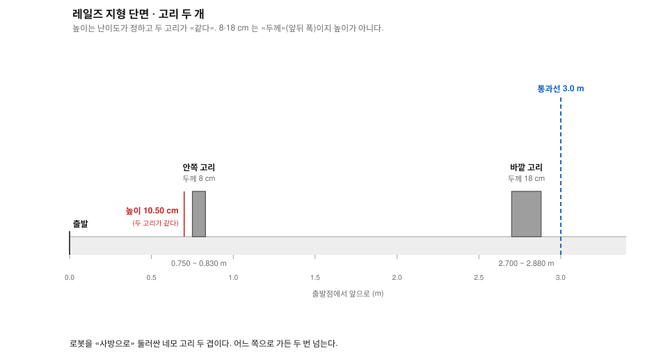
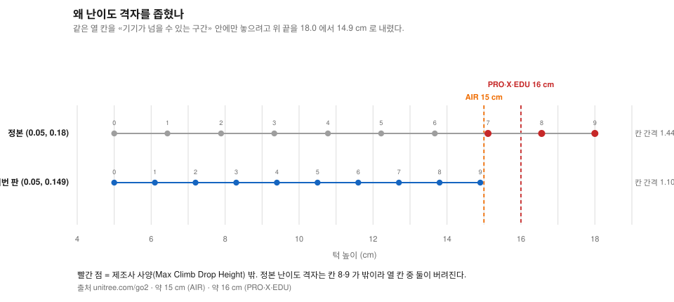
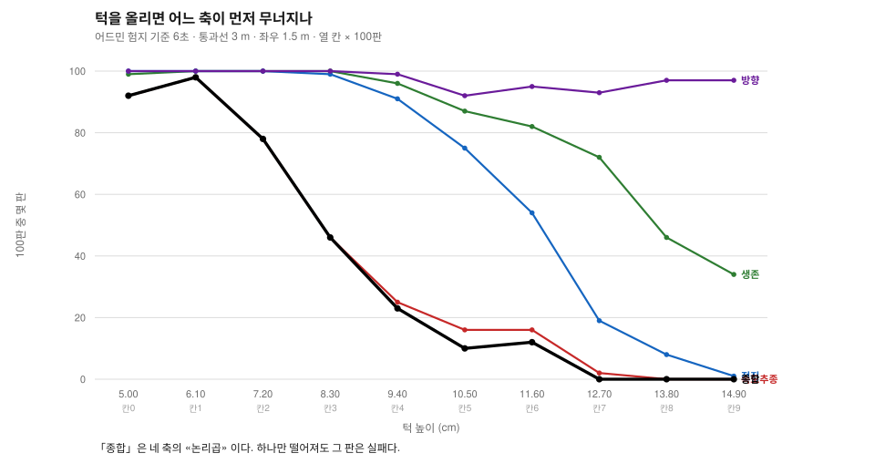
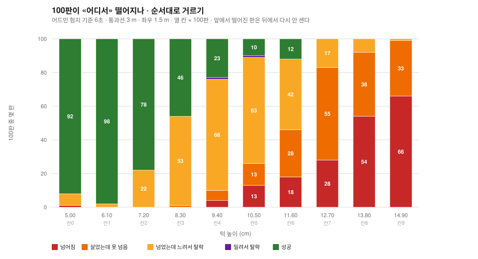
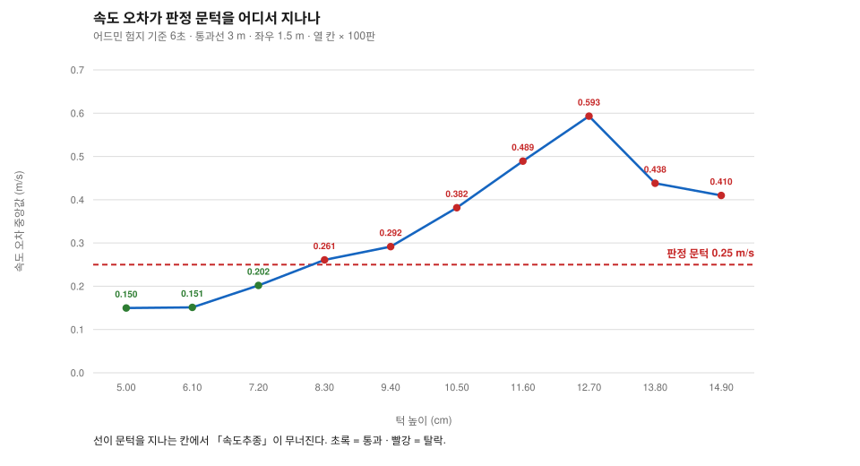

# 레일즈 난이도 격자: 8~11 cm 에서는 살아서 넘고도 «느려서» 떨어진다

> 분류: 실험
> 작성: 맹라현 · 2026-09-07 07:10
> 근거: 실측 (아이작심 열 칸 × 100판 × 두 시계 = 2,000판) · IsaacLab 소스 원문
> 요지: 턱 5.0~14.9 cm 를 열 칸으로 나눠 2,000판을 돌렸다. 실패 원인이 높이마다 다르다. 8.3~11.6 cm 에서는 로봇이 살아서 턱을 넘는데 «명령 속도를 못 따라갔다» 는 이유로 떨어지고, 12.7 cm 위에서야 낙상이 주가 된다.
> 상태: 초안
> 판: v1.0
> 이슈: #66 #216 #90 #99 #125

> 실행: 맹라현 · 2026-09-07 · RunPod RTX 4090
> `isaaclab` 패키지 **0.54.2** `확인됨` (첨부 `run_manifest.json` 스무 칸 전부).
> **팀장 09-03 실행 기록**도 같은 `0.54.2` 다. 내가 잰 것이 아니라 그 파일을 읽은 것이다
> (`sim/eval/results/20260903-rough10-1.0mps/run_manifest.json`).
> 포드 템플릿 이름은 `IsaacLab-2.3.2-Go2` 이나 **설치본을 직접 확인하지 않았다** `미확인`.
> 정책: 팀 기준선 NVIDIA 공식 체크포인트 sha256 `f2aa77bf…` `확인됨`
> 원자료: **행 파일** `haeng/isaac/results/20260907-rails-6s/` · `haeng/isaac/results/20260907-rails-50s/`
> 조건: **어드민 기획서** `deliverables/plan/proposal.md` 209행 험지 기준 그대로

---

## 0. 결론 먼저

레일즈(`rails`)는 **로봇 앞을 가로막는 턱 두 개를 넘는 지형**이다. 그 턱을 5.0 cm 부터
14.9 cm 까지 **열 칸**으로 나눠, **칸마다 100판씩 두 번** 돌렸다. 모두 **2,000판**이다.

**네 가지가 나왔다.**

### 1. 실패의 원인이 «높이마다 다르다». 두 자리로 갈린다

100판을 순서대로 걸러 본 것이다. 앞 칸에서 떨어진 판은 뒤 칸에서 다시 세지 않는다.

| 턱 높이 | 넘어짐 | 살았는데 못 넘음 | **넘었는데 느려서 탈락** | 성공 |
|---|---|---|---|---|
| **8.30 cm** | 0판 | 1판 | **53판** | 46판 |
| **9.40** | 4 | 6 | **66** | 23 |
| **10.50** | 13 | 13 | **63** | 10 |
| 11.60 | 18 | 28 | 42 | 12 |
| **12.70** | **28** | **55** | 17 | 0 |
| **14.90** | **66** | 33 | 1 | 0 |

**8.30 cm 에서 로봇은 100판 중 99판을 살아서 넘는다. 그런데 53판이 「느리다」는 이유로
실패로 찍힌다.** 낙상은 0판이다.

**12.70 cm 위는 이야기가 다르다.** 거기서는 정말로 넘어지고(28 -> 66판), 살아서도 턱
앞에 갇힌다(55판 · 33판).

### 2. 종합이 반토막 나는 자리는 **7.20 -> 8.30 cm** 한 칸이다

| 턱 cm | 5.00 | **6.10** | **7.20** | **8.30** | 10.50 | 12.70 위 |
|---|---|---|---|---|---|---|
| **종합** | 92% | **98%** | **78%** | **46%** | 10% | **0%** |

**90% 를 넘는 것은 5.00 cm(92%)와 6.10 cm(98%) 둘뿐이다.**
그리고 **7.20 -> 8.30 cm 한 칸에서 78% 가 46% 로 반토막 난다.**
**꺾이는 이유는 낙상이 아니라 속도다** (위 1번).

### 3. 「시간이 6초라 모자란 것 아니냐」 → **아니다**

시간을 **여덟 배(50초)** 로 풀어도 통과선을 넘는 판이 **최대 9판** 늘 뿐이다.

| 턱 cm | 6초 전진 | 50초 전진 | 차 |
|---|---|---|---|
| 10.50 | 75% | 81% | +6 |
| 11.60 | 54% | 58% | +4 |
| 12.70 | 19% | 28% | **+9** |

**어드민 6초 기준은 레일즈에서 정당하다.** 시간은 병목이 아니다.

### 4. 「옆으로 밀려서 떨어지는 것 아니냐」 → **아니다**

방향 성공률이 열 칸에서 **92~100%** 이고, 좌우 이탈 중앙값이 **0.07~0.46 m** 다.
판정 임계 1.5 m 에 한참 못 미친다. **다섯 축 가운데 방향은 한 번도 병목이 아니었다.**

---

## 1. 무엇을 재는 실험인가



### 1-1. 지형: 턱 두 개

로봇은 출발점에서 앞으로 걸어가며 **턱 두 개**를 넘어야 한다.

| 자리 | 출발점에서 | 무엇 |
|---|---|---|
| 1 | 0.00 m | 출발 |
| 2 | **0.75 ~ 0.83 m** | **앞 턱** · 두께 8 cm |
| 3 | 0.83 ~ 2.70 m | 평지 1.87 m |
| 4 | **2.70 ~ 2.88 m** | **뒤 턱** · 두께 18 cm |
| 5 | **3.00 m** | **통과선** · 여기까지 가면 「전진 성공」 |
| 6 | 4.00 m | 지형 타일 끝 |

**두 턱은 높이가 같다.** 난이도가 정하는 것은 높이 하나이고, 두께는 앞 8 cm · 뒤 18 cm
로 고정이다. **이 순서는 바뀌지 않는다** (7절에서 이것이 문제가 된다).

**통과선 3 m 는 뒤 턱 뒷면(2.88 m)에서 12 cm 뒤다.** 즉 「두 턱을 다 넘었나」를 재는 선이다.

### 1-2. 난이도 열 칸

IsaacLab 은 난이도를 0 에서 1 까지의 숫자로 받아 턱 높이로 바꾼다 (`mesh_terrains.py` 401행 `확인됨`).

```python
rail_height = cfg.rail_height_range[0] + difficulty * (cfg.rail_height_range[1] - cfg.rail_height_range[0])
```

칸 k(0~9)의 난이도는 `k/9` 다. **이 문서는 열 칸을 전부 돌렸다.**

| 칸 | 0 | 1 | 2 | 3 | 4 | 5 | 6 | 7 | 8 | 9 |
|---|---|---|---|---|---|---|---|---|---|---|
| **턱 높이 cm** | 5.00 | 6.10 | 7.20 | 8.30 | 9.40 | 10.50 | 11.60 | 12.70 | 13.80 | 14.90 |

### 1-3. 이 난이도 격자는 «어드민 기획서와 다르다». 왜 바꿨나

| 어디 | `rail_height_range` | 한 칸 간격 | 맨 위 |
|---|---|---|---|
| **어드민 기획서 326행 · 정본 설정** | (0.05, 0.18) | 1.44 cm | 18.0 cm |
| **이 문서** | **(0.05, 0.149)** | **1.10 cm** | **14.9 cm** |

**바꾼 이유 둘.**

1. **정본 난이도 격자는 위 두 칸이 기기 한계 밖이다.** 유니트리 공식 사양이
   「16 cm 이상은 못 넘는다」고 적는다 (9/2 멘토링 전사 `01:03:59`).
   정본 난이도 격자의 칸 8(16.56 cm)·칸 9(18.00 cm)이 그 선 밖이라, 열 칸 중 **두 칸이 버려진다.**

2. **정본 난이도 격자는 갈리는 구간이 성기다.** 정본으로 재면 종합이 96% -> 55% 로 한 칸에
   꺾이는데(6.44 -> 7.89 cm), 그 사이가 비어 보이지 않는다. 간격을 1.44 cm 에서 1.10 cm
   로 좁히면 같은 구간에 칸이 하나 더 들어간다.

**바꾼 것은 이 실행뿐이다.** 파일은 안 고쳤다. `test_terrains.py` 가 검사하는 정본 값
`(0.05, 0.18)` 은 그대로 있고, 실행 직전 메모리에서만 갈아 끼웠다 (2절).

> **주의.** 그래서 **이 문서의 칸 번호는 기획서 격자표의 칸 번호와 같지 않다.**
> 서로 대면 안 된다. 대려면 **턱 높이(cm)** 로 대야 한다.
> 어느 쪽 난이도 격자를 정본으로 쓸지는 12절 「물어볼 것」 1번이다.

### 1-4. 한 판이 성공하려면 네 가지를 다 만족해야 한다

**이 문서의 표에 나오는 다섯 열이 이것이다.**

| 열 이름 | 무엇을 재나 | 통과 기준 |
|---|---|---|
| **생존** | 몸이 지형에 닿지 않고 제한 시간을 채웠나 | 몸통 접촉 없음 |
| **전진** | 통과선까지 갔나 | 3 m 이상 |
| **속도추종** | 명령한 속도를 따라갔나 | 평균 오차 **0.25 m/s 이하** |
| **방향** | 옆으로 안 밀렸나 | 1.5 m 이내 |
| **종합** | **위 넷을 «모두» 만족했나** | 넷 다 통과 |

**종합은 넷의 논리곱이다.** 하나만 떨어져도 그 판은 실패다. 그래서 종합은 항상
네 축 중 «가장 낮은 것» 이하가 된다.

### 1-5. 이 실험이 채우려는 빈칸

**어드민 기획서**가 두 군데를 비워 뒀다.

> **층 2 의 경계값은 아직 없다.** 지금까지의 1,000판은 … 전부 난이도 0.5 한 점에서 측정한 값이다.
> 난이도 격자를 아직 돌리지 않았으므로 **이동폭 목표를 지금 적지 않는다.** (7-1 · 240행)

> 난이도 경계의 이동폭 · **경계값이 없다** (7-1 「아직 목표값을 정하지 않은 셋」 · 262행)

기획서 7-2 의 격자 규격표에 `rails` 행은 있으나 통과율이 비어 있다.
**이 문서는 그 행을 채운다.** 정식 격자는 아니다 (9절 「아직 못 한 것」 ① 참고).

---

## 2. 조건



**어드민 기획서** 209행을 그대로 따랐다 `확인됨`. **본표(3~4절)는 6초 판이다.**

| 항목 | 6초 판 (본표) | 50초 판 (5절 대조) |
|---|---|---|
| 제한 시간 | **6초** (어드민) | 50초 |
| 통과선 · 명령 속도 | 3 m · 1.0 m/s | 같음 |
| 좌우 이탈 임계 | 1.5 m | 같음 |
| 속도 오차 임계 | 0.25 m/s | 같음 |
| 세계 테두리 `border_width` | **10 m** (정본) · 전방 한계 14 m | 60 m · 전방 한계 64 m |
| 시드 | 42 | 42 |
| 규모 | **칸당 100판 · 열 칸 = 1,000판** | 같음 |
| 초기 변동 | spawn ±0.10 m · yaw ±5.0도 · 관절 ×0.95~1.05 | 같음 |

**50초 판만 세계를 넓힌 이유.** 정본 테두리 10 m 면 전방 한계가 14 m 다. 50초에
1.0 m/s 면 50 m 를 가야 하므로 세계가 모자란다. **턱(타일 8 m)은 안 건드리고 그 바깥
평지만 넓혔다.** 6초 판은 6 m 만 가면 되므로 정본 10 m 그대로다.

**정본 하네스 `sim/eval/eval_generalization.py` 를 고치지 않았다.** 판정·집계·초기조건은
전부 정본 것이다. 재현 스크립트 `haeng/isaac/sweep_rails_difficulty.py` 는 정본 모듈을
그대로 불러들인 뒤 `main()` 을 부르기 **직전에** 설정 객체 세 값
(`difficulty_range` · `rail_height_range` · `border_width`)만 메모리에서 바꾼다.

---

## 3. 실측: 어드민 기준 6초 · 열 칸 × 100판



**아래 숫자는 모두 «100판 중 몇 판» 이다.** 열이 무엇을 재는지는 1-4 절에 있다.

| 칸 | 턱 높이 | 종합 | Wilson 95% | 생존 | 전진 | **속도추종** | 방향 | 평균 전진 |
|---|---|---|---|---|---|---|---|---|
| 0 | 5.00 cm | 92% | [85.0, 95.9] | 99% | 100% | **92%** | 100% | 5.32 m |
| **1** | **6.10** | **98%** | [93.0, 99.4] | 100% | 100% | **98%** | 100% | 5.24 |
| **2** | **7.20** | **78%** | [68.9, 85.0] | 100% | 100% | **78%** | 100% | 4.94 |
| **3** | **8.30** | **46%** | [36.6, 55.7] | 100% | 99% | **46%** | 100% | 4.55 |
| 4 | 9.40 | 23% | [15.8, 32.2] | 96% | 91% | **25%** | 99% | 4.10 |
| 5 | 10.50 | 10% | [5.5, 17.4] | 87% | 75% | **16%** | 92% | 3.43 |
| 6 | 11.60 | 12% | [7.0, 19.8] | 82% | 54% | **16%** | 95% | 2.80 |
| **7** | **12.70** | **0%** | [0.0, 3.7] | **72%** | **19%** | **2%** | 93% | 1.88 |
| 8 | 13.80 | 0% | [0.0, 3.7] | 46% | 8% | **0%** | 97% | 1.35 |
| 9 | 14.90 | 0% | [0.0, 3.7] | 34% | 1% | **0%** | 97% | 1.05 |

**세 자리로 갈린다.**

| 구간 | 턱 | 무슨 일이 나나 |
|---|---|---|
| **되는 구간** | 5.0 ~ 7.2 cm | 다 살고 다 넘는다. 종합 78% 이상 |
| **속도에서 떨어지는 구간** | **8.3 ~ 11.6 cm** | 살아서 넘는데 **속도추종이 46% -> 16%** 로 무너진다 |
| **막히는 구간** | 12.7 cm 위 | 넘는 것 자체가 안 된다. 전진 19% -> 1% · 생존 72% -> 34% |

**종합 90% 를 넘는 것은 칸 0(5.00 cm · 92%)과 칸 1(6.10 cm · 98%) 둘뿐이다.**
칸 2(7.20 cm)는 78% 로 이미 그 아래이고, 칸 3(8.30 cm)에서 46% 로 반토막 난다.

> **칸 6(11.60 cm)이 칸 5(10.50 cm)보다 종합이 높다** (12% 대 10%). 두 구간이
> [5.5, 17.4] 와 [7.0, 19.8] 로 크게 겹치므로 **순서가 뒤집혔다고 말할 수 없다** `미측정`.
> 100판으로는 이 정도 차이를 못 가른다.

---

## 4. 왜 떨어지나: 100판을 순서대로 걸러 보면



한 판이 실패하는 길은 여럿인데, 위 표는 축마다 따로 세어 **어느 것이 먼저 무너졌는지**를
안 보여 준다. 그래서 **순서대로** 걸렀다. 앞에서 떨어진 판은 뒤에서 다시 세지 않는다.

`넘어졌나` → `살았는데 통과선을 못 갔나` → `넘었는데 느렸나` → `옆으로 밀렸나` → 성공

| 턱 cm | 넘어짐 | 살았는데 못 넘음 | **넘었는데 느려서 탈락** | 밀려서 탈락 | 성공 | 속도 오차 중앙 |
|---|---|---|---|---|---|---|
| 5.00 | 1 | 0 | 7 | 0 | **92** | 0.150 |
| 6.10 | 0 | 0 | 2 | 0 | **98** | 0.151 |
| 7.20 | 0 | 0 | **22** | 0 | **78** | 0.202 |
| **8.30** | **0** | **1** | **53** | 0 | 46 | **0.261** |
| **9.40** | 4 | 6 | **66** | 1 | 23 | 0.292 |
| **10.50** | 13 | 13 | **63** | 1 | 10 | 0.382 |
| 11.60 | 18 | 28 | 42 | 0 | 12 | 0.489 |
| **12.70** | **28** | **55** | 17 | 0 | 0 | 0.593 |
| 13.80 | **54** | 38 | 8 | 0 | 0 | 0.438 |
| 14.90 | **66** | 33 | 1 | 0 | 0 | 0.410 |

각 줄의 다섯 칸을 더하면 100 이다 `확인됨`.

### 4-1. 8.3 ~ 10.5 cm: 살아서 넘는데 «느리다» 는 이유로 떨어진다

**8.30 cm 에서 낙상은 0판이다.** 100판 중 99판이 통과선을 넘는다.
그런데 그중 **53판이 속도추종에서 떨어진다.**

9.40 cm 도, 10.50 cm 도 같다. **가장 많이 떨어지는 칸이 언제나 「속도」다** (66판 · 63판).

### 4-2. 왜 하필 8.30 cm 에서 꺾이나: 판정 문턱을 지나기 때문이다

속도추종의 통과 기준은 **평균 오차 0.25 m/s 이하**다 (`eval_generalization.py` 86행 기본값).

| 턱 cm | 5.00 | 6.10 | **7.20** | **8.30** | 9.40 | 10.50 |
|---|---|---|---|---|---|---|
| **속도 오차 중앙값** | 0.150 | 0.151 | **0.202** | **0.261** | 0.292 | 0.382 |
| | | | ↑ 문턱 아래 | ↑ **문턱 넘음** | | |
| **종합** | 92% | 98% | 78% | **46%** | 23% | 10% |

**중앙값이 0.25 를 넘어서는 칸이 8.30 cm 이고, 종합이 반토막 나는 칸도 8.30 cm 다.**
같은 자리다.

> **어드민 기획서 248행**이 건 목표를 이 표로 읽으면 이렇게 된다.
>
> > `rails` 속도 오차 중앙값 **0.502 -> 0.25 m/s 이하**
>
> 그 `0.502` 는 **난이도 0.5(정본 난이도 격자에서 턱 11.5 cm)** 에서 잰 값이다.
> 내 난이도 격자에서 0.502 는 **11.60 cm(0.489)와 12.70 cm(0.593) 사이**다 `확인됨`.
> 목표 0.25 는 **7.20 cm(0.202)와 8.30 cm(0.261) 사이**다.
>
> 즉 기획서 목표는 「**11.5 cm 에서 나던 속도를 7~8 cm 수준으로 끌어올려라**」와 같은
> 크기다. 다만 이것은 **두 숫자를 같은 자로 나란히 놓은 것**이지, 학습이 그렇게
> 움직인다는 뜻은 아니다 `추측`.

### 4-3. 못 가른 것: 「균일하게 느린 것」인가 「가다 서다」인가

> **주의.** 속도 오차 `velocity_mae_mps` 는 매 스텝 `‖실제속도 − (1.0, 0)‖` 의 평균이다.
> 로봇이 **균일하게 느린 것**인지 **턱에서 멈칫하는 것**인지는 **이 값 하나로는 못 가른다** `미측정`.
> `vy≈0` 이고 `vx≤1` 이면 `MAE = 1 − 평균속도` 라 두 경우가 같은 값이 되기 때문이다.
>
> **가르려면 속도 시계열이 필요하고, 그것을 이번에 같이 받아 뒀다.**
> `haeng/isaac/videos/20260907-rails-tier{3,5,6,7,9}/vseries_*.csv` 가 스텝마다
> `(t, 출발점에서 전진 m, 몸통 기준 vx)` 를 담는다. **아직 안 봤다** (#125 4번).

---

## 5. 「6초가 짧아서 떨어지는 것 아니냐」 → 아니다



같은 열 칸을 **제한 시간만 50초로 바꿔** 한 번 더 돌렸다 (1,000판). 세계 테두리를
60 m 로 넓혀 로봇이 세계 밖으로 나가지 않게 했다 (2절).

| 턱 cm | 6초 생존 | 50초 생존 | 6초 전진 | 50초 전진 | 전진 차 |
|---|---|---|---|---|---|
| 5.00 | 99% | 99% | 100% | 100% | 0 |
| 7.20 | 100% | 100% | 100% | 100% | 0 |
| 8.30 | 100% | 100% | 99% | 100% | +1 |
| 9.40 | 96% | 98% | 91% | 93% | +2 |
| **10.50** | 87% | 87% | **75%** | **81%** | **+6** |
| **11.60** | 82% | 66% | **54%** | **58%** | **+4** |
| **12.70** | 72% | 59% | **19%** | **28%** | **+9** |
| 13.80 | 46% | 49% | 8% | 14% | +6 |
| 14.90 | 34% | 25% | 1% | 4% | +3 |

**시간을 여덟 배로 풀어도 통과선을 넘는 판이 최대 9판 늘 뿐이다.**
못 넘는 판은 시간이 모자라서가 아니라 **넘을 수가 없어서** 못 넘는다.

**생존은 되레 떨어지는 칸이 있다** (11.60 cm 에서 82% -> 66%). 오래 걸을수록 넘어질
기회가 늘기 때문으로 보이나 **확인 안 했다** `추측`.

> ### 이 판을 왜 종합 성공률로 안 쓰나
>
> **좌우 이탈 판정이 시간과 묶여 있기 때문이다.** 하네스는 좌우 이탈을 **판이 끝난
> 자리**에서 잰다 (`metrics.py` 226행 · 끝점 − 시작점). 6초면 로봇이 6 m 쯤에서
> 끝나므로 통과선 3 m 와 거의 같은 자리이고, 임계 1.5 m 가 그 거리에 맞춰진 값이다.
>
> **50초로 늘리면 로봇이 42 m 를 걷는다.** 그 끝자리에서 재면 좌우 이탈 중앙값이
> **17~19 m** 가 되어 임계 1.5 m 를 통째로 넘는다. 5.00 cm 에서 방향 성공률이 **1%** 로
> 나온다. 지형 난이도와 무관한 숫자다.
>
> **그래서 50초 판은 「넘느냐」(생존 · 전진)만 읽는다.** 이 두 축은 좌우 이탈과 무관하다.

---

## 6. 「옆으로 밀려서 떨어지는 것 아니냐」 → 아니다

| 턱 cm | 평균 전진 | 좌우 이탈 중앙 | 좌우 이탈 최대 | **방향 성공** |
|---|---|---|---|---|
| 5.00 | 5.32 m | 0.43 m | 1.07 m | **100%** |
| 7.20 | 4.94 | 0.24 | 0.67 | **100%** |
| 8.30 | 4.55 | 0.31 | 1.17 | **100%** |
| 9.40 | 4.10 | 0.35 | 2.00 | 99% |
| 10.50 | 3.43 | 0.46 | 2.08 | 92% |
| 11.60 | 2.80 | 0.37 | 1.99 | 95% |
| 12.70 | 1.88 | 0.37 | 2.19 | 93% |
| 14.90 | 1.05 | 0.07 | 2.10 | 97% |

**좌우 이탈 중앙값이 0.07 ~ 0.46 m 다.** 임계 1.5 m 의 3분의 1 이 안 된다.
4절의 「밀려서 탈락」 칸이 열 칸에서 **모두 0 또는 1판**인 것과 같은 이야기다.

**다섯 축 가운데 방향은 한 번도 병목이 아니었다.**

---

## 7. 낙상이 어느 자리에서 나나

레일즈는 한 판에 턱이 둘이다. **높이는 같고 두께만 다르다** (앞 턱 8 cm · 뒤 턱 18 cm).
`rail_thickness_range` 가 튜플 언패킹이라 난이도 축이 아니고 고정이다 `확인됨`.
**앞 턱이 얇고 뒤 턱이 두껍다. 이 순서는 바뀌지 않는다.**

자리는 1-1 절의 표를 그대로 쓴다.

### 7-1. 넘어진 판이 어느 자리에서 나오나 (판 수 · 칸당 100판)

| 턱 cm | 낙상 계 | **앞 턱 앞** | **앞 턱 위** | 두 턱 사이 | **뒤 턱 위** | 뒤 턱 넘음 |
|---|---|---|---|---|---|---|
| 9.40 | 4 | 0 | 0 | 2 | 1 | 1 |
| **10.50** | **13** | **0** | **0** | 4 | **8** | 1 |
| 11.60 | 18 | 2 | 1 | 7 | 6 | 2 |
| 12.70 | 28 | 3 | 4 | 12 | 6 | 3 |
| **13.80** | **54** | **19** | **11** | 14 | 9 | 1 |
| **14.90** | **66** | **19** | **18** | 24 | 4 | 1 |

**10.50 cm 에서는 앞 턱에서 죽는 판이 0 이다.** 낙상 13건 중 **8건이 뒤 턱**이다.

**13.80 cm 부터는 앞 턱에서 30건이 죽는다** (앞 · 위 합). 뒤 턱까지 가는 판 자체가 준다.

> **이것으로 「두께가 원인」이라고 말할 수 없다** `추측`.
> **앞 턱은 «항상» 8 cm 이고 뒤 턱은 «항상» 18 cm 다.** 두께와 「몇 번째로 만나는가」가
> 붙어 있어 둘을 못 가른다. 뒤 턱에서 더 죽는 것은 두께 탓일 수도, 앞 턱을 넘느라
> 속도·자세가 무너진 채로 만나기 때문일 수도 있다.
>
> 가르려면 **두께만 바꾼 판**이 필요하다. `rail_thickness_range` 를 `(0.18, 0.08)` 로
> 뒤집어 앞뒤 두께를 맞바꾼 뒤 낙상 자리가 따라 움직이는지 본다.
> 지금 자료로는 **자리가 옮겨간다는 «관찰»** 까지다.

### 7-2. 안 넘어지고 못 간 판은 어디에 서나: **앞 턱 뒤 0.3 m**

낙상하지 않았는데 통과선을 못 넘은 판만 골라, 어디에 멈췄는지 봤다.

| 턱 cm | 두 턱 사이에 선 판 | **중앙 자리** | 최소 | 최대 | 앞 턱 뒤 0.5 m 안 |
|---|---|---|---|---|---|
| 9.40 | 5 | **1.14 m** | 1.01 | 2.63 | 4 / 5 |
| 10.50 | 11 | **1.20** | 0.99 | 2.49 | 9 / 11 |
| 11.60 | 25 | **1.15** | 0.97 | 2.66 | 19 / 25 |
| **12.70** | **51** | **1.15** | 0.85 | 2.58 | **42 / 51** |
| 13.80 | 38 | **1.10** | 0.93 | 2.53 | 34 / 38 |
| 14.90 | 30 | **1.15** | 0.98 | 2.36 | 29 / 30 |

**앞 턱 뒷면은 0.83 m 다. 멈춘 자리 중앙이 1.10 ~ 1.20 m 로, 앞 턱을 넘자마자
0.3 m 지점이다.** 여섯 칸 전부에서 같은 자리다.

**두 턱 사이 평지는 1.87 m 나 되는데, 로봇은 그 앞머리에 선다.** 앞다리는 앞 턱을
넘었고 뒷다리는 아직 턱에 걸린 상태로 보이나, **접지 자료가 없어 확인 못 했다** `추측`.
영상 15개가 있으니 눈으로 가릴 수 있다 (10절).

> 이 자리는 **팀장 09-03 실행 기록**에도 나온다. 그 레일즈 100판을 **위 표와 같은 방식으로**
> (안 넘어졌고 두 턱 사이에 멈춘 판) 다시 세어 봤다 `확인됨`.
>
> | | 판 수 | 중앙 자리 | 앞 턱 뒤 0.5 m 안 |
> |---|---|---|---|
> | **팀장 09-03** (정본 난이도 격자 · 난이도 0.5 · 턱 11.5 cm) | 31 | **1.14 m** | 25 / 31 |
> | **이 문서** (내 난이도 격자 · 11.60 cm) | 25 | **1.15 m** | 19 / 25 |
>
> **난이도 격자도 난이도 축도 다른 판인데 멈추는 자리가 같다.**

---

## 8. 검증

로컬 원자료로 다시 세어 확인했다 `확인됨`.

| 항목 | 6초 판 | 50초 판 |
|---|---|---|
| 열 칸 각 100판 | 1,000판 통과 | 1,000판 통과 |
| 스키마 20열 열 칸 동일 | 통과 (1종) | 통과 (1종) |
| (`env_id`, `episode`) 중복 | **0** | **0** |
| 결측값 | **0** | **0** |
| `difficulty.json` 높이 ↔ `0.05 + k/9 × 0.099` | 10/10 일치 | 10/10 일치 |
| `run_manifest` 제한 시간 ↔ `difficulty.json` | 10/10 일치 | 10/10 일치 |
| 4절 다섯 칸 합 = 100 | 10/10 일치 | 해당 없음 |

**포드에서 로컬로 받을 때** 파일 184개를 sha256 으로 하나씩 대조했고 전부 일치했다 `확인됨`.

---

## 9. 확인 현황

| 항목 | 상태 |
|---|---|
| 열 칸 × 100판 × 두 시계 = 2,000판 실측 | `확인됨` |
| **8.3 ~ 10.5 cm 에서 병목이 속도추종** | `확인됨`. 4절 순서 거르기 · 낙상 0~13판 대 속도 탈락 53~66판 |
| **꺾이는 자리가 속도 문턱 0.25 를 지나는 자리와 같음** | `확인됨`. 4-2절 |
| **12.7 cm 위에서 병목이 낙상 · 정지** | `확인됨`. 생존 72% -> 34% |
| **종합 90% 를 넘는 것은 5.00 · 6.10 cm 둘뿐** | `확인됨` |
| **시간이 병목이 아님** | `확인됨`. 50초로 최대 +9판. 5절 |
| **좌우 이탈이 병목이 아님** | `확인됨`. 중앙 0.07~0.46 m. 6절 |
| 낙상 자리가 높이에 따라 뒤 턱 -> 앞 턱으로 옮겨감 | `확인됨`. 7-1절 |
| 안 넘어지고 못 간 판이 앞 턱 뒤 0.3 m 에 몰림 | `확인됨`. 7-2절 |
| **그 원인이 «두께» 인가** | **`추측`.** 두께와 순서가 교란돼 못 가른다. 7-1절 |
| **그 자리에서 뒷다리가 걸리는가** | **`추측`.** 접지 자료가 없다. 7-2절 |
| **속도 오차의 성격 (균일하게 느림 대 멈칫)** | **`미측정`.** 시계열은 받아 뒀고 아직 안 봤다. 4-3절 |
| 원자료 무결성 · 전송 무결성 | `확인됨`. 8절 |
| 체크포인트가 팀 것인가 | `확인됨`. sha256 |
| **시드와 무관한가** | **`미측정`.** 이번 2,000판은 시드 42 하나다 |
| **정식 격자인가** | **아니다.** 아래 ① |
| **경계의 이동폭** | **`미측정`.** 학습 후가 없다. 아래 ② |

### 아직 못 한 것

**① 정식 격자가 아니다.** 정본 하네스에 난이도 인자가 없어(#125 3번 미착수)
`difficulty_range` 를 실행 중 메모리에서 바꿔 끼웠다. **`run_manifest.json` 에 난이도가
안 들어간다.** `difficulty.json` 을 따로 붙였으므로 **파일 두 개를 같이 봐야 한다.**
**정식 숫자는 #125 3번이 들어온 뒤 다시 돌리는 것이 맞다.** 이 문서는 사전 측정이다.

**② 학습 전만이다.** 기획서 층 2 가 요구하는 것은 경계의 **이동폭**이고, 그것은
학습 후가 있어야 나온다.

**③ 낙상 판정이 `base` 접촉만 본다** `확인됨` (`velocity_env_cfg.py` 271~274행 ·
Go2 가 61행에서 같은 값으로 덮음). **다리로 턱을 짚고 넘는 판은 통과로 센다.**
Go2 는 머리가 `base` 링크에 붙어 있으므로 (`go2.xml` 73~75행 `pos 0.285` · `0.293`)
**몸통 판정과 머리 판정은 지금 같은 것**이다.

**④ 시드가 하나다.** 이전 실행에서 정본 난이도 격자 한 칸을 시드 42·43·44 로 돌렸을 때
구간이 전부 겹쳤으나, **그것은 「시드와 무관하다」의 증명이 아니라 100판으로는 차이를
못 가른다는 뜻**이다. 이번 난이도 격자에서는 안 봤다.

**⑤ 속도 시계열과 영상을 아직 안 봤다.** 4-3 · 7-2 절이 그것을 기다린다.

---

## 10. 대표 영상

**갈리는 자리 셋(10.50 · 11.60 · 12.70 cm)과 위아래 대조 둘(8.30 · 14.90 cm)**,
칸마다 세 판씩 **15개**다.

- 측면 정면 · 수평. 광축이 진행방향과 직각이고 위아래 각이 0 이다 `확인됨`
  (`viewport_camera_controller.py` 216행 · eye 와 lookat 의 x · z 를 같게 둔 것)
- **1920×1080 · libx264 · crf 20 · preset slow · 50 fps.**
  팀 정본 `sim/eval/record_flat_army.py` 28~29행과 같은 규격이다
- 20초. 본표(6초)보다 길게 잡아 판이 끝난 뒤까지 보이게 했다

12.70 cm 칸 세 판이 4절의 세 가지 실패를 그대로 보여 준다.

| 파일 | 무슨 판인가 |
|---|---|
| `rails-tier7-side-ep00.mp4` | 1.6초에 두 턱 사이 0.92 m 에서 **넘어짐** |
| `rails-tier7-side-ep01.mp4` | 20초 내내 1.23 m 에서 **안 넘어지고 못 감** (7-2절의 그 자리) |
| `rails-tier7-side-ep02.mp4` | 3.12 m 로 **넘고 나서** 14.4초에 넘어짐 |

`haeng/isaac/videos/20260907-rails-tier{3,5,6,7,9}/`

---

## 11. 원자료

```
haeng/isaac/results/20260907-rails-6s/tier0 ~ tier9/     본표 1,000판
haeng/isaac/results/20260907-rails-50s/tier0 ~ tier9/    시간 대조 1,000판
   칸마다 generalization_raw.csv (100판 20열) · generalization_summary.csv
          run_manifest.json · difficulty.json
haeng/isaac/videos/20260907-rails-tier{3,5,6,7,9}/       영상 15개 · 속도 시계열
```

**아직 맹복스에 내지 않았다.** 행에만 있다.

재현 스크립트는 **행 파일** `haeng/isaac/sweep_rails_difficulty.py` (본표) ·
`haeng/isaac/record_rails_side.py` (영상)다. 이 문서와 함께 올릴지는
아래 「물어볼 것」 1번의 답에 따른다.

---

## 12. 물어볼 것

1. **난이도 격자를 어느 것으로 정본으로 삼나?** 이 문서는 `(0.05, 0.149)` 로 돌렸다
   (1-3절 이유). 기획서 326행은 `(0.05, 0.18)` 이다. **칸 번호가 서로 안 맞으므로
   하나로 정해야 한다.** 기획서 7-2 가 격자 측정을 오흥재님께 배정했으니 같이 정할 일이다.

2. **학습 목표를 속도추종으로 잡는 것이 맞나?** (이슈 #216)
   4절이 근거다. 8.3 ~ 10.5 cm 에서 로봇은 **살아서 턱을 넘는데** 53~66판이 속도에서
   떨어진다. 지금 판정은 「느리게라도 넘는 것」을 실패로 센다.

3. **#66 의 「낙상 우세 · 발 배치 보상」은 어느 구간을 말하는 것인가?**
   이 자료로는 **12.7 cm 위에서만** 낙상이 주다. 8~11 cm 대는 낙상이 아니다.
   #66 이 다루는 난이도를 명시하면 진단이 갈린다.

4. `rail_thickness_range` 를 난이도 축으로 둘 것인가? 7-1절이 재료다.

---

## 13. 출처

### 원 출처 (밖)

- IsaacLab `rails_terrain` 난이도 -> 높이 보간식 · 지형 형상
  [`mesh_terrains.py`](https://github.com/isaac-sim/IsaacLab/blob/main/source/isaaclab/isaaclab/terrains/trimesh/mesh_terrains.py)
- IsaacLab 보상 11항목 · 낙상 판정 `body_names="base"`
  [`velocity_env_cfg.py`](https://github.com/isaac-sim/IsaacLab/blob/main/source/isaaclab_tasks/isaaclab_tasks/manager_based/locomotion/velocity/velocity_env_cfg.py)
- Go2 가 낙상 판정을 같은 값으로 덮는 자리
  [`config/go2/rough_env_cfg.py`](https://github.com/isaac-sim/IsaacLab/blob/main/source/isaaclab_tasks/isaaclab_tasks/manager_based/locomotion/velocity/config/go2/rough_env_cfg.py)
- 카메라가 회전 없이 위치만 따라감
  [`viewport_camera_controller.py`](https://github.com/isaac-sim/IsaacLab/blob/main/source/isaaclab/isaaclab/envs/ui/viewport_camera_controller.py)
- 체크포인트 출처 · 태스크 등록
  [Isaac Lab 환경 목록](https://isaac-sim.github.io/IsaacLab/main/source/overview/environments.html)
- Go2 몸통·머리가 한 링크임 (`base` 안의 앞쪽 원통·구)
  [`go2.xml`](https://github.com/google-deepmind/mujoco_menagerie/blob/main/unitree_go2/go2.xml)
- Unitree Go2 공개 사양 (넘을 수 있는 단차 한계)
  [Unitree Go2](https://www.unitree.com/go2)

### 팀 안

- 정본 하네스 `sim/eval/eval_generalization.py` · 설정 `sim/eval/generalization_env_cfg.py` · 판정 `sim/eval/metrics.py`
- 영상 규격 정본 `sim/eval/record_flat_army.py` 28~29행
- 조건 **어드민 기획서** `deliverables/plan/proposal.md` 209 · 248 · 326행 · 빈칸 240 · 262행
- 규모 **어드민 결정** `docs/DECISIONS.md` 119행
- 기기 한계 16 cm `docs/meetings/20260902-park-mentoring.md` (전사 `01:03:59`)
- 팀 실측 대조 `sim/eval/results/20260903-rough10-1.0mps/`

---

## 판 이력

| 판 | 언제 | 무엇이 바뀌었나 | 근거 |
|---|---|---|---|
| v1.0 | 2026-09-07 | 처음 씀. 난이도 격자 (0.05, 0.149) 열 칸 × 100판 × 두 시계 = 2,000판 | 실측 |
