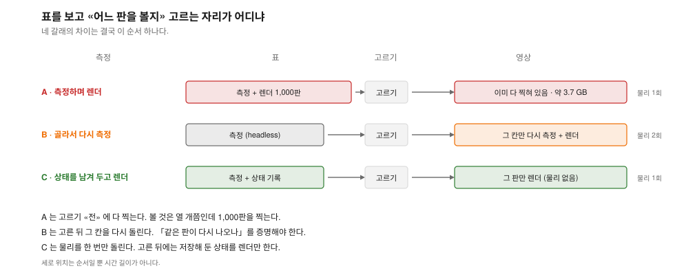
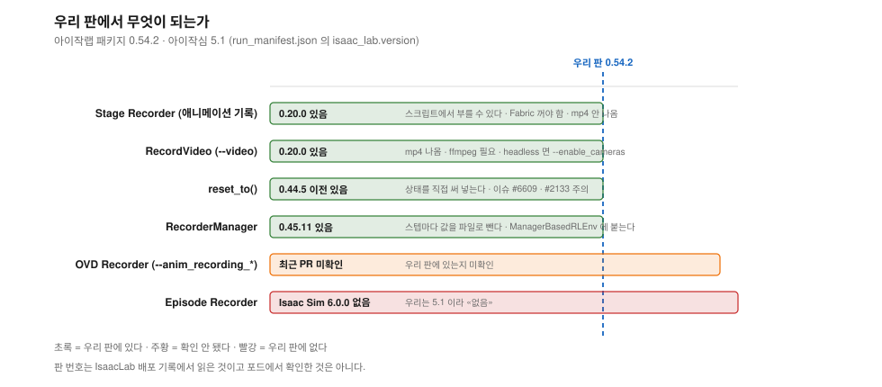

# 표와 영상을 같은 판으로 맞추는 법: 아이작심 5.1 에서 되는 것만

> 분류: 리서치
> 작성: 맹라현 · 2026-09-09 09:24
> 근거: 공식 문서 (NVIDIA 아이작심·아이작랩 문서 10쪽 · 인용 16개를 원문 파일에 대고 문자열 대조 · 깃허브 이슈 4건 · 논의 1건 · 소스 3개) · 실측 (우리 원자료 60칸 108짝 대조)
> 요지: 표를 낸 그 판을 영상으로 보려면 다시 돌려야 하는데 같은 판이 나오는지가 문제였다. NVIDIA 문서 두 쪽이 서로 다른 말을 한다. 아이작심 6.0 에 답이 되는 기능이 있으나 우리 5.1 에는 없다. 5.1 에서 쓸 수 있는 길이 셋 있고, 측정하며 렌더를 거는 것은 그중 가장 비싼 길이다.
> 상태: 초안
> 판: v1.1
> 이슈: #342 · #66 · #216

---

## 한눈에

| | 알아낸 것 | 무게 |
|---|---|---|
| **1** | **아이작심 6.0 의 Episode Recorder 가 이 문제의 정답인데 우리 5.1 에는 없다** | ★★★ |
| **2** | **NVIDIA 문서 두 쪽이 서로 다른 말을 한다.** 재현성 쪽은 「같은 하드웨어면 같다」, Mimic 쪽은 「`env.reset` 을 쓰면 결정론적이지 않다」 | ★★★ |
| **3** | 우리 원자료 108짝에 **설명이 안 되는 어긋남이 0개다.** 조건이 같은 1짝은 100판 20열이 전부 같았다 | ★★★ |
| **4** | **그 대조에 관절 값이 없다.** 영상은 관절 움직임이라 지금 근거로는 영상을 보증하지 못한다 | ★★★ |
| **5** | 5.1 에서 쓸 수 있는 길이 셋이다. 상태 기록 · 다시 측정 · Stage Recorder | ★★ |
| **6** | Stage Recorder 는 UI 전용이 아니다. `omni.kit.commands.execute` 로 부른다 | ★★ |
| **7** | 흔들리는 조건은 「수천 환경 · 수천 프레임」과 「런타임 도메인 랜덤화」다. **우리는 둘 다 아니다** | ★★ |
| **8** | 측정하며 렌더를 거는 것은 되지만 가장 비싸다. 1,000판이면 약 3.7 GB 다 | ★ |

**당장 할 것.** 성패가 갈리는 칸 하나를 골라 같은 명령줄로 두 번 돌리고
**스텝마다 관절 12개를 파일로 남겨 맞대 본다** (6절).

---

## 0. 무엇이 문제였나

레일즈 난이도 격자 1,000판을 돌리면 **표가 나온다.** 표를 봐야
「8.30 cm 칸에서 51판이 속도 때문에 실패했다」를 안다.

그다음 **그 판을 눈으로 봐야 한다.** 그런데 영상을 찍으려면 다시 돌려야 하고,
다시 돌린 것이 표의 그 판과 같은지 **증명할 방법이 없었다.**

2026-09-07 에 찍은 영상 20개가 이 문제로 못 쓰게 됐다.
표를 보기 전에 골라 찍었고, 표가 나온 뒤 보니 다른 판이 필요했다.




---

## 1. 다시 돌리면 같은 판이 나오나 ★★★

### 1-1. NVIDIA 재현성 문서는 「같다」고 한다

[Reproducibility and Determinism](https://isaac-sim.github.io/IsaacLab/main/source/features/reproducibility.html) `공식 문서`

> Given the **same hardware** and Isaac Sim (and consequently PhysX) version, the
> simulation produces **identical results** for scenes with **rigid bodies and
> articulations**.

> At present, PhysX **does not guarantee determinism for any scene with non-rigid
> bodies**, such as cloth or soft bodies.

**Go2 는 articulation 이고 우리 지형 10종은 `Hf*` 3개와 `Mesh*` 7개다.
천도 연체도 0개다** `확인됨` (`generalization_env_cfg.py` 58~153행).
**곧 이 보장 안쪽이다.**

깨지는 조건도 같은 쪽에 있다.

> the simulation results **can vary across different hardware configurations** due
> to floating point precision and rounding errors.

> Due to **GPU work scheduling**, there's a possibility that **runtime changes to
> simulation parameters may alter the order in which operations take place.**
> … any modification to the execution ordering can result in **minor changes in the
> least significant bits of output data.** These changes may lead to **divergent
> execution over the course of simulating thousands of environments and simulation
> frames.**

**두 조건이 우리와 어떻게 다른지가 중요하다.** ★★

| NVIDIA 가 경고한 조건 | 우리 |
|---|---|
| 수천 환경 · 수천 프레임 | **로봇 1마리 · 6초(약 300 스텝)** |
| 런타임 도메인 랜덤화 (물성치를 도중에 바꿈) | **안 한다** |
| 다른 하드웨어 | 같은 RTX 4090 |

문서가 처방까지 적어 놓았다.

> it is **strongly advised to perform this operation only at setup time, before the
> environment stepping commences.**

시드가 어디에 박히는지도 있다.

> the random seed is set to a fixed value using the **`configure_seed()`** method.
> This method sets the random seed for **both the CPU and GPU globally** across
> different libraries, including **PyTorch and NumPy**.
> The seed is set into **`isaaclab.envs.ManagerBasedEnvCfg.seed`**

**우리 환경은 `UnitreeGo2GeneralizationEnvCfg(UnitreeGo2RoughEnvCfg)` 이고
그 부모가 `isaaclab_tasks.manager_based.…` 에서 온다** `확인됨`
(`generalization_env_cfg.py` 27 · 168행). **곧 이 자리가 우리 자리다.**

### 1-2. ★★★ 그런데 Mimic 문서는 「아니다」라고 한다

[Isaac Lab Mimic](https://isaac-sim.github.io/IsaacLab/main/source/overview/imitation-learning/teleop_imitation.html) `공식 문서`

> **Non-determinism may be observed during replay** as physics in IsaacLab are
> **not determimnistically reproducible when using `env.reset`.**

(`determimnistically` 는 NVIDIA 문서의 오타를 그대로 옮긴 것이다.
이 문장은 같은 쪽에 **두 번** 나온다.)

**우리 하네스는 `raw_env.reset()` 을 시작에 «한 번» 부른다**
(`eval_generalization.py` 444행) `확인됨`. 판이 끝날 때의 리셋은
`ManagerBasedRLEnv.step()` 안에서 일어나는 것으로 보이나 **그 소스는 안 봤다**
`미확인`. **그래서 이 경고에 해당하는지도 아직 단정하지 못한다.**

**이 대립이 이 노트에서 가장 무거운 것이다.** 한쪽은 「같다」이고 한쪽은
「리셋을 쓰면 아니다」다. **우리 조건에서 직접 재야 답이 난다** (6절).

### 1-3. 우리 원자료로 대조한 결과 `실측` ★★★

원자료 묶음 8개 · 칸 60개를 **턱 높이가 같은 것끼리 108짝**으로 맞댔다.
줄 순서는 `(env_id, episode)` 로 맞춘 뒤 비교했다.

| 갈래 | 짝 |
|---|---|
| 출발 자리부터 다름 (설정이 달랐던 것) | 105 |
| 출발 같고 지형도 같음 → **모든 열 일치** | **1** |
| 출발 같은데 지형(두께)을 일부러 맞바꾼 것 | 2 |
| **설명이 안 되는 어긋남** | **0** |

**일치한 한 짝**은 `rails-sweep/tier0` 대 `20260907-rails-6s/tier0` 이다.

| | rails-sweep | 20260907-rails-6s |
|---|---|---|
| 끝난 시각 | 2026-09-04 02:47 | 2026-09-07 06:01 |
| 포드 호스트 | `4d1ec4eb88cd` | `7830aac45687` |
| 일치 | **100판 · 20열 전부** | |

**사흘 차이 · 다른 포드에서 소수점까지 같았다.**

시드가 실제로 갈리는지는 칸 60개의 «첫 판» 출발 자리로 봤다.
시드 42 로 돌린 묶음 3개(칸 28개)가 `x=-0.004 y=-0.0422 yaw=-3.168` 로 같고,
09-08 묶음 3개(칸 30개)는 자기들끼리 `x=-0.0482 y=-0.0982 yaw=2.141` 로 같다.
시드 43 은 `x=-0.0881`, 44 는 `x=-0.072` 로 다르다.
**첫 판만 본 것이고 나머지 99판은 이 대조에 넣지 않았다.**

### 1-4. ★★★ 이 근거의 한계 · 관절을 못 봤다 `미측정`

**CSV 에 관절 열이 0개다.** 일치를 확인한 20열은 판마다 요약 한 줄이고,
「그 순간에 무릎이 몇 도였나」는 원자료에 없다.
**영상은 관절 움직임 그 자체이므로 이 근거로 영상을 보증하지 못한다.**

다만 20열 중 둘(`velocity_mae_mps` · `mean_reward_per_step`)이 스텝마다 쌓이는
평균이고, 그것이 소수 여섯 자리까지 같았다 (예: `0.034297`).

그리고 일치한 칸이 **턱 5.00 cm** 로 가장 쉬운 칸이다. 100판 중 성공 92 ·
낙상 1 · 시간초과 99 다. **성패가 갈리는 12~15 cm 칸은 대조한 적이 없다.**

---

## 2. 우리 판에서 되는 것과 안 되는 것 ★★★

우리 포드는 **아이작심 5.1 · 아이작랩 패키지 0.54.2** 다
(`run_manifest.json` 의 `isaac_lab.version`).




| 기능 | 언제 들어왔나 | 우리 판에서 |
|---|---|---|
| Stage Recorder (애니메이션 기록) | 0.20.0 (2024-07-26) | **있음** |
| `RecordVideo` (`--video`) | 0.20.0 (2024-07-26) | **있음** |
| `reset_to()` | 0.44.5 이전 (0.44.5 에서 수정) | **있음** |
| `RecorderManager` | 0.45.11 (2025-09-04) 에 언급 | **있음** |
| OVD Recorder `--anim_recording_*` | 최근 PR (#4409 문서화) | **미확인** |
| **Episode Recorder** | **아이작심 6.0.0 신설** | **없음** |

**판 번호는 IsaacLab 배포 기록에서 읽은 것이고 포드에서 확인한 것은 아니다** `추측`.

### 없는 것 · Episode Recorder 가 정답이었다 ★★★

6.0.0 배포 기록 원문이다.

> **Added support for episode recording and replay** (`isaacsim.replicator.episode_recorder`).
> The recorder captures simulation state and teleoperation input to multi-episode
> HDF5 files for **offline replay** and SDG pipelines.

재생 때 물리가 도는지도 적혀 있다.

> **No physics is stepped, no DOFs are written, no IK is solved**, no trigger
> command is re-dispatched, no OpenXR input is consumed.

**5.1 문서에는 이 쪽이 404 이고 5.1 Replicator 목차 22개 항목에 0개다.
우리는 쓰지 못한다.**

---

## 3. 5.1 에서 쓸 수 있는 길 셋 ★★

**아래 셋 중 어느 것도 우리가 돌려 본 적이 없다** `미측정`. 문서와 소스에서 읽은
것을 정리한 것이고, 「이렇게 하면 된다」가 아니라 「문서에 이렇게 적혀 있다」다.

### 길 C · 상태를 남기고 나중에 렌더 (그림의 C)

**`RecorderManager` 로 스텝마다 값을 파일에 쌓고, 표를 본 뒤 고른 판만
`reset_to()` 로 상태를 써 넣으며 `render()` 로 렌더한다.**

무엇을 남기나. 스텝마다 **19개**다.

```
관절 각도 12  +  몸통 위치 3(x,y,z)  +  몸통 자세 4(quaternion)
```

6초 판이 약 300 스텝이니 1,000판이면 570만 개 · 4바이트로 **약 23 MB** 다.

`reset_to()` 문서 원문이다.

> resets the environments to **specific states**, instead of using the
> randomization events.

**같은 파일로 두 가지가 된다.** 두 벌을 맞대면 재현성 시험이 되고
한 벌을 되짚으면 영상이 된다.

**함정이 둘이다.**

| 이슈 | 무엇 | 상태 |
|---|---|---|
| [#6609](https://github.com/isaac-sim/IsaacLab/issues/6609) | 리셋 뒤 **렌더러가 옛 자세를 그대로 쓴다.** 행렬 오차 `1.67e-6` → `1.79~1.99`. `reset_transform_cadence()` 를 부르면 돌아온다 | 닫힘 |
| [#2133](https://github.com/isaac-sim/IsaacLab/issues/2133) | `reset_to(env_ids=...)` 에 shape mismatch | **열린 채 · 관리자 답 없음** |

**#6609 가 특히 나쁘다.** 이슈가 「the first camera read after reset can skip the
official renderer transform update and reuse pre-reset transforms」라고 적는다.
**곧 자세는 바꿨는데 렌더는 옛것을 쓴다.** 그때 예외가 나는지는 이슈에 안 적혀
있고 나도 안 돌려 봤다 `미확인`.

### 길 B · 고른 칸만 다시 측정하며 렌더 (그림의 B)

**코드를 하나도 고치지 않는다.** 표를 headless 로 뽑고, 볼 칸을 고른 뒤
그 칸만 같은 명령줄로 다시 돌리며 렌더를 건다.

근거는 1절이다. **약점도 1절이다.** 관절을 못 봤고 Mimic 문서가
`env.reset` 을 경고한다.

6초짜리 100판 한 칸이면 다시 도는 비용이 작다. 열 칸을 다 돌 필요가 없다.

### 길 D · Stage Recorder 로 USD 를 굽고 재생

[Recording Animations of Simulations](https://isaac-sim.github.io/IsaacLab/main/source/how-to/record_animation.html) `공식 문서`

> The animated USD can be quickly replayed and reviewed by scrubbing through the
> timeline window, **without simulating expensive physics operations.**

**★★ UI 전용이 아니다.** 문서에 호출 코드가 통째로 실려 있다.

```python
omni.kit.commands.execute(
    "StartRecording",
    target_paths=[("/World", True)], live_mode=True,
    use_frame_range=False, record_to="FILE", fps=0,
    apply_root_anim=False, increment_name=True,
    record_folder=<폴더>, take_name="TimeSample")

omni.kit.commands.execute("StopRecording")
```

멈춘 뒤 무대를 복사하며 물리를 벗기는 코드도 실려 있다.
`ArticulationRootAPI` 를 떼고 `RigidBodyAPI` 를 떼고 관절의
`physics:jointEnabled` 를 `False` 로 놓는다.

나오는 것은 둘이다.

```
Stage.usd               물리를 뺀 원래 무대
TimeSample_tk001.usd    움직임만 담긴 time-sampled 층
```

**약점이 셋이다.**

| 무엇 | 원문 |
|---|---|
| Fabric 을 꺼야 한다 | 「you need to **disable Fabric**」 (`--disable_fabric`) |
| 재생이 손 작업이다 | Layers 판에 둘을 sublayer 로 넣고 재생 버튼을 누른다 |
| **mp4 절차가 문서에 없다** | USD 만 나온다. 영상은 Movie Capture 를 한 번 더 태워야 한다 |

---

## 4. 최후의 보루 · 측정하면서 렌더를 건다 ★

**표를 만드는 그 실행에서 카메라를 같이 켠다.** 증명할 것이 없다.

```
--video --video_length <스텝> --video_interval <스텝> --enable_cameras
```

**전제와 자리도 문서에 있다.**

| 무엇 | 원문 |
|---|---|
| ffmpeg 가 필요하다 | 「enabled by **installing ffmpeg**」 · 포드에 있는지 **미확인** |
| headless 면 카메라를 켜야 한다 | 「add the **`--enable_cameras`** argument when running headless」 |
| 영상이 떨어지는 자리 | `IsaacLab/logs/<rl_workflow>/<task>/<run>/videos/train` |

**왜 최후인가. 셋이다.**

**하나. 고르기 «전» 에 다 찍어야 한다.** 지금 찍어 둔 mp4 41개 평균이 3.78 MB 다
`확인됨`. 그 값을 1,000판에 곱하면 **약 3.7 GB** 인데 이건 **산술이고 1,000판을
실제로 찍어 본 것은 아니다** `미측정`. 실제로 보는 것은 열 개쯤이다.

**둘. 느려진다.**

> enabling recording is **equivalent to enabling rendering** during training,
> which will **slow down both startup and runtime performance.**

**셋. 알려진 결함이 둘이다.**

| 이슈 | 무엇 | 상태 |
|---|---|---|
| [#6316](https://github.com/isaac-sim/IsaacLab/issues/6316) | 「Headless video recording **pumps Kit on every environment step**」 녹화하지 않는 구간에도 Kit 이 매 스텝 돌아 4,096환경에서 8.6% 손해다 | 닫힘 |
| [#875](https://github.com/isaac-sim/IsaacLab/issues/875) | `RecordVideo` 가 FPS 를 `None` 으로 넘겨 mp4 쓰기가 죽는다 (아이작심 4.1.0) | 닫힘 |

---

## 5. 이 방식이 실무에서 쓰이나 ★★

**아이작랩 자체가 「기록하고 다시 튼다」를 정식 절차로 쓴다.**
Isaac Lab Mimic 의 순서가 넷이다.

```
기록  IsaacLab 저장소의 record_demos
재생  IsaacLab 저장소의 replay_demos      <- 모은 것을 검증하는 자리
표시  IsaacLab 저장소의 annotate_demos
생성  IsaacLab 저장소의 generate_dataset

(넷 다 우리 저장소가 아니라 NVIDIA IsaacLab 쪽 스크립트다)
```

**아이작랩 관리자의 답**도 있다. 「데모를 기록하면서 영상도 찍고 싶다」는 물음
([Discussion #2744](https://github.com/isaac-sim/IsaacLab/discussions/2744)) 에
**Stage Recorder 아니면 camera sensor + Replicator** 를 답으로 줬다.

**논문 셋이 같은 방식을 쓴다.**

[Unreal Robotics Lab](https://arxiv.org/abs/2504.14135) 은 길 C 와 같다.

> a high-fidelity **Replay System caches joint kinematics and sensor streams**,
> enabling researchers to record physical trajectories and **deterministically
> replay them across iteratively augmented visual environments**

[RoboSnap](https://arxiv.org/abs/2607.06699) 에는 왜 이 방식을 쓰는지가 적혀 있다.

> suggests a **low-cost path** for augmenting real robot logs through simulation
> replay, perturbation, and **re-rendering**

[GRADE](https://journals.sagepub.com/doi/10.1177/02783649251346211) (IJRR ·
막스플랑크 + 슈투트가르트대) - **주의. 이 논문의 재현 시험은 물리를 «켠 채» 한
것이라 길 C 의 근거가 아니다.**

> we introduce a new way to precisely repeat a recorded experiment **within a
> physically enabled simulation**

그 조건에서 60초 · 3,601 자세를 대조해 위치 어긋남 **-3.5e-6 m** ·
RGB structural similarity **99.6%** 를 냈고 남은 차이의 원인을 이렇게 적었다.

> This is driven mostly by **aliasing effects and pixel values that lie alongside
> the borders of the objects.**

**물리가 갈라져서가 아니라 가장자리 aliasing 때문이다.**

---

## 6. 다음에 할 것 ★★★

**성패가 갈리는 칸 하나를 골라 같은 명령줄로 두 번 돌리고 스텝마다 관절 12개를
파일로 남겨 맞대 본다.** 한쪽은 렌더를 켜고 한쪽은 끈다.

이 한 번으로 셋이 갈린다.

| 결과 | 뜻 |
|---|---|
| 관절이 한 개도 안 어긋남 | **길 B 를 쓸 수 있다.** 코드 변경이 0이다 |
| 렌더 켠 쪽만 어긋남 | **렌더가 판을 바꾼다.** 길 C 또는 최후의 보루로 간다 |
| 둘 다 어긋남 | **최후의 보루밖에 없다** |

**고를 칸은 쉬운 5.00 cm 가 아니라 성패가 갈리는 12~15 cm 쪽이어야 한다.**
쉬운 칸은 거의 다 성공해 궤적이 비슷할 수밖에 없다.

---

## 7. 확인 현황

| 항목 | 상태 |
|---|---|
| 5.1 에 Episode Recorder 없음 · 6.0 신설 | `확인됨`. 6.0 배포 기록 원문 · 5.1 쪽 404 · 5.1 목차 22항목에 0개 |
| NVIDIA 가 「같은 하드웨어면 같은 결과」라고 적음 | `확인됨`. 재현성 문서 원문 |
| NVIDIA 가 「리셋을 쓰면 결정론적이지 않다」고 경고함 | `확인됨`. Mimic 문서 원문 · 같은 쪽에 두 번 |
| 우리 원자료 108짝에 설명 안 되는 어긋남 0 | `확인됨`. `generalization_raw.csv` 전수 대조 |
| 100판 20열이 사흘 뒤 다른 포드에서 일치 | `확인됨`. 다만 **한 칸 · 가장 쉬운 5.00 cm** |
| Stage Recorder 를 스크립트에서 부를 수 있음 | `확인됨`. 문서에 호출 코드 원문이 실려 있음 |
| `render()` 안에 물리 진행 코드가 없음 | `확인됨`. `simulation_context.py` 의 `step`·`render` **두 함수만** 읽음. 부모 클래스는 안 봄 |
| 인용 16개가 원문에 그대로 있음 | `확인됨`. 원문 10개 파일을 받아 문자열 대조 |
| `reset_to`·`RecorderManager`·Stage Recorder 가 0.54.2 에 있음 | **`추측`.** 배포 기록의 판 번호만 봄. **포드 미확인** |
| OVD Recorder 가 0.54.2 에 있음 | **`미확인`** |
| 포드에 ffmpeg 이 있음 | **`미확인`** |
| 관절이 스텝마다 같은가 | **`미측정`.** CSV 에 관절 열 0개 |
| 렌더를 켜면 판이 바뀌는가 | **`미측정`** |
| 렌더를 켜면 얼마나 느려지는가 | **`미측정`** |

## 판 이력

| 판 | 언제 | 무엇이 바뀌었나 | 근거 |
|---|---|---|---|
| **v1.1** | 2026-09-09 | 딱지 없이 단정한 곳 여섯을 고쳤다. 지형 10종에 연체가 0개인 것과 환경이 manager-based 인 것은 소스에서 확인해 `확인됨` 을 붙였다. **「우리 평가는 판마다 reset 을 한다」는 내가 소스를 안 보고 쓴 말이라 걷어냈다** (`raw_env.reset()` 은 444행에 한 번뿐이다). `#6609` 의 「에러가 안 난다」도 이슈에 없는 말이라 뺐다. 길 셋을 우리가 돌려 본 적이 없다는 것과 3.7 GB 가 산술이라는 것을 밝혔다 | 자체 전수 읽기 |
| v1.0 | 2026-09-09 | 처음 씀 | #342 |
